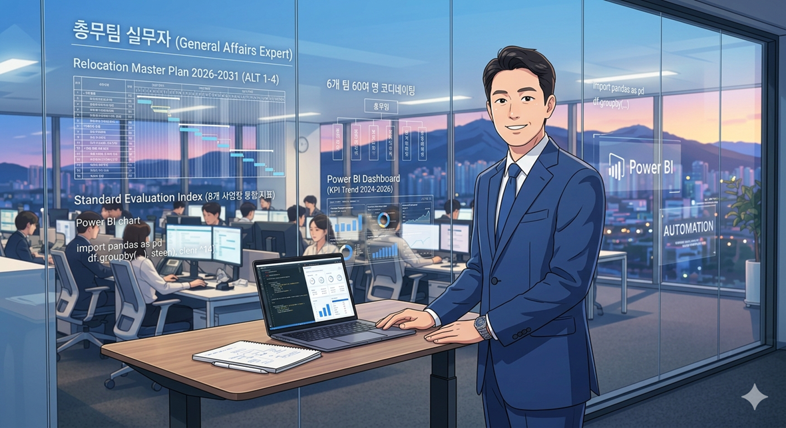

## 🏢 Profile
안녕하세요? **총무 전 영역을 15년간 직접 기획 · 실행해온 실무자** **<mark style="background:#fff88f">'주헌'</mark>** 입니다. 
단순한 지원 업무를 넘어, 데이터 기반의 의사결정과 시스템 자동화를 통해 조직의 효율성을 극대화하는 일을 즐깁니다. 오늘도 '문제해결' 중입니다.

---

## 💼 Major Experience
실무에서 발로 뛰며 만들어낸 주요 성과들입니다.

### **부동산 자산관리**
- **연구소 부지 용도지역 변경 성공(2021 - 2025)**
	* **자연녹지→1종일반주거 종상향** : 용적률 3배 이상 상향(60%→200%), 자산가치 1,000억원 제고, 실제 행정절차는 8개월 소요(전국단위 최단기간)
	* 공공주택과 같은 공공사업, 아파트 분양과 같은 수익사업이 아닌 기업 연구소 부지를 운영중인 상태에서 용도지역 변경한 이례적인 사례
* 4,500억원 규모 부동산 자산관리 및 권리분석 연 100건 이상 수행(2011 - 2020)
* 산업단지·국유재산 부지 매입, 유휴부지 물류센터 PF사업·주차장 조성 등 신규 사업 추진(2016 - 2020)

### **공간기획 및 인프라 조성**
* **4개 사업장, 3,400평, 470억 규모 복합휴게공간 7개월 만에 일괄 조성(2022 - 2023)**
* 그룹 통합사옥(연면적 13,000평) 이전 시 레이아웃 배치 및 공간 효율화 주도(2012)
* 7,000여명의 임직원 거주지 지오코딩 · QGIS 분석으로 최적 거점 선정 및 거점오피스 도입 · 운영(2022 - 2024)

### **F&B · 복지 인프라**
- **사업장 인근 기숙사 700여개 호실 확보 · 운영** (시공 단계에서부터 15개월간 다자간 이해관계자 협의) (2023)
-  글로벌 5대 호텔 체인 · 항공사 · 모빌리티 기업 제휴 계약 및 임직원 복리후생 운영(2024-2026)
- 북미 지역 사원식당(아워홈, 풀무원, 현대그린푸드 등) 입찰 · 운영 코디네이팅(2024-2026)
- Global 창립기념 특식 행사 기획 · 실행(2024)

### **AI · 디지털 시스템 구축**
- Global ERP 연동 부동산 자산관리 시스템, CAD 기반 공간 수요 시뮬레이션 직접 개발 (2022)
- **Power Platform**(Power BI · Automate · Pages 등) **기반 업무 시스템 자체 구축 · 운영**(총무 업무 표준평가 시스템, 해외 출장 관리 포탈) (2026)
- 바이브 코딩 · Low-Code 개발을 통한 데이터 시각화 · 자동화 실무 적용 (2025 - 2026)

### **Global 총무 표준화**
-  2년간 Global 경영지원 TFT 운영을 주도, 해외 신설 법인 총무 Set-up 가이드 수립 (사무환경 · 식당 · 차량 · 청소/미화 · 통근버스 등) (2023 - 2024)
- 글로벌 경영지원 표준 리포트(인당 식당 운영비용, 면적당 청소비용 등 비용중심) 구축 (2024)
---

## 🛠️ Specialized Skills (The "Practical Tech")
### **Full-Stack Business Solution Design**
개발자가 아닌 **'문제 해결사'로서, 현장의 페인 포인트를 즉각적인 시스템으로 전환합니다.**

- **Frontend (Power Pages):** VDI 및 내부망 보안 가이드를 준수하며, HTML/JS/CSS 웹 리소스를 활용해 사용자 친화적인 비즈니스 인터페이스를 설계합니다.    
- **Backend & Logic (Power Automate):** 서버 사이드 언어(Python 등)의 제약을 Power Automate의 HTTP 트리거 패턴으로 극복하여, 복잡한 비즈니스 로직과 데이터 흐름을 자동화합니다.   
- **Data Architecture (SharePoint & JSON):** Dataverse를 사용할 수 없는 환경에서도 SharePoint를 엔터프라이즈급 데이터 저장소로 최적화하고, 대용량 데이터는 JSON 비정형 처리를 통해 fetch 성능을 극대화(5MB 미만 최적화)합니다.
- **Workflow Automation** : Python 스크립트, RPA를 활용한 반복적 행정 업무 및 대량의 데이터를 처리합니다.
---
## 💡 Why Me? (저의 차별점)

1. **현장 중심의 설계** : IT 부서의 표준 개발 프로세스를 기다리는 대신, 현장의 요구사항을 즉시 시스템화하는 **Agile Developer** 입니다.    
2. **보안과 효율의 균형** : 내부망, 외부 접속 차단, 서버 언어 사용 불가와 같은 까다로운 기업 보안 환경 내에서 **최적의 대안(Workaround)** 을 찾아 시스템을 완성합니다. 
3. **데이터 기반 의사결정 지원** : 단순한 기능 구현을 넘어, 수집된 데이터를 시각화하고 경영 지표로 연결하는 **Data-to-Insight** 전 과정을 리딩합니다.
---
## ❤️ "The Curator" (취향의 큐레이션)
개인적인 취향들을 조금씩 채워나가보겠습니다. 😄

| **Category** | **What I Love**               | **Why?**                                                                                             |
| ------------ | ----------------------------- | ---------------------------------------------------------------------------------------------------- |
| **Travel**   | Japan, Maldives, Switzerland  | 비행시간이 짧아서 6살 뽀짝이와 가기에는 일본이 최적이었습니다. 그 외에 저와 제 아내의 인생 여행지는 단연코 몰디브와 스위스입니다. 여행이 주는 설레임은 언제나 행복합니다. 😊 |
| **Movie**    | Action, SF, Thriller, Fantasy | 극장에서 영화를 제대로 즐겨 본지는 오래됐지만, 밤을 새면서 영화를 볼만큼 즐겼고, 현재는 출퇴근 시간 동안 틈틈이 보고 있습니다.                            |
