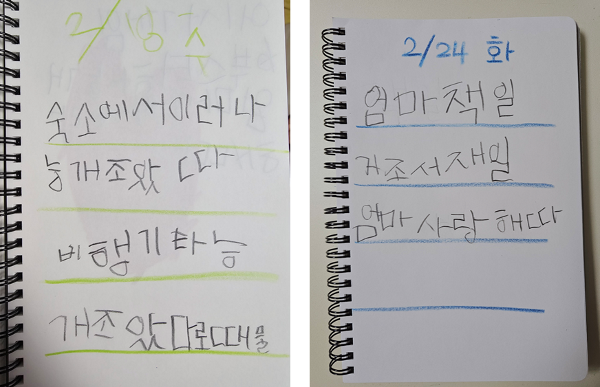
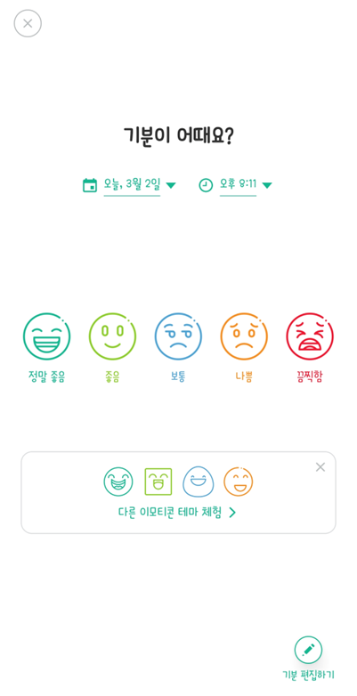
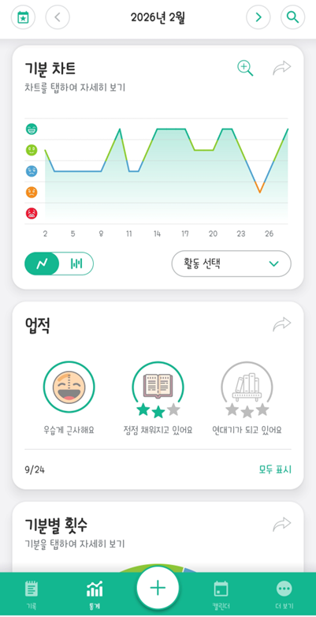
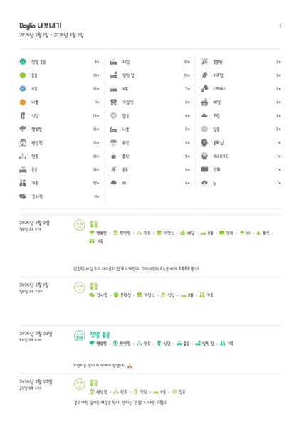

# 기억노트란 무엇인가?
말 그대로 우리 뽀짝이 버전의 일기장이다. 😀 (아래 사진 참고)  

한글을 어느 정도 알게된 후로 올해 1월부터 아내가 **그날 가장 좋았던 일, 기억에 남는 일**을 B5 노트에 써보는 노트다.  생각보다 내용은 별 거 없지만 아이의 필체가 점점 좋아지고, 맞춤법이 맞아가는 걸 보면 아이의 성장을 보고 있는 것 같아 왠지 뿌듯하기까지 한 노트이다. 기분 좋은 날 혹은 하고 싶은 말이 많은 날에는 3~4 페이지씩 쓴다. 

# 나는 왜 기억노트를 떠올렸을까?
회사 후배들이 저녁자리에서 나를 보고 그랬다.  "화가 머리 끝까지 날만도 한데, 도대체 어떻게 그렇게 평온할 수 있느냐"고, 그리고 덧붙여 "신기하다"라고 했다. 농담삼아 15년차 정도 되면 모든걸 다 체념하게 되어 화내고 욕해봤자 결국 내가 해결해야 된다는 사실을 알게 되면 그 보다 더한 '현타'는 없다고 얘기해줬다.  한편, 후배 한 친구는 나와 같이 비슷하게 평정심을 유지하는 친구인데, 부부상담을 갔다가 남편분의 상태가 마치 '휴화산'과 같다는 얘기를 들었다고 했다. 계속 참다보면 언젠가 터진다는 의미였을 텐데, 부부 사이에 안 참으면 어쩌라는 건지.. 😂  그런 얘기를 나누고 집에 돌아오는 길에 **문득, 나도 그날의 기분과 감정을 짧게 한 줄이라도 기록하면 어떨까** 하는 생각이 들었다.  가끔 스트레스를 받는 다고 느낄 때가 있으면 아내는 ChatGPT랑 상담을 받아보는 것도 추천했는데, 어디서부터 무엇을 얘기해야 할지 시작하기가 어려웠다. 그러다 보니 나에 대해서 **내가 지나온 일상에 대해서 좀 더 객관적인(?) Data가 있으면 좋겠다**는 생각을 했다.  
# 데일리오(Daylio) 앱 활용
일상을 기록하는 게 일처럼 느껴지면 안되고, 내가 아주 짧은 시간에 기록할 수 있어야 하기 때문에 어떤 방식이 좋을까 고민하던 중 '[데일리오(Daylio)](https://play.google.com/store/apps/details?id=net.daylio&pcampaignid=web_share)'라는 앱을 발견했다. 
기능은 간단하게 이야기하면 **그 날의 '기분'을 기록하는 앱**이다. 사용법은 워낙 간단해서 특별히 설명할 만한 것 조차 없는데, 매일 기분을 기록하면서 그 날의 있었던 일을 기록했는데 바쁠때는 그냥 기분만 선택하면 기록이 되어서 나조차도 이미 한달 이상 매일 쓰게 됐다. 
그리고 통계를 보고 나니 **나는 보통 이상으로 기분이 '좋은' 사람이었다.** 🤣 매일 기분을 적고 보니 실제 Data가 그렇게 애기해 주고 있어서 반박이 어렵다.   나처럼 뭔가 스트레스를 받는 것 같긴 한데, 이상하게 스트레스 지수 검사나 '내 마음 보고서' 등등 유사한 테스트를 해봤는데도 스트레스가 검출되지 않는 사람(?)이 있다면 나처럼 자신의 기분 혹은 감정을 하루하루 짧게라도 기록해보길 추천한다.   유료 버전에는 내가 작성한 기록들을 PDF로 내보내기를 해주는데, 일기장 마냥 이것도 꽤나 가치있는 기록이 될 수 있겠다는 생각이 든다.

  