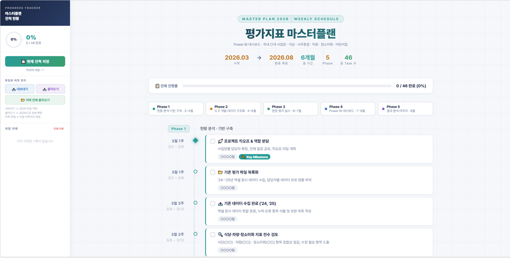

# 마스터플랜(Progress Tracker)
나는 총무로 근무하고 있어서 다른 사업장의 직원들이랑 같이 협업(?)해야 할 일들이 많다.  프로젝트성 업무도 상당수 있는데다가 사실 코디네이터로 일을 시키고 제대로 됐는지 챙겨야 하는 일들도 많았아. 그러다 최근 AI, AI 노래를 부르는 업무환경 때문에 다음과 같은 마스터플랜(Progress Tracker)을 만들게 됐다. 사실, 우리팀 팀장님이 마스터플랜 매니아 이기도 하다. 😂 기능에 대해서는 직장인이라면 그냥 보기만 해도 알 수 있을거라 특별히 설명하지 않아도 되지만, 내가 만들면서 고민했던 사항은 다음과 같다.
- 구관이 명관, 여러사람이 보고 함께 현황 관리를 해야 하므로 가독성 있는 디자인일 것(예를 들면, 폰트는 '프리텐다드'로 설정)
- 각 항목별로 체크, 완료시 진척률을 직관적으로 확인할 수 있을 것
- 회사 내부 망에서 동작이 가능할 것. **즉, DB를 활용할 수 있을 것** ※ DB가 있어야 여러사람이 같은 화면을 보고 공유할 수 있다.  
이 중 마지막 DB에 관해서는 할 말이 많다.  보통의 회사들이 마찬가지이겠지만 AI로 인해 1인 개발자 혹은 나와 같은 총무팀 직원들도 웹 개발이라는 걸 손대게 되었는데, 막상 **직원들이 개발한 프로그램을 업로드하고 테스트할 수 있는 환경을 제공하지는 않는다.**  그도 그럴 것이 이를 테면, 웹호스팅과 같은 환경을 제공하면 기존에 사내 시스템을 개발해주던 개발자들의 역할이 모호해지고, 당장은 투자비가 절약되는 것으로 생각할 수 있지만 유지보수와 같은 개발 이후의 일들을 누가 해야 하는지에 대해서도 애매할 것이라 어찌보면 당연할 수도 있다.  Github 접속이 막혀있지만 해도 다행인 수준인 건 사실이다.   그러다 보니 Antigravity나 Cursor, 아니면 Gemini나 Claude로 열심히 코딩을 해서 결과물이 html 형태로 나오면 로컬 PC에서 띄우면 '끝'이라고 생각하고, 그 다음 단계로 넘어가질 못한다.   자세히 들어가면 백엔드 개발까지 직원들이 알아야 된다는 얘기가 되겠지만, 그보다 웹페이지(html)가 어떤식으로 DB를 가져가서 구현할 수 있을지에 대한 고민과 지원이 전무하다보니 아래 코드도 진척 현황에 대한 간단한 정보(DB)를 JSON으로 내보내기하고 불러오는 형태로 작성했다.  물론, 나는 이후에 회사의 M365 시스템 안에서 작동하는 **Sharepoint List를 이용해서 DB를 구현**했다.   이 부분은 각자의 환경에 맞게 수정하면 될 것 같다.  누군가는 MySQL을 쓸 수도 있을 것이고, MS Dataverse도 쓸 수 있을 테니까 말이다.

> [!SUCCESS] **Masterplan 공유**
> - [🌐 새 창에서 마스터플랜 열기(Ctrl + 클릭)](/files/masterplan.html)
