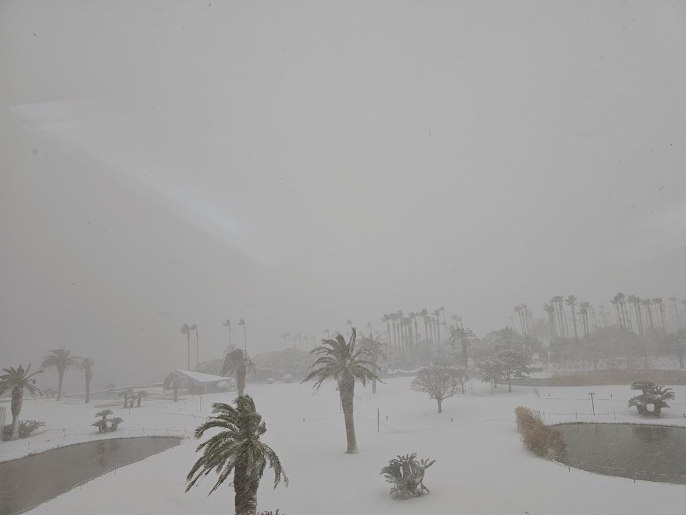
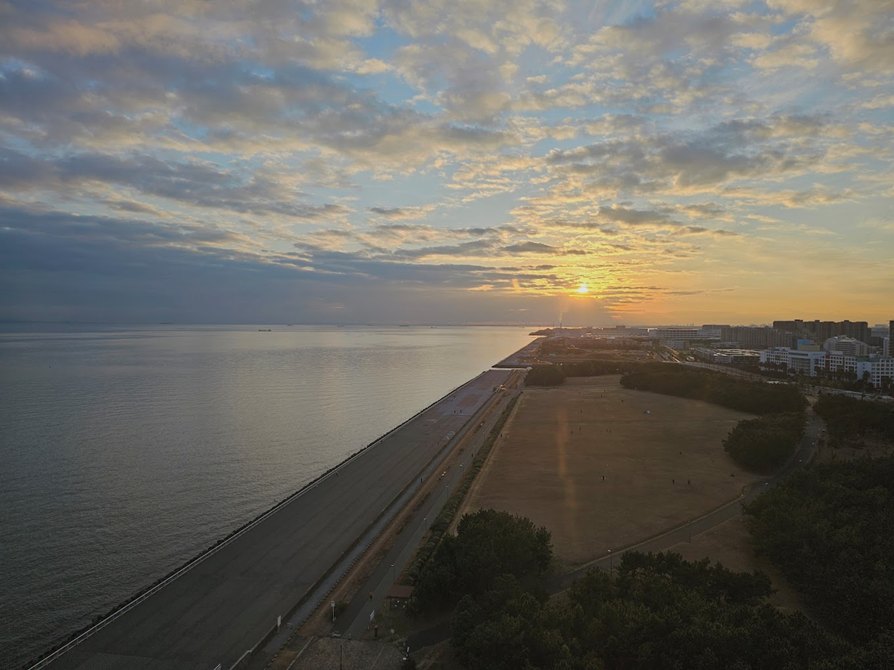

# 제주도 한달살기
내가 다니고 있는 회사는 크리스마스를 전후로 보통 '종무'를 하고 다음해 1/1까지 보통 일주일 가량을 쉰다.  (12/31 종무식, 1/2 시무식을 하던 이전 회사와는 확실히 다르다. 😂) 뽀짝이가 3살이 되고 나니 싸야될 짐도 많이 줄고, 먹는 것도 어른 들이랑 같이 먹을 수 있게 되니 여행이 갈만해졌고, 뭔가 자신감도 생겼다.   그러다 12월 연말에 한 때 한참 유행이던 '**제주도 한달살기**'에 도전하기로 했다. 사실은 날씨 좋을 때 한달이라도 '휴직'을 하려고 운을 띄웠지만, 상무님이 딱 잘라 12월 한달 다녀오라고 정리 해버렸다.  언제나 육아에 진심이었기 때문에 12월이라도 안 보내주면 '육아휴직'라도 할 기세로 느끼셨는지, 남들 쉴 때 연차써서 좀 더 쉬고 오라는 취지였다.   물론, **지금 가봐야 아이는 커서 기억하지 못한다**는 얘기와 함께였다. 그렇게 한달간의 숙소와 이동계획, 렌트 등등을 여유있게 짜고, 2023년 12월 18일, 남들보다 일찍 한 해를 마무리하고 제주도에 도착, 한달 살기를 시작했다.  그리고 다음과 같은 이유로 겨울 제주도를 가지 않으리라 다짐했다.
- 시도 때도 없는 **강풍 주의보**로 항공편이 자주 지연된다.
- 심지어 '**폭설**'이 난데없이 오는데, 항공편 결항은 물론 상상 이상의 적설량으로 도로 통제부터 시작해서 숙소에서 발이 묶인다.
  - 군 시절 철원에서 본 눈 이후로 내가 살면서 가장 많은 눈을 봤다.
- 강원도 만큼 **빠르게 제설이 불가능**하고, 한번 눈이 왔다 하면 며칠동안 고생하게 된다. 
  - 통제되는 도로가 많다보니 빙빙 돌아서 가야해서 평소보다 2배 이상 시간이 소요되도 하고, 언덕이 있는 곳들은 차들이 모두 헛바퀴가 돌아서 미끄러지는 걸 실시간으 봐야 한다.
  - 차선도 잘 보이지 않아서 도로에 사고 현장이 널려있고, 정차시 차가 미끄러지는 걸 몸소 느끼게 된다.
  - 이쯤되면 스노우 타이어거나 체인이 필요해지는데, '렌트카'에 그런게 있을리 만무하다.

사실 우리 부부는 뽀짝이가 태어나고 제대로 된 첫 장기 여행을 가기도 했고, 한달에 가까운 시간을 제주도에서 보내다 보니 양가 부모님께 며칠씩 놀러오시라고 했다.  그래서 렌트카도 '9인승 카니발'로 빌렸고, 숙소도 부모님께서 놀러오시는 날에는 방 4개에 꽤나 비싼 리조트로 2박 이상씩 예약을 했던 터였다. 하지만, 앞서 얘기한 폭설과 강풍으로 실제 카니발과 숙소를 제대로 이용한 건 단 하루 밖에 되지 않았다. 😭  폭설이 잦아들 때쯤 무작정 김포공항으로 달려가서 운행되는 비행기편을 찾아서 부모님이 놀러오시긴 했지만, 정작 제주공항에서 우리 부부와 뽀짝이가 있는 서귀포까지 폭설로 택시나 버스가 운행을 하지 않아서 공항 근처 허름한 리조트에 1박을 하셨다.  김포공항으로 올라오는 비행기편도 이틀 이상 그 동안 폭설로 발이 묶였던 사람들이 바글바글했던 터라 전쟁통이 따로 없었다. 이미 호텔 체크아웃까지 하고 짐 다 싸서 나온 사람들이 공항에 왔는데, 비행기는 결항됐지, 주변에 숙소는 없지, 먼 곳으로 가려고 해도 교통편이 없으니 무작정 공항에서 대기하게 되는 터였다.   한마디로 **연말/연시, 눈이 많이 내리는 시즌의 '제주도'는 변수의 연속**이었고, 나는 누군가 이 시즌에 제주도로 여행을 간다고 얘기하면 **항상 최소 '1주일' 이상 시간이 있을 때 가라**고 한다.  
# 2025년 연말 여행은 도쿄로 결정
연말 휴가와 더불어 아이가 1/2 개강하는 유치원에 다니게 되면서 연말/연시에 1주일 이상 시간이 생겼다. 제주도는 '폭설'을 겪은 이후로는 한번도 가지 않았고, 비교적 비행시간이 짧으면서 겨울 날씨가 한국보다는 따뜻한 '도쿄'를 가기로 했다. 아이가 조금 크다 보니 '디즈니씨', '디즈니랜드'도 좀 더 즐길 수 있지 않을까 하는 생각이었고, 그 밖에도 엔화도 저렴하고, 카드 결제 이벤트도 많고 여러가지가 맞았다.  여행에 대한 이야기는 다음 번에 좀 더 자세히 쓰겠지만, 같은 시기 도쿄는 평온 그 자체였다.  도쿄 베이가 있어서 바닷바람이 있는 날도 있었지만, '눈'은 구경도 하지 못했다. 게다가 도쿄는 하네다 공항, 나리타 공항 두 곳이 있어서인지 어쨌든 한국에는 갈 수 있겠다는 생각이 들었다. 

# 어릴 때 여행은 아이가 커서 기억하지 못한다
내가 퇴근하고 와서 상무님이 **지금 가봐야 아이는 커서 기억하지 못한다**는 얘기를 하더라라고 아내에게 이야기했을 때, 아내의 답변을 이러했다. 
> **7살의 뽀짝이는 4살 때 기억을 가지고 살아.**

맞는 말이다. 아이가 커서 어른이 되고 나서는 우리 가족끼리 제주도에 가고, 일본에 가고 여행했던 기억들이 없을 수는 있지만 지금의 뽀짝이는 기억한다. 모든 걸 다 기억할 수는 없어도 그 때 그 행복했던 기분, 감정, 그리고 수많은 사진과 동영상은 남는다. 