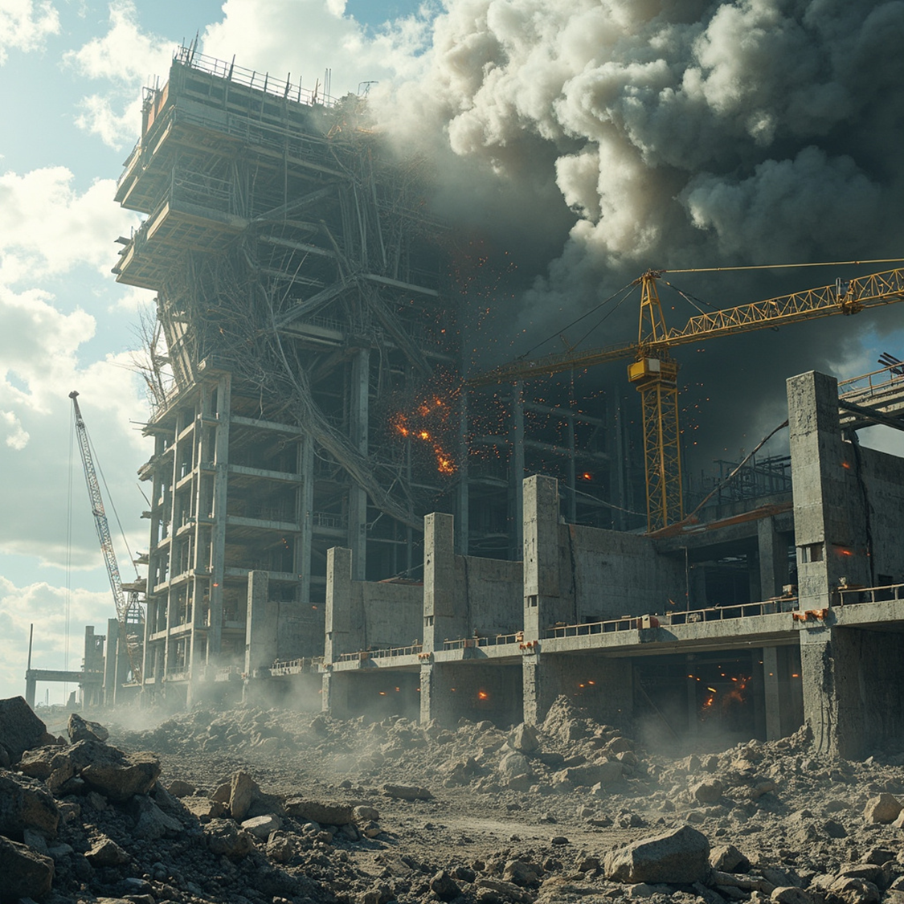

# 신축중이던 공장이 붕괴되었다.
바야흐로 2011년 말(사실은 아직도 정확한 날짜와 시간까지 기억한다. 😅), 입사한지 1년도 되지 않았을 때였다. 아침에 출근을 했는데, 선배들과 팀장님이 한참이 지나도 출근을 하지 않았다. '무슨 일이 있나?' 싶었는데, 알고보니 새벽에 신축공장 현장이 붕괴되어서 전부 현장에 가 있었던 것이었다.  군대를 다녀온 사람이면 알겠지만, 이런 정도의 큰 사고가 일어나면 **여기저기 별 상관도 없는 사람이 '입을 대려고' 현장으로 몰려든다.**  왜냐? 회사의 오너도 오기 때문이다. 마치, 사고 한번 터지면 대대, 연대, 여단, 사단, 육군본부 등등에서 상황파악 한답시고 너도나도 전화하는 것과 같은 이치다.  그렇게 C레벨이 너도나도 이러쿵 저러쿵, 몇 날 며칠동안 붕괴된 공장에 대해 어떻게 대응해야 하는지 '설왕설래'가 있었다. 하지만 그렇게 '말'만 오갔을 뿐 정작 해결, 실행하는 사람은 없었다. 내가 그리 좋아하는 단어는 아니지만 흔히 '마도구찌'가 없었던 것이다.   이 때까지만 해도 나는 이 일과 전혀 무관한 사람이라 생각했다.  '사원' 나부랭이에게 이런 상황을 해결(?)하라고 할 회사가 지금도 있진 않을거다. 하지만 내가 이 글을 쓴다는 건 내가 경험했기 때문이다. 😂 요즘은 AI가 워낙 발달해서 이런 상황에서도 체계적으로 상황 정리와 대응방안까지 가이드를 줄 수 있을지 모르겠지만, 흔치 않은 경험이다 보니 생각이 나서 정리해보기로 했다.   

# 사고 직후
붕괴 사고에 회사 관계자를 비롯해 경찰, 소방, 언론, 보험사 등 엄청나게 많은 인파가 몰려든다. 사람들에게는 불구경이나 마찬가지 이기 때문에 당분간은 궁금해 할 수 밖에 없다. 
- 사고현장 통제가 우선이다.
	- 2차 붕괴가 없으리란 법이 없다. 그래서 우선 **사고 현장은 통제구역으로 잡고 '관계자 외 출입금지' 라인**을 만들어야 한다.  건설현장이기도 하고 공장을 지을 정도의 회사면 '건설팀'이나 '공무팀'이 있을 것이기에 **출입통제 구역을 설정**하도록 하고, **향후에는 펜스**를 쳐서 공사현장처럼 만들어야 한다.
	- 이 때, 다른 공장으로 출입하거나 외부인의 출입으로 인한 보안상의 이슈와 2차 붕괴 등의 잠재된 위협을 감지하기 위해서 **사고 현장 주변을 비추는 CCTV를 설치해서 모니터링** 해야 한다.  '보안팀'이 있다면 보안 관련 업무를 위임하면 될 것이다. 
- '비상대책반'과 같은 별도의 TF 구성이 필요하다.
	- 현장 인파가 어느 정도 정리되고 나면 **'비상대책반'과 같은 내/외부를 연결하는 별도 TF가 구성**되어야 한다. TF는 소방, 경찰, 지자체 및 정부 관계자, 언론사 등을 대응하는 채널의 역할과 현재의 상황과 현장에서 발생하는 이슈에 대해서 내부 C레벨 또는 유관부서와 공유하는 게 초기 주요 역할이다. 사실 나는 이 때, 평일 저녁, 야간, 주말을 다 포함해서 **24시간 3교대로 근무를 섰다.**  마치 불침번이나 당직 같은 느낌으로 두 달 이상을 보냈다.  
- 현장이 어느정도 통제되고 나면 다음과 같은 상황이 벌어진다.
	- 극박한 느낌의 24시간 혹은 48시간 정도가 지나면 추가 붕괴 위험은 없다는 게 어느 정도 판단이 되고, 대피했던 공장 근로자들은 다시 출근을 하게 된다. 다만, **이런 상황에서 총무로 근무하면서 느끼는 당황스러움은 이런 것들**이다. 
		- 신축공장이 붕괴되었는데, 기존 공장 근무자들은 대피를 시켜야 하나, 퇴근을 시켜야 하나
		- 만약, 퇴근이라면 공장 가동을 중단하고 퇴근하라고 의사결정을 누가 내릴 수 있나, 대표이사 혹은 오너에게 보고해야 한다면 누가 보고할 것인가
		- 내일은 출근을 시켜야 하나
		- 공장 가동 중단으로 생산하던 물량 납품지연으로 피해를 보는 이해관계자들게는 누가 이 사실을 알리고, 대응할 것인가
		- 이 이후에 정상화는 누가 책임지고 이끌어갈 것인가
	- 안타깝게도 결국 회사에 소속되어 있는 사람들은 이게 '누군가의 잘못이냐'를 따지려 들고 **'해결' 중심보다는 '원인'을 찾는데 혈안**이 되어서 이 위기상황을 모면 하고 한다. 한마디로 "**저는 몰라요. 쟤가 그랬어요**"의 스탠스다.  왜냐하면 맡아봤자, 빛이 나지 않는 일이다. 자칫 제 명을 단축하는 일일 확률이 훨씬 높다.
# 진흙탕 싸움의 시작
현직에 있는 사람들은 공장이 무너졌다는 소식을 들은 순간 대부분 느낌이 온다. '아, 이거 소송해야 되겠구나', 그렇다. 이렇게 공장이 무너진 경우 시공사, 감리와 진흑탕 싸움을 시작해야 한다. 회사 대 회사 인 상황에서 "아이고 죄송합니다. 저희 잘못입니다. 원하시는 대로 모두 보상해드리겠습니다." 라고 할 리가 없지 않은가? "원인은 모르겠고, 저희 잘못은 없습니다."가 기본적인 스탠스인다. 그러다 "그럼 원칙대로 하시죠!"가 결국은 소송이다.
- 공장이 무너진 경우에는 **'지반'이 원인인지 아닌지가 중요하다. 즉, '자연재해'이냐 '인재'냐를 가리는 포인트**가 된다.
	- 당시 회사에서는 **사단법인 한국지반공학회**에 붕괴 원인 조사를 요청했고, 상대측인 시공사 + 감리는 **대한토목협회**에 동일한 요청을 했다.
	- 예상했겠지만, 의뢰자의 Needs(?)에 근접한 용역 결과물이 나오게 된다. 법적 공방을 위해서는 양 당사자의 주장을 뒷받침할 객관적인 근거가 있어야 하니 당연한 수순이다. 
붕괴원인은 그렇다 치고 그럼 공장 붕괴로 인한 피해금액은 도대체 얼마인가? 얼마를 배상해달라고 소송을 하는 것일까? 이 부분이 가장 내가 많은 시간을 투입했던 항목이고, 전역한 이후로 '사회생활'이 '군대'보다 더 나은 게 아니라, 마치 전역일이 없는 '군대' 같다는 생각을 하게 했던 대목이다.

소송을 할 수 밖에 없다는 사실에 대해서는 모두가 인지하고 있었고, TF에서 수차례 회의를 했다. 결국은 R&R을 싸움을 하고 있었던 것이었는데, '**피해액을 누가 정리할 것이냐**'가 가장 중요한 결정사항 이었다.  앞에서 이야기 했지만 이런 일은 '독이 든 성배'라는 표현이 정확하다. 그럼에도 불구하고 말만(?) 하기 좋아했던 당시 팀장은 원하지 않았겠지만 아는 척 하다 일을 받아온다. 그렇게 각 팀에서 나름의 피해액이라고 불리는 자료들이 수십장씩 날아오게 된다. 시간이 어느 정도 흘러 A4 박스를 다 채우고 한참을 넘는 자료들이 팀장 책상에 쌓이게 됐다.  
그러다 12월 23일 금요일 오후 7시 쯤 퇴근하려고 인사하던 나에게 한마디 한다.  "야, 나 이거 정리 못하겠다. 어이쿠, 이거 니가 좀 해봐라. 월요일 아침에 볼 수 있겠지?" 그렇게 나의 주말, 연말/연시가 모두 날아갔다.  더 많은 이야기가 있지만 당시 입사 1년 남짓된 사원에게 이런 일을 시킨다는 건 나에게 기회를 준다는 것 보다는 꼬리 자르기의 느낌이었다.  사원이 못하는 건 어찌보면 당연한 일이니까. 한편으로는 내가 어떤 사람인지를 보여줄 수 있는 계기가 되었다. 물론, 이후로 일이 더 많아져서 힘들긴 했지만 어떤 부장이 나한테 그랬다.  "○○아, 너는 좋겠다. 이거 소송 끝나려면 최소 3년은 회사 더 다닐 수 있겠다." 
- 당시의 나는 **피해액 산정을 위해 '직접적 피해'와 '간접적 피해'를 큰 틀에서 구분**하기로 했다. 
	- '직접적 피해'는 말 그대로 공장이 붕괴되면서 토사에 유실된 원재료라든지, 사용하지 못하게 된 가구, 시설, 장비 등과 같은 것들을 말한다. 
	- '간접적 피해'는 예를 들어 공장이 붕괴되면서 정전이 되었는데, 이 정전으로 인해 냉장, 냉동 기능이 제대로 작동하지 못해 제품을 폐기해야 했다든지, 단수로 인해 설비가 오작동을 일으켜 수리비가 나왔다든지 하는 것들이다.
	- 어떤 부서에서는 본인의 사용하던 PC가 붕괴로 인해 토사에 묻혔는데, 그 안에 기존의 업무 히스토리와 각종 정보가 있다며 해당 정보에 대해서도 피해보상을 요구하기도 했다.  하지만, 예상하겠지만 법원에서는 '피해액'으로 인정 받지 못했다.  객관적인 인과관계에 의해서 발생한 피해액에 대해서 소송가액이 정해지는 것이며, 이 마저도 시간이 지나면 조정/합의를 거쳐 피해액이 아니라 합의금 느낌으로 변질된다.
- **한 권의 책으로 소송자료**를 만들었다.
	- 당시 A4 1,500여장의 자료를 정리해야 했었는데, 전부 스캔하거나 PDF로 변환하 '직접적 피해'와 '간접적 피해'로 구분하고 각 항목별 목차를 만들어 간지를 끼워넣는 방식으로 한 권의 책 형태로 소송자료를 만들었다. 
	- 사실 PDF를 편집하고 변환하는 것은 지금에 와서야 어려운 일이 아니지만, 당시에는 회사에서 라이선스의 제약을 받지 않으면서 '무료'로 사용가능한 Tool이 거의 없다시피 해서 꽤나 애를 먹었었던 기억이 있다.  한편으로는 PDF로 정리하는 걸 보고 당시 팀장은 '신선한 충격'을 먹은 표정이기도 했다.
	- 지금이라면 OCR을 하든 AI를 나눠서 시켰으면 훨씬 더 잘 정리했을지도 모르겠다.
- 이와 같은 **붕괴 사고 이면에는 '보험사'가 있다.**
	- 사실, 사고 직후 가장 빨리 달려온 사람 중 한명이 당시 보험사의 담당자였다.  대부분의 제조업을 영위하는 회사들이 '재산종합보험'을 가입하고 있을테고, 당시 내가 다니던 회사에서는 부보가액을 103%로 설정했었다.  즉, 100억 짜리 공장이면 103억을 보상한도로 받을 수 있게 설정해놨었는데, 500억 수준의 공장이었기 때문에 보험사 입장에서도 쉽지 않은 금액이었으리라 생각이 든다.
	- 어찌저찌 소송을 통해 '인재'로 판명이 되어 시공사로부터 보상을 받을 수 있게 되었지만 소송이 치뤄지는 기간 동안에 하루빨리 소송이 끝나길 가장 바라던 사이 보험사 담당자였다.
# 승소
**공장이 붕괴되고 3년 6개월이 넘는 지리멸렬한 소송전 끝에 승소 판결이 났다.**  어느 부장이 했던 말처럼 **나는 승소할 때까지도 회사를 다니게 됐다.**  늘 느끼지만, 굳이 인생에서 겪지 않아도(?) 될 일들을 참 많이 겪어본 것 같다.  누가 알았겠는가? 내 이력서에 공장 붕괴 사고 대응 및 승소 이런 내용이 한 줄 들어갈지...

