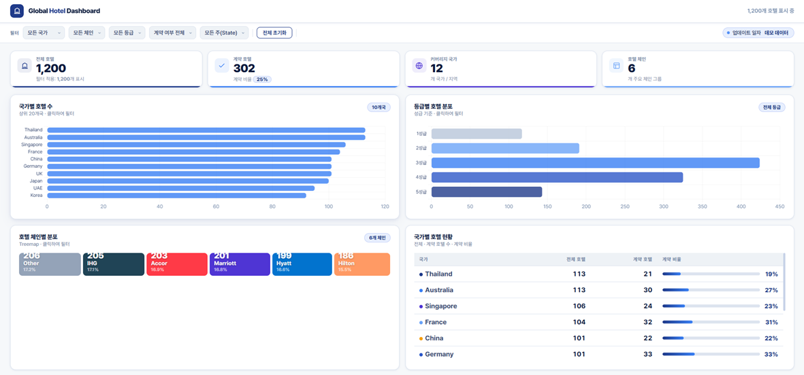

# Global Hotel Dashboard
현재 회사에서 본의 아니게(?) 어쩌다보니(?) 해외출장 관련 업무도 맡고 있다. 정확히는 '부'의 역할인데 마치 '정'의 역할을 하고 있는 중이다. 해외출장 관련된 업무는 사실 **국내 기업들에서는 제대로 된 역할이 사실상 없는 거나 마찬가지다.**  대부분의 대기업들은 계열사 혹은 관계사로 여행사(TMC)와 거래를 하고 있고, 대다수가 여행사를 통해서 상용 출장을 가는 실정이기 때문이다.   한편, 삼성이나 LG는 PRP(Preferred Rate Program), 말 그대로 선호 요금 프로그램을 운영하는데, 특정 기업의 임직원이 출장을 올 때, 일반 공표 요금(BAR, Best Available Rate)보다 저렴하게 이용할 수 있도록 사전에 약정된 기업 할인 요금 체계다.  이를 토대로 '계약호텔' 이라는 부르는 호텔들을 1년 단위로 정기적으로 Update 한다. 해당 기업이 숙박한 실적으로 토대로 다음해 요금을 연중 고정으로 줄지, 변동 요금에서 고정 할인을 줄지, 조식 포함으로 제공할지 등등 이러한 것들을 각각의 주요 호텔들이 여행사 시스템을 통해 제시하고 확정해서 각 기업에 제공하는 형태다.  문제는 이러한 **일련의 과정을 '여행사'가 주도**하다보니 실제 나와 같은 담당 아닌 담당자는 현재 회사가 영위하는 사업장과 관계없는 지역의 호텔이라든지, 지금은 출장을 많이 안가는 지역의 호텔이라든지 등의 상황과 마주하게 된다.  한마디로 **내 입맛에 맞질 않는다.**  그래서 업무를 자꾸 깊이 파고 들다 보니 첨부와 같은 Global Hotel Dashboard까지 만들게 됐다.  **주요 기능은 다음과 같다.**
- 각 국가별, 호텔 체인별, 호텔 등급별, 계약 호텔 여부에 따라 호텔 현황을 보여줍니다.
- 미국의 경우 호텔이 워낙 많기 때문에 '주(State)'를 기준으로 보여줍니다.
- Open Street Map 기반으로 회사 사업장을 기준 반경 5~20km 내에 있는 호텔들을 보여줍니다.
- 계약되어 있는 호텔들의 List도 표시해줍니다.

**그리고 이럴 때 유용합니다.**
- 사업장 주변 계약호텔을 선정하거나 직원들에게 계약호텔을 안내할 때
- 회사 비용으로 출장을 가지만 각 호텔 체인별 Tier와 연계하여 숙박 계획을 세울 때
- 출장 기준(예를 들어 4성급 이하)에 적합한 호텔들을 필터링 할 때
- 신설 사업장 주변에 확보해야 호텔 및 추가 계약해야 할 호텔을 찾을 때

사실 나는 이 대시보드를 여행사 담당자들을 Challenge 하기 위해 사용하고 있지만, 여기서 더 나아가 **실제 숙박실적(Room Night, Revenue 등)과의 연계를 2단계로 개발중**이다.  이를 통해서 좀 더 경쟁력 있는 숙박료와 Benefit을 얻을 수 있는 건 당연지사이다. 통상 해외에서는 이와 같은 역할로 'Travel Manager' 라는 직무가 있는데, 아직까지 한국에서는 그 필요성을 잘 느끼지 못하는 것 같다.  어쩌면, 여행사가 있으니 신경 쓰고 싶지 않은 것일 수도 있다.

마지막으로 **DB에 관해 부연 설명을 드리면 다음과 같습니다.**
- 현재 데모 데이터로 페이지가 구성되어 있으며, DB는 json 파일을 이용하도록 되어 있습니다.
- DB Table은 아래와 같이 구성되어 있는 Data를 이용했습니다.
- DB Table상 Text는 영문을 기본으로 입력했습니다.

| Hotel Chain | Country | Name | Address | State / Territory | 계약호텔 여부 | Grade | Zip Code | Latitude (위도) | Longitude (경도) | Google Map Link | 호텔 URL |
| ----------- | ------- | ---- | ------- | ----------------- | ------- | ----- | -------- | ------------- | -------------- | --------------- | ------ |
| Text        | Text    | Text | Text    | Text              | O/X     | 1~5성급 | 숫자       | 숫자            | 숫자             | 하이퍼링크           | 하이퍼링크  |
- 저의 경우 27,000여개의 DB를 구축해서 로드해야 해서 json 용량이 과다하게 커지는 것을 우려해 호텔 체인 기준 3개로 분할하여 병렬로 로드하도록 했습니다.
- 업데이트 일자는 json 파일의 가장 최근 수정일자를 가져오도록 했습니다.

동일한 Data로 Power BI로도 보고서를 작성해 봤습니다만, 확실히 HTML + CSS + JS 가 로딩속도가 월등합니다. 디자인적으로도 훌륭한 건 덤입니다. 😄 Global 호텔 체인들의 정보를 Web Scraping 하는 과정도 녹록치 않았었는데, 이 부분은 다음 기회에 써보도록 하겠습니다.

> [!SUCCESS] **Dashboard 공유**
> - [🌐 새 창에서 Dashboard 열기(Ctrl + 클릭)](/files/global_hotel.html)

---
- 2026.03.25 
	- 기존 Open Street Map 지도가 "예쁘지 않다"는 의견이 있어서 대안으로 무료로 사용할 수 있는 타일(Tile)들의 이미지와 코드를 포스팅 했습니다.
	- [Global Hotel Dashboard 지도 타일 변경]()