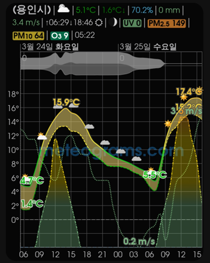
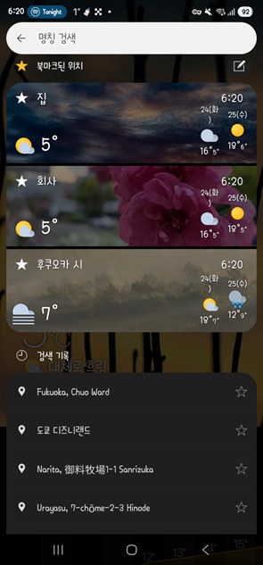
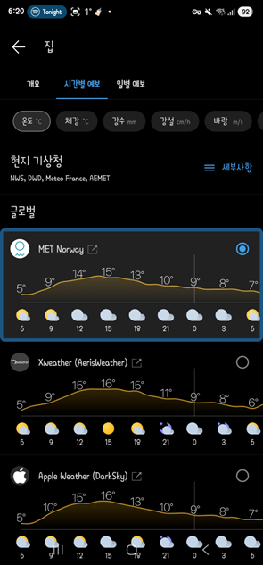

# Meteogram Weather Widget
"노르웨이 기상청이 정확하다."는 이야기는 누구나 들어본 적 있을 것이다.

> "한국은 3시간 단위, 노르웨이는 24시간 단위로 예보…맞을 수밖에"
>  ※ 출처 : 「[기상청 前대변인이 말한 노르웨이 '예보 정확도' 높은 이유](https://www.hankyung.com/article/2020081207127)」(2020.08.12)

또, 한국 기상청 Data를 기반으로 한 앱을 이용하다 예보가 틀려서 제대로 준비를 못한 경험도 있을 것이다. 특히, 아이랑 주말에 놀러가려고 마음 먹었는데, 눈이나 비 소식이 있어서 에버랜드를 안 가는 걸로 계획을 세웠는데, 막상 비 한방울, 1mm 눈 조차도 오지 않았을 때는 화마저 났다. 😇 누군가는 여유로운 에버랜드를 즐기고 있을 것이었기에...

그래서 **노르웨이 기상청 Data를 기반으로 날씨정보를 보여주는 앱**을 찾아 헤맨지 수년만에 5년 이상 내 휴대폰 첫 화면의 50% 가까이를 차지하고 있는 [Meteogram Weather Widget](https://play.google.com/store/apps/details?id=com.cloud3squared.meteogram&pcampaignid=web_share)을 소개한다.

주요 기능은 다음과 같다. 물론 무료 버전 기준이다. 그래서 meteograms.com 이라는 워터마크가 백그라운드에 깔려 있지만, 크게 거슬리지 않는다. 
- **날씨 정보 공급자(메인, 보조)를 사용자가 원하는 대로 선택할 수 있다.**
	- 노르웨이 기상청, 독일, 호주, 핀란드 등은 무료로 제공된다.
	- 보조 데이터 공급자도 동일하게 선택할 수 있다. 
- **아래 항목들을 위치에 기반해 차트에 표현해 준다.**
	- **각종 날씨 심볼, 실제 기온, 체감 기온, 일출과 일몰**, 이슬점, 습구 온도, 지면 온도, **자외선 지수**, Kp 지수, **공기질 지수**, 나무/잡초/잔디 꽃가루 지수, **강수량**(합계/누적), **눈**(합계/누적), 강수 확률, 뇌우 확률, 번개 잠재 지수, 대류가용잠재에너지, 우박 확률, 우빙 확률, 대류성 강수 확률, 강설 확률, 빙결 수준, 적설심, 기압, 구름양, 시계, **고별 구름양**, 안개, 구름 기본 높이, 상대 습도, 절대 습도, **풍속**, 순간 풍속, 풍향, 풍향 화살표, 시정, **오존**, 탄소 집약도, 햇빛, 일조량(합계), 방사 조도, 조수 정보, 해 온도, 파도의 높이, 파도 주기, 파도 방향, 태양의 고도, 태양의 방위, 달의 고도, 달의 방위, 달의 형상, 행성의 고도, 행성의 방위
	- 사실상 날씨로 알고 싶은 항목들은 거의 모든 내용을 다 차트로 표현할 수 있다.

위 스크린샷 처럼 설정하려면 다음과 같이 하면된다. 
- 차트 스타일
	- 글꼴 그룹 / 글꼴 묶음 / 글꼴 스타일 : TeX Gyre / TeX Gyre Adventor / 보통 400
	- 그래프 라벨 글씨 크기 15, 최대/최소 라벨의 글씨 크기 17
	- 최대점에 대한 최소/최대 라벨 색상 : 빨강
	- 최소점에 대한 최소/최대 라벨 색상 : 파랑
	- 최소/최대 라벨에 두꺼운 글꼴 사용 : ON
	- 최대/최소 라벨에 단위를 추가 : ON
	- 최대/최소 라벨 겹치기 허용 : ON
	- 최소/최대 라벨 주위에 선 효과 활성화 : ON
- 날씨 정보 공급자
	- 기본 데이터 공급자 : Norwegian Meteorological Institute
	- 보조 데이터 공급자 : OpenWeaterMap
- 상단 정보
	- 상단 정보의 위치 부분에 대한 글씨 크기 : 20
	- 상단 정보의 변수 부분에 대한 글씨 크기 : 15
	- 줄 간격 : 0.9
	- 상단 정보의 위치 부분을 더 굵은 글씨로 보기 : ON
	- 상단정보에 단위 표시 : ON
	- 지역 : ON / 더 굵은 글꼴 굵기를 사용합니다: ON
	- 날씨 기호 / 달의 위상 / 실제 기온 / 체감 기온 / 풍속 / 일출/일몰 시간 / 강수량(차트 기간 동안 누적) / 상대 습도 / 자외선 지수(자외선 지수 값을 표준 색상 체로 보기) / AQI(PM 2.5, PM10, 오존 값, 표준색상표로 PM 값을 표시) : ON
	- 경고 (각 섹션에 임계값을 설정) : ON
	- Meteogram 업데이트 시간 : ON
- 날씨 심볼
	- 보이기 : ON
- 실제 기온 
	- 보이기 : ON
	- 색상 등급 사용 : ON
	- 그림자 : ON
	- 최소/최대값 라벨 : ON
		- 최대/최소 라벨 창 : 24시간마다
		- 최소/최대 라벨에 색 사용 : 선 색상
	- 격자선 보기 / 축 라벨 : ON
- 체감 기온 
	- 보이기 : ON
	- 색상 등급 사용 : ON
	- 그림자 : ON
	- 최소/최대값 라벨 : ON
		- 최대/최소 라벨 창 : 차트
		- 최소/최대 라벨에 색 사용 : 선 색상
	- 체감 기온과 실제 기온 사이 공간을 채우기 : ON
- 자외선 지수
	- 보이기 : ON
	- 색상 등급 사용 : ON
	- 최소/최대값 라벨 : ON
		- 최대/최소 라벨 창 : 차트
		- 최소/최대 라벨에 색 사용 : 선 색상
- 강수량
	- 보이기 : ON
	- 보이기 : 예상값
	- 선 굵기 : 2.0
	- 매 시간 당 : ON
	- 일일 합계 표시 : ON
	- 최소/최대값 라벨 : ON
		- 최대/최소 라벨 창 : 차트
		- 최소/최대 라벨에 색 사용 : 선 색상
- 눈
	- 보이기 : ON
	- 선 굵기 : 2.0
	- 최소/최대값 라벨 : ON
		- 최대/최소 라벨 창 : 차트
		- 최소/최대 라벨에 색 사용 : 선 색상
- 고도별 구름양
	- 보이기 : ON
- 풍속
	- 보이기 : ON
	- 단위 : 초속-미터 (m/s)
	- 색상 등급 사용 : ON
	- 최소/최대값 라벨 : ON
		- 최대/최소 라벨 창 : 차트
		- 최소/최대 라벨에 색 사용 : 선 색상
- 오존
	- 보이기 : ON
	- 색상 등급 사용 : ON
	- 최소/최대값 라벨 : ON
		- 최대/최소 라벨 창 : 차트
		- 최소/최대 라벨에 색 사용 : 선 색상
- 이미지 압축 
	- 이미지 압축을 사용합니다 : ON

설정이 엄청 많아 보이지만, 몇 번 하다보면 익숙해 진다. 😅 이 만큼 설정항목이 많기 때문에 그 많은 Data를 표현해줄 수 있는 것이기도 하다. 가끔 무료버전 Update를 하다보면 기존 설정이 날아가는 경우가 간혹 있었는데, 그 때를 위해서도 본인의 설정은 어느 정도 기억해 놓는게 좋다.

누군가는 그냥 설정 백업해서 공유해달라고 할 수 있을 것 같아서 페이지 하단에 클립보드 코드를 남긴다.  다만, 무료 버전에서 설정 백업은 가능하지만 **'복원'은 유료 버전에서만 된다.** 😇

수년간 Meteogram Weather Widget을 큰 불편함 없이 사용하고 있지만, 몇 가지 아쉬운 점이 있다. 물론, 유료 버전을 사용하면 대부분 해결되긴 한다. (1년에 12,000원, 평생 50,000원)
- **'눈' 예보는 생각보다 정확하지 않다.** 강수만큼 세부 항목이 없기도 하지만, '폭설' 등은 차트만 보고서는 예측하기가 어렵다. 
- **1주일 이상의 미래 날씨 예측을 보기가 어렵다.** 차트에서 '앞으로' 버튼을 계속 눌러서 봐야 하는데 일별로 차트의 넓이가 계속 줄어서 1주일 정도가 최대다.
- **여러 지역의 날씨를 확인하기 어렵다.** 무료에서는 자동 위치 감지를 보통 사용하는데, 다른 지역을 확인하려면 수동으로 지역을 입력해야 한다. (물론, 유료 버전은 즐겨는 위치 목록 기능이 있어서 선택하면 바로 확인이 가능하긴 하다.)
# Weawow

그래서 나는 [Weawow](https://play.google.com/store/apps/details?id=com.weawow&pcampaignid=web_share)를 앱도 함께 설치해서 같이 이용중에 있다.  Weawow도 노르웨이 기상청 Data를 사용해서 날씨를 보여주기도 하지만, 내가 원하는 여러 장소들 예를 들면, **집, 회사, 여행갈 지역 등에 대한 정보를 한눈에 볼 수 있어서** 서브로 이용하기에 꽤나 괜찮은 앱이다.  Meteogram Weather Widget 처럼 하나의 차트에 모두 집약해서 보여주진 않지만, 그래도 각 카테고리별로 정돈된 UI다.

---

> [!note] Meteogram Weather Widget 설정 백업 클립보드 코드
> {"appVersionCode":"2002","provider":{"b":"openweathermap.org"},"theme":"semi-transparent","chartFont":{"size":"15.0"},"canvasColor":"#ff727272","dataLabels":{"boxes":{"":"false"},"fontSize":"17.0","bolder":"true","stroke":{"":"true","width":"3.2"}},"header":{"location":{"bolder":"true"},"temperature":{"color":"line"},"feelslike":{"":"true","color":"line"},"humidity":{"":"true","color":"line"},"precipitation":{"":"true","color":"line"},"windSpeed":{"":"true","color":"line"},"sunriseSet":{"":"true"},"uvi":{"":"true"},"aqi":{"":"true","pm25":"true","pm10":"true","o3":"true"},"weatherSymbols":{"":"true"},"fontSize":{"title":"20.0","subtitle":"15.0"},"bolder":{"title":"true"}},"temperature":{"minMaxLabels":"true","scale":{"":"true"}},"feelslike":{"":"true","minMaxLabels":"true","scale":{"":"true","colors":[["50","#dd120000"],["40","#dd720000"],["40","#dd880000"],["30","#ddee0000"],["30","#ddcc0000"],["20","#ddffaa00"],["20","#ddffbb33"],["10","#ddffff33"],["10","#dd00ff00"],["0","#dd007700"],["0","#dd33ffff"],["-10","#dd3300cc"],["-10","#ddff99ff"],["-20","#dd773377"],["-20","#dde4e4e4"],["-30","#dd676767"]]},"rangeOverlay":{"":"true"}},"precipitation":{"scale":{"":"true"},"dailies":"true","series":{"type":"column"}},"precipitationSnow":{"":"true","minMaxLabels":"true","scale":{"":"true"},"seriesType":"column"},"snowProb":{"axis":{"max":"400","scale":"fixed"}},"precipitationProb":{"axis":{"max":"400","scale":"fixed"}},"pollenTree":{"axis":{"max":"10","scale":"fixed"}},"pollenWeed":{"axis":{"max":"10","scale":"fixed"}},"pollenGrass":{"axis":{"max":"10","scale":"fixed"}},"windSpeed":{"":"true","axis":{"labels":{"":"false"}},"scale":{"":"true"}},"windDirection":{"axis":{"max":"612","scale":"fixed"}},"windArrows":{"":"false"},"uvi":{"":"true","scale":{"":"true"}},"cloudiness":{"axis":{"max":"400","scale":"fixed"}},"clearness":{"axis":{"max":"400","scale":"fixed"}},"fog":{"axis":{"max":"400","scale":"fixed"}},"twilight":{"type":{"0":"false"}},"daylightBands":{"":"false"},"weatherSymbols":{"scaleFactor":"1.2"},"pressure":{"":"false"},"humidity":{"axis":{"max":"150","scale":"fixed"}},"thunderProb":{"axis":{"scale":"fixed"}},"hailProb":{"axis":{"scale":"fixed"}},"freezingRainProb":{"axis":{"scale":"fixed"}},"convectivePrecipProb":{"axis":{"scale":"fixed"}},"ozone":{"":"true","scale":{"":"true"}},"sunshine":{"axis":{"max":"90","scale":"fixed"}},"wave":{"height":{"provider":{"":"noaa.gov","b":"none"}},"period":{"provider":{"":"noaa.gov","b":"none"}},"direction":{"provider":{"":"noaa.gov","b":"none"},"axis":{"max":"540","scale":"fixed"}}},"sun":{"elevation":{"axis":{"min":"0","max":"180","scale":"fixed"}},"azimuth":{"axis":{"max":"720","scale":"fixed"}}},"moon":{"elevation":{"axis":{"min":"0","max":"180","scale":"fixed"}},"azimuth":{"axis":{"max":"720","scale":"fixed"}}},"planet":{"elevation":{"axis":{"min":"0","max":"180","scale":"fixed"}},"azimuth":{"axis":{"max":"720","scale":"fixed"}}},"appTheme":"dark","resumeAtTime":"05:30","helpLinks":"false","sectionList":["location","generalSettings","tokenSystem","optionSets","chartStyle","provider","gfs","timeSettings","header","headerMetar","weatherSymbols","weatherBar","indicesBar","airAndPollenBar","trendsBar","alertsBar","dayAndNight","temperature","feelslike","dewpoint","wetBulb","groundTemp","smart","uvi","kpi","aqi","pollenTree","pollenWeed","pollenGrass","precipitation","precipitationTotals","precipitationSummed","precipitationSnow","precipitationSnowTotals","precipitationSnowSummed","precipitationProb","thunderProb","lpi","cape","hailProb","freezingRainProb","convectivePrecipProb","snowProb","freezingLevel","snowDepth","pressure","cloudiness","clearness","cloudLayers","fog","cloudBaseHeight","humidity","humAbs","windSpeed","windSpeedGust","windDirection","windArrows","visibility","ozone","carbon","sunshine","sunshineTotals","irradiance","tide","seaTemp","waveHeight","wavePeriod","waveDirection","sunElevation","sunAzimuth","moonElevation","moonAzimuth","moonPhase","planetElevation","planetAzimuth","compression","advancedSettings","apiKey","fileSettings","backupSettings","defaultSettings","upgrade","cacheBust","misc","support","credits","appInfo"],"optionSetsAutoOpen":"false","hierarchical":"true"}
