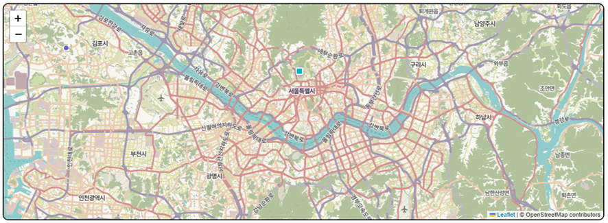
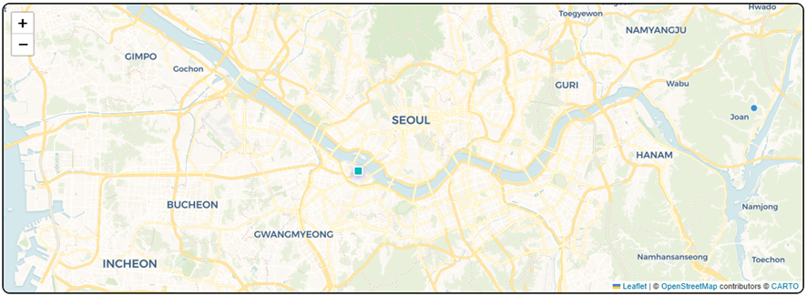
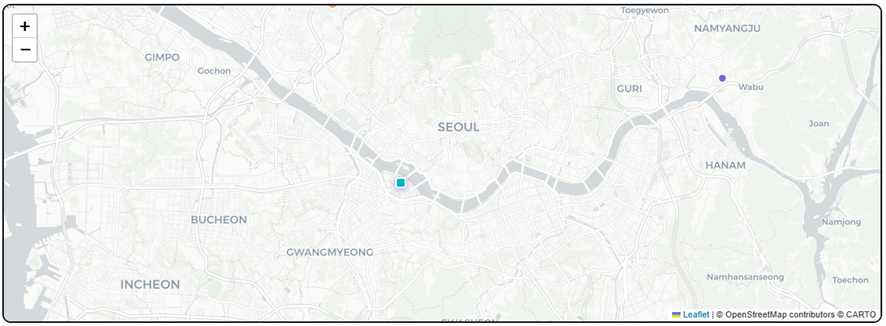
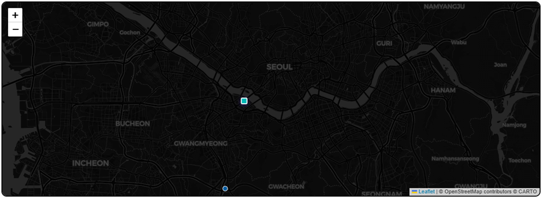
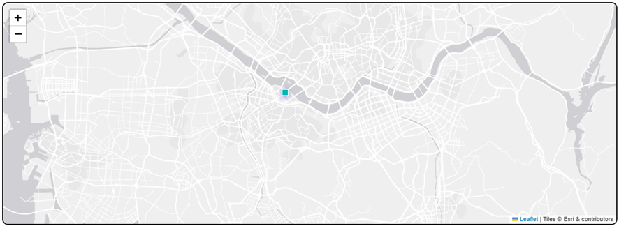

# 지도가 예쁘지가 않아.
얼마전에 만든 [AI를 활용한 Global Hotel Dashboard]() 프로젝트를 비롯해서 파트 후배들과 여러 AI 프로젝트를 진행하고 있는데, 보고 드렸더니 "지도가 예쁘지 않아. 다른 건 없어?" 라는 피드백이 있었다. 😇<br>
VDI 환경에서는 보안 정책상 구글 지도나 네이버 지도, 카카오맵 등 기존에 우리가 흔히 쓰는 지도 서비스를 띄울 수 조차 없기 때문에 코드를 짤 때, [Open Steet Map](https://www.openstreetmap.org/)을 이용했는데 내가 봐도 시인성이 좀 떨어지긴 한다. <br>
그래서 Open Street Map은 그대로 두고 타일(Tile)을 올려보기로 했다. <br>물론, 회사 시스템에서 사용해야 하므로 유료든 무료든 별도의 API Key를 요구하는 서비스는 제외했다. <br>사실 이러면 남는게 별로 없긴 하지만, 그래도 몇 가지 찾아서 변경해봤다.

# 타일 스타일










나의 경우 Global 지도 Base로 이용해야 하다보니 적절한 지명이 필요해서 **CARTO Voyager로 타일을 올려서 활용하는 걸로 결정**했다. <br>'구관이 명관'이라고 코딩이나 시스템에 대한 지식이 없는 제 3자가 볼 땐 그냥 '이쁜게 최고'이기 때문에 일단 조금이라도 더 이쁘게 만들자!

# 각 타일별 코드


```
 /* ── MAP ── */

function initMap(){

  myMap=L.map('map-box').setView([20,10],2);

  // 한국어 고정 타일 (OSM Nominatim 한국어 렌더링 레이어)

  L.tileLayer('https://tile.openstreetmap.org/{z}/{x}/{y}.png',{

    attribution:'© <a href="https://www.openstreetmap.org/copyright">OpenStreetMap</a> contributors',

    maxZoom:19,

    // OSM 한국어 타일 서버 — lang=ko 파라미터 지원 레이어

  }).addTo(myMap);

  // 한국어 오버레이 타일 (지명을 한국어로 표시)

  L.tileLayer('https://{s}.tile.openstreetmap.fr/osmfr/{z}/{x}/{y}.png',{

    attribution:'', maxZoom:20, opacity:0

  }); // fallback 준비

  // 실제 한국어 타일

  myMap.eachLayer(l=>myMap.removeLayer(l));

  L.tileLayer('https://tile-a.openstreetmap.fr/hot/{z}/{x}/{y}.png',{

    attribution:'© OpenStreetMap contributors',maxZoom:19

  }).addTo(myMap);

  

  mLayer=L.layerGroup().addTo(myMap);

  oLayer=L.layerGroup().addTo(myMap);
```



```
/* ── MAP ── */

function initMap(){

  myMap=L.map('map-box').setView([20,10],2);

  // CARTO Voyager — API 키 불필요, 가독성 높은 무료 타일

  L.tileLayer('https://{s}.basemaps.cartocdn.com/rastertiles/voyager/{z}/{x}/{y}{r}.png',{

    attribution:'© <a href="https://www.openstreetmap.org/copyright">OpenStreetMap</a> contributors © <a href="https://carto.com/attributions">CARTO</a>',

    subdomains:'abcd',

    maxZoom:20

  }).addTo(myMap);

  

  mLayer=L.layerGroup().addTo(myMap);

  oLayer=L.layerGroup().addTo(myMap);
```



```
/* ── MAP ── */

function initMap(){

  myMap=L.map('map-box').setView([20,10],2);

  // CARTO Positron (Light) — API 키 불필요, 가독성 높은 무료 타일

L.tileLayer('https://{s}.basemaps.cartocdn.com/light_all/{z}/{x}/{y}{r}.png', {

    attribution: '© OpenStreetMap contributors © CARTO'

}).addTo(myMap);

  

  mLayer=L.layerGroup().addTo(myMap);

  oLayer=L.layerGroup().addTo(myMap);
```


 
```
/* ── MAP ── */

function initMap(){

  myMap=L.map('map-box').setView([20,10],2);

  // CARTO Positron (Light) — API 키 불필요, 가독성 높은 무료 타일

L.tileLayer('https://{s}.basemaps.cartocdn.com/dark_all/{z}/{x}/{y}{r}.png', {

    attribution: '© OpenStreetMap contributors © CARTO'

}).addTo(myMap);

  

  mLayer=L.layerGroup().addTo(myMap);

  oLayer=L.layerGroup().addTo(myMap);
```


 
```
/* ── MAP ── */

function initMap(){

  myMap=L.map('map-box').setView([20,10],2);

  // Esri World Gray Canvas — API 키 불필요, 가독성 높은 무료 타일

L.tileLayer('https://server.arcgisonline.com/ArcGIS/rest/services/Canvas/World_Light_Gray_Base/MapServer/tile/{z}/{y}/{x}', {

    attribution: 'Tiles © Esri & contributors',

    maxZoom: 16

}).addTo(myMap);

  

  mLayer=L.layerGroup().addTo(myMap);

  oLayer=L.layerGroup().addTo(myMap);
```
