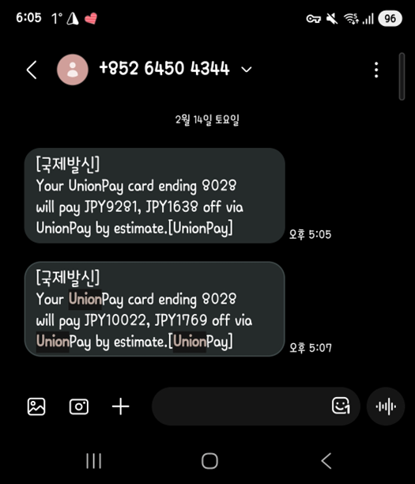

# 트래블로그 카드가 쏘아올린 공
하나카드에서 [트래블로그 체크카드](https://www.hanacard.co.kr/OPI41000000D.web?schID=pcd&mID=PI41015414P&CD_PD_SEQ=15414&)를 출시한시 얼추 4년이 다 되어간다. 기존에도 하나은행에서 Viva X나 Viva e 등등의 해외여행에 특화된 카드들을 많이 출시하긴 했지만, 대부분 현지 ATM 인출 수수료나 환전 수수료 등에 대한 혜택 위주였고 그나마도 완전 '무료' 이런 혜택은 아니었다.  그러다 바야흐로 트래블로그 체크카드가 등장했는데, 해외 ATM 인출 수수료 면제, 해외 가맹점 이용수수료 면제 조건으로 나온데다가 하나머니와 연계해서 '목표환율 자동 충전' 기능까지 추가되다 보니 해외 여행을 한 번이라도 다녀올 사람이라면 무지성 '발급'을 하게 만드는 카드가 됐다.  가만히 지켜만 보고 있을 수 없었던 다른 카드사들도 [신한 SOL트래블 체크카드](https://www.shinhancard.com/pconts/html/card/apply/check/1225714_2206.html), [KB 트래블러스 체크카드](https://card.kbcard.com/CRD/DVIEW/HCAMCXPRICAC0076?cooperationcode=09562), [우리 위비트래블 체크카드](https://m.wooricard.com/dcmw/yh1/crd/crd01/M1CRD101S02.do?recomNo=103489) 등 유사한 상품들을 출시했다.  모든 트래블 체크카드가 그렇듯 **해외에서 사용을 해야지만 유의미 하다보니 해외 현지 결제 이벤트들이 상당히 많이 생겼고, 현재까지도 진행중이다.**  어떤 측면에서 보면 개인적으로는 국내에서보다 해외에서 소비하는 게 더 '절약'이 될 지경이다. 😇 이렇든 저렇든 **소비자 입장에서 '경쟁'은 늘 좋은 거니까**... 앞으로도 쭉 이 체제가 유지되었으면 좋겠다. 

# 해외 여행 갈 때마다 챙기는 현지 결제 이벤트
나는 체크카드와 신용카드를 합쳐서 약 60여장을 가지고 있다.  위에서 얘기한 카드들이 나올 때 마다 발급 받아둔 것도 있지만, KB 굴비카드 시리즈라든지 최근에 유행한 하나 MG+ S, 신한 The More 등등 그때그때 핫한 카드들이 출시될 때마다 발급 받았다. (대부분은 거의 다 '단종' 상태다.) "회사 동료들이 그렇게 카드가 많으면 관리가 힘들지 않냐?" 많이 묻고는 하는데, **아무래도 나는 이런 할인(?)을 즐기는 사람인 것 같다.** 😇 흔히들 얘기하는 체리피커 중에 한 명일지도 모르겠다. 
다음은 지난 설에 후쿠오카를 다녀오면서 내가 정리했던 '현지 결제 이벤트'다. 여행계획을 짤 때 항상 [옵시디언(Obsidian)](https://obsidian.md/)을 이용해서 작성하는 2가지 항목이 있는데, 하나는 여행 계획이고, 하나는 이 현지 결제 이벤트다.  이 이벤트를 토대로 현지에서 소비 계획을 세운다. 😀

- 2026.02.14 ~ 2026.02.18 후쿠오카

| 우선순위 | 카드명                     | 사용처         | 사용금액                  | 비고                                             |
| ---- | ----------------------- | ----------- | --------------------- | ---------------------------------------------- |
| 1    | 금융 포인트리                 | 일본 전역       | 34,352엔               | 합산 100,000엔 이용시 10% 캐시백                        |
|      |                         | 렌트카         | 20,980엔               |                                                |
|      |                         | 머큐어         | 13,280엔               | 우리 SKT 유니온페이 이용 검토                             |
|      |                         | 힐튼          | 30,248엔               | 리브메이트 유니온페이 이용 검토                              |
|      | 리브메이트(아내)               | 편의점         | 건당 1천엔 이상             | 외화머니 500엔 제공, 최대 5회                            |
|      | 리브메이트(나)                | 면세점         | 1만엔 이상(합산)            | 외화머니 1천엔 제공                                    |
| 2    | BC GOAT                 | 기타          |                       | 100만원까지 6% (국제 수수료 1.2%)                       |
| 3    | 우리 SKT(아내, 나)           | 유니온페이 가맹점   | 8,000엔 이상 (USD 50) | 11% 즉시 할인, 건당 최대 2,500엔(USD 15) 각 3회(아내, 나) |
| 4    | 리브메이트(나)                | 유니온페이 가맹점   | 10,000엔 이상            | 15% 즉시 할인, 건당 최대 2,000엔 최대 5회               |
| 5    | 신한 Hi Point             | 기타          |                       | 100만원까지 5%, 4만원 적립 한도                          |
| 6    | 트래블로그 체크                | 세븐일레븐       | 합산 2만원 이상             | 5천 하나머니 적립(아내, 나)                              |
|      |                         | LAWSON      | 합산 2만원 이상             | 5천 하나머니 적립(아내, 나)                              |
|      |                         | FAMILY MART | 합산 2만원 이상             | 5천 하나머니 적립(아내, 나)                              |
|      |                         | 해외 면세점      | 합산 5만원 이상             | 1만 하나머니 적립(아내, 나)                              |
|      |                         | 해외 ATM      | 합산 20만원 이상 인출시        | 5천 하나머니 적립(아내, 나)                              |
| 7    | 네이버페이 머니                | 오프라인 결제     | 1만엔 까지(합산)            | 10% 적립(최대 1만원까지) 신한 Hi Point 초과시            |
| 8    | 신한카드 (더모아, Hi-Point) | 삼성페이 결제     | 합산 15,500엔 이상         | 1만원 캐시백                                        |

실제 위 표를 토대로 거의 대부분 다 결제하고 왔고, 4번 까지 알차게 쓰고 왔다. **일본에서 소비한 전체 금액의 최소 10%는 할인**을 받고 온 것 같다. 다만, 이렇게 할인을 받으려면 서두에 얘기한 것처럼 일단 **사용할 수 있는 카드가 많아야 한다.**  JCB, UnionPay, Master, Visa 전부 경쟁중이기 때문이다.  위 표를 토대로 일본에서 유니클로를 결제하면 다음과 같아진다. (해외 결제 수수료는 고려하지 않았다.) 
- 10,000엔(소비세 포함) - 소비세 면세(10%, 1,000엔) = 결제금액 9,000엔 ① 금융 포인트리(JCB) 결제시 900엔(10%) 캐시백 = 실제 체감금액 8,100엔 ② 우리 SKT(UnionPay) 결제시 990엔(11%) 즉시할인 = 실제 결제금액 8,010엔
- 후쿠오카 공항 면세점 결제금액 12,000엔  → 금융 포인트리(JCB) 결제시 1,200엔(10%) 캐시백 +  KB국민카드 이벤트(면세점 10,000엔 이상 결제시 외화머니 1,000엔 제공) = 실제 체금액 9,800엔

특히, UnionPay 이벤트의 경우 아래와 같이 얼마 할인이 됐다고 바로 문자가 온다.

결론을 한마디로 얘기하자면, 해외여행 계획이 있다면 해당 **월 초부터 수시로 카드사 홈페이지 이벤트란을 모니터링** 하자. 대부분의 카드사 이벤트가 그렇듯이 '응모'하지 않으면 혜택 적용을 해주지 않으니 미리미리 **쓰지 않더라도 '응모' 버튼을** 눌러놓자.  그리고 여행하는 국가의 이벤트를 모아서 정리하자.  그 이후에는 여행을 즐기면 그만이다! 👍

