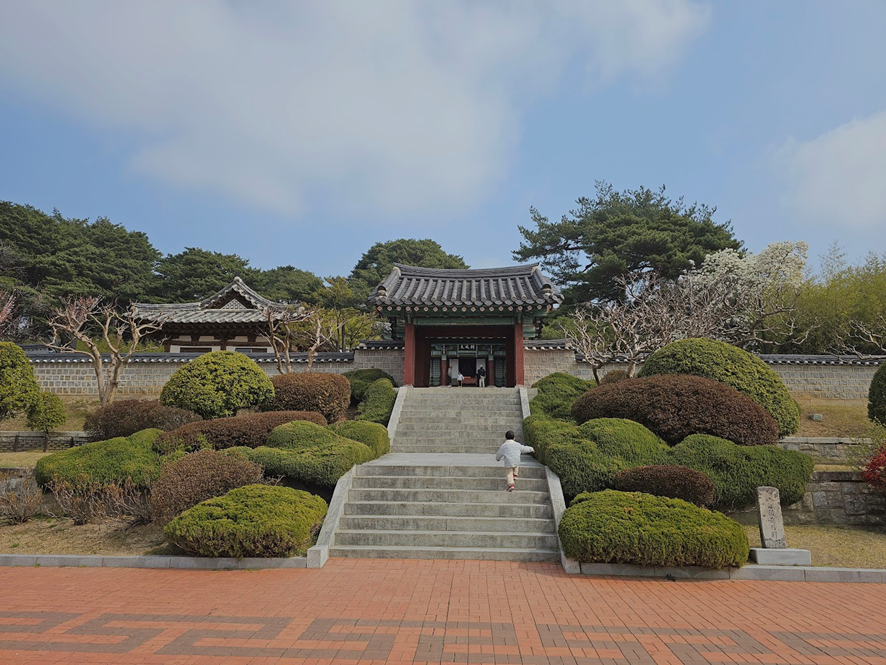
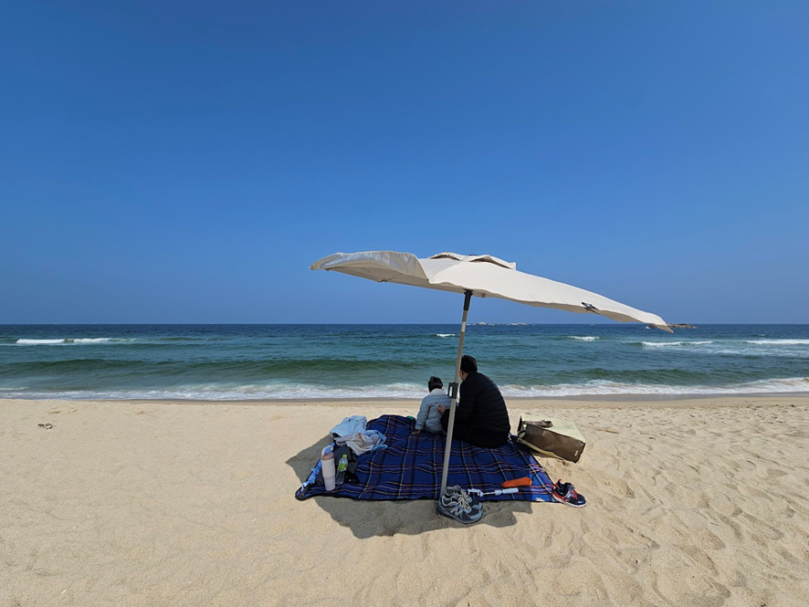
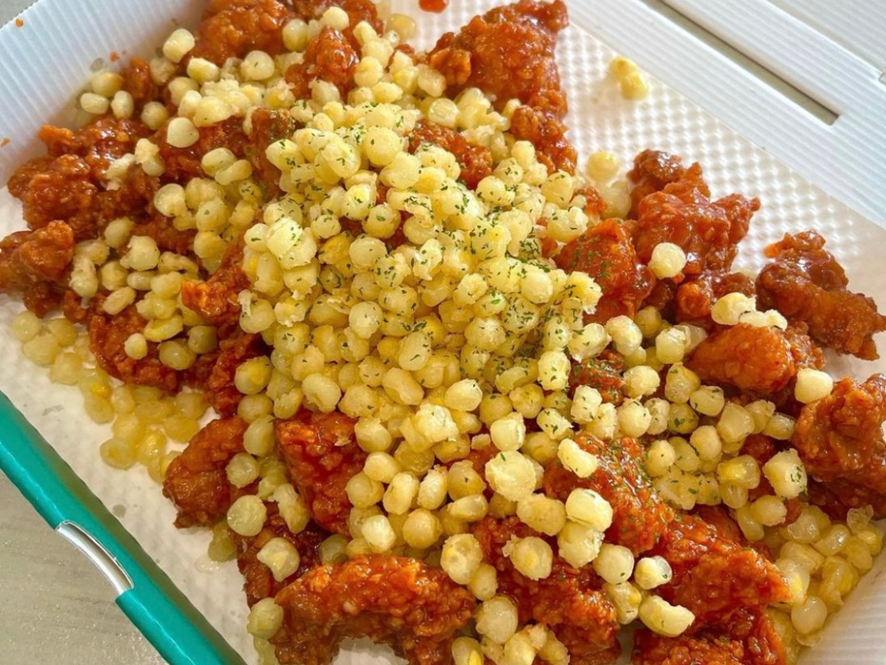
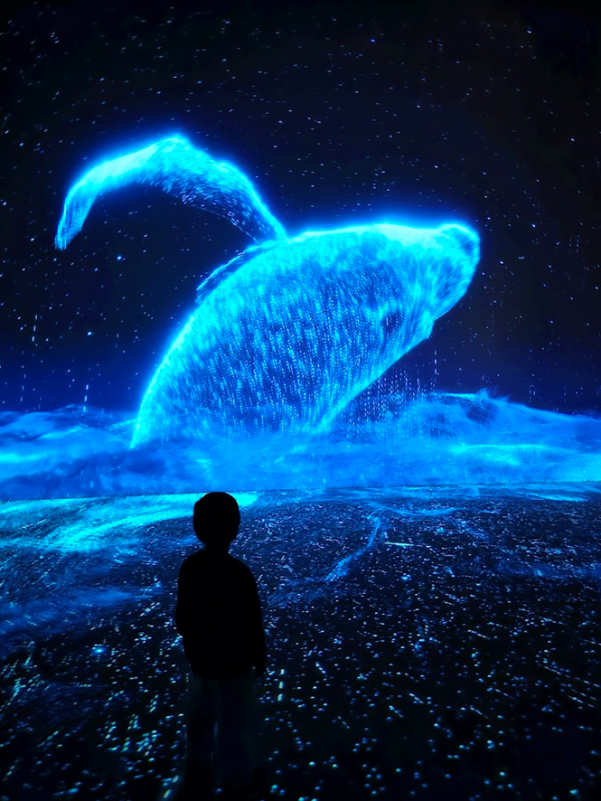
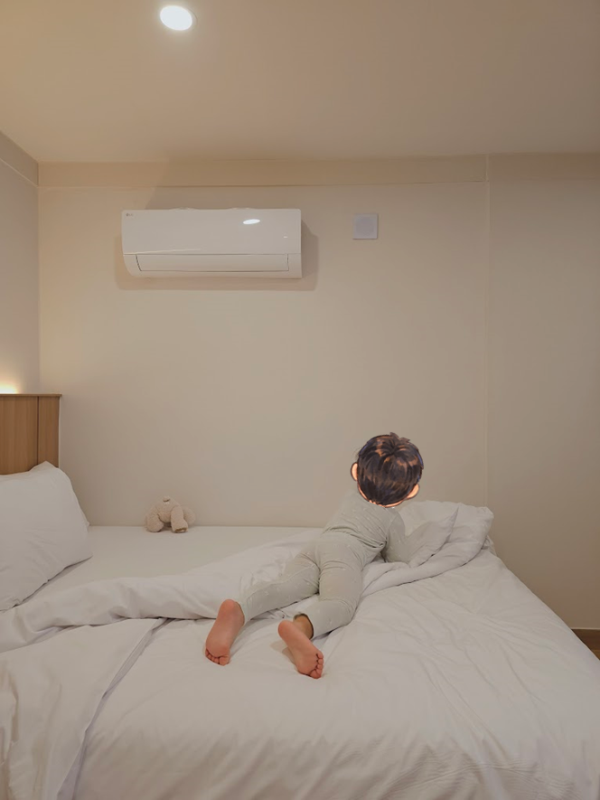
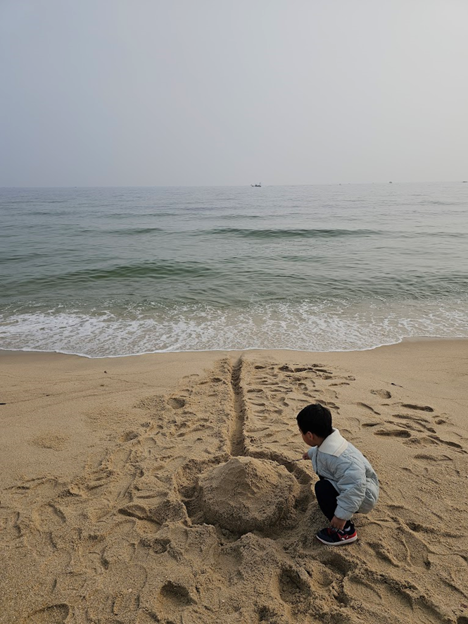
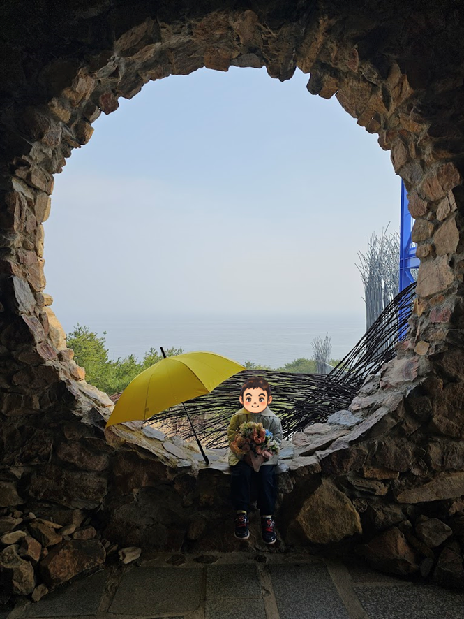

# 미세먼지를 피하고 싶었다.
출근길에 마스크를 쓰고 오가는 일도 엄청 귀찮은 일인데, 몇 날 며칠 동안 미세먼지 '매우 심각' 상태가 계속 됐고, 주말에도 계속 된다는 예보가 있었다. 😇 내가 근무하는 장소가 꽤 높은 층인데 밖을 내다보면 아무것도 안 보일 때도 있을 정도였으니 정말 심각하긴 한 것 같았다. 주말이 다가오면서 아이랑 같이 놀아야 하는데, 마스크를 쓰고 노는 게 얼마나 불편한 일인지 알고 있었기에 그나마 안 써도 될만한 곳을 찾아봤다. 실제로 **태백산맥 넘어 영동 지방은** 수도권 보다는 미세먼지가 덜했다.  수도권이 매우 나쁨 수준이면, **나쁨 ~ 보통 수준을 보였다.** 미세먼지가 태백산맥을 다 넘지 못하는 것 같은 느낌(?)이었는데, 실제 논문으로도 증명이 된 것 같다. 
- [이재헌 저술 2023. 강원도 미세먼지 분포에 대한 태백산맥의 영향. 한국방재학회](https://www.j-kosham.or.kr/upload/pdf/KOSHAM-2023-23-3-21.pdf)

오히려 영동 지방은 화력발전소가 많아서 지역에서 발생되는 미세먼지가 더 많다고도 했다. 어찌되었든 수도권에서 노는 것보다는 무조건 낫겠다 싶어 금요일 밤에 부랴부랴 호텔을 예약하고 토요일 아침 일찍 강릉 여행을 떠났다.

# 강릉 주말 여행
아이랑 여행을 갈 때는 시간 단위로 일정을 짜지 않고, 아이와 함께 갈 수 있는 장소들과 식당 몇 개를 알아보고 간다. 언제나 계획대로 되지 않기 때문이기도 하다. 😇

이번 3/28(토) ~ 3/29(일) 주말 여행 일정은 다음과 같이 다녀왔다.

> [!TIP] 일정
> 📅 **1일차**📍 
>  오죽헌 🏛️ → 경포대 해변 🌊 → 강릉닭강정 🍗 → 아르떼뮤지엄 강릉 🎨 → 숙소(MGM 호텔) 🏨 → 경포대 해변 🌙 → 태홍루 🍜
> 
> 📅 **2일차**📍 
> 경포대 해변 🌅 → 하슬라아트월드 🗿

나도 생애 처음 가 본 '[오죽헌](https://naver.me/xf5AFK4A)', 한옷도 멋있지만, 정원도 잘 꾸며져 있고 목련, 벚꽃, 자두나무, 명자나무 등 다채로운 꽃들을 볼 수 있는 곳이다. 4월 중순 즈음 꽃이 다 피고나면 정말 예쁠 것 같다는 생각을 많이 했다. 입장료도 그리 비싸지 않은데다 사진도 예쁘게 잘 나온다. 아이가 있다면 내부에 '[화폐전시관](https://naver.me/xP89ZSsl)', '[시립박물관](https://naver.me/GZZ2mOIw)'이 있어서 **2시간은 놀 수 있다.** (물론, 내가 갔던 토요일에는 시립박물관 문은 닫혀있었다.) 특히, 화폐박물관에 가면 사진을 찍어서 55,000원 지폐에 촬영한 얼굴을 합성해서 스크린에 띄워주는 게 있는데 꽤 재미있다. 😄 촬영한 사진은 메일로 보내준다.

동해 바다는 더 말할 필요도 없이 좋았다. 아이가 돌 때쯤 사놓은 파라솔을 드디어 2번째로 쓸 수 있는 기회였다. 😆 3월 말의 동해 바다는 **햇살은 따스하지만 바람은 좀 차가워서 경량 패딩 정도는 입어야** 오랜시간 모래놀이를 할 수 있었다.

아내와 나의 최애 닭강정은 삼척 '[부영닭강정](https://naver.me/GpCTHYNp)'이었는데, 이번에 처음 먹은 '[강릉닭강정](https://naver.me/Fuz5LJqD)'과 최애를 꼽으라면 굉장히 고민이 된다.  한번 먹어보고 또 생각이 나는 맛이었다. 특히, **저 옥수수와 사이사이 누릉지가 굉장히 별미**다. 😆 택배가 된다면 당장 주문하고 싶은 마음이다. 토요일 오후 2시 브레이크 타임 시작 5분전에 도착해서 거의 기다림 없이 바로 주문하고 받아서 나왔는데, 여러 리뷰를 보니 피크 시즌에는 1~2시간 웨이팅은 기본인 듯 하다. 개인적으로 그만큼 기다려서 먹을만한 가치가 있다는 생각이다. 👍

뽀짝이가 4살때 아르떼뮤지엄 여수에 갔었는데, 그때보다 훨씬 좋았다.  [아르떼뮤지엄 강릉](https://naver.me/xjgckgru)점은 뭔가 **멍 때리고 작품 감상하기 최적화 되어 있는 느낌**이다. 미끄럼틀 같이 아이가 몸으로 노는 시설은 없지만 동물 스케치도 있고, 번개, 바다 등등 바닥에 앉아서 작품을 바라보는 것만으로도 꽤나 재미있었다. 뽀짝이는 제 집마냥 신발도 벗고 드러누웠다가 엎드려 뻗쳐를 했다가 나름대로의 이 곳에서 찾았다. 😇

성인 2, 아이 1 이렇다 보니 웬만한 호텔들을 인당 2만원 수준의 추가금을 받거나 아예 아동 입실이 불가능 한 곳이 많다. 또, 이제는 더블 침대에서 3명이서 같이 잘 수는 없기에 몇 년 전부터 무조건 여행갈 때는 트윈룸을 예약하고 간다. 그 중 선택한 곳이 이 [**MGM 호텔**](https://naver.me/xq3ai4bz)이다.  내가 원하는 조건은 3가지 였는데, 모두 만족했다. 
	**① 트윈룸 중에 가장 저렴할 것  **
	**② 경포대 바다가 도보로 2~3분 이내 갈 수 있을 것 **
	**③ 비교적 리모델링이 최근에 되었거나 객실 상태가 쾌적한 곳**  
생수도 기본 3개 비치에 1층 로비에 무한으로 생수를 가져갈 수 있었고, 주차장도 넉넉한 편이었다.  화장실 배수가 살짝 잘 안되는 느낌이었지만 그것 외에는 모두 만족스러웠다. **3/28(토) 1박 기준 115,000원**을 결제했는데, 아이러니한 건 여기어때, 야놀자 등 전부 비즈니스 회원인데, 네이버에서 검색/경유해서 들어간 게 선착순 15,000원 쿠폰 적용이 되어서 가장 저렴했다. 

저녁식사를 했던 '[태홍루](https://naver.me/GeUq2tfm)'는 마감 5분전에 들어가느라 사진을 찍진 못했는데, 생각보다 맛있었다. 영업을 오전 10시 ~ 오후 6시까지 밖에 하지 않는데, 현지 맛집 느낌이 물씬 났다. 대부분의 관광객들을 코너 돌면 바로 자리하고 있는 '[최일순 짬뽕순두부](https://naver.me/Gj6XOP8l)'에 줄줄이 웨이팅을 하고 있었는데, 어차피 뽀짝이는 짬뽕 정도의 맵기를 아직은 못 먹어서 탕수육을 먹으러 갔던 터였다. 마감 5분 전에 들어갔음에도 사장님이 '천천히 먹어라, 남은 탕수육은 싸줄까' 하시면서 너무도 친절하게 응대해주셔서 다음에 강릉에 간 다면 또 갈 의향이 있다. **탕수육도 맛있었지만, 짬뽕이 뭔가 다른 곳들과는 매콤달콤하니 별미**였다. 

다음날 아침부터 경포대 해변에서 모래성을 지으면서 뽀짝이와 놀았다.  겸사겸사 '삽질'도 전수를 하면서... 😇

[하슬라 아트월드](https://naver.me/FgHDJFVH)는 강릉에서는 30분 정도 떨어져 있어서 정동진 쪽에 가깝다. 그럼에도 찾아간 이유는 조금은 색다른 미술 작품들이 있기도 하고, 바다도 구경하고 사진도 좀 예쁘게 나올 것 같아서 였다. 결론부터 얘기하면 사진 찍으면서 꽤 재밌게 놀았다. 조금 신선한 작품들도 많았는데, 사진을 찍으면 예쁘게 잘 나왔다. 물론, 이 날도 미세먼지가 있기는 했어서 바다 색깔이 더 예쁘게 나오지 않아 아쉽긴 했다. 설치 미술이나 색다른 곳을 원한다면 한번쯤 가볼만 한 것 같다. **대신 입장료 자체는 조금 비싼 편이다.** 😇  활발한 아이 혹은 아이들을 동반한 가족이라면 어쩌면 근처에 있는 [정동진 레일바이크](https://naver.me/5S9QcmBl)가 나을 수도 있다. 거의 대부분 구간이 전동으로 움직여서 조금만 발로 굴러주면 나머지는 해변을 따라 자동으로 움직인다.  이틀동안 600km 가까이 운전을 했더니 다리가 꽤나 뻐근하다. 그런데도 또 놀러가고 싶은 마음이 스멀스멀 올라오는 걸 보니 아직 놀러갈 체력이 남아 있나 보다. 😁
