# 결국 나보고 교육을 하라고 한다.
기존에 내가 만들었던 [AI를 활용한 Global Hotel Dashboard](), [AI를 활용한 마스터플랜(Progress Tracker)]() 이런 것들 때문이었는지 모르겠지만, 팀장님이 나보고 팀원들을 상대로 Power Platforms 관련 교육을 해달라고 요청했다. 정확히는 **Power Pages, Power Automate, Sharepoint List 또는 JSON을 통해 백엔드, 프론트엔드를 구축해서 하나의 사이트 혹은 시스템을 만드는 걸 설명해달라**는 것이었다. 그것도 20분 안에 말이다. 나머지는 "직원들 개인이 알아서 할거야"라는 말과 함께.  Power BI라는 아주 좋은 툴이 있긴 하지만, 요즘 말로 '있어빌리티' 가 있게 예쁘게 만드는 건 굉장히 어렵다.  오랜 시간이 걸리기도 하고 차트 막대 색깔을 하나하나 바꾸다 보면 현타가 쎄게 온다. 내부 Copilot이 차단되어 있기 때문에 AI 보고 예쁘게 꾸며달라고 할 수 조차 없기 때문이다.  그래서 나는 다른 방법들을 찾았다. 그 결과, Power Pages의 웹 리소스와 Power Automate의 Flow, 그리고 Teams와 연동되는 Sharepoint에서 나름의 사이트 구축을 할 수 있게 되었고, 더 나아가 직원들을 대상으로 하는 '시스템'을 만들 수 있었다.  특히, 27,000여개의 호텔 데이터를 활용한 대시보드를 BI와 Pages를 통해 각각 만들어 봤는데, 결과적으로 지도에 마커를 찍고 데이터를 표현하는 속도 자체가 [AI를 활용한 Global Hotel Dashboard]()에서 처럼 확실히 HTML + CSS + JS + JSON 조합이 압도적으로 빨랐다. 한마디로 내 무덤을 내가 판 꼴이려나... 😇

# 교육 내용
사실 대부분의 직원들이 엑셀의 vlookup 정도만 활용해서 업무를 한다. 그래서 html이 뭔지, css가 뭔지 아무런 개념이 없다. Antigravity니 Cursor며 깔아보고 써본 사람들을 바이브 코딩으로 짠 하고 html 파일을 만들어냈지만 그게 Edge나 Chrome에서도 실행이 된다는 사실을 모르기도 했다. 더욱이 **나는 개발자도 아니고, 코딩 학원 선생님도 아니기 때문에** 고민하다 다음과 같은 내용을 주로 알려주기로 했다.
- HTML, CSS, JavaScript, JSON의 역할과 기능, 예시
- 프론트엔드와 백엔드의 개념과 차이
- 개발자와 소통시 필요한 사용자 흐름, 화면 설계서, 기능 명세서에 대한 소개
- Power Platform 내 각 앱들의 기능과 용도
- Power Pages 사용시 사내 제약 환경
- Power Pages - Power Automate - SharePoint 연계 방식
- Power BI와 Power Pages의 차이 및 장/단점
- Power Pages 웹 리소스 업로드 방법 안내
- 바이브 코딩의 개념
- 최근 개발 패러다임의 변화와 AI 코딩을 위한 4대 핵심역량 소개

써놓고 보니 뭔가 거창하긴 하지만, 다른 팀원들이 '이해'를 할 수 있을지 모르겠다.

교육자료는 NotebookLM으로 제작했고, 설명을 위한 예제 역시 간단한 AI 코딩으로 만들었다. 

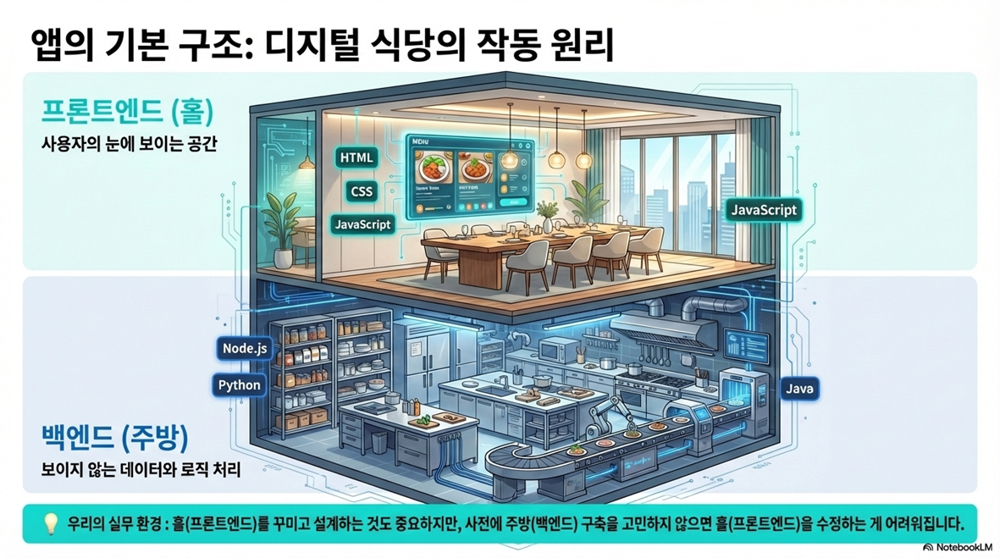 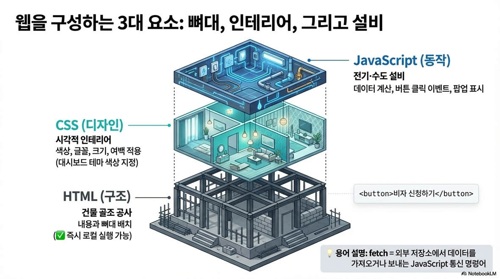 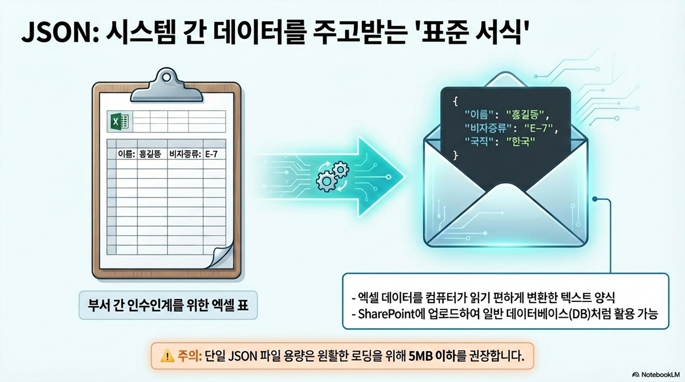 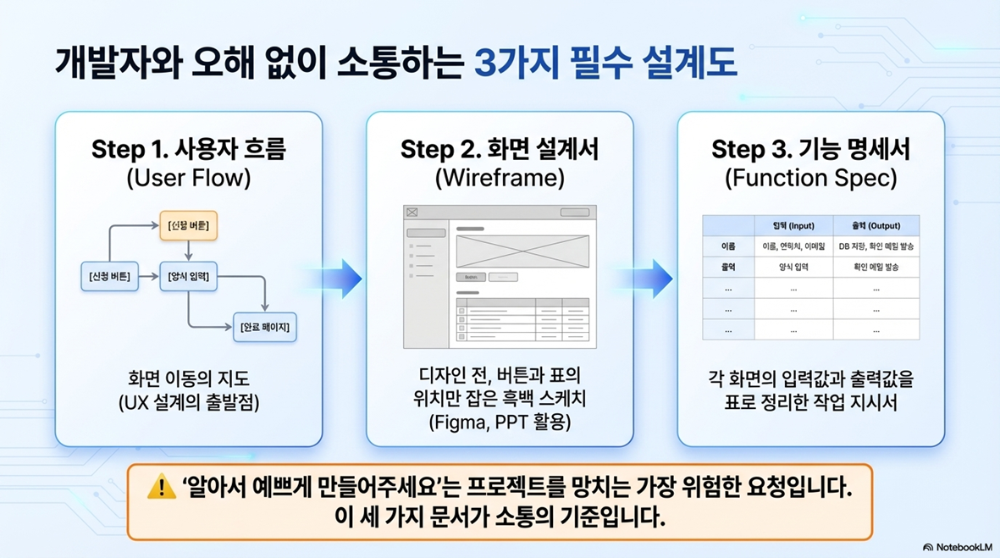    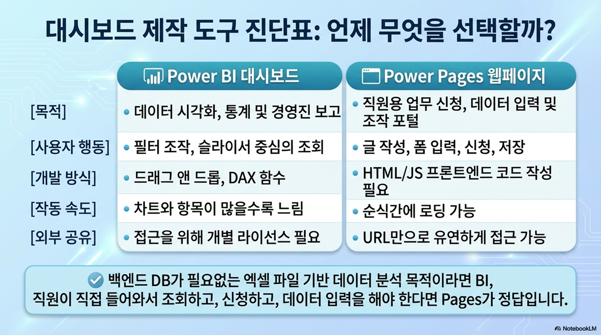 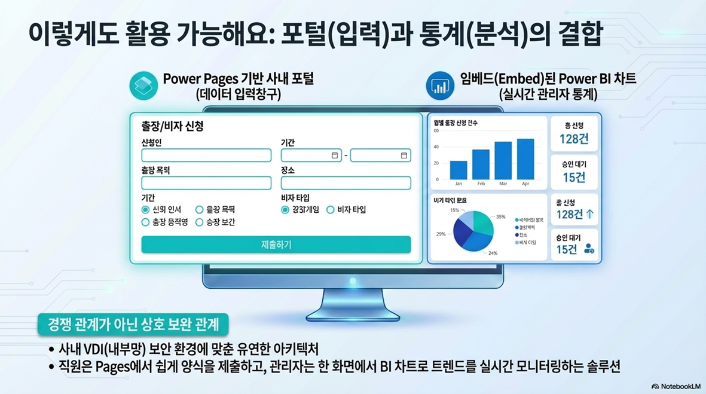 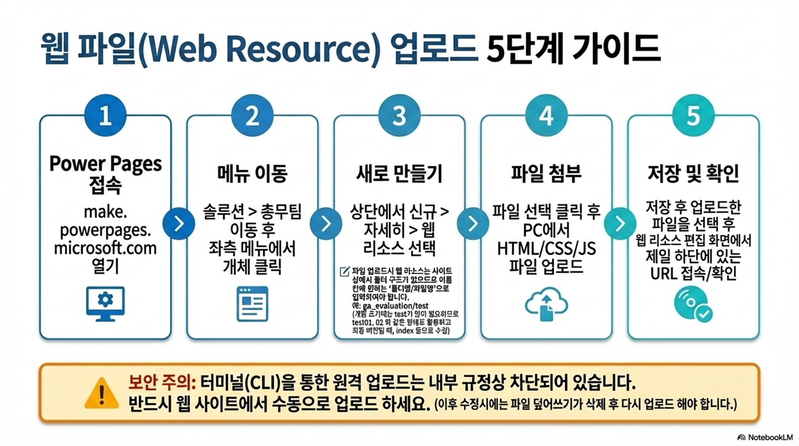 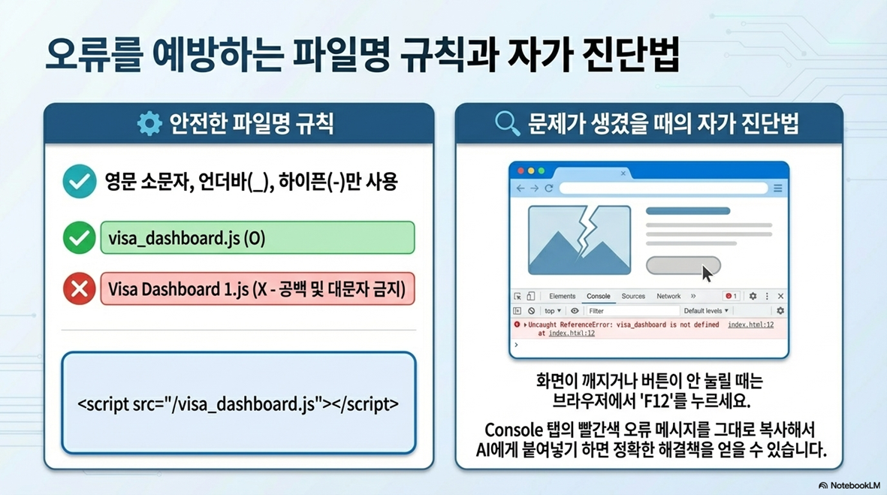 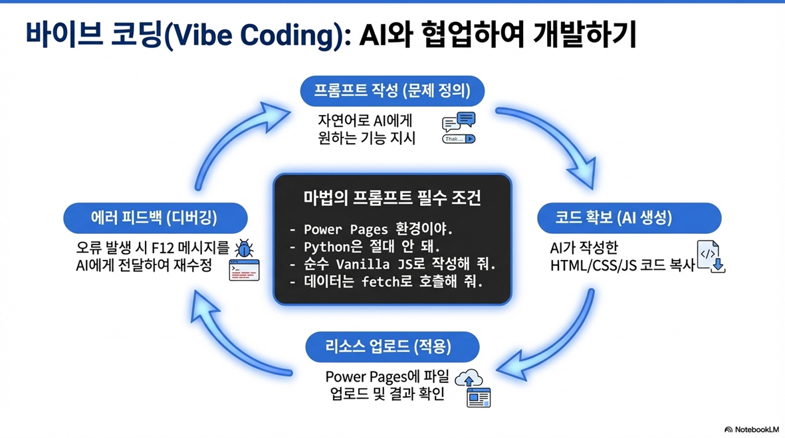  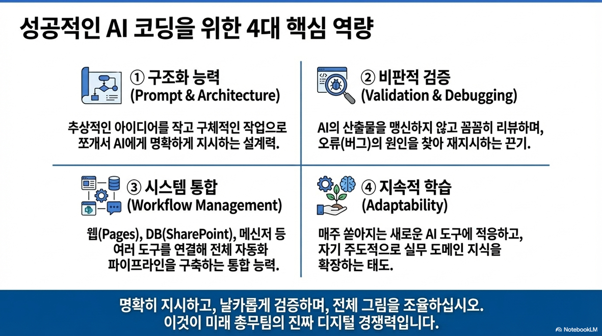

# HTML 예제
HTML만 있을 때, HTML + CSS만 있을 때, HTML + CSS + JavaScript까지 있을 때, 이렇게 3단계의 차이를 보여주기 위해 다음과 같은 예시 코드를 만들었다. 너무 간단한 코드라 별 내용이 없긴 하지만, 개념 이해에는 어느 정도 도움이 되리라 본다.

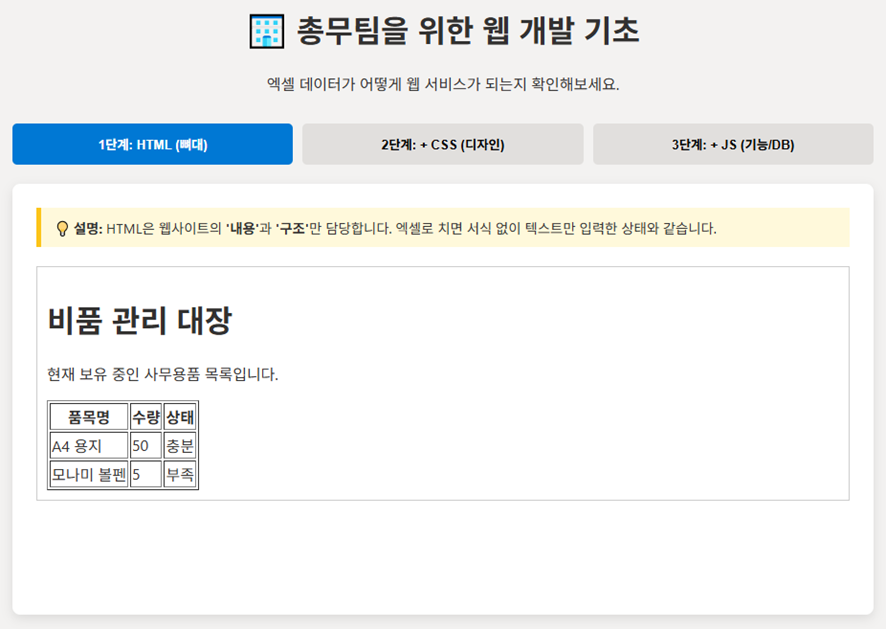

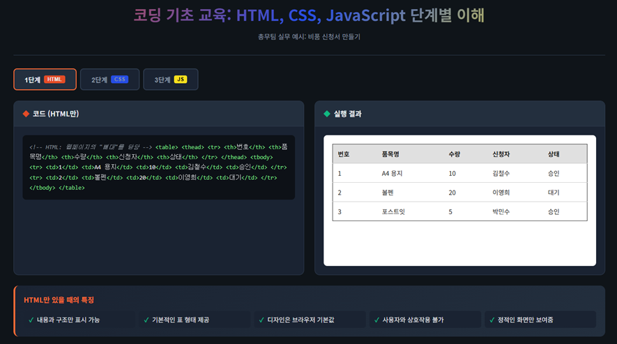

3번째 예시의 경우 백엔드 즉, DB의 필요성에 대해 알려주기 위해 만들었다.  임의의 비품을 추가하면 내 PC, 내 화면에서는 보이지만 다른 직원의 PC에서 실행하면 내역이 보이질 않는다.  DB가 없으면 모든 사용자가 같은 화면을 볼 수 없다. 로컬 스토리지에 저장되는 데이터일 뿐이다. 다른 직원 PC까지 갈 필요도 없이 Edge에서 html 파일을 열고 입력한 후에 Chrome에서 동일하게 띄워보면 내역이 없는 걸 알 수 있다. 
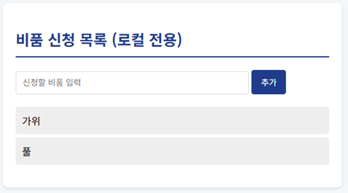

> [!SUCCESS] **예시 공유**
> - [🌐 새 창에서 예시1 열기(Ctrl + 클릭)](/files/example_1.html)
> - [🌐 새 창에서 예시2 열기(Ctrl + 클릭)](/files/example_2.html)
> - [🌐 새 창에서 예시3 열기(Ctrl + 클릭)](/files/example_3.html)

이 정도면 20분은 금방 채울 수 있겠지... 😇
