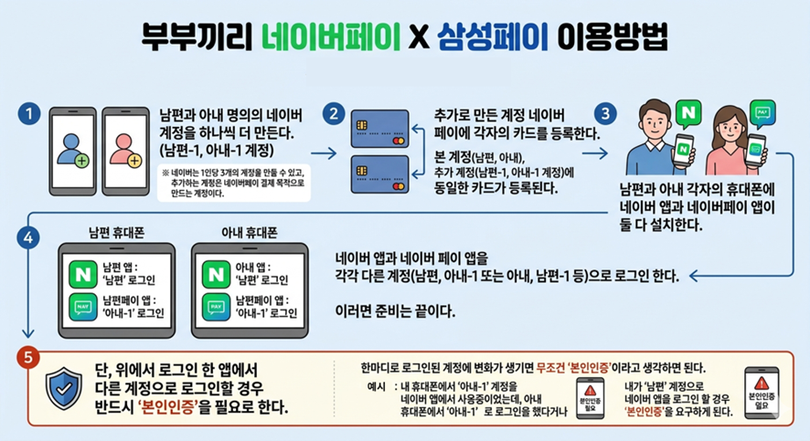
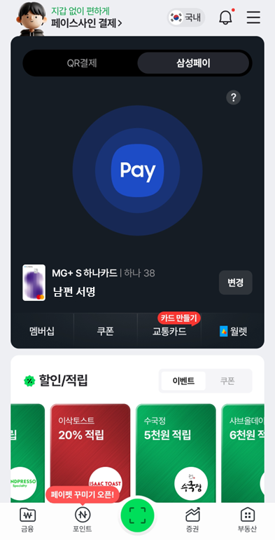
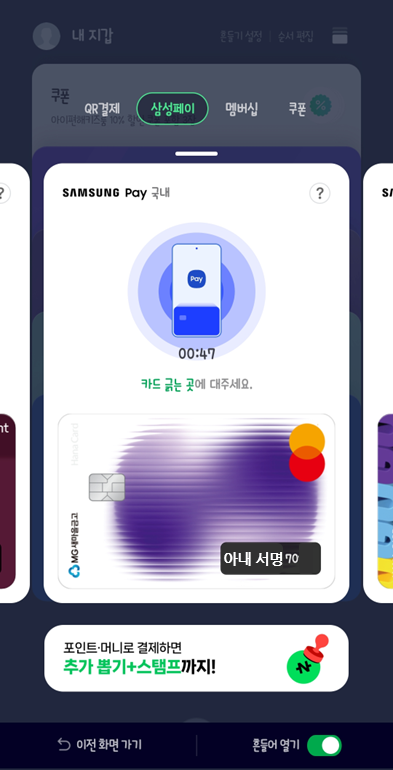
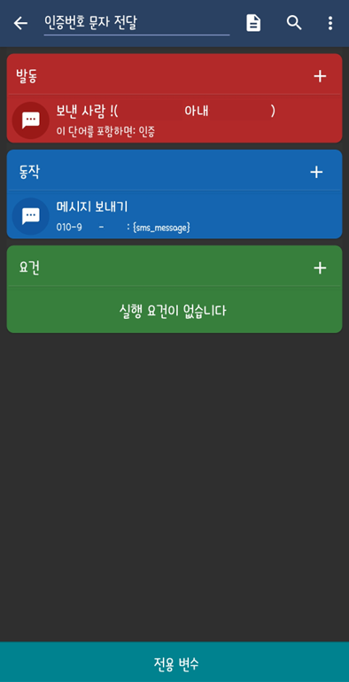
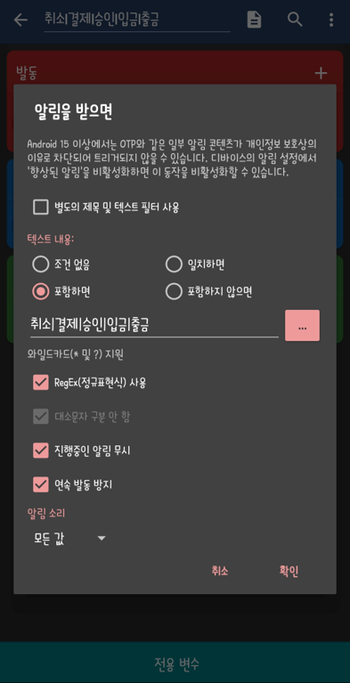

# 카드가 많아지면 할 일이 많아진다.
[여행의 재미는 소비에 있다.]() 포스팅에서 얘기했던 것처럼 60여장의 카드를 관리하려고 하다보면 당연히 내 카드, 아내 카드 모두의 실적과 혜택을 뽑아(?)먹어야 한다. 그러려고 그렇게 많은 카드를 만들게 되는 거니까. 그래서 **서로의 카드를 언제든 사용할 수 있는 환경을 만들기 위해 "네이버페이 X 삼성페이"를 활용**한다. (둘 다 갤럭시 휴대폰이다.) 과거에는 페이코 X 삼성페이가 있어서 동일하게 서비스를 이용했었는데, 페이코가 서비스를 종료하고 네이버페이가 동일하게 서비스를 유지중이다. 카카오페이도 삼성페이를 지원하고 있지만, 부부끼리 사용하기에는 네이버페이가 더 편리하다.
# 부부끼리 네이버페이 X 삼성페이 이용방법
사용방법은 생각보다 간단하다.

- **남편과 아내 명의의 네이버 계정을 하나씩 더 만든다.** (남편-1, 아내-1 계정)
	※ 네이버는 1인당 3개의 계정을 만들 수 있고, 추가하는 계정은 네이버페이 결제 목적으로 만드는 계정이다.
- 추가로 만든 계정 네이버 페이에 각자의 카드를 등록한다. 
	- 본 계정(남편, 아내), 추가 계정(남편-1, 아내-1 계정)에 동일한 카드가 등록된다.
- 남편과 아내 각자의 휴대폰에 네이버 앱과 네이버페이 앱이 둘 다 설치한다. 
- **네이버 앱과 네이버 페이 앱을 각각 다른 계정**(남편, 아내-1 또는 아내, 남편-1 등)**으로 로그인 한다.**
- 이러면 준비는 끝이다. 단, 위에서 로그인 한 앱에서 다른 계정으로 로그인할 경우 반드시 '본인인증'을 필요로 한다. 한마디로 로그인된 계정에 변화가 생기면 **무조건 '본인인증'**이라고 생각하면 된다.
	- 예를 들면, 내 휴대폰에서 '아내-1' 계정을 네이버 앱에서 사용중이었는데, 아내 휴대폰에서 '아내-1'로 로그인을 했다거나 내가 '남편' 계정으로 네이버 앱을 로그인 할 경우 '본인인증'을 요구하게 된다.

연말정산이나 여러 사유로 타인 명의의 카드를 등록해서 사용하는 사람들이 가장 '애로사항'으로 느끼는 부분이 바로 저 '본인인증' 이다. 우선 설정에 성공(?)하면 아래와 같이 하나의 휴대폰에서 부부(2명)의 삼성페이로 각각 결제할 수 있다.

 

# 인증문자 자동 포워딩을 위한 앱 Macrodroid
나와 아내는 각각의 휴대폰에 [Macrodroid](https://play.google.com/store/apps/details?id=com.arlosoft.macrodroid&pcampaignid=web_share)가 설치되어 있다. 과거에는 [Tasker](https://play.google.com/store/apps/details?id=net.dinglisch.android.taskerm&pcampaignid=web_share)를 쓰고는 했는데, 최근에는 UI가 좀 더 괜찮기도 하고 사용이 좀 더 편리해서 Macrodroid를 애용하고 있다. Macrodroid는 안드로이드 휴대폰에서 일어나는 각종 이벤트를 토대로 자동화해주는 앱인데, 특정 단어가 포함된 문자가 수신되면 자동으로 포워딩(전달)할 수 있다. 갤럭시 루틴에 SMS 포워딩 기능이 있었다면 이 앱마저 필요없을 수도 있었는데, 아직까지 해당 기능까지는 없다. 설정방법은 이렇다. (다른 앱들도 동일한 형태다.)
- 문자로 **"승인", "인증", "Code" 라는 단어가 포함된 메세지**가 수신되면 아내(010-1234-1234) 번호로 해당 메세지를 전달하게 한다. (반대의 경우도 마찬가지다.)
- 단, 이 때 메세지를 **보낸 사람에 '아내 번호는 반드시 제외'** (설정화면에서 느낌표 !가 제외 설정) 시켜야 한다. 제외시키지 않게 되면 같은 문자를 서로 '무한대'로 주고 받을 수 있다. 😇
- 여기서 좀 더 응용해서 **"결제", "입금", "출금", "취소"** 라는 단어를 포함해서 동일한 형태로 매크로를 만들면 서로간의 지출내역도 공유할 수 있다. 
한가지 유의사항을 미리 얘기하면 해외여행시에는 해당 기능을 비활성화 해놓는 게 좋다. 로밍을 해가는 사람이면 모르겠지만, 나처럼 현지 eSIM을 사용하게 될 경우 해외에서 문자 발송은 건당 과금되기 때문에 크진 않지만 소소하게 로밍요금이 발생될 수 있기 때문이다.  물론, SKT의 경우 로밍해가면 현지에서 발송하는 문자도 공짜이기는 했지만, 로밍비가 워낙 비싸니... 😇

 

이렇게 각종 인증 문자까지 부부 서로에게 포워딩을 시켜놓으면 네이버페이 앱이든, 네이버 앱이든 인증이 풀리는 경우에도 바로 인증할 수 있다. 마지막으로 앱에서 **본인인증을 요구할 때는 반드시 사용하고 있는 휴대폰의 번호로 인증해야 한다.** 예를 들어, **남편 휴대폰에서 아내 명의 계정의 네이버 페이 혹은 네이버 앱을 이용중인 경우에 본인인증은 남편 휴대폰 번호로 해야한다.** 성명, 생년월일 등을 그대로 입력하되 휴대폰 번호는 다르게 넣어서 인증을 해야 삼성페이가 정상적으로 작동한다.   나 같은 경우 아내 카드의 실적을 챙기기도 하고, 아내 카드로 보험료, 관리비 등을 결제하고 있다보니 인증문자를 같이 받으면 효율이 상당히 좋다. 👍

---
- 2026.04.20
	- 혹시나 "취소", "결제", "승인", "입금", "출금" 등의 텍스트가 포함된 알림이나 문자를 하나의 매크로로 전송하고 싶은 경우에는 아래와 같이 **RegEx(정규표현식) 사용에 ✔️ 체크**한 후에 텍스트 내용에 **"│" 활용**해서 입력하면 된다.  즉, **"취소│결제│승인│입금│출금"**과 같이 입력하면 된다.

