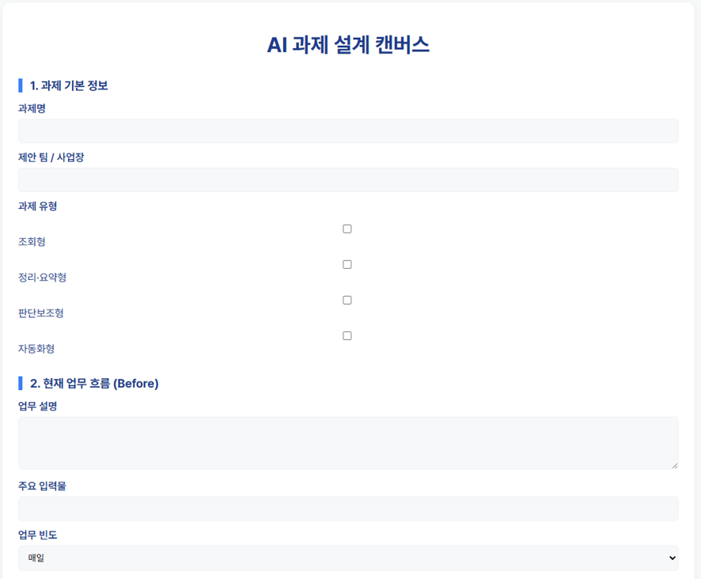
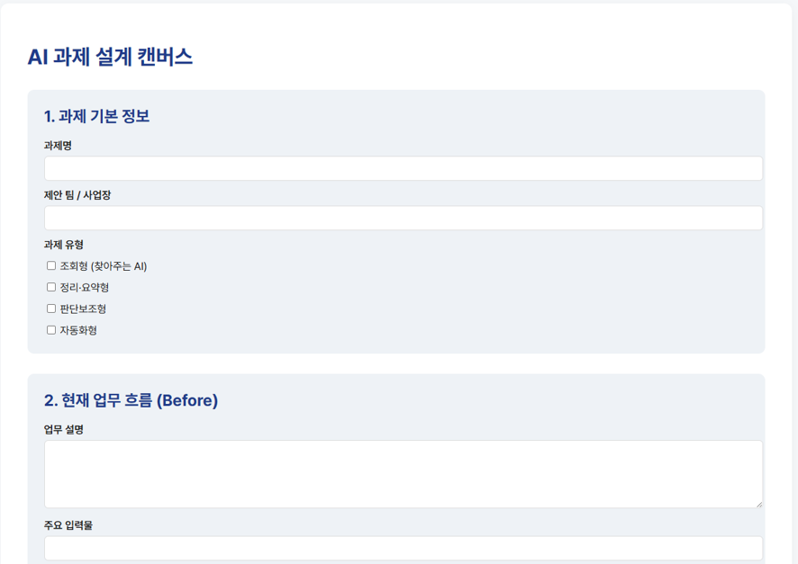
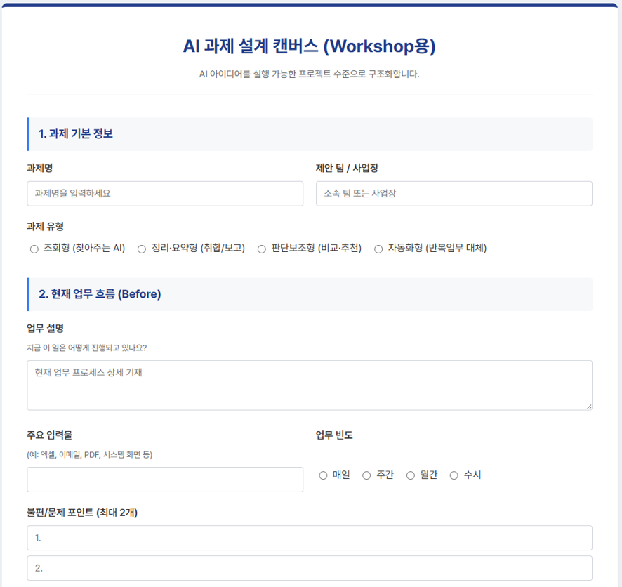
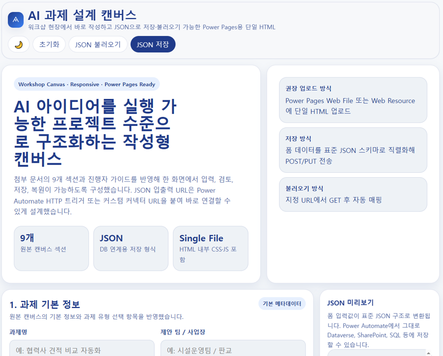
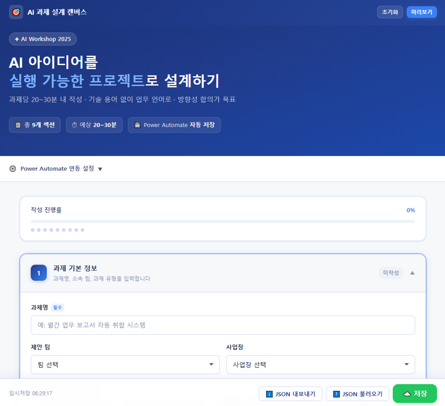

# Workshop 좀 준비해봐
[직원들을 대상으로 Power Platforms 교육]()을 한지 며칠 지나지도 않았는데, 난데 없이 팀장님이 나를 부른다.<br>"4월 말쯤에 하루 종일할지, 오후만 해도 될지 보고 저녁식사 있는 일정으로 팀장들하고 실무자들 포함해서 상무님이랑 같이 ○○에서 하는 걸로 하자"<br>이게 AI Workshop에 대한 지시의 전부다. 😇 주제나 내용 따위는 사치스럽다.<br>어쩌면 내 문제일 수도 있다. 주변에 있는 후배들은 내가 개떡같이 얘기해도 그럴싸하게 자꾸 들고 가서 라고 한다.<br>속으로 '어떻게 그게 내 문제야' 라고 생각하면서도 고개를 끄덕이게 된다.<br><br>어찌되었든 뭔가를 만들어야 해서 기존에 담당 임원 산하에서 추진하려고 했던 AI 과제 10개를 가지고 "AI 과제 추진 가속화 Workshop"을 타이틀로 준비해본다.<br>대부분의 직원들이 엑셀 vlookup 정도만 다룰 수 있는 Skill이 있다고 가정하고 실제 과제를 구현 즉, 목표 달성을 할 수 있는지 현실감각을 일깨우는 목적이다.<br>결과적으로는 안될 것 같으면 빨리 다른 아이템으로 대체하든지 지원인력을 붙이든지 하자는 취지이다.<br>사실 되냐 안되냐도 코딩을 모르거나 시스템 아키텍쳐, 사내 환경을 하나도 모르는 사람이 알기란 하늘의 별따기다.<br>그래서 빨리 누군가 '가르마를 타줄 필요'가 있다. (그걸 내가 할 줄을 몰랐지만... 😇)

# AI 과제 설계 캔버스
여러 AI들과 심도있는(?) 대화를 통해 이번 Workshop에서는 아래 양식과 같이 "**AI 아이디어를 실행 가능한 프로젝트 수준으로 구조화**" 하기로 했다.

## 과제 기본 정보
- **과제명**:
- **제안 팀 / 사업장**:
- **과제 유형** (선택)
	- [ ] 조회형 (찾아주는 AI)
	- [ ] 정리·요약형 (취합/보고)
	- [ ] 판단보조형 (비교·추천)
	- [ ] 자동화형 (반복업무 대체)
## 현재 업무 흐름 (Before)
- **업무 설명**: 지금 이 일은 어떻게 진행되고 있나요?
- **주요 입력물**: (예: 엑셀, 이메일, PDF, 시스템 화면 등)
- **업무 빈도**: 
	- [ ] 매일 
	- [ ] 주간 
	- [ ] 월간 
	- [ ] 수시
- **불편/문제 포인트** (최대 2개) 
	- 1. 
	- 2.
## AI 적용 포인트 (핵심은 ‘1곳’)
- **AI가 대신하거나 도와줄 지점은 어디인가요?**
   (예: 자료 취합, 초안 작성, 비교 정리, 조건 체크 등)
- **사람의 판단이 꼭 필요한가요?**
	- [ ] 예 
	- [ ] 아니오
	- [ ] 일부만 필요
## 데이터 관점
- **주요 데이터 형태** (복수 선택 가능)
	 - [ ] 정형 데이터 (엑셀, 테이블, DB)
	 - [ ] 비정형 데이터 (문서, 이메일, 이미지)
- **데이터 위치**
	 - [ ] 개인 PC 
	 - [ ] 팀 공유폴더 
	 - [ ] 시스템/포털
- **데이터 품질**
	- [ ] 비교적 정리됨 
	- [ ] 일부 정리 필요 
	- [ ] 정리가 많이 필요
## 구현 형태 가설 (정답 아님)
- 교육용이 아닌 “방향성 선택”, 가장 적합해 보이는 형태는?
	- [ ] Chat / Copilot 활용
	- [ ] 간단 자동화 (Workflow, RPA)
	- [ ] AI Agent
	- [ ] 기존 시스템 연계 필요
## 기대 효과
- **시간 절감**: (예: 월 ○시간)
- **품질 개선**: (누락 감소, 일관성 등)
- **기타 효과**: (의사결정 속도, 만족도 등)
## 리스크 & 제약
- **실패 시 영향도**
	- [ ] 낮음
	- [ ] 중간
	- [ ] 높음 (임원/대외/법무 등)
- **우려 사항** (예: 정확도, 책임 소재, 보안 등)
## PoC 가능성 판단 (중요)
- **2~4주 내 시험 적용 가능?**
	- [ ] 가능 
	- [ ] 일부 보완 필요 
	- [ ] 어려움
- **PoC 범위** (작게 한다면 어디까지?)
## 워크샵 결론 (합의 사항)
- 이 과제는:
	- [ ] Quick Win (바로 시도)
	- [ ] 중기 과제 (추가 검토)
	- [ ] 보류 / Drop
 - **다음 액션**:
   (예: PoC 검토, IT 협의, 과제 재정의 등)
## ✔️ **사용 가이드 (진행자용)**
- 한 과제당 **20~30분** 작성
- 기술 용어 금지, **업무 언어 사용**
- “완성도”보다 **방향성 합의**가 목적

# AI 과제 설계 캔버스를 취합하는 웹페이지 제작
그래도 명색이 AI Workshop인데 위에서 얘기한 AI 과제 설계 캔버스를 종이로 출력해서 받는게 모양이 빠지는 느낌이다. 😅<br>그래서 Wokshop 때는 웹페이지에 접속해서 각 실무자 혹은 팀장이 입력하는 형태로 만드려고 다름과 같이 프롬프트를 준비했다.<br>
> [!note] 프롬프트
> 첨부한 AI 과제 설계 캔버스 (Workshop용).docx 파일을 웹상에서 사용자들이 접속해서 작성하도록 반응형 html로 만들어줘. 폰트는 프리텐다드, 색상은 네이비 계열의 #203B8A, #3A80F4, #F6F8FA, #EEF2F6, #203B8A 등을 사용해줘. 
> 
> Power Pages 웹 리소스로 업로드할 거기 때문에 html 파일 안에 css, js 적용되어야 하고, DB로 활용되어야 할 부분은 json으로 저장/불러올 수 있도록 설정해줘. 
> 
> json 로드와 쓰기는 Power Automate 흐름을 통해서 url을 입력하면 작동하도록 설정해줘.

내용이 많지 않은 프롬프트인데, **AI 별로 결과물이 천차만별**이다.<br>어쩌면 그 동안 내가 대화했던 내용들 때문에도 차이가 있을수도 있다.<br>코드의 양으로 봐도 Copilot 4.69KB < ChatGPT 6.57KB < Gemini 21.2KB < Perplexity 36.0KB < Claude 70.7KB 순으로 10배 이상 차이가 나기도 한다.<br><br>코드 용량이 크면 클수록 퀄리티가 좋다고 얘기할 수는 없지만, 개인적으로는 역시나 Claude가 괜찮았다.<br>다른 결과물들의 경우 Google Forms와 같은 느낌이었다면, **Claude는 뭔가 하나의 시스템 같은 느낌**이었기 때문이다.<br>한편, Perplexity는 한동안 사용하지 않았었는데, 코드도 그럴싸하게 짜주는 것 같다.<br>Pro 계정의 경우 Claude Sonnet 4.6을 사용할 수 있어서 일지도 모르겠다.<br><br>코드는 페이지 하단에 첨부했고, 이제 Workshop만 진행하면 되는 건가... 😇












```
<!DOCTYPE html>
<html lang="ko">
<head>
  <meta charset="UTF-8" />
  <meta name="viewport" content="width=device-width, initial-scale=1.0"/>
  <title>AI 과제 설계 캔버스</title>

  <!-- Pretendard -->
  <link rel="stylesheet" href="https://cdn.jsdelivr.net/gh/orioncactus/pretendard/dist/web/static/pretendard.css"/>

  <style>
    body {
      font-family: 'Pretendard', sans-serif;
      background: #F6F8FA;
      margin: 0;
      padding: 16px;
      color: #203B8A;
    }

    .container {
      max-width: 1000px;
      margin: auto;
      background: #FFFFFF;
      border-radius: 12px;
      padding: 24px;
      box-shadow: 0 4px 10px rgba(0,0,0,0.05);
    }

    h1 {
      text-align: center;
      color: #203B8A;
      margin-bottom: 24px;
    }

    h2 {
      font-size: 18px;
      margin-top: 32px;
      border-left: 6px solid #3A80F4;
      padding-left: 12px;
    }

    label {
      font-weight: 600;
      margin-top: 12px;
      display: block;
    }

    input, textarea, select {
      width: 100%;
      padding: 10px;
      margin-top: 6px;
      border-radius: 6px;
      border: 1px solid #EEF2F6;
      background: #F6F8FA;
      box-sizing: border-box;
    }

    textarea {
      min-height: 80px;
    }

    .row {
      display: grid;
      grid-template-columns: repeat(auto-fit, minmax(240px, 1fr));
      gap: 16px;
    }

    .checkbox-group, .radio-group {
      margin-top: 6px;
    }

    .checkbox-group label,
    .radio-group label {
      font-weight: 400;
      margin-right: 12px;
    }

    .actions {
      margin-top: 40px;
      text-align: right;
    }

    button {
      background: #3A80F4;
      color: #fff;
      border: none;
      border-radius: 6px;
      padding: 12px 20px;
      font-size: 14px;
      cursor: pointer;
    }

    button.secondary {
      background: #203B8A;
      margin-right: 8px;
    }

    @media (max-width: 600px) {
      h1 { font-size: 22px; }
    }
  </style>
</head>
<body>

<div class="container">
  <h1>AI 과제 설계 캔버스</h1>

  <!-- 1 -->
  <h2>1. 과제 기본 정보</h2>
  <label>과제명</label>
  <input id="title"/>

  <label>제안 팀 / 사업장</label>
  <input id="team"/>

  <label>과제 유형</label>
  <div class="checkbox-group">
    <label><input type="checkbox" value="조회형"> 조회형</label>
    <label><input type="checkbox" value="정리·요약형"> 정리·요약형</label>
    <label><input type="checkbox" value="판단보조형"> 판단보조형</label>
    <label><input type="checkbox" value="자동화형"> 자동화형</label>
  </div>

  <!-- 2 -->
  <h2>2. 현재 업무 흐름 (Before)</h2>
  <label>업무 설명</label>
  <textarea id="beforeDesc"></textarea>

  <label>주요 입력물</label>
  <input id="beforeInput"/>

  <label>업무 빈도</label>
  <select id="frequency">
    <option>매일</option><option>주간</option><option>월간</option><option>수시</option>
  </select>

  <label>불편/문제 포인트</label>
  <input id="pain1" placeholder="1"/>
  <input id="pain2" placeholder="2"/>

  <!-- 3 -->
  <h2>3. AI 적용 포인트</h2>
  <textarea id="aiPoint"></textarea>

  <div class="radio-group">
    <label><input type="radio" name="human" value="예"> 예</label>
    <label><input type="radio" name="human" value="아니오"> 아니오</label>
    <label><input type="radio" name="human" value="일부"> 일부</label>
  </div>

  <!-- Buttons -->
  <div class="actions">
    <button class="secondary" onclick="loadData()">불러오기</button>
    <button onclick="saveData()">저장</button>
  </div>
</div>

<script>
const LOAD_URL = "https://YOUR-POWER-AUTOMATE-LOAD-URL";
const SAVE_URL = "https://YOUR-POWER-AUTOMATE-SAVE-URL";

function collectData(){
  return {
    basicInfo:{
      title: title.value,
      team: team.value,
      type: [...document.querySelectorAll('input[type=checkbox]:checked')].map(v=>v.value)
    },
    before:{
      description: beforeDesc.value,
      inputs: beforeInput.value,
      frequency: frequency.value,
      painPoints:[pain1.value,pain2.value]
    },
    aiPoint:{
      point: aiPoint.value,
      humanJudgement: document.querySelector('input[name=human]:checked')?.value
    }
  }
}

function saveData(){
  fetch(SAVE_URL,{
    method:"POST",
    headers:{ "Content-Type":"application/json" },
    body: JSON.stringify(collectData())
  }).then(()=>alert("저장 완료"))
}

function loadData(){
  fetch(LOAD_URL)
    .then(res=>res.json())
    .then(d=>{
      title.value = d.basicInfo.title;
      team.value = d.basicInfo.team;
    })
}
</script>

</body>
</html>
``
```



```
<!DOCTYPE html>
<html lang="ko">
<head>
<meta charset="UTF-8">
<meta name="viewport" content="width=device-width, initial-scale=1.0">

<title>AI 과제 설계 캔버스</title>

<link rel="stylesheet" href="https://cdn.jsdelivr.net/gh/orioncactus/pretendard/dist/web/static/pretendard.css">

<style>

body{
font-family:'Pretendard',sans-serif;
background:#F6F8FA;
margin:0;
padding:20px;
color:#1a1a1a;
}

.container{
max-width:1100px;
margin:auto;
background:white;
padding:40px;
border-radius:12px;
box-shadow:0 4px 20px rgba(0,0,0,0.05);
}

h1{
color:#203B8A;
margin-bottom:30px;
}

.section{
margin-bottom:30px;
padding:25px;
background:#EEF2F6;
border-radius:10px;
}

.section h2{
color:#203B8A;
margin-top:0;
}

label{
display:block;
margin-top:12px;
font-weight:600;
}

input[type=text], textarea{
width:100%;
padding:10px;
border-radius:6px;
border:1px solid #ddd;
margin-top:6px;
}

textarea{
min-height:80px;
}

.checkbox-group{
margin-top:8px;
}

.checkbox-group label{
font-weight:400;
display:block;
}

button{
background:#3A80F4;
color:white;
border:none;
padding:12px 18px;
border-radius:6px;
cursor:pointer;
margin-top:20px;
margin-right:10px;
}

button:hover{
background:#203B8A;
}

@media (max-width:768px){

.container{
padding:20px;
}

}

</style>

</head>

<body>

<div class="container">

<h1>AI 과제 설계 캔버스</h1>

<form id="canvasForm">

<div class="section">

<h2>1. 과제 기본 정보</h2>

<label>과제명</label>
<input type="text" id="projectName">

<label>제안 팀 / 사업장</label>
<input type="text" id="team">

<label>과제 유형</label>

<div class="checkbox-group">

<label><input type="checkbox" value="조회형"> 조회형 (찾아주는 AI)</label>
<label><input type="checkbox" value="정리요약형"> 정리·요약형</label>
<label><input type="checkbox" value="판단보조형"> 판단보조형</label>
<label><input type="checkbox" value="자동화형"> 자동화형</label>

</div>

</div>


<div class="section">

<h2>2. 현재 업무 흐름 (Before)</h2>

<label>업무 설명</label>
<textarea id="workflow"></textarea>

<label>주요 입력물</label>
<input type="text" id="inputs">

<label>업무 빈도</label>

<div class="checkbox-group">
<label><input type="radio" name="frequency" value="daily"> 매일</label>
<label><input type="radio" name="frequency" value="weekly"> 주간</label>
<label><input type="radio" name="frequency" value="monthly"> 월간</label>
<label><input type="radio" name="frequency" value="adhoc"> 수시</label>
</div>

<label>불편/문제 포인트</label>
<textarea id="painpoints"></textarea>

</div>


<div class="section">

<h2>3. AI 적용 포인트</h2>

<label>AI가 도움 줄 지점</label>
<textarea id="aiPoint"></textarea>

<label>사람 판단 필요 여부</label>

<div class="checkbox-group">

<label><input type="radio" name="humanDecision" value="yes"> 예</label>
<label><input type="radio" name="humanDecision" value="no"> 아니오</label>
<label><input type="radio" name="humanDecision" value="partial"> 일부만 필요</label>

</div>

</div>


<div class="section">

<h2>4. 데이터 관점</h2>

<label>데이터 형태</label>

<div class="checkbox-group">

<label><input type="checkbox" value="structured"> 정형 데이터</label>
<label><input type="checkbox" value="unstructured"> 비정형 데이터</label>

</div>

<label>데이터 위치</label>

<div class="checkbox-group">

<label><input type="checkbox" value="pc"> 개인 PC</label>
<label><input type="checkbox" value="shared"> 공유폴더</label>
<label><input type="checkbox" value="system"> 시스템/포털</label>

</div>

<label>데이터 품질</label>

<div class="checkbox-group">

<label><input type="radio" name="dataQuality" value="good"> 비교적 정리됨</label>
<label><input type="radio" name="dataQuality" value="medium"> 일부 정리 필요</label>
<label><input type="radio" name="dataQuality" value="poor"> 많이 필요</label>

</div>

</div>


<div class="section">

<h2>6. 기대 효과</h2>

<label>시간 절감</label>
<input type="text" id="timeSaving">

<label>품질 개선</label>
<textarea id="qualityImprove"></textarea>

<label>기타 효과</label>
<textarea id="otherEffect"></textarea>

</div>


<div class="section">

<h2>7. 리스크</h2>

<label>실패 영향도</label>

<div class="checkbox-group">

<label><input type="radio" name="risk" value="low"> 낮음</label>
<label><input type="radio" name="risk" value="medium"> 중간</label>
<label><input type="radio" name="risk" value="high"> 높음</label>

</div>

<label>우려 사항</label>
<textarea id="riskNotes"></textarea>

</div>


<button type="button" onclick="saveJSON()">저장</button>
<button type="button" onclick="loadJSON()">불러오기</button>

</form>

</div>


<script>

function collectData(){

return {

projectName:document.getElementById("projectName").value,
team:document.getElementById("team").value,
workflow:document.getElementById("workflow").value,
inputs:document.getElementById("inputs").value,
painpoints:document.getElementById("painpoints").value,
aiPoint:document.getElementById("aiPoint").value,
timeSaving:document.getElementById("timeSaving").value,
qualityImprove:document.getElementById("qualityImprove").value,
otherEffect:document.getElementById("otherEffect").value,
riskNotes:document.getElementById("riskNotes").value

}

}


async function saveJSON(){

const data=collectData()

const url="POWER_AUTOMATE_SAVE_URL"

await fetch(url,{
method:"POST",
headers:{
"Content-Type":"application/json"
},
body:JSON.stringify(data)
})

alert("저장 완료")

}


async function loadJSON(){

const url="POWER_AUTOMATE_LOAD_URL"

const res=await fetch(url)

const data=await res.json()

document.getElementById("projectName").value=data.projectName||""
document.getElementById("team").value=data.team||""
document.getElementById("workflow").value=data.workflow||""
document.getElementById("inputs").value=data.inputs||""
document.getElementById("painpoints").value=data.painpoints||""
document.getElementById("aiPoint").value=data.aiPoint||""
document.getElementById("timeSaving").value=data.timeSaving||""
document.getElementById("qualityImprove").value=data.qualityImprove||""
document.getElementById("otherEffect").value=data.otherEffect||""
document.getElementById("riskNotes").value=data.riskNotes||""

alert("불러오기 완료")

}

</script>

</body>
</html>
```



```
<!DOCTYPE html>
<html lang="ko">
<head>
    <meta charset="UTF-8">
    <meta name="viewport" content="width=device-width, initial-scale=1.0">
    <title>AI 과제 설계 캔버스</title>
    <link rel="stylesheet" as="style" crossorigin href="https://cdn.jsdelivr.net/gh/orioncactus/pretendard@v1.3.9/dist/web/variable/pretendardvariable.min.css" />
    
    <style>
        :root {
            --primary-navy: #203B8A;
            --accent-blue: #3A80F4;
            --light-bg: #F6F8FA;
            --page-bg: #EEF2F6;
            --text-color: #333333;
            --border-color: #d1d5db;
        }

        body {
            font-family: 'Pretendard Variable', Pretendard, -apple-system, BlinkMacSystemFont, system-ui, Roboto, 'Helvetica Neue', 'Segoe UI', 'Apple SD Gothic Neo', 'Noto Sans KR', 'Malgun Gothic', sans-serif;
            background-color: var(--page-bg);
            color: var(--text-color);
            line-height: 1.6;
            padding: 20px;
            margin: 0;
        }

        .container {
            max-width: 900px;
            margin: 0 auto;
            background-color: #ffffff;
            padding: 40px;
            border-top: 6px solid var(--primary-navy);
            border-radius: 8px;
            box-shadow: 0 4px 12px rgba(0, 0, 0, 0.05);
        }

        .header {
            text-align: center;
            margin-bottom: 30px;
            padding-bottom: 20px;
            border-bottom: 2px solid var(--light-bg);
        }

        .header h1 {
            color: var(--primary-navy);
            margin: 0 0 10px 0;
            font-size: 28px;
        }

        .header p {
            color: #666;
            margin: 0;
            font-size: 15px;
        }

        h2 {
            background-color: var(--light-bg);
            color: var(--primary-navy);
            padding: 12px 15px;
            border-left: 4px solid var(--accent-blue);
            font-size: 18px;
            margin-top: 35px;
            margin-bottom: 15px;
            border-radius: 0 4px 4px 0;
        }

        .form-group {
            margin-bottom: 20px;
        }

        label {
            display: block;
            font-weight: 600;
            margin-bottom: 8px;
            color: var(--text-color);
        }

        .sub-label {
            font-size: 13px;
            color: #666;
            font-weight: normal;
            margin-bottom: 8px;
            display: block;
        }

        input[type="text"], textarea {
            width: 100%;
            padding: 10px 12px;
            border: 1px solid var(--border-color);
            border-radius: 4px;
            font-family: inherit;
            font-size: 15px;
            box-sizing: border-box;
            transition: border-color 0.2s;
        }

        input[type="text"]:focus, textarea:focus {
            border-color: var(--accent-blue);
            outline: none;
            box-shadow: 0 0 0 3px rgba(58, 128, 244, 0.1);
        }

        textarea {
            resize: vertical;
            min-height: 80px;
        }

        .radio-group, .checkbox-group {
            display: flex;
            flex-wrap: wrap;
            gap: 15px;
            margin-top: 5px;
        }

        .radio-item, .checkbox-item {
            display: flex;
            align-items: center;
            gap: 6px;
        }

        .radio-item label, .checkbox-item label {
            margin: 0;
            font-weight: 400;
            cursor: pointer;
        }

        .grid-2 {
            display: grid;
            grid-template-columns: 1fr 1fr;
            gap: 20px;
        }

        /* Power Automate 설정 영역 */
        .automation-panel {
            margin-top: 50px;
            padding: 20px;
            background-color: #f8f9fa;
            border: 1px dashed var(--border-color);
            border-radius: 8px;
        }

        .automation-panel h3 {
            margin-top: 0;
            font-size: 16px;
            color: #555;
        }

        .button-group {
            display: flex;
            gap: 10px;
            margin-top: 20px;
        }

        button {
            padding: 12px 24px;
            border: none;
            border-radius: 4px;
            font-size: 16px;
            font-weight: 600;
            font-family: inherit;
            cursor: pointer;
            transition: background-color 0.2s;
        }

        .btn-save {
            background-color: var(--primary-navy);
            color: white;
        }

        .btn-save:hover { background-color: #1a2f6e; }

        .btn-load {
            background-color: var(--accent-blue);
            color: white;
        }

        .btn-load:hover { background-color: #2b6ad2; }

        .guide-box {
            background-color: #e8f0fe;
            border-radius: 4px;
            padding: 15px;
            margin-top: 30px;
            font-size: 14px;
        }
        
        .guide-box strong { color: var(--primary-navy); }

        #statusMessage {
            margin-top: 10px;
            font-weight: 600;
            font-size: 14px;
        }
        .success { color: #28a745; }
        .error { color: #dc3545; }

        @media (max-width: 600px) {
            .grid-2 { grid-template-columns: 1fr; }
            .container { padding: 20px; }
        }
    </style>
</head>
<body>

<div class="container">
    <div class="header">
        <h1>AI 과제 설계 캔버스 (Workshop용)</h1>
        <p>AI 아이디어를 실행 가능한 프로젝트 수준으로 구조화합니다.</p>
    </div>

    <form id="aiCanvasForm">
        <h2>1. 과제 기본 정보</h2>
        <div class="grid-2">
            <div class="form-group">
                <label>과제명</label>
                <input type="text" name="taskName" placeholder="과제명을 입력하세요">
            </div>
            <div class="form-group">
                <label>제안 팀 / 사업장</label>
                <input type="text" name="teamName" placeholder="소속 팀 또는 사업장">
            </div>
        </div>
        <div class="form-group">
            <label>과제 유형</label>
            <div class="radio-group">
                <div class="radio-item"><input type="radio" name="taskType" value="조회형" id="t1"><label for="t1">조회형 (찾아주는 AI)</label></div>
                <div class="radio-item"><input type="radio" name="taskType" value="정리·요약형" id="t2"><label for="t2">정리·요약형 (취합/보고)</label></div>
                <div class="radio-item"><input type="radio" name="taskType" value="판단보조형" id="t3"><label for="t3">판단보조형 (비교·추천)</label></div>
                <div class="radio-item"><input type="radio" name="taskType" value="자동화형" id="t4"><label for="t4">자동화형 (반복업무 대체)</label></div>
            </div>
        </div>

        <h2>2. 현재 업무 흐름 (Before)</h2>
        <div class="form-group">
            <label>업무 설명</label>
            <span class="sub-label">지금 이 일은 어떻게 진행되고 있나요?</span>
            <textarea name="currentProcess" placeholder="현재 업무 프로세스 상세 기재"></textarea>
        </div>
        <div class="grid-2">
            <div class="form-group">
                <label>주요 입력물</label>
                <span class="sub-label">(예: 엑셀, 이메일, PDF, 시스템 화면 등)</span>
                <input type="text" name="mainInput">
            </div>
            <div class="form-group">
                <label>업무 빈도</label>
                <span class="sub-label">&nbsp;</span>
                <div class="radio-group">
                    <div class="radio-item"><input type="radio" name="frequency" value="매일" id="f1"><label for="f1">매일</label></div>
                    <div class="radio-item"><input type="radio" name="frequency" value="주간" id="f2"><label for="f2">주간</label></div>
                    <div class="radio-item"><input type="radio" name="frequency" value="월간" id="f3"><label for="f3">월간</label></div>
                    <div class="radio-item"><input type="radio" name="frequency" value="수시" id="f4"><label for="f4">수시</label></div>
                </div>
            </div>
        </div>
        <div class="form-group">
            <label>불편/문제 포인트 (최대 2개)</label>
            <input type="text" name="painPoint1" placeholder="1." style="margin-bottom: 8px;">
            <input type="text" name="painPoint2" placeholder="2.">
        </div>

        <h2>3. AI 적용 포인트 (핵심은 ‘1곳’)</h2>
        <div class="form-group">
            <label>AI가 대신하거나 도와줄 지점은 어디인가요?</label>
            <span class="sub-label">(예: 자료 취합, 초안 작성, 비교 정리, 조건 체크 등)</span>
            <textarea name="aiTarget"></textarea>
        </div>
        <div class="form-group">
            <label>사람의 판단이 꼭 필요한가요?</label>
            <div class="radio-group">
                <div class="radio-item"><input type="radio" name="humanJudgment" value="예" id="h1"><label for="h1">예</label></div>
                <div class="radio-item"><input type="radio" name="humanJudgment" value="아니오" id="h2"><label for="h2">아니오</label></div>
                <div class="radio-item"><input type="radio" name="humanJudgment" value="일부만 필요" id="h3"><label for="h3">일부만 필요</label></div>
            </div>
        </div>

        <h2>4. 데이터 관점</h2>
        <div class="form-group">
            <label>주요 데이터 형태 (복수 선택 가능)</label>
            <div class="checkbox-group">
                <div class="checkbox-item"><input type="checkbox" name="dataType" value="정형 데이터" id="d1"><label for="d1">정형 데이터 (엑셀, 테이블, DB)</label></div>
                <div class="checkbox-item"><input type="checkbox" name="dataType" value="비정형 데이터" id="d2"><label for="d2">비정형 데이터 (문서, 이메일, 이미지)</label></div>
            </div>
        </div>
        <div class="grid-2">
            <div class="form-group">
                <label>데이터 위치</label>
                <div class="radio-group" style="flex-direction: column;">
                    <div class="radio-item"><input type="radio" name="dataLocation" value="개인 PC"><label>개인 PC</label></div>
                    <div class="radio-item"><input type="radio" name="dataLocation" value="팀 공유폴더"><label>팀 공유폴더</label></div>
                    <div class="radio-item"><input type="radio" name="dataLocation" value="시스템/포털"><label>시스템/포털</label></div>
                </div>
            </div>
            <div class="form-group">
                <label>데이터 품질</label>
                <div class="radio-group" style="flex-direction: column;">
                    <div class="radio-item"><input type="radio" name="dataQuality" value="비교적 정리됨"><label>비교적 정리됨</label></div>
                    <div class="radio-item"><input type="radio" name="dataQuality" value="일부 정리 필요"><label>일부 정리 필요</label></div>
                    <div class="radio-item"><input type="radio" name="dataQuality" value="정리가 많이 필요"><label>정리가 많이 필요</label></div>
                </div>
            </div>
        </div>

        <h2>5. 구현 형태 가설 (정답 아님)</h2>
        <div class="form-group">
            <label>가장 적합해 보이는 형태는?</label>
            <span class="sub-label">교육용이 아닌 “방향성 선택”</span>
            <div class="radio-group">
                <div class="radio-item"><input type="radio" name="implementationIdea" value="Chat/Copilot 활용"><label>Chat / Copilot 활용</label></div>
                <div class="radio-item"><input type="radio" name="implementationIdea" value="간단 자동화(Workflow, RPA)"><label>간단 자동화 (Workflow, RPA)</label></div>
                <div class="radio-item"><input type="radio" name="implementationIdea" value="AI Agent"><label>AI Agent</label></div>
                <div class="radio-item"><input type="radio" name="implementationIdea" value="기존 시스템 연계 필요"><label>기존 시스템 연계 필요</label></div>
            </div>
        </div>

        <h2>6. 기대 효과</h2>
        <div class="form-group">
            <label>시간 절감</label>
            <input type="text" name="effectTime" placeholder="(예: 월 ○시간)">
        </div>
        <div class="form-group">
            <label>품질 개선</label>
            <input type="text" name="effectQuality" placeholder="(누락 감소, 일관성 등)">
        </div>
        <div class="form-group">
            <label>기타 효과</label>
            <input type="text" name="effectOther" placeholder="(의사결정 속도, 만족도 등)">
        </div>

        <h2>7. 리스크 & 제약</h2>
        <div class="form-group">
            <label>실패 시 영향도</label>
            <span class="sub-label">(임원/대외/법무 등)</span>
            <div class="radio-group">
                <div class="radio-item"><input type="radio" name="riskImpact" value="낮음"><label>낮음</label></div>
                <div class="radio-item"><input type="radio" name="riskImpact" value="중간"><label>중간</label></div>
                <div class="radio-item"><input type="radio" name="riskImpact" value="높음"><label>높음</label></div>
            </div>
        </div>
        <div class="form-group">
            <label>우려 사항</label>
            <span class="sub-label">(예: 정확도, 책임 소재, 보안 등)</span>
            <textarea name="riskConcerns"></textarea>
        </div>

        <h2>8. PoC 가능성 판단 (중요)</h2>
        <div class="form-group">
            <label>2~4주 내 시험 적용 가능?</label>
            <div class="radio-group">
                <div class="radio-item"><input type="radio" name="pocFeasibility" value="가능"><label>가능</label></div>
                <div class="radio-item"><input type="radio" name="pocFeasibility" value="일부 보완 필요"><label>일부 보완 필요</label></div>
                <div class="radio-item"><input type="radio" name="pocFeasibility" value="어려움"><label>어려움</label></div>
            </div>
        </div>
        <div class="form-group">
            <label>PoC 범위</label>
            <span class="sub-label">(작게 한다면 어디까지?)</span>
            <input type="text" name="pocScope">
        </div>

        <h2>9. 워크샵 결론 (합의 사항)</h2>
        <div class="form-group">
            <label>이 과제는:</label>
            <div class="radio-group">
                <div class="radio-item"><input type="radio" name="workshopConclusion" value="Quick Win"><label>Quick Win (바로 시도)</label></div>
                <div class="radio-item"><input type="radio" name="workshopConclusion" value="중기 과제"><label>중기 과제 (추가 검토)</label></div>
                <div class="radio-item"><input type="radio" name="workshopConclusion" value="보류/Drop"><label>보류 / Drop</label></div>
            </div>
        </div>
        <div class="form-group">
            <label>다음 액션</label>
            <span class="sub-label">(예: PoC 검토, IT 협의, 과제 재정의 등)</span>
            <textarea name="nextAction"></textarea>
        </div>

        <div class="guide-box">
            <strong>✅ 사용 가이드 (진행자용)</strong><br>
            • 한 과제당 20~30분 작성<br>
            • 기술 용어 금지, 업무 언어 사용<br>
            • “완성도”보다 <strong>방향성 합의</strong>가 목적
        </div>

        <div class="automation-panel">
            <h3>🔄 데이터 저장 / 불러오기 (Power Automate 연동)</h3>
            <div class="form-group">
                <label>저장용 Webhook URL (POST)</label>
                <input type="text" id="saveUrl" placeholder="Power Automate HTTP 요청 URL을 입력하세요">
            </div>
            <div class="form-group">
                <label>불러오기용 Webhook URL (GET/POST)</label>
                <input type="text" id="loadUrl" placeholder="Power Automate HTTP 요청 URL을 입력하세요">
            </div>
            
            <div class="button-group">
                <button type="button" class="btn-save" onclick="saveToPowerAutomate()">JSON 저장하기</button>
                <button type="button" class="btn-load" onclick="loadFromPowerAutomate()">JSON 불러오기</button>
            </div>
            <div id="statusMessage"></div>
        </div>
    </form>
</div>

<script>
    // 폼 데이터를 JSON으로 변환
    function getFormDataAsJSON() {
        const form = document.getElementById('aiCanvasForm');
        const formData = new FormData(form);
        const jsonObj = {};

        formData.forEach((value, key) => {
            // 체크박스 다중 선택 처리
            if (jsonObj.hasOwnProperty(key)) {
                if (!Array.isArray(jsonObj[key])) {
                    jsonObj[key] = [jsonObj[key]];
                }
                jsonObj[key].push(value);
            } else {
                jsonObj[key] = value;
            }
        });
        
        // 데이터 형태(체크박스)가 선택되지 않았을 경우 빈 배열로 처리
        if(!jsonObj.dataType) jsonObj.dataType = [];

        return jsonObj;
    }

    // JSON 데이터를 폼에 채워넣기
    function populateForm(data) {
        const form = document.getElementById('aiCanvasForm');
        form.reset(); // 초기화

        Object.keys(data).forEach(key => {
            const field = form.elements[key];
            if (!field) return;

            const value = data[key];

            if (field.type === 'checkbox' || field.type === 'radio') {
                // 단일 필드 (라디오/체크박스가 1개인 경우)
                if(field.value === value) field.checked = true;
            } else if (field.length) {
                // 노드 리스트 (라디오/체크박스 그룹)
                Array.from(field).forEach(node => {
                    if (Array.isArray(value)) {
                        if (value.includes(node.value)) node.checked = true;
                    } else {
                        if (node.value === value) node.checked = true;
                    }
                });
            } else {
                // 텍스트, 텍스트에어리어
                field.value = value;
            }
        });
    }

    // 상태 메시지 출력
    function showStatus(message, isError = false) {
        const statusEl = document.getElementById('statusMessage');
        statusEl.textContent = message;
        statusEl.className = isError ? 'error' : 'success';
        setTimeout(() => statusEl.textContent = '', 5000);
    }

    // Power Automate로 저장 (POST)
    async function saveToPowerAutomate() {
        const url = document.getElementById('saveUrl').value.trim();
        if (!url) {
            showStatus("저장용 Webhook URL을 입력해주세요.", true);
            return;
        }

        const data = getFormDataAsJSON();
        
        try {
            showStatus("저장 중...");
            const response = await fetch(url, {
                method: 'POST',
                headers: { 'Content-Type': 'application/json' },
                body: JSON.stringify(data)
            });

            if (response.ok) {
                showStatus("데이터가 성공적으로 전송되었습니다.");
            } else {
                showStatus(`전송 실패 (상태 코드: ${response.status})`, true);
            }
        } catch (error) {
            showStatus(`오류 발생: ${error.message}`, true);
        }
    }

    // Power Automate에서 불러오기
    async function loadFromPowerAutomate() {
        const url = document.getElementById('loadUrl').value.trim();
        if (!url) {
            showStatus("불러오기용 Webhook URL을 입력해주세요.", true);
            return;
        }

        try {
            showStatus("데이터 불러오는 중...");
            // Power Automate 트리거 설정에 따라 GET 또는 POST로 동작 가능하도록 기본 GET 사용
            const response = await fetch(url, {
                method: 'GET',
                headers: { 'Accept': 'application/json' }
            });

            if (response.ok) {
                const data = await response.json();
                populateForm(data);
                showStatus("데이터를 성공적으로 불러왔습니다.");
            } else {
                showStatus(`불러오기 실패 (상태 코드: ${response.status})`, true);
            }
        } catch (error) {
            showStatus(`오류 발생: ${error.message}. (CORS 문제이거나 URL 오류일 수 있습니다.)`, true);
        }
    }
</script>

</body>
</html>
```



```
<!DOCTYPE html>
<html lang="ko" data-theme="light">
<head>
  <meta charset="UTF-8" />
  <meta name="viewport" content="width=device-width, initial-scale=1.0" />
  <title>AI 과제 설계 캔버스</title>
  <link rel="preconnect" href="https://api.fontshare.com" />
  <link href="https://api.fontshare.com/v2/css?f[]=pretendard@300,400,500,600,700&display=swap" rel="stylesheet" />
  <style>
    :root, [data-theme="light"] {
      --font-body: 'Pretendard', 'Malgun Gothic', 'Apple SD Gothic Neo', 'Noto Sans KR', sans-serif;
      --font-display: 'Pretendard', 'Malgun Gothic', 'Apple SD Gothic Neo', 'Noto Sans KR', sans-serif;
      --text-xs: clamp(0.75rem, 0.72rem + 0.2vw, 0.875rem);
      --text-sm: clamp(0.875rem, 0.84rem + 0.2vw, 1rem);
      --text-base: clamp(1rem, 0.97rem + 0.22vw, 1.125rem);
      --text-lg: clamp(1.125rem, 1.02rem + 0.6vw, 1.5rem);
      --text-xl: clamp(1.375rem, 1.1rem + 1vw, 2rem);
      --text-2xl: clamp(1.75rem, 1.2rem + 1.8vw, 2.7rem);
      --space-1: 0.25rem; --space-2: 0.5rem; --space-3: 0.75rem; --space-4: 1rem; --space-5: 1.25rem;
      --space-6: 1.5rem; --space-8: 2rem; --space-10: 2.5rem; --space-12: 3rem; --space-16: 4rem;
      --radius-sm: 0.5rem; --radius-md: 0.875rem; --radius-lg: 1.25rem; --radius-xl: 1.5rem; --radius-full: 999px;
      --color-bg: #F6F8FA;
      --color-surface: #FFFFFF;
      --color-surface-2: #EEF2F6;
      --color-surface-offset: #E8EEF9;
      --color-border: rgba(32,59,138,.14);
      --color-divider: rgba(32,59,138,.10);
      --color-text: #203B8A;
      --color-text-muted: #4C629D;
      --color-text-faint: #7184B8;
      --color-text-inverse: #F6F8FA;
      --color-primary: #203B8A;
      --color-primary-hover: #1A3173;
      --color-primary-active: #132456;
      --color-primary-soft: #3A80F4;
      --color-primary-highlight: rgba(58,128,244,.12);
      --color-success: #156f4d;
      --color-warning: #b56a00;
      --color-error: #b3261e;
      --shadow-sm: 0 1px 2px rgba(32,59,138,.06);
      --shadow-md: 0 8px 24px rgba(32,59,138,.10);
      --shadow-lg: 0 18px 40px rgba(32,59,138,.14);
      --transition: 180ms cubic-bezier(.16,1,.3,1);
      --content-wide: 1200px;
    }
    [data-theme="dark"] {
      --color-bg: #0F172A;
      --color-surface: #16213F;
      --color-surface-2: #1B2C54;
      --color-surface-offset: #243A6B;
      --color-border: rgba(238,242,246,.12);
      --color-divider: rgba(238,242,246,.08);
      --color-text: #F6F8FA;
      --color-text-muted: #CBD5E1;
      --color-text-faint: #94A3B8;
      --color-text-inverse: #0F172A;
      --color-primary: #3A80F4;
      --color-primary-hover: #6BA0F6;
      --color-primary-active: #8FB8F8;
      --color-primary-soft: #203B8A;
      --color-primary-highlight: rgba(58,128,244,.18);
      --shadow-sm: 0 1px 2px rgba(0,0,0,.20);
      --shadow-md: 0 8px 24px rgba(0,0,0,.30);
      --shadow-lg: 0 18px 40px rgba(0,0,0,.36);
    }
    *,*::before,*::after{box-sizing:border-box;margin:0;padding:0}
    html{-webkit-text-size-adjust:none;text-size-adjust:none;scroll-behavior:smooth}
    body{min-height:100dvh;font-family:var(--font-body);font-size:var(--text-base);line-height:1.6;color:var(--color-text);background:linear-gradient(180deg,var(--color-bg) 0%, var(--color-surface-2) 100%)}
    img,svg{display:block;max-width:100%;height:auto}
    button,input,textarea,select{font:inherit;color:inherit}
    button{cursor:pointer;border:none;background:none}
    textarea{resize:vertical;min-height:120px}
    input[type="checkbox"],input[type="radio"]{accent-color:var(--color-primary);width:1.05rem;height:1.05rem}
    :focus-visible{outline:2px solid var(--color-primary-soft);outline-offset:2px}
    .sr-only{position:absolute;width:1px;height:1px;padding:0;margin:-1px;overflow:hidden;clip:rect(0,0,0,0);white-space:nowrap;border:0}
    .app-shell{max-width:var(--content-wide);margin:0 auto;padding:var(--space-4);display:grid;gap:var(--space-4)}
    .topbar{position:sticky;top:0;z-index:20;backdrop-filter:blur(14px);background:color-mix(in srgb, var(--color-bg) 86%, transparent);border:1px solid var(--color-border);border-radius:var(--radius-xl);padding:var(--space-4);display:flex;flex-wrap:wrap;gap:var(--space-3);justify-content:space-between;align-items:center;box-shadow:var(--shadow-sm)}
    .brand{display:flex;align-items:center;gap:var(--space-3)}
    .brand-mark{width:42px;height:42px;border-radius:14px;background:linear-gradient(135deg,var(--color-primary) 0%, var(--color-primary-soft) 100%);display:grid;place-items:center;color:#fff;box-shadow:var(--shadow-md)}
    .brand-copy h1{font-size:var(--text-xl);font-family:var(--font-display);line-height:1.15}
    .brand-copy p{font-size:var(--text-sm);color:var(--color-text-muted)}
    .toolbar{display:flex;flex-wrap:wrap;gap:var(--space-2);align-items:center}
    .btn{min-height:44px;padding:0 var(--space-4);border-radius:var(--radius-full);display:inline-flex;align-items:center;gap:var(--space-2);border:1px solid var(--color-border);transition:all var(--transition)}
    .btn:hover{transform:translateY(-1px);box-shadow:var(--shadow-sm)}
    .btn-primary{background:var(--color-primary);color:var(--color-text-inverse);border-color:transparent}
    .btn-primary:hover{background:var(--color-primary-hover)}
    .btn-secondary{background:var(--color-surface);color:var(--color-text)}
    .btn-ghost{background:transparent}
    .hero{display:grid;grid-template-columns:1.35fr .9fr;gap:var(--space-4)}
    .panel{background:var(--color-surface);border:1px solid var(--color-border);border-radius:var(--radius-xl);box-shadow:var(--shadow-md)}
    .hero-main,.hero-side{padding:clamp(var(--space-5),3vw,var(--space-8))}
    .eyebrow{display:inline-flex;align-items:center;gap:var(--space-2);padding:.4rem .8rem;border-radius:var(--radius-full);background:var(--color-primary-highlight);color:var(--color-primary);font-size:var(--text-xs);font-weight:700;letter-spacing:.02em}
    .hero-main h2{font-size:var(--text-2xl);line-height:1.1;margin-top:var(--space-4);max-width:18ch}
    .hero-main p{margin-top:var(--space-4);color:var(--color-text-muted);max-width:60ch}
    .stat-grid{margin-top:var(--space-6);display:grid;grid-template-columns:repeat(3,1fr);gap:var(--space-3)}
    .stat{padding:var(--space-4);border-radius:var(--radius-lg);background:var(--color-surface-2);border:1px solid var(--color-border)}
    .stat strong{display:block;font-size:var(--text-lg);line-height:1.2}
    .stat span{font-size:var(--text-sm);color:var(--color-text-muted)}
    .info-list{display:grid;gap:var(--space-3)}
    .info-item{padding:var(--space-4);border-radius:var(--radius-lg);background:var(--color-surface-2);border:1px solid var(--color-border)}
    .info-item strong{display:block;font-size:var(--text-sm);margin-bottom:var(--space-1)}
    .layout{display:grid;grid-template-columns:minmax(0,1fr) 320px;gap:var(--space-4);align-items:start}
    .form-card{padding:var(--space-5)}
    .section-head{display:flex;justify-content:space-between;align-items:flex-start;gap:var(--space-3);margin-bottom:var(--space-4)}
    .section-head h3{font-size:var(--text-lg)}
    .section-head p{font-size:var(--text-sm);color:var(--color-text-muted)}
    .form-grid{display:grid;grid-template-columns:repeat(2,minmax(0,1fr));gap:var(--space-4)}
    .field,.field-full{display:grid;gap:var(--space-2)}
    .field-full{grid-column:1 / -1}
    label.legend,label .label-text,.field > span,.field-full > span{font-size:var(--text-sm);font-weight:600}
    input[type="text"],input[type="number"],input[type="url"],textarea,select{
      width:100%;min-height:48px;padding:.85rem 1rem;border-radius:var(--radius-md);border:1px solid var(--color-border);
      background:var(--color-surface-2)
    }
    textarea{padding-top:1rem}
    .choice-group{display:flex;flex-wrap:wrap;gap:var(--space-3)}
    .check-card,.radio-card{display:flex;align-items:flex-start;gap:var(--space-2);padding:var(--space-3) var(--space-4);border-radius:var(--radius-lg);background:var(--color-surface-2);border:1px solid var(--color-border);min-height:52px;flex:1 1 220px}
    .two-lines{display:grid;gap:var(--space-2)}
    .inline-grid{display:grid;grid-template-columns:repeat(2,minmax(0,1fr));gap:var(--space-3)}
    .aside{position:sticky;top:100px;display:grid;gap:var(--space-4)}
    .aside-card{padding:var(--space-5)}
    .aside-card h4{font-size:var(--text-base);margin-bottom:var(--space-2)}
    .aside-card p,.aside-card li{font-size:var(--text-sm);color:var(--color-text-muted)}
    .aside-card ul{list-style:none;display:grid;gap:var(--space-2)}
    .json-box{font-family:ui-monospace,SFMono-Regular,Menlo,monospace;background:var(--color-surface-2);border:1px solid var(--color-border);border-radius:var(--radius-lg);padding:var(--space-4);font-size:12px;white-space:pre-wrap;word-break:break-word;max-height:360px;overflow:auto}
    .footer-note{padding:var(--space-5);font-size:var(--text-sm);color:var(--color-text-muted)}
    .tag{display:inline-flex;align-items:center;padding:.35rem .7rem;border-radius:var(--radius-full);background:var(--color-primary-highlight);font-size:var(--text-xs);font-weight:700;color:var(--color-primary)}
    .status{font-size:var(--text-xs);color:var(--color-text-muted)}
    .hidden{display:none !important}
    @media (max-width: 1024px){
      .hero,.layout{grid-template-columns:1fr}
      .aside{position:static}
    }
    @media (max-width: 720px){
      .app-shell{padding:var(--space-3)}
      .topbar,.hero-main,.hero-side,.form-card,.aside-card,.footer-note{padding:var(--space-4)}
      .form-grid,.inline-grid,.stat-grid{grid-template-columns:1fr}
      .toolbar{width:100%}
      .toolbar .btn{flex:1 1 calc(50% - .5rem);justify-content:center}
      .brand-copy h1{font-size:clamp(1.25rem,5vw,1.6rem)}
    }
    @media (prefers-reduced-motion: reduce){*{scroll-behavior:auto;transition:none !important}}
  </style>
</head>
<body>
  <a class="sr-only" href="#mainContent">본문으로 건너뛰기</a>
  <div class="app-shell">
    <header class="topbar">
      <div class="brand">
        <div class="brand-mark" aria-hidden="true">
          <svg viewBox="0 0 24 24" width="22" height="22" fill="none" stroke="currentColor" stroke-width="1.8" aria-label="AI Canvas Logo">
            <path d="M4 18 12 4l8 14" />
            <path d="M8.5 12h7" />
            <path d="M10.2 15h3.6" />
          </svg>
        </div>
        <div class="brand-copy">
          <h1>AI 과제 설계 캔버스</h1>
          <p>워크샵 현장에서 바로 작성하고 JSON으로 저장·불러오기 가능한 Power Pages용 단일 HTML</p>
        </div>
      </div>
      <div class="toolbar">
        <button class="btn btn-secondary" type="button" data-theme-toggle aria-label="다크 모드 전환">🌙</button>
        <button class="btn btn-secondary" type="button" id="btnReset">초기화</button>
        <button class="btn btn-secondary" type="button" id="btnLoadJson">JSON 불러오기</button>
        <button class="btn btn-primary" type="button" id="btnSaveJson">JSON 저장</button>
      </div>
    </header>

    <section class="hero">
      <div class="panel hero-main">
        <span class="eyebrow">Workshop Canvas · Responsive · Power Pages Ready</span>
        <h2>AI 아이디어를 실행 가능한 프로젝트 수준으로 구조화하는 작성형 캔버스</h2>
        <p>첨부 문서의 9개 섹션과 진행자 가이드를 반영해 한 화면에서 입력, 검토, 저장, 복원이 가능하도록 구성했습니다. JSON 입출력 URL은 Power Automate HTTP 트리거 또는 커스텀 커넥터 URL을 붙여 바로 연결할 수 있게 설계했습니다.</p>
        <div class="stat-grid">
          <div class="stat"><strong>9개</strong><span>원본 캔버스 섹션</span></div>
          <div class="stat"><strong>JSON</strong><span>DB 연계용 저장 형식</span></div>
          <div class="stat"><strong>Single File</strong><span>HTML 내부 CSS·JS 포함</span></div>
        </div>
      </div>
      <aside class="panel hero-side">
        <div class="info-list">
          <div class="info-item"><strong>권장 업로드 방식</strong><span>Power Pages Web File 또는 Web Resource에 단일 HTML 업로드</span></div>
          <div class="info-item"><strong>저장 방식</strong><span>폼 데이터를 표준 JSON 스키마로 직렬화해 POST/PUT 전송</span></div>
          <div class="info-item"><strong>불러오기 방식</strong><span>지정 URL에서 GET 후 자동 매핑</span></div>
        </div>
      </aside>
    </section>

    <div class="layout">
      <main id="mainContent" class="panel form-card">
        <form id="canvasForm">
          <section class="section-head">
            <div>
              <h3>1. 과제 기본 정보</h3>
              <p>원본 캔버스의 기본 정보와 과제 유형 선택 항목을 반영했습니다.</p>
            </div>
            <span class="tag">기본 메타데이터</span>
          </section>
          <div class="form-grid">
            <label class="field">
              <span>과제명</span>
              <input type="text" name="basic.taskName" placeholder="예: 협력사 견적 비교 자동화" />
            </label>
            <label class="field">
              <span>제안 팀 / 사업장</span>
              <input type="text" name="basic.teamSite" placeholder="예: 시설운영팀 / 판교" />
            </label>
            <fieldset class="field-full">
              <label class="legend">과제 유형</label>
              <div class="choice-group">
                <label class="check-card"><input type="checkbox" name="basic.taskTypes" value="조회형" /><span>조회형 (찾아주는 AI)</span></label>
                <label class="check-card"><input type="checkbox" name="basic.taskTypes" value="정리·요약형" /><span>정리·요약형 (취합/보고)</span></label>
                <label class="check-card"><input type="checkbox" name="basic.taskTypes" value="판단보조형" /><span>판단보조형 (비교·추천)</span></label>
                <label class="check-card"><input type="checkbox" name="basic.taskTypes" value="자동화형" /><span>자동화형 (반복업무 대체)</span></label>
              </div>
            </fieldset>
          </div>

          <section class="section-head" style="margin-top:var(--space-8)">
            <div>
              <h3>2. 현재 업무 흐름 (Before)</h3>
              <p>현재 업무 설명, 입력물, 빈도, 문제 포인트를 구조화합니다.</p>
            </div>
            <span class="tag">현행 프로세스</span>
          </section>
          <div class="form-grid">
            <label class="field-full">
              <span>업무 설명</span>
              <textarea name="before.description" placeholder="지금 이 일이 어떻게 진행되는지 간단히 작성"></textarea>
            </label>
            <label class="field-full">
              <span>주요 입력물</span>
              <input type="text" name="before.inputs" placeholder="예: 엑셀, 이메일, PDF, 시스템 화면" />
            </label>
            <fieldset class="field-full">
              <label class="legend">업무 빈도</label>
              <div class="choice-group">
                <label class="radio-card"><input type="radio" name="before.frequency" value="매일" /><span>매일</span></label>
                <label class="radio-card"><input type="radio" name="before.frequency" value="주간" /><span>주간</span></label>
                <label class="radio-card"><input type="radio" name="before.frequency" value="월간" /><span>월간</span></label>
                <label class="radio-card"><input type="radio" name="before.frequency" value="수시" /><span>수시</span></label>
              </div>
            </fieldset>
            <label class="field">
              <span>불편/문제 포인트 1</span>
              <input type="text" name="before.painPoint1" placeholder="최대 2개 중 첫 번째" />
            </label>
            <label class="field">
              <span>불편/문제 포인트 2</span>
              <input type="text" name="before.painPoint2" placeholder="최대 2개 중 두 번째" />
            </label>
          </div>

          <section class="section-head" style="margin-top:var(--space-8)">
            <div>
              <h3>3. AI 적용 포인트</h3>
              <p>핵심 적용 지점과 사람의 판단 필요 수준을 입력합니다.</p>
            </div>
            <span class="tag">핵심 1곳</span>
          </section>
          <div class="form-grid">
            <label class="field-full">
              <span>AI가 대신하거나 도와줄 지점</span>
              <textarea name="aiPoint.supportPoint" placeholder="예: 자료 취합, 초안 작성, 비교 정리, 조건 체크"></textarea>
            </label>
            <fieldset class="field-full">
              <label class="legend">사람의 판단이 꼭 필요한가요?</label>
              <div class="choice-group">
                <label class="radio-card"><input type="radio" name="aiPoint.humanJudgement" value="예" /><span>예</span></label>
                <label class="radio-card"><input type="radio" name="aiPoint.humanJudgement" value="아니오" /><span>아니오</span></label>
                <label class="radio-card"><input type="radio" name="aiPoint.humanJudgement" value="일부만 필요" /><span>일부만 필요</span></label>
              </div>
            </fieldset>
          </div>

          <section class="section-head" style="margin-top:var(--space-8)">
            <div>
              <h3>4. 데이터 관점</h3>
              <p>데이터 형태, 위치, 품질을 복수선택 및 단일선택으로 설계했습니다.</p>
            </div>
            <span class="tag">데이터 준비도</span>
          </section>
          <div class="form-grid">
            <fieldset class="field-full">
              <label class="legend">주요 데이터 형태</label>
              <div class="choice-group">
                <label class="check-card"><input type="checkbox" name="data.dataTypes" value="정형 데이터" /><span>정형 데이터 (엑셀, 테이블, DB)</span></label>
                <label class="check-card"><input type="checkbox" name="data.dataTypes" value="비정형 데이터" /><span>비정형 데이터 (문서, 이메일, 이미지)</span></label>
              </div>
            </fieldset>
            <fieldset class="field-full">
              <label class="legend">데이터 위치</label>
              <div class="choice-group">
                <label class="radio-card"><input type="radio" name="data.location" value="개인 PC" /><span>개인 PC</span></label>
                <label class="radio-card"><input type="radio" name="data.location" value="팀 공유폴더" /><span>팀 공유폴더</span></label>
                <label class="radio-card"><input type="radio" name="data.location" value="시스템/포털" /><span>시스템/포털</span></label>
              </div>
            </fieldset>
            <fieldset class="field-full">
              <label class="legend">데이터 품질</label>
              <div class="choice-group">
                <label class="radio-card"><input type="radio" name="data.quality" value="비교적 정리됨" /><span>비교적 정리됨</span></label>
                <label class="radio-card"><input type="radio" name="data.quality" value="일부 정리 필요" /><span>일부 정리 필요</span></label>
                <label class="radio-card"><input type="radio" name="data.quality" value="정리가 많이 필요" /><span>정리가 많이 필요</span></label>
              </div>
            </fieldset>
          </div>

          <section class="section-head" style="margin-top:var(--space-8)">
            <div>
              <h3>5. 구현 형태 가설</h3>
              <p>교육용 정답이 아니라 방향성 선택용 입력으로 구성했습니다.</p>
            </div>
            <span class="tag">솔루션 방향</span>
          </section>
          <div class="form-grid">
            <fieldset class="field-full">
              <label class="legend">가장 적합해 보이는 형태</label>
              <div class="choice-group">
                <label class="radio-card"><input type="radio" name="implementation.type" value="Chat / Copilot 활용" /><span>Chat / Copilot 활용</span></label>
                <label class="radio-card"><input type="radio" name="implementation.type" value="간단 자동화 (Workflow, RPA)" /><span>간단 자동화 (Workflow, RPA)</span></label>
                <label class="radio-card"><input type="radio" name="implementation.type" value="AI Agent" /><span>AI Agent</span></label>
                <label class="radio-card"><input type="radio" name="implementation.type" value="기존 시스템 연계 필요" /><span>기존 시스템 연계 필요</span></label>
              </div>
            </fieldset>
          </div>

          <section class="section-head" style="margin-top:var(--space-8)">
            <div>
              <h3>6. 기대 효과</h3>
              <p>정량·정성 효과를 함께 적을 수 있도록 분리했습니다.</p>
            </div>
            <span class="tag">효과 추정</span>
          </section>
          <div class="form-grid">
            <label class="field">
              <span>시간 절감</span>
              <input type="text" name="benefit.timeSaving" placeholder="예: 월 20시간" />
            </label>
            <label class="field">
              <span>품질 개선</span>
              <input type="text" name="benefit.qualityImprovement" placeholder="예: 누락 감소, 일관성 향상" />
            </label>
            <label class="field-full">
              <span>기타 효과</span>
              <textarea name="benefit.otherEffects" placeholder="예: 의사결정 속도, 만족도 향상"></textarea>
            </label>
          </div>

          <section class="section-head" style="margin-top:var(--space-8)">
            <div>
              <h3>7. 리스크 & 제약</h3>
              <p>영향도와 우려 사항을 분리해 기록합니다.</p>
            </div>
            <span class="tag">리스크 관리</span>
          </section>
          <div class="form-grid">
            <fieldset class="field-full">
              <label class="legend">실패 시 영향도</label>
              <div class="choice-group">
                <label class="radio-card"><input type="radio" name="risk.impact" value="낮음" /><span>낮음</span></label>
                <label class="radio-card"><input type="radio" name="risk.impact" value="중간" /><span>중간</span></label>
                <label class="radio-card"><input type="radio" name="risk.impact" value="높음" /><span>높음 (임원/대외/법무 등)</span></label>
              </div>
            </fieldset>
            <label class="field-full">
              <span>우려 사항</span>
              <textarea name="risk.concerns" placeholder="예: 정확도, 책임 소재, 보안"></textarea>
            </label>
          </div>

          <section class="section-head" style="margin-top:var(--space-8)">
            <div>
              <h3>8. PoC 가능성 판단</h3>
              <p>2~4주 시험 적용 가능 여부와 최소 범위를 입력합니다.</p>
            </div>
            <span class="tag">실행 가능성</span>
          </section>
          <div class="form-grid">
            <fieldset class="field-full">
              <label class="legend">2~4주 내 시험 적용 가능?</label>
              <div class="choice-group">
                <label class="radio-card"><input type="radio" name="poc.feasibility" value="가능" /><span>가능</span></label>
                <label class="radio-card"><input type="radio" name="poc.feasibility" value="일부 보완 필요" /><span>일부 보완 필요</span></label>
                <label class="radio-card"><input type="radio" name="poc.feasibility" value="어려움" /><span>어려움</span></label>
              </div>
            </fieldset>
            <label class="field-full">
              <span>PoC 범위</span>
              <textarea name="poc.scope" placeholder="작게 시작한다면 어디까지 할지 작성"></textarea>
            </label>
          </div>

          <section class="section-head" style="margin-top:var(--space-8)">
            <div>
              <h3>9. 워크샵 결론</h3>
              <p>합의 결과와 다음 액션을 남길 수 있도록 구성했습니다.</p>
            </div>
            <span class="tag">결론</span>
          </section>
          <div class="form-grid">
            <fieldset class="field-full">
              <label class="legend">이 과제는</label>
              <div class="choice-group">
                <label class="radio-card"><input type="radio" name="conclusion.result" value="Quick Win" /><span>Quick Win (바로 시도)</span></label>
                <label class="radio-card"><input type="radio" name="conclusion.result" value="중기 과제" /><span>중기 과제 (추가 검토)</span></label>
                <label class="radio-card"><input type="radio" name="conclusion.result" value="보류 / Drop" /><span>보류 / Drop</span></label>
              </div>
            </fieldset>
            <label class="field-full">
              <span>다음 액션</span>
              <textarea name="conclusion.nextAction" placeholder="예: PoC 검토, IT 협의, 과제 재정의"></textarea>
            </label>
          </div>

          <section class="section-head" style="margin-top:var(--space-8)">
            <div>
              <h3>운영 설정</h3>
              <p>Power Automate에서 호출할 JSON 저장/불러오기 URL을 입력합니다.</p>
            </div>
            <span class="tag">Integration</span>
          </section>
          <div class="form-grid">
            <label class="field-full">
              <span>JSON Load URL (GET)</span>
              <input type="url" id="loadUrl" placeholder="예: https://prod-00.korea.flow.microsoft.com/.../triggers/manual/paths/invoke?..." />
            </label>
            <label class="field-full">
              <span>JSON Save URL (POST 또는 PUT)</span>
              <input type="url" id="saveUrl" placeholder="예: https://prod-00.korea.flow.microsoft.com/.../triggers/manual/paths/invoke?..." />
            </label>
            <label class="field">
              <span>저장 HTTP Method</span>
              <select id="saveMethod">
                <option value="POST">POST</option>
                <option value="PUT">PUT</option>
              </select>
            </label>
            <label class="field">
              <span>레코드 식별자(Optional)</span>
              <input type="text" id="recordId" placeholder="예: AI-WS-2026-001" />
            </label>
          </div>
        </form>
      </main>

      <aside class="aside">
        <section class="panel aside-card">
          <h4>JSON 미리보기</h4>
          <p>폼 입력값이 표준 JSON 구조로 변환됩니다. Power Automate에서 그대로 Dataverse, SharePoint, SQL 등에 저장할 수 있습니다.</p>
          <div id="jsonPreview" class="json-box" aria-live="polite"></div>
        </section>
        <section class="panel aside-card">
          <h4>사용 가이드</h4>
          <ul>
            <li>한 과제당 20~30분 작성 기준으로 설계했습니다.</li>
            <li>기술 용어보다 업무 언어 중심으로 입력하도록 안내 문구를 유지했습니다.</li>
            <li>목표는 완성도가 아니라 방향성 합의입니다.</li>
          </ul>
        </section>
        <section class="panel aside-card">
          <h4>Power Automate 요청 본문 예시</h4>
          <div class="json-box">{
  "recordId": "AI-WS-2026-001",
  "savedAt": "2026-04-08T15:14:00+09:00",
  "canvas": { ...폼 JSON... }
}</div>
          <p class="status" id="integrationStatus">대기 중</p>
        </section>
      </aside>
    </div>

    <footer class="panel footer-note">
      이 HTML은 CSS와 JavaScript가 모두 파일 내부에 포함된 단일 배포본입니다. Power Pages 환경에서는 저장/불러오기 URL을 Power Automate HTTP 엔드포인트로 연결하고, 필요 시 인증 헤더 또는 쿼리스트링 키를 흐름 쪽에서 처리하면 됩니다.
    </footer>
  </div>

  <script>
    (function () {
      const html = document.documentElement;
      const toggle = document.querySelector('[data-theme-toggle]');
      let theme = window.matchMedia && window.matchMedia('(prefers-color-scheme: dark)').matches ? 'dark' : 'light';
      html.setAttribute('data-theme', theme);
      toggle.textContent = theme === 'dark' ? '☀️' : '🌙';
      toggle.addEventListener('click', function () {
        theme = theme === 'dark' ? 'light' : 'dark';
        html.setAttribute('data-theme', theme);
        toggle.textContent = theme === 'dark' ? '☀️' : '🌙';
      });

      const form = document.getElementById('canvasForm');
      const jsonPreview = document.getElementById('jsonPreview');
      const integrationStatus = document.getElementById('integrationStatus');
      const loadUrlInput = document.getElementById('loadUrl');
      const saveUrlInput = document.getElementById('saveUrl');
      const saveMethodInput = document.getElementById('saveMethod');
      const recordIdInput = document.getElementById('recordId');
      const btnReset = document.getElementById('btnReset');
      const btnLoadJson = document.getElementById('btnLoadJson');
      const btnSaveJson = document.getElementById('btnSaveJson');

      function setDeepValue(obj, path, value) {
        const keys = path.split('.');
        let current = obj;
        keys.forEach(function (key, index) {
          if (index === keys.length - 1) {
            current[key] = value;
            return;
          }
          if (!current[key] || typeof current[key] !== 'object' || Array.isArray(current[key])) {
            current[key] = {};
          }
          current = current[key];
        });
      }

      function getCanvasData() {
        const data = {
          meta: {
            schemaVersion: '1.0.0',
            formId: 'ai-task-canvas',
            title: 'AI 과제 설계 캔버스',
            recordId: recordIdInput.value.trim() || null,
            savedAt: new Date().toISOString()
          }
        };

        const elements = form.querySelectorAll('input[name], textarea[name], select[name]');
        const grouped = {};

        elements.forEach(function (el) {
          const name = el.name;
          if (!name) return;
          if (el.type === 'checkbox') {
            if (!grouped[name]) grouped[name] = [];
            if (el.checked) grouped[name].push(el.value);
            return;
          }
          if (el.type === 'radio') {
            if (el.checked) grouped[name] = el.value;
            else if (!(name in grouped)) grouped[name] = null;
            return;
          }
          grouped[name] = el.value;
        });

        Object.keys(grouped).forEach(function (path) {
          setDeepValue(data, path, grouped[path]);
        });

        return data;
      }

      function setFormValue(name, value) {
        const nodes = form.querySelectorAll('[name="' + CSS.escape(name) + '"]');
        if (!nodes.length) return;
        const first = nodes[0];

        if (first.type === 'checkbox') {
          const values = Array.isArray(value) ? value : [];
          nodes.forEach(function (node) { node.checked = values.includes(node.value); });
          return;
        }
        if (first.type === 'radio') {
          nodes.forEach(function (node) { node.checked = node.value === value; });
          return;
        }
        first.value = value == null ? '' : value;
      }

      function flattenObject(obj, prefix, output) {
        Object.keys(obj || {}).forEach(function (key) {
          const value = obj[key];
          const path = prefix ? prefix + '.' + key : key;
          if (value && typeof value === 'object' && !Array.isArray(value)) {
            flattenObject(value, path, output);
          } else {
            output[path] = value;
          }
        });
      }

      function applyCanvasData(payload) {
        const source = payload && payload.canvas ? payload.canvas : payload;
        const flat = {};
        flattenObject(source, '', flat);
        Object.keys(flat).forEach(function (path) {
          if (path.indexOf('meta.') === 0) return;
          setFormValue(path, flat[path]);
        });
        if (source && source.meta && source.meta.recordId) {
          recordIdInput.value = source.meta.recordId;
        } else if (payload && payload.recordId) {
          recordIdInput.value = payload.recordId;
        }
        renderPreview();
      }

      function renderPreview() {
        jsonPreview.textContent = JSON.stringify(getCanvasData(), null, 2);
      }

      async function loadJsonFromUrl() {
        const url = loadUrlInput.value.trim();
        if (!url) {
          alert('JSON Load URL을 입력해주세요.');
          return;
        }
        integrationStatus.textContent = '불러오는 중...';
        try {
          const response = await fetch(url, { method: 'GET', headers: { 'Accept': 'application/json' } });
          if (!response.ok) throw new Error('HTTP ' + response.status);
          const payload = await response.json();
          applyCanvasData(payload);
          integrationStatus.textContent = '불러오기 완료';
        } catch (error) {
          integrationStatus.textContent = '불러오기 실패: ' + error.message;
          alert('JSON 불러오기에 실패했습니다. CORS, 인증, 응답 JSON 형식을 확인해주세요.\n' + error.message);
        }
      }

      async function saveJsonToUrl() {
        const url = saveUrlInput.value.trim();
        if (!url) {
          alert('JSON Save URL을 입력해주세요.');
          return;
        }
        integrationStatus.textContent = '저장 중...';
        const canvas = getCanvasData();
        const payload = {
          recordId: recordIdInput.value.trim() || canvas.meta.recordId,
          savedAt: new Date().toISOString(),
          canvas: canvas
        };
        try {
          const response = await fetch(url, {
            method: saveMethodInput.value,
            headers: {
              'Content-Type': 'application/json',
              'Accept': 'application/json, text/plain, */*'
            },
            body: JSON.stringify(payload)
          });
          if (!response.ok) throw new Error('HTTP ' + response.status);
          let resultText = '';
          try { resultText = await response.text(); } catch (e) {}
          integrationStatus.textContent = '저장 완료' + (resultText ? ' · 응답 수신' : '');
          renderPreview();
        } catch (error) {
          integrationStatus.textContent = '저장 실패: ' + error.message;
          alert('JSON 저장에 실패했습니다. Power Automate URL, CORS, 인증, HTTP Method를 확인해주세요.\n' + error.message);
        }
      }

      function resetForm() {
        if (!window.confirm('입력값을 모두 초기화할까요?')) return;
        form.reset();
        recordIdInput.value = '';
        integrationStatus.textContent = '초기화 완료';
        renderPreview();
      }

      form.addEventListener('input', renderPreview);
      form.addEventListener('change', renderPreview);
      btnLoadJson.addEventListener('click', loadJsonFromUrl);
      btnSaveJson.addEventListener('click', saveJsonToUrl);
      btnReset.addEventListener('click', resetForm);

      renderPreview();

      window.AITaskCanvas = {
        getData: getCanvasData,
        setData: applyCanvasData,
        saveJsonToUrl: saveJsonToUrl,
        loadJsonFromUrl: loadJsonFromUrl
      };
    })();
  </script>
</body>
</html>
```



```
<!DOCTYPE html>
<html lang="ko">
<head>
<meta charset="UTF-8">
<meta name="viewport" content="width=device-width, initial-scale=1.0">
<title>AI 과제 설계 캔버스</title>
<link rel="preconnect" href="https://fonts.googleapis.com">
<link rel="preconnect" href="https://fonts.gstatic.com" crossorigin>
<link href="https://fonts.googleapis.com/css2?family=Pretendard:wght@300;400;500;600;700;800&display=swap" rel="stylesheet">
<style>
/* ── Reset & Variables ──────────────────────────────────────────────── */
*, *::before, *::after { box-sizing: border-box; margin: 0; padding: 0; }

:root {
  --navy:       #203B8A;
  --blue:       #3A80F4;
  --blue-light: #5B9CF6;
  --bg:         #F6F8FA;
  --bg2:        #EEF2F6;
  --bg3:        #E4EAF4;
  --white:      #FFFFFF;
  --text:       #1A2340;
  --text2:      #4A5580;
  --text3:      #8892B0;
  --border:     #D0D9EE;
  --border2:    #B8C4DC;
  --success:    #22C55E;
  --warn:       #F59E0B;
  --danger:     #EF4444;
  --shadow-sm:  0 1px 3px rgba(32,59,138,.08), 0 1px 2px rgba(32,59,138,.04);
  --shadow:     0 4px 16px rgba(32,59,138,.10), 0 1px 4px rgba(32,59,138,.06);
  --shadow-lg:  0 8px 32px rgba(32,59,138,.14), 0 2px 8px rgba(32,59,138,.08);
  --radius:     12px;
  --radius-sm:  8px;
  --radius-lg:  16px;
  --font:       'Pretendard', 'Apple SD Gothic Neo', 'Malgun Gothic', sans-serif;
  --transition: 0.18s cubic-bezier(.4,0,.2,1);
}

html { scroll-behavior: smooth; }
body {
  font-family: var(--font);
  background: var(--bg);
  color: var(--text);
  min-height: 100vh;
  line-height: 1.6;
  -webkit-font-smoothing: antialiased;
}

/* ── Scrollbar ──────────────────────────────────────────────────────── */
::-webkit-scrollbar { width: 6px; height: 6px; }
::-webkit-scrollbar-track { background: var(--bg2); }
::-webkit-scrollbar-thumb { background: var(--border2); border-radius: 3px; }
::-webkit-scrollbar-thumb:hover { background: var(--blue); }

/* ── Top Header ─────────────────────────────────────────────────────── */
.site-header {
  background: var(--navy);
  background-image: linear-gradient(135deg, #162d6e 0%, #203B8A 50%, #2a4fa8 100%);
  padding: 0 24px;
  position: sticky;
  top: 0;
  z-index: 100;
  box-shadow: 0 2px 16px rgba(32,59,138,.3);
}
.header-inner {
  max-width: 960px;
  margin: 0 auto;
  display: flex;
  align-items: center;
  justify-content: space-between;
  height: 60px;
  gap: 16px;
}
.header-logo {
  display: flex;
  align-items: center;
  gap: 10px;
  text-decoration: none;
}
.logo-icon {
  width: 32px; height: 32px;
  background: rgba(255,255,255,.15);
  border-radius: 8px;
  display: flex; align-items: center; justify-content: center;
  font-size: 16px;
}
.logo-text {
  font-size: 15px;
  font-weight: 700;
  color: #fff;
  letter-spacing: -.3px;
}
.header-actions { display: flex; gap: 8px; align-items: center; }

.btn {
  display: inline-flex;
  align-items: center;
  gap: 6px;
  padding: 7px 14px;
  border-radius: var(--radius-sm);
  font-family: var(--font);
  font-size: 13px;
  font-weight: 600;
  cursor: pointer;
  border: none;
  transition: all var(--transition);
  text-decoration: none;
  white-space: nowrap;
}
.btn-ghost {
  background: rgba(255,255,255,.1);
  color: rgba(255,255,255,.9);
  border: 1px solid rgba(255,255,255,.15);
}
.btn-ghost:hover { background: rgba(255,255,255,.2); border-color: rgba(255,255,255,.3); }
.btn-primary {
  background: var(--blue);
  color: #fff;
  box-shadow: 0 2px 8px rgba(58,128,244,.35);
}
.btn-primary:hover { background: var(--blue-light); box-shadow: 0 4px 12px rgba(58,128,244,.45); transform: translateY(-1px); }
.btn-secondary {
  background: var(--white);
  color: var(--navy);
  border: 1.5px solid var(--border);
}
.btn-secondary:hover { background: var(--bg2); border-color: var(--blue); color: var(--blue); }
.btn-success {
  background: var(--success);
  color: #fff;
  box-shadow: 0 2px 8px rgba(34,197,94,.3);
}
.btn-success:hover { background: #16a34a; transform: translateY(-1px); }
.btn-warn {
  background: var(--warn);
  color: #fff;
}
.btn-warn:hover { background: #d97706; }
.btn-danger-outline {
  background: transparent;
  color: var(--danger);
  border: 1.5px solid var(--danger);
}
.btn-danger-outline:hover { background: #fef2f2; }
.btn-lg { padding: 11px 22px; font-size: 15px; border-radius: var(--radius); }
.btn-sm { padding: 5px 10px; font-size: 12px; }
.btn:disabled { opacity: .5; cursor: not-allowed; pointer-events: none; }

/* ── Hero Banner ────────────────────────────────────────────────────── */
.hero {
  background: linear-gradient(160deg, #162d6e 0%, #203B8A 45%, #1a4db8 100%);
  padding: 48px 24px 52px;
  position: relative;
  overflow: hidden;
}
.hero::before {
  content: '';
  position: absolute;
  top: -40%; right: -10%;
  width: 500px; height: 500px;
  background: radial-gradient(circle, rgba(58,128,244,.18) 0%, transparent 70%);
  pointer-events: none;
}
.hero::after {
  content: '';
  position: absolute;
  bottom: -30%; left: -5%;
  width: 400px; height: 400px;
  background: radial-gradient(circle, rgba(58,128,244,.10) 0%, transparent 70%);
  pointer-events: none;
}
.hero-inner {
  max-width: 960px;
  margin: 0 auto;
  position: relative;
  z-index: 1;
}
.hero-badge {
  display: inline-flex;
  align-items: center;
  gap: 6px;
  background: rgba(255,255,255,.12);
  border: 1px solid rgba(255,255,255,.2);
  border-radius: 100px;
  padding: 4px 12px;
  font-size: 12px;
  font-weight: 600;
  color: rgba(255,255,255,.85);
  margin-bottom: 16px;
  letter-spacing: .3px;
}
.hero-title {
  font-size: clamp(22px, 4vw, 32px);
  font-weight: 800;
  color: #fff;
  line-height: 1.3;
  margin-bottom: 10px;
  letter-spacing: -.5px;
}
.hero-title span { color: #7fb3ff; }
.hero-sub {
  font-size: 15px;
  color: rgba(255,255,255,.65);
  margin-bottom: 28px;
  font-weight: 400;
}
.hero-meta {
  display: flex;
  flex-wrap: wrap;
  gap: 12px;
}
.meta-chip {
  display: flex;
  align-items: center;
  gap: 6px;
  background: rgba(255,255,255,.08);
  border: 1px solid rgba(255,255,255,.12);
  border-radius: 8px;
  padding: 6px 12px;
  font-size: 13px;
  color: rgba(255,255,255,.75);
}
.meta-chip strong { color: #fff; }

/* ── Power Automate Config Panel ────────────────────────────────────── */
.config-panel {
  background: var(--white);
  border-bottom: 1px solid var(--border);
  padding: 0 24px;
}
.config-inner {
  max-width: 960px;
  margin: 0 auto;
  padding: 16px 0;
}
.config-toggle {
  display: flex;
  align-items: center;
  gap: 8px;
  cursor: pointer;
  font-size: 13px;
  font-weight: 600;
  color: var(--text2);
  user-select: none;
  padding: 2px 0;
}
.config-toggle:hover { color: var(--blue); }
.config-toggle .toggle-icon {
  transition: transform var(--transition);
  font-size: 11px;
}
.config-toggle.open .toggle-icon { transform: rotate(180deg); }
.config-body {
  display: none;
  margin-top: 16px;
  padding: 20px;
  background: var(--bg);
  border-radius: var(--radius);
  border: 1px solid var(--border);
  animation: slideDown .2s ease;
}
.config-body.show { display: block; }

@keyframes slideDown {
  from { opacity: 0; transform: translateY(-8px); }
  to   { opacity: 1; transform: translateY(0); }
}

.config-grid {
  display: grid;
  grid-template-columns: 1fr 1fr;
  gap: 12px;
}
@media (max-width: 640px) { .config-grid { grid-template-columns: 1fr; } }

.config-field { display: flex; flex-direction: column; gap: 5px; }
.config-field label { font-size: 12px; font-weight: 600; color: var(--text2); }
.config-field input {
  padding: 8px 12px;
  border: 1.5px solid var(--border);
  border-radius: var(--radius-sm);
  font-family: var(--font);
  font-size: 13px;
  color: var(--text);
  background: var(--white);
  transition: border-color var(--transition);
}
.config-field input:focus { outline: none; border-color: var(--blue); box-shadow: 0 0 0 3px rgba(58,128,244,.1); }
.config-field input::placeholder { color: var(--text3); }
.config-actions { display: flex; gap: 8px; margin-top: 12px; flex-wrap: wrap; }
.config-status {
  margin-top: 10px;
  font-size: 12px;
  padding: 8px 12px;
  border-radius: var(--radius-sm);
  display: none;
}
.config-status.show { display: flex; align-items: center; gap: 6px; }
.config-status.success { background: #f0fdf4; color: #166534; border: 1px solid #bbf7d0; }
.config-status.error   { background: #fef2f2; color: #991b1b; border: 1px solid #fecaca; }
.config-status.loading { background: #eff6ff; color: #1d4ed8; border: 1px solid #bfdbfe; }

/* ── Main Layout ────────────────────────────────────────────────────── */
.main-wrap {
  max-width: 960px;
  margin: 0 auto;
  padding: 32px 24px 80px;
}

/* ── Progress Tracker ───────────────────────────────────────────────── */
.progress-bar-wrap {
  background: var(--white);
  border: 1px solid var(--border);
  border-radius: var(--radius-lg);
  padding: 20px 24px;
  margin-bottom: 28px;
  box-shadow: var(--shadow-sm);
}
.progress-header {
  display: flex;
  align-items: center;
  justify-content: space-between;
  margin-bottom: 12px;
}
.progress-label { font-size: 13px; font-weight: 600; color: var(--text2); }
.progress-pct { font-size: 13px; font-weight: 700; color: var(--blue); }
.progress-track {
  height: 6px;
  background: var(--bg2);
  border-radius: 100px;
  overflow: hidden;
}
.progress-fill {
  height: 100%;
  background: linear-gradient(90deg, var(--navy), var(--blue));
  border-radius: 100px;
  transition: width .4s cubic-bezier(.4,0,.2,1);
  width: 0%;
}
.section-dots {
  display: flex;
  gap: 6px;
  margin-top: 12px;
  flex-wrap: wrap;
}
.dot {
  width: 8px; height: 8px;
  border-radius: 50%;
  background: var(--border);
  transition: background var(--transition);
  cursor: pointer;
}
.dot.filled { background: var(--blue); }
.dot.active { background: var(--navy); transform: scale(1.3); }

/* ── Section Card ───────────────────────────────────────────────────── */
.section-card {
  background: var(--white);
  border: 1px solid var(--border);
  border-radius: var(--radius-lg);
  margin-bottom: 20px;
  box-shadow: var(--shadow-sm);
  transition: box-shadow var(--transition);
  overflow: hidden;
}
.section-card:hover { box-shadow: var(--shadow); }
.section-card.active { border-color: var(--blue); box-shadow: 0 0 0 3px rgba(58,128,244,.08), var(--shadow); }

.section-header {
  display: flex;
  align-items: center;
  gap: 14px;
  padding: 20px 24px;
  cursor: pointer;
  user-select: none;
  border-bottom: 1px solid transparent;
  transition: all var(--transition);
}
.section-header:hover { background: var(--bg); }
.section-card.open .section-header { border-bottom-color: var(--border); background: var(--bg); }

.section-num {
  width: 36px; height: 36px;
  border-radius: 10px;
  background: linear-gradient(135deg, var(--navy), var(--blue));
  color: #fff;
  font-size: 14px;
  font-weight: 800;
  display: flex; align-items: center; justify-content: center;
  flex-shrink: 0;
  box-shadow: 0 2px 8px rgba(32,59,138,.25);
}
.section-card.done .section-num { background: linear-gradient(135deg, #16a34a, #22c55e); }

.section-title-group { flex: 1; min-width: 0; }
.section-title { font-size: 15px; font-weight: 700; color: var(--text); letter-spacing: -.2px; }
.section-desc { font-size: 12px; color: var(--text3); margin-top: 2px; }

.section-status {
  display: flex;
  align-items: center;
  gap: 6px;
  font-size: 12px;
  font-weight: 600;
  padding: 4px 10px;
  border-radius: 100px;
  white-space: nowrap;
}
.section-status.todo   { background: var(--bg2); color: var(--text3); }
.section-status.partial{ background: #fef3c7; color: #92400e; }
.section-status.done   { background: #f0fdf4; color: #166534; }

.chevron-icon {
  color: var(--text3);
  font-size: 12px;
  transition: transform var(--transition);
  flex-shrink: 0;
}
.section-card.open .chevron-icon { transform: rotate(180deg); }

.section-body {
  display: none;
  padding: 24px;
  animation: fadeIn .2s ease;
}
.section-card.open .section-body { display: block; }

@keyframes fadeIn {
  from { opacity: 0; } to { opacity: 1; }
}

/* ── Form Elements ──────────────────────────────────────────────────── */
.form-row { margin-bottom: 18px; }
.form-row:last-child { margin-bottom: 0; }

.form-label {
  display: flex;
  align-items: center;
  gap: 6px;
  font-size: 13px;
  font-weight: 600;
  color: var(--text);
  margin-bottom: 7px;
}
.form-label .req {
  color: var(--blue);
  font-size: 10px;
  background: rgba(58,128,244,.1);
  padding: 1px 5px;
  border-radius: 4px;
}
.form-hint {
  font-size: 12px;
  color: var(--text3);
  margin-bottom: 7px;
  margin-top: -3px;
}

input[type="text"],
input[type="number"],
textarea,
select {
  width: 100%;
  padding: 10px 14px;
  border: 1.5px solid var(--border);
  border-radius: var(--radius-sm);
  font-family: var(--font);
  font-size: 14px;
  color: var(--text);
  background: var(--white);
  transition: all var(--transition);
  line-height: 1.5;
  -webkit-appearance: none;
}
input:focus, textarea:focus, select:focus {
  outline: none;
  border-color: var(--blue);
  box-shadow: 0 0 0 3px rgba(58,128,244,.1);
}
input::placeholder, textarea::placeholder { color: var(--text3); }
textarea { resize: vertical; min-height: 80px; }
select { cursor: pointer; background-image: url("data:image/svg+xml,%3Csvg xmlns='http://www.w3.org/2000/svg' width='12' height='12' viewBox='0 0 12 12'%3E%3Cpath fill='%234A5580' d='M6 8L1 3h10z'/%3E%3C/svg%3E"); background-repeat: no-repeat; background-position: right 12px center; padding-right: 36px; }

/* ── Checkbox Group ─────────────────────────────────────────────────── */
.check-group {
  display: flex;
  flex-wrap: wrap;
  gap: 8px;
}
.check-chip {
  display: inline-flex;
  align-items: center;
  gap: 7px;
  padding: 7px 14px;
  border: 1.5px solid var(--border);
  border-radius: 100px;
  font-size: 13px;
  font-weight: 500;
  color: var(--text2);
  cursor: pointer;
  transition: all var(--transition);
  user-select: none;
  background: var(--white);
}
.check-chip:hover { border-color: var(--blue); color: var(--blue); background: rgba(58,128,244,.04); }
.check-chip input[type="checkbox"],
.check-chip input[type="radio"] { display: none; }
.check-chip.checked {
  border-color: var(--blue);
  background: rgba(58,128,244,.08);
  color: var(--blue);
  font-weight: 600;
}
.check-chip.checked-navy {
  border-color: var(--navy);
  background: rgba(32,59,138,.06);
  color: var(--navy);
  font-weight: 600;
}
.chip-dot {
  width: 7px; height: 7px;
  border-radius: 50%;
  border: 1.5px solid currentColor;
  flex-shrink: 0;
}
.check-chip.checked .chip-dot,
.check-chip.checked-navy .chip-dot {
  background: currentColor;
}

/* ── Radio Grid ─────────────────────────────────────────────────────── */
.radio-grid {
  display: grid;
  grid-template-columns: repeat(auto-fill, minmax(160px, 1fr));
  gap: 8px;
}
.radio-card {
  padding: 12px 14px;
  border: 1.5px solid var(--border);
  border-radius: var(--radius-sm);
  cursor: pointer;
  transition: all var(--transition);
  background: var(--white);
}
.radio-card:hover { border-color: var(--blue); background: rgba(58,128,244,.03); }
.radio-card input { display: none; }
.radio-card.selected {
  border-color: var(--navy);
  background: rgba(32,59,138,.05);
  box-shadow: inset 0 0 0 1px var(--navy);
}
.radio-card-icon { font-size: 20px; margin-bottom: 4px; }
.radio-card-label { font-size: 13px; font-weight: 600; color: var(--text); }
.radio-card-sub { font-size: 11px; color: var(--text3); margin-top: 2px; }

/* ── Risk Selector ──────────────────────────────────────────────────── */
.risk-group { display: flex; gap: 8px; }
.risk-btn {
  flex: 1;
  padding: 10px;
  border: 1.5px solid var(--border);
  border-radius: var(--radius-sm);
  text-align: center;
  cursor: pointer;
  font-size: 13px;
  font-weight: 600;
  transition: all var(--transition);
  background: var(--white);
  color: var(--text2);
}
.risk-btn:hover { border-color: var(--border2); }
.risk-btn.low.active    { border-color: var(--success); background: #f0fdf4; color: #166534; }
.risk-btn.medium.active { border-color: var(--warn);    background: #fffbeb; color: #92400e; }
.risk-btn.high.active   { border-color: var(--danger);  background: #fef2f2; color: #991b1b; }

/* ── Conclusion Selector ────────────────────────────────────────────── */
.conclusion-group { display: flex; gap: 10px; flex-wrap: wrap; }
.conclusion-btn {
  flex: 1;
  min-width: 120px;
  padding: 16px 14px;
  border: 2px solid var(--border);
  border-radius: var(--radius);
  text-align: center;
  cursor: pointer;
  transition: all var(--transition);
  background: var(--white);
}
.conclusion-btn:hover { border-color: var(--blue); transform: translateY(-2px); box-shadow: var(--shadow); }
.conclusion-btn .c-icon { font-size: 24px; margin-bottom: 6px; }
.conclusion-btn .c-label { font-size: 13px; font-weight: 700; color: var(--text); }
.conclusion-btn .c-sub { font-size: 11px; color: var(--text3); margin-top: 3px; }
.conclusion-btn.active-quick  { border-color: var(--success); background: #f0fdf4; box-shadow: 0 4px 12px rgba(34,197,94,.15); }
.conclusion-btn.active-mid    { border-color: var(--blue);    background: rgba(58,128,244,.06); box-shadow: 0 4px 12px rgba(58,128,244,.15); }
.conclusion-btn.active-hold   { border-color: var(--warn);    background: #fffbeb; box-shadow: 0 4px 12px rgba(245,158,11,.15); }

/* ── Textarea pair ──────────────────────────────────────────────────── */
.dual-row {
  display: grid;
  grid-template-columns: 1fr 1fr;
  gap: 14px;
}
@media (max-width: 600px) { .dual-row { grid-template-columns: 1fr; } }

/* ── Info Tag ───────────────────────────────────────────────────────── */
.info-tag {
  display: inline-flex;
  align-items: center;
  gap: 5px;
  font-size: 12px;
  color: var(--text3);
  background: var(--bg2);
  padding: 3px 8px;
  border-radius: 5px;
  margin-left: 6px;
}

/* ── Divider ────────────────────────────────────────────────────────── */
.divider {
  height: 1px;
  background: var(--border);
  margin: 20px 0;
}

/* ── Toast ──────────────────────────────────────────────────────────── */
.toast-container {
  position: fixed;
  bottom: 24px;
  right: 24px;
  z-index: 9999;
  display: flex;
  flex-direction: column;
  gap: 8px;
  pointer-events: none;
}
.toast {
  display: flex;
  align-items: center;
  gap: 10px;
  padding: 12px 18px;
  border-radius: var(--radius);
  font-size: 14px;
  font-weight: 500;
  box-shadow: var(--shadow-lg);
  pointer-events: all;
  animation: toastIn .3s cubic-bezier(.34,1.56,.64,1);
  max-width: 340px;
}
.toast.success { background: #1a1a2e; color: #4ade80; border-left: 3px solid var(--success); }
.toast.error   { background: #1a1a2e; color: #f87171; border-left: 3px solid var(--danger); }
.toast.info    { background: #1a1a2e; color: #93c5fd; border-left: 3px solid var(--blue); }
.toast.loading { background: #1a1a2e; color: #fcd34d; border-left: 3px solid var(--warn); }
@keyframes toastIn {
  from { opacity: 0; transform: translateX(20px) scale(.95); }
  to   { opacity: 1; transform: translateX(0) scale(1); }
}

/* ── Bottom Action Bar ──────────────────────────────────────────────── */
.action-bar {
  position: fixed;
  bottom: 0; left: 0; right: 0;
  background: rgba(255,255,255,.95);
  backdrop-filter: blur(12px);
  -webkit-backdrop-filter: blur(12px);
  border-top: 1px solid var(--border);
  padding: 12px 24px;
  z-index: 50;
  box-shadow: 0 -4px 20px rgba(32,59,138,.08);
}
.action-bar-inner {
  max-width: 960px;
  margin: 0 auto;
  display: flex;
  align-items: center;
  justify-content: space-between;
  gap: 12px;
}
.action-bar-left { display: flex; gap: 8px; align-items: center; }
.action-bar-right { display: flex; gap: 8px; align-items: center; }
.last-saved { font-size: 12px; color: var(--text3); }

/* ── Modal ──────────────────────────────────────────────────────────── */
.modal-overlay {
  position: fixed; inset: 0;
  background: rgba(15,20,40,.5);
  backdrop-filter: blur(4px);
  -webkit-backdrop-filter: blur(4px);
  z-index: 200;
  display: none;
  align-items: center;
  justify-content: center;
  padding: 20px;
}
.modal-overlay.show { display: flex; animation: fadeIn .2s ease; }
.modal {
  background: var(--white);
  border-radius: var(--radius-lg);
  padding: 32px;
  max-width: 480px;
  width: 100%;
  box-shadow: var(--shadow-lg);
  animation: slideUp .25s cubic-bezier(.34,1.56,.64,1);
}
@keyframes slideUp {
  from { opacity: 0; transform: translateY(20px) scale(.97); }
  to   { opacity: 1; transform: translateY(0) scale(1); }
}
.modal-title { font-size: 18px; font-weight: 800; color: var(--text); margin-bottom: 8px; }
.modal-body { font-size: 14px; color: var(--text2); line-height: 1.7; margin-bottom: 24px; }
.modal-actions { display: flex; gap: 8px; justify-content: flex-end; }

/* ── Summary Preview ────────────────────────────────────────────────── */
.summary-grid {
  display: grid;
  grid-template-columns: 1fr 1fr;
  gap: 10px;
  margin-top: 8px;
}
@media (max-width: 600px) { .summary-grid { grid-template-columns: 1fr; } }
.summary-item {
  background: var(--bg);
  border: 1px solid var(--border);
  border-radius: var(--radius-sm);
  padding: 12px 14px;
}
.summary-item-label { font-size: 11px; font-weight: 600; color: var(--text3); text-transform: uppercase; letter-spacing: .5px; margin-bottom: 4px; }
.summary-item-value { font-size: 14px; font-weight: 600; color: var(--text); word-break: break-all; }
.summary-item-value.empty { color: var(--text3); font-weight: 400; font-style: italic; }

/* ── Spinner ────────────────────────────────────────────────────────── */
.spinner {
  width: 16px; height: 16px;
  border: 2px solid currentColor;
  border-top-color: transparent;
  border-radius: 50%;
  animation: spin .7s linear infinite;
  flex-shrink: 0;
}
@keyframes spin { to { transform: rotate(360deg); } }

/* ── Responsive ─────────────────────────────────────────────────────── */
@media (max-width: 640px) {
  .hero { padding: 32px 20px 36px; }
  .main-wrap { padding: 20px 16px 80px; }
  .section-body { padding: 18px; }
  .action-bar-inner { flex-wrap: wrap; }
  .action-bar-left, .action-bar-right { flex: 1; }
}
</style>
</head>
<body>

<!-- ── Top Header ─────────────────────────────────────────────────────── -->
<header class="site-header">
  <div class="header-inner">
    <a class="header-logo" href="#">
      <div class="logo-icon">🎯</div>
      <span class="logo-text">AI 과제 설계 캔버스</span>
    </a>
    <div class="header-actions">
      <button class="btn btn-ghost btn-sm" onclick="resetForm()">초기화</button>
      <button class="btn btn-primary btn-sm" onclick="openPreviewModal()">미리보기</button>
    </div>
  </div>
</header>

<!-- ── Hero Banner ─────────────────────────────────────────────────────── -->
<section class="hero">
  <div class="hero-inner">
    <div class="hero-badge">✦ AI Workshop 2025</div>
    <h1 class="hero-title">AI 아이디어를<br><span>실행 가능한 프로젝트</span>로 설계하기</h1>
    <p class="hero-sub">과제당 20~30분 내 작성 · 기술 용어 없이 업무 언어로 · 방향성 합의가 목표</p>
    <div class="hero-meta">
      <div class="meta-chip">📋 <span>총 <strong>9개 섹션</strong></span></div>
      <div class="meta-chip">⏱ <span>예상 <strong>20~30분</strong></span></div>
      <div class="meta-chip">💾 <span>Power Automate <strong>자동 저장</strong></span></div>
    </div>
  </div>
</section>

<!-- ── Config Panel ────────────────────────────────────────────────────── -->
<div class="config-panel">
  <div class="config-inner">
    <div class="config-toggle" id="configToggle" onclick="toggleConfig()">
      <span>⚙️</span>
      <span>Power Automate 연동 설정</span>
      <span class="toggle-icon">▼</span>
    </div>
    <div class="config-body" id="configBody">
      <div class="config-grid">
        <div class="config-field">
          <label>저장(Write) Flow URL</label>
          <input type="text" id="writeUrl" placeholder="https://prod-xx.westus.logic.azure.com/workflows/..." />
        </div>
        <div class="config-field">
          <label>불러오기(Read) Flow URL</label>
          <input type="text" id="readUrl" placeholder="https://prod-xx.westus.logic.azure.com/workflows/..." />
        </div>
        <div class="config-field">
          <label>과제 ID (불러오기용)</label>
          <input type="text" id="loadId" placeholder="예: TASK-001" />
        </div>
        <div class="config-field">
          <label>저장 위치 경로 (선택)</label>
          <input type="text" id="savePath" placeholder="예: AI_Workshop/캔버스" />
        </div>
      </div>
      <div class="config-actions">
        <button class="btn btn-secondary btn-sm" onclick="saveConfig()">⚙️ 설정 저장</button>
        <button class="btn btn-warn btn-sm" onclick="loadFromFlow()">📥 데이터 불러오기</button>
        <button class="btn btn-success btn-sm" onclick="saveToFlow()">☁️ Power Automate로 저장</button>
      </div>
      <div class="config-status" id="configStatus"></div>
    </div>
  </div>
</div>

<!-- ── Main Content ───────────────────────────────────────────────────── -->
<main class="main-wrap">

  <!-- Progress -->
  <div class="progress-bar-wrap">
    <div class="progress-header">
      <span class="progress-label">작성 진행률</span>
      <span class="progress-pct" id="progressPct">0%</span>
    </div>
    <div class="progress-track">
      <div class="progress-fill" id="progressFill"></div>
    </div>
    <div class="section-dots" id="sectionDots"></div>
  </div>

  <!-- ① 과제 기본 정보 -->
  <div class="section-card" id="sec0" data-section="0">
    <div class="section-header" onclick="toggleSection(0)">
      <div class="section-num">1</div>
      <div class="section-title-group">
        <div class="section-title">과제 기본 정보</div>
        <div class="section-desc">과제명, 소속 팀, 과제 유형을 입력합니다</div>
      </div>
      <div class="section-status todo" id="status0">미작성</div>
      <div class="chevron-icon">▼</div>
    </div>
    <div class="section-body">
      <div class="form-row">
        <label class="form-label">과제명 <span class="req">필수</span></label>
        <input type="text" id="taskName" placeholder="예: 월간 업무 보고서 자동 취합 시스템" oninput="updateProgress()" />
      </div>
      <div class="dual-row">
        <div class="form-row">
          <label class="form-label">제안 팀</label>
          <select id="teamName" onchange="updateProgress()">
            <option value="">팀 선택</option>
            <option>총무팀</option>
            <option>조직문화팀</option>
            <option>즐거운직장팀</option>
            <option>기타</option>
          </select>
        </div>
        <div class="form-row">
          <label class="form-label">사업장</label>
          <select id="bizSite" onchange="updateProgress()">
            <option value="">사업장 선택</option>
            <option>사업장 A</option>
            <option>사업장 B</option>
            <option>사업장 C</option>
            <option>사업장 D</option>
          </select>
        </div>
      </div>
      <div class="form-row">
        <label class="form-label">과제 유형 <span class="info-tag">중복 선택 가능</span></label>
        <div class="check-group" id="taskType">
          <label class="check-chip" onclick="toggleChip(this,'taskType')">
            <input type="checkbox" value="조회형"><div class="chip-dot"></div>🔍 조회형 (찾아주는 AI)
          </label>
          <label class="check-chip" onclick="toggleChip(this,'taskType')">
            <input type="checkbox" value="정리·요약형"><div class="chip-dot"></div>📝 정리·요약형 (취합/보고)
          </label>
          <label class="check-chip" onclick="toggleChip(this,'taskType')">
            <input type="checkbox" value="판단보조형"><div class="chip-dot"></div>⚖️ 판단보조형 (비교·추천)
          </label>
          <label class="check-chip" onclick="toggleChip(this,'taskType')">
            <input type="checkbox" value="자동화형"><div class="chip-dot"></div>⚙️ 자동화형 (반복업무 대체)
          </label>
        </div>
      </div>
    </div>
  </div>

  <!-- ② 현재 업무 흐름 -->
  <div class="section-card" id="sec1" data-section="1">
    <div class="section-header" onclick="toggleSection(1)">
      <div class="section-num">2</div>
      <div class="section-title-group">
        <div class="section-title">현재 업무 흐름 (Before)</div>
        <div class="section-desc">지금 이 업무가 어떻게 진행되고 있는지 기술합니다</div>
      </div>
      <div class="section-status todo" id="status1">미작성</div>
      <div class="chevron-icon">▼</div>
    </div>
    <div class="section-body">
      <div class="form-row">
        <label class="form-label">업무 설명</label>
        <div class="form-hint">현재 이 업무는 어떻게 진행되고 있나요? (As-Is)</div>
        <textarea id="workDesc" rows="3" placeholder="예: 매월 말 각 부서에서 엑셀 파일을 이메일로 수합한 후 담당자가 수작업으로 취합하여 보고서를 작성함" oninput="updateProgress()"></textarea>
      </div>
      <div class="form-row">
        <label class="form-label">주요 입력물 <span class="info-tag">복수 선택</span></label>
        <div class="check-group" id="inputType">
          <label class="check-chip" onclick="toggleChip(this,'inputType')"><input type="checkbox" value="엑셀"><div class="chip-dot"></div>📊 엑셀</label>
          <label class="check-chip" onclick="toggleChip(this,'inputType')"><input type="checkbox" value="이메일"><div class="chip-dot"></div>📧 이메일</label>
          <label class="check-chip" onclick="toggleChip(this,'inputType')"><input type="checkbox" value="PDF/문서"><div class="chip-dot"></div>📄 PDF/문서</label>
          <label class="check-chip" onclick="toggleChip(this,'inputType')"><input type="checkbox" value="시스템 화면"><div class="chip-dot"></div>🖥️ 시스템 화면</label>
          <label class="check-chip" onclick="toggleChip(this,'inputType')"><input type="checkbox" value="구두/채팅"><div class="chip-dot"></div>💬 구두/채팅</label>
          <label class="check-chip" onclick="toggleChip(this,'inputType')"><input type="checkbox" value="기타"><div class="chip-dot"></div>➕ 기타</label>
        </div>
      </div>
      <div class="form-row">
        <label class="form-label">업무 빈도</label>
        <div class="check-group" id="frequency">
          <label class="check-chip" onclick="selectSingle(this,'frequency')"><input type="radio" name="freq" value="매일"><div class="chip-dot"></div>매일</label>
          <label class="check-chip" onclick="selectSingle(this,'frequency')"><input type="radio" name="freq" value="주간"><div class="chip-dot"></div>주간</label>
          <label class="check-chip" onclick="selectSingle(this,'frequency')"><input type="radio" name="freq" value="월간"><div class="chip-dot"></div>월간</label>
          <label class="check-chip" onclick="selectSingle(this,'frequency')"><input type="radio" name="freq" value="수시"><div class="chip-dot"></div>수시</label>
        </div>
      </div>
      <div class="form-row">
        <label class="form-label">불편/문제 포인트 <span class="info-tag">최대 2개</span></label>
        <div class="dual-row">
          <input type="text" id="pain1" placeholder="① 불편한 점 첫 번째" oninput="updateProgress()" />
          <input type="text" id="pain2" placeholder="② 불편한 점 두 번째" oninput="updateProgress()" />
        </div>
      </div>
    </div>
  </div>

  <!-- ③ AI 적용 포인트 -->
  <div class="section-card" id="sec2" data-section="2">
    <div class="section-header" onclick="toggleSection(2)">
      <div class="section-num">3</div>
      <div class="section-title-group">
        <div class="section-title">AI 적용 포인트</div>
        <div class="section-desc">핵심은 '딱 1곳' 특정하는 것입니다</div>
      </div>
      <div class="section-status todo" id="status2">미작성</div>
      <div class="chevron-icon">▼</div>
    </div>
    <div class="section-body">
      <div class="form-row">
        <label class="form-label">AI가 대신하거나 도와줄 지점 <span class="req">핵심</span></label>
        <div class="form-hint">자료 취합 / 초안 작성 / 비교 정리 / 조건 체크 등 구체적으로 1곳만 기입해주세요</div>
        <textarea id="aiPoint" rows="3" placeholder="예: 각 팀에서 수신된 엑셀 파일을 자동으로 취합하여 표준 보고서 양식에 자동 입력하는 단계" oninput="updateProgress()"></textarea>
      </div>
      <div class="form-row">
        <label class="form-label">사람의 판단이 꼭 필요한가요?</label>
        <div class="check-group" id="humanJudge">
          <label class="check-chip" onclick="selectSingle(this,'humanJudge')"><input type="radio" name="hj" value="예 (사람 판단 필수)"><div class="chip-dot"></div>✋ 예, 사람 판단 필수</label>
          <label class="check-chip" onclick="selectSingle(this,'humanJudge')"><input type="radio" name="hj" value="아니오 (규칙 기반)"><div class="chip-dot"></div>🤖 아니오, 규칙 기반</label>
          <label class="check-chip" onclick="selectSingle(this,'humanJudge')"><input type="radio" name="hj" value="일부만 필요"><div class="chip-dot"></div>⚡ 일부만 필요</label>
        </div>
      </div>
    </div>
  </div>

  <!-- ④ 데이터 관점 -->
  <div class="section-card" id="sec3" data-section="3">
    <div class="section-header" onclick="toggleSection(3)">
      <div class="section-num">4</div>
      <div class="section-title-group">
        <div class="section-title">데이터 관점</div>
        <div class="section-desc">구현 난이도를 좌우하는 핵심 요소입니다</div>
      </div>
      <div class="section-status todo" id="status3">미작성</div>
      <div class="chevron-icon">▼</div>
    </div>
    <div class="section-body">
      <div class="form-row">
        <label class="form-label">주요 데이터 형태 <span class="info-tag">복수 선택</span></label>
        <div class="check-group" id="dataType">
          <label class="check-chip" onclick="toggleChip(this,'dataType')"><input type="checkbox" value="정형 데이터 (엑셀/테이블/DB)"><div class="chip-dot"></div>📊 정형 데이터 (엑셀/테이블/DB)</label>
          <label class="check-chip" onclick="toggleChip(this,'dataType')"><input type="checkbox" value="비정형 데이터 (문서/이메일/이미지)"><div class="chip-dot"></div>📁 비정형 데이터 (문서/이메일/이미지)</label>
        </div>
      </div>
      <div class="form-row">
        <label class="form-label">데이터 위치 <span class="info-tag">복수 선택</span></label>
        <div class="check-group" id="dataLocation">
          <label class="check-chip" onclick="toggleChip(this,'dataLocation')"><input type="checkbox" value="개인 PC"><div class="chip-dot"></div>💻 개인 PC</label>
          <label class="check-chip" onclick="toggleChip(this,'dataLocation')"><input type="checkbox" value="팀 공유폴더 (SharePoint/OneDrive)"><div class="chip-dot"></div>📂 팀 공유폴더 (SharePoint/OneDrive)</label>
          <label class="check-chip" onclick="toggleChip(this,'dataLocation')"><input type="checkbox" value="사내 시스템/포털"><div class="chip-dot"></div>🏢 사내 시스템/포털</label>
        </div>
      </div>
      <div class="form-row">
        <label class="form-label">데이터 품질 수준</label>
        <div class="check-group" id="dataQuality">
          <label class="check-chip" onclick="selectSingle(this,'dataQuality')"><input type="radio" name="dq" value="비교적 정리됨"><div class="chip-dot"></div>✅ 비교적 정리됨</label>
          <label class="check-chip" onclick="selectSingle(this,'dataQuality')"><input type="radio" name="dq" value="일부 정리 필요"><div class="chip-dot"></div>🔧 일부 정리 필요</label>
          <label class="check-chip" onclick="selectSingle(this,'dataQuality')"><input type="radio" name="dq" value="정리가 많이 필요"><div class="chip-dot"></div>⚠️ 정리가 많이 필요</label>
        </div>
      </div>
    </div>
  </div>

  <!-- ⑤ 구현 형태 가설 -->
  <div class="section-card" id="sec4" data-section="4">
    <div class="section-header" onclick="toggleSection(4)">
      <div class="section-num">5</div>
      <div class="section-title-group">
        <div class="section-title">구현 형태 가설</div>
        <div class="section-desc">정답이 아닙니다 — 방향성 선택입니다</div>
      </div>
      <div class="section-status todo" id="status4">미작성</div>
      <div class="chevron-icon">▼</div>
    </div>
    <div class="section-body">
      <div class="form-row">
        <label class="form-label">가장 적합해 보이는 구현 형태 <span class="info-tag">복수 선택 가능</span></label>
        <div class="radio-grid" id="implType">
          <div class="radio-card" onclick="toggleImplCard(this,'chat')">
            <div class="radio-card-icon">💬</div>
            <div class="radio-card-label">Chat / Copilot 활용</div>
            <div class="radio-card-sub">개인 생산성, 즉시 사용 가능</div>
          </div>
          <div class="radio-card" onclick="toggleImplCard(this,'automation')">
            <div class="radio-card-icon">⚡</div>
            <div class="radio-card-label">간단 자동화</div>
            <div class="radio-card-sub">Power Automate, Workflow, RPA</div>
          </div>
          <div class="radio-card" onclick="toggleImplCard(this,'agent')">
            <div class="radio-card-icon">🤖</div>
            <div class="radio-card-label">AI Agent</div>
            <div class="radio-card-sub">복잡한 판단 흐름 자동화</div>
          </div>
          <div class="radio-card" onclick="toggleImplCard(this,'system')">
            <div class="radio-card-icon">🏗️</div>
            <div class="radio-card-label">기존 시스템 연계</div>
            <div class="radio-card-sub">DB, 포털, Power Apps</div>
          </div>
        </div>
      </div>
      <div class="form-row">
        <label class="form-label">구현 형태 선택 이유 / 메모</label>
        <textarea id="implNote" rows="2" placeholder="예: 정형 데이터이고 반복 빈도가 높아 Power Automate로 충분할 것으로 판단" oninput="updateProgress()"></textarea>
      </div>
    </div>
  </div>

  <!-- ⑥ 기대 효과 -->
  <div class="section-card" id="sec5" data-section="5">
    <div class="section-header" onclick="toggleSection(5)">
      <div class="section-num">6</div>
      <div class="section-title-group">
        <div class="section-title">기대 효과</div>
        <div class="section-desc">정량적·정성적 기대 효과를 기입합니다</div>
      </div>
      <div class="section-status todo" id="status5">미작성</div>
      <div class="chevron-icon">▼</div>
    </div>
    <div class="section-body">
      <div class="dual-row">
        <div class="form-row">
          <label class="form-label">시간 절감</label>
          <input type="text" id="effectTime" placeholder="예: 월 8시간 절감" oninput="updateProgress()" />
        </div>
        <div class="form-row">
          <label class="form-label">품질 개선</label>
          <input type="text" id="effectQuality" placeholder="예: 누락 오류 90% 감소" oninput="updateProgress()" />
        </div>
      </div>
      <div class="form-row">
        <label class="form-label">기타 효과</label>
        <input type="text" id="effectOther" placeholder="예: 의사결정 속도 향상, 담당자 만족도 개선 등" oninput="updateProgress()" />
      </div>
    </div>
  </div>

  <!-- ⑦ 리스크 & 제약 -->
  <div class="section-card" id="sec6" data-section="6">
    <div class="section-header" onclick="toggleSection(6)">
      <div class="section-num">7</div>
      <div class="section-title-group">
        <div class="section-title">리스크 & 제약</div>
        <div class="section-desc">실패 시 영향도와 우려 사항을 솔직하게 기입합니다</div>
      </div>
      <div class="section-status todo" id="status6">미작성</div>
      <div class="chevron-icon">▼</div>
    </div>
    <div class="section-body">
      <div class="form-row">
        <label class="form-label">실패 시 영향도</label>
        <div class="risk-group">
          <div class="risk-btn low" onclick="selectRisk(this,'low')">🟢 낮음<br><small>내부 보조 용도</small></div>
          <div class="risk-btn medium" onclick="selectRisk(this,'medium')">🟡 중간<br><small>팀 업무 영향</small></div>
          <div class="risk-btn high" onclick="selectRisk(this,'high')">🔴 높음<br><small>임원/대외/법무</small></div>
        </div>
        <input type="hidden" id="riskLevel" />
      </div>
      <div class="form-row">
        <label class="form-label">우려 사항</label>
        <div class="check-group" id="riskItems">
          <label class="check-chip" onclick="toggleChip(this,'riskItems')"><input type="checkbox" value="정확도"><div class="chip-dot"></div>정확도</label>
          <label class="check-chip" onclick="toggleChip(this,'riskItems')"><input type="checkbox" value="책임 소재"><div class="chip-dot"></div>책임 소재</label>
          <label class="check-chip" onclick="toggleChip(this,'riskItems')"><input type="checkbox" value="보안/개인정보"><div class="chip-dot"></div>보안/개인정보</label>
          <label class="check-chip" onclick="toggleChip(this,'riskItems')"><input type="checkbox" value="IT 인프라 제약"><div class="chip-dot"></div>IT 인프라 제약</label>
          <label class="check-chip" onclick="toggleChip(this,'riskItems')"><input type="checkbox" value="담당자 역량"><div class="chip-dot"></div>담당자 역량</label>
          <label class="check-chip" onclick="toggleChip(this,'riskItems')"><input type="checkbox" value="데이터 품질"><div class="chip-dot"></div>데이터 품질</label>
        </div>
        <textarea id="riskNote" style="margin-top:10px" rows="2" placeholder="추가 우려 사항이 있으면 자유롭게 기입해 주세요" oninput="updateProgress()"></textarea>
      </div>
    </div>
  </div>

  <!-- ⑧ PoC 가능성 -->
  <div class="section-card" id="sec7" data-section="7">
    <div class="section-header" onclick="toggleSection(7)">
      <div class="section-num">8</div>
      <div class="section-title-group">
        <div class="section-title">PoC 가능성 판단</div>
        <div class="section-desc">2~4주 내 시험 적용 가능 여부를 판단합니다</div>
      </div>
      <div class="section-status todo" id="status7">미작성</div>
      <div class="chevron-icon">▼</div>
    </div>
    <div class="section-body">
      <div class="form-row">
        <label class="form-label">2~4주 내 시험 적용 가능 여부</label>
        <div class="check-group" id="pocFeasibility">
          <label class="check-chip" onclick="selectSingle(this,'pocFeasibility')"><input type="radio" name="poc" value="가능"><div class="chip-dot"></div>✅ 가능</label>
          <label class="check-chip" onclick="selectSingle(this,'pocFeasibility')"><input type="radio" name="poc" value="일부 보완 필요"><div class="chip-dot"></div>🔧 일부 보완 필요</label>
          <label class="check-chip" onclick="selectSingle(this,'pocFeasibility')"><input type="radio" name="poc" value="어려움"><div class="chip-dot"></div>❌ 어려움</label>
        </div>
      </div>
      <div class="form-row">
        <label class="form-label">PoC 범위</label>
        <div class="form-hint">작게 한다면 어디까지 할 수 있을까요?</div>
        <textarea id="pocScope" rows="3" placeholder="예: 1개 사업장, 1개 팀의 월간 보고서 취합 자동화만 우선 적용 → 2주 내 완성 목표" oninput="updateProgress()"></textarea>
      </div>
    </div>
  </div>

  <!-- ⑨ 워크샵 결론 -->
  <div class="section-card" id="sec8" data-section="8">
    <div class="section-header" onclick="toggleSection(8)">
      <div class="section-num">9</div>
      <div class="section-title-group">
        <div class="section-title">워크샵 결론 (합의 사항)</div>
        <div class="section-desc">팀장·임원과 합의된 방향을 기록합니다</div>
      </div>
      <div class="section-status todo" id="status8">미작성</div>
      <div class="chevron-icon">▼</div>
    </div>
    <div class="section-body">
      <div class="form-row">
        <label class="form-label">이 과제는 <span class="req">합의 필수</span></label>
        <div class="conclusion-group" id="conclusionType">
          <div class="conclusion-btn" onclick="selectConclusion('quick',this)">
            <div class="c-icon">🚀</div>
            <div class="c-label">Quick Win</div>
            <div class="c-sub">바로 시도 (1~4주)</div>
          </div>
          <div class="conclusion-btn" onclick="selectConclusion('mid',this)">
            <div class="c-icon">📈</div>
            <div class="c-label">중기 과제</div>
            <div class="c-sub">추가 검토 (1~3개월)</div>
          </div>
          <div class="conclusion-btn" onclick="selectConclusion('hold',this)">
            <div class="c-icon">⏸️</div>
            <div class="c-label">보류 / Drop</div>
            <div class="c-sub">재정의 또는 제외</div>
          </div>
        </div>
        <input type="hidden" id="conclusionValue" />
      </div>
      <div class="form-row">
        <label class="form-label">다음 액션 (Next Step)</label>
        <div class="check-group" id="nextActions">
          <label class="check-chip" onclick="toggleChip(this,'nextActions')"><input type="checkbox" value="PoC 착수"><div class="chip-dot"></div>🏃 PoC 착수</label>
          <label class="check-chip" onclick="toggleChip(this,'nextActions')"><input type="checkbox" value="IT 부서 협의"><div class="chip-dot"></div>🤝 IT 부서 협의</label>
          <label class="check-chip" onclick="toggleChip(this,'nextActions')"><input type="checkbox" value="데이터 정리"><div class="chip-dot"></div>🗂️ 데이터 정리</label>
          <label class="check-chip" onclick="toggleChip(this,'nextActions')"><input type="checkbox" value="과제 범위 재정의"><div class="chip-dot"></div>✏️ 과제 범위 재정의</label>
          <label class="check-chip" onclick="toggleChip(this,'nextActions')"><input type="checkbox" value="임원 보고"><div class="chip-dot"></div>📊 임원 보고</label>
        </div>
      </div>
      <div class="form-row">
        <label class="form-label">목표 완료 시점</label>
        <input type="text" id="targetDate" placeholder="예: 2025년 8월 말, 2025년 9월 내 완료" oninput="updateProgress()" />
      </div>
      <div class="form-row">
        <label class="form-label">기타 합의 사항 / 메모</label>
        <textarea id="conclusionNote" rows="3" placeholder="워크샵에서 논의된 내용, 임원 코멘트, 특이 사항 등을 자유롭게 기입해 주세요" oninput="updateProgress()"></textarea>
      </div>
    </div>
  </div>

</main>

<!-- ── Bottom Action Bar ──────────────────────────────────────────────── -->
<div class="action-bar">
  <div class="action-bar-inner">
    <div class="action-bar-left">
      <span class="last-saved" id="lastSaved">미저장</span>
    </div>
    <div class="action-bar-right">
      <button class="btn btn-secondary" onclick="exportJSON()">⬇️ JSON 내보내기</button>
      <button class="btn btn-secondary" onclick="importTrigger()">⬆️ JSON 불러오기</button>
      <button class="btn btn-success btn-lg" onclick="saveToFlow()">☁️ 저장</button>
    </div>
  </div>
</div>
<input type="file" id="importFileInput" accept=".json" style="display:none" onchange="importJSON(event)" />

<!-- ── Toast Container ───────────────────────────────────────────────── -->
<div class="toast-container" id="toastContainer"></div>

<!-- ── Preview Modal ─────────────────────────────────────────────────── -->
<div class="modal-overlay" id="previewModal">
  <div class="modal">
    <div class="modal-title">📋 과제 요약 미리보기</div>
    <div class="modal-body" id="previewContent"></div>
    <div class="modal-actions">
      <button class="btn btn-secondary" onclick="closeModal('previewModal')">닫기</button>
      <button class="btn btn-primary" onclick="exportJSON()">JSON 내보내기</button>
      <button class="btn btn-success" onclick="saveToFlow()">☁️ 저장</button>
    </div>
  </div>
</div>

<!-- ── Reset Modal ────────────────────────────────────────────────────── -->
<div class="modal-overlay" id="resetModal">
  <div class="modal">
    <div class="modal-title">⚠️ 초기화 확인</div>
    <div class="modal-body">작성한 모든 내용이 삭제됩니다. 계속하시겠습니까?<br>삭제 전 JSON으로 내보내기를 권장합니다.</div>
    <div class="modal-actions">
      <button class="btn btn-secondary" onclick="closeModal('resetModal')">취소</button>
      <button class="btn btn-danger-outline" onclick="confirmReset()">초기화</button>
    </div>
  </div>
</div>

<script>
// ── State ─────────────────────────────────────────────────────────────────
const STORAGE_KEY = 'ai_canvas_v1';
const CONFIG_KEY  = 'ai_canvas_config';
let implSelected = [];
let riskSelected = null;
let conclusionSelected = null;
let lastSavedTime = null;

// ── Init ─────────────────────────────────────────────────────────────────
window.addEventListener('DOMContentLoaded', () => {
  initSectionDots();
  loadLocalStorage();
  loadConfig();
  updateProgress();
  openSection(0);
  setInterval(autoLocalSave, 30000);
});

// ── Section Toggle ────────────────────────────────────────────────────────
function toggleSection(idx) {
  const card = document.getElementById('sec' + idx);
  const isOpen = card.classList.contains('open');
  // close all
  document.querySelectorAll('.section-card').forEach(c => c.classList.remove('open','active'));
  if (!isOpen) { card.classList.add('open','active'); }
}
function openSection(idx) {
  document.getElementById('sec' + idx).classList.add('open','active');
}

// ── Chip Toggles ──────────────────────────────────────────────────────────
function toggleChip(el, group) {
  el.classList.toggle('checked');
  updateProgress();
}
function selectSingle(el, group) {
  document.querySelectorAll('#' + group + ' .check-chip').forEach(c => c.classList.remove('checked'));
  el.classList.add('checked');
  updateProgress();
}
function toggleImplCard(el, val) {
  el.classList.toggle('selected');
  const idx = implSelected.indexOf(val);
  if (idx > -1) implSelected.splice(idx,1); else implSelected.push(val);
  updateProgress();
}
function selectRisk(el, val) {
  document.querySelectorAll('.risk-btn').forEach(b => b.classList.remove('active'));
  el.classList.add('active');
  riskSelected = val;
  document.getElementById('riskLevel').value = val;
  updateProgress();
}
function selectConclusion(type, el) {
  document.querySelectorAll('.conclusion-btn').forEach(b => {
    b.classList.remove('active-quick','active-mid','active-hold');
  });
  el.classList.add('active-' + type);
  conclusionSelected = type;
  document.getElementById('conclusionValue').value = type;
  updateProgress();
}

// ── Progress ──────────────────────────────────────────────────────────────
const SECTION_FIELDS = [
  ['taskName'],
  ['workDesc', 'pain1'],
  ['aiPoint'],
  [],       // data checkboxes
  [],       // impl cards
  ['effectTime'],
  [],       // risk
  ['pocScope'],
  ['conclusionValue'],
];

function getSectionFilled(idx) {
  switch(idx) {
    case 0: return !!v('taskName');
    case 1: return !!v('workDesc');
    case 2: return !!v('aiPoint');
    case 3: return getChecked('dataType').length > 0;
    case 4: return implSelected.length > 0;
    case 5: return !!v('effectTime') || !!v('effectQuality');
    case 6: return !!riskSelected;
    case 7: return getChecked('pocFeasibility').length > 0;
    case 8: return !!conclusionSelected;
  }
  return false;
}
function getSectionPartial(idx) {
  switch(idx) {
    case 0: return !!v('taskName') && (!v('teamName') || !getChecked('taskType').length);
    case 1: return !!v('workDesc') && (!v('pain1'));
    case 2: return !!v('aiPoint');
    default: return false;
  }
}

function updateProgress() {
  let filled = 0;
  for(let i=0;i<9;i++) {
    const f = getSectionFilled(i);
    const card = document.getElementById('sec'+i);
    const stat = document.getElementById('status'+i);
    const dot  = document.querySelector('.dot[data-idx="'+i+'"]');
    if(f) {
      filled++;
      stat.textContent='완료';
      stat.className='section-status done';
      card.classList.add('done');
      if(dot) dot.classList.add('filled');
    } else {
      stat.textContent='미작성';
      stat.className='section-status todo';
      card.classList.remove('done');
      if(dot) dot.classList.remove('filled');
    }
  }
  const pct = Math.round(filled/9*100);
  document.getElementById('progressPct').textContent = pct+'%';
  document.getElementById('progressFill').style.width = pct+'%';
  autoLocalSave();
}

function initSectionDots() {
  const wrap = document.getElementById('sectionDots');
  wrap.innerHTML = '';
  for(let i=0;i<9;i++) {
    const d = document.createElement('div');
    d.className = 'dot';
    d.dataset.idx = i;
    d.title = '섹션 '+(i+1);
    d.onclick = () => { toggleSection(i); document.getElementById('sec'+i).scrollIntoView({behavior:'smooth',block:'start'}); };
    wrap.appendChild(d);
  }
}

// ── Helpers ───────────────────────────────────────────────────────────────
function v(id) { return (document.getElementById(id)||{}).value||''; }
function getChecked(group) {
  return Array.from(document.querySelectorAll('#'+group+' .check-chip.checked'))
    .map(el => el.querySelector('input').value);
}
function getRadio(name) {
  const el = document.querySelector('input[name="'+name+'"]:checked');
  return el ? el.value : '';
}

// ── Collect Data ──────────────────────────────────────────────────────────
function collectData() {
  return {
    meta: {
      id: 'CANVAS-' + Date.now(),
      createdAt: new Date().toISOString(),
      version: '1.0'
    },
    section1_basic: {
      taskName: v('taskName'),
      teamName: v('teamName'),
      bizSite: v('bizSite'),
      taskType: getChecked('taskType'),
    },
    section2_workflow: {
      workDesc: v('workDesc'),
      inputType: getChecked('inputType'),
      frequency: getChecked('frequency')[0] || '',
      pain1: v('pain1'),
      pain2: v('pain2'),
    },
    section3_aiPoint: {
      aiPoint: v('aiPoint'),
      humanJudge: getChecked('humanJudge')[0] || '',
    },
    section4_data: {
      dataType: getChecked('dataType'),
      dataLocation: getChecked('dataLocation'),
      dataQuality: getChecked('dataQuality')[0] || '',
    },
    section5_impl: {
      implType: implSelected,
      implNote: v('implNote'),
    },
    section6_effect: {
      effectTime: v('effectTime'),
      effectQuality: v('effectQuality'),
      effectOther: v('effectOther'),
    },
    section7_risk: {
      riskLevel: riskSelected || '',
      riskItems: getChecked('riskItems'),
      riskNote: v('riskNote'),
    },
    section8_poc: {
      pocFeasibility: getChecked('pocFeasibility')[0] || '',
      pocScope: v('pocScope'),
    },
    section9_conclusion: {
      conclusion: conclusionSelected || '',
      nextActions: getChecked('nextActions'),
      targetDate: v('targetDate'),
      conclusionNote: v('conclusionNote'),
    },
  };
}

// ── Local Storage ─────────────────────────────────────────────────────────
function autoLocalSave() {
  try {
    localStorage.setItem(STORAGE_KEY, JSON.stringify(collectData()));
    const now = new Date();
    const timeStr = now.getHours().toString().padStart(2,'0')+':'+now.getMinutes().toString().padStart(2,'0')+':'+now.getSeconds().toString().padStart(2,'0');
    document.getElementById('lastSaved').textContent = '임시저장 ' + timeStr;
    lastSavedTime = now;
  } catch(e) {}
}

function loadLocalStorage() {
  try {
    const raw = localStorage.getItem(STORAGE_KEY);
    if(raw) {
      const d = JSON.parse(raw);
      applyData(d);
    }
  } catch(e) {}
}

function applyData(d) {
  if(!d) return;
  // section 1
  const s1 = d.section1_basic || {};
  setVal('taskName', s1.taskName);
  setVal('teamName', s1.teamName);
  setVal('bizSite', s1.bizSite);
  setChips('taskType', s1.taskType);

  // section 2
  const s2 = d.section2_workflow || {};
  setVal('workDesc', s2.workDesc);
  setChips('inputType', s2.inputType);
  if(s2.frequency) setSingleChip('frequency', s2.frequency);
  setVal('pain1', s2.pain1);
  setVal('pain2', s2.pain2);

  // section 3
  const s3 = d.section3_aiPoint || {};
  setVal('aiPoint', s3.aiPoint);
  if(s3.humanJudge) setSingleChip('humanJudge', s3.humanJudge);

  // section 4
  const s4 = d.section4_data || {};
  setChips('dataType', s4.dataType);
  setChips('dataLocation', s4.dataLocation);
  if(s4.dataQuality) setSingleChip('dataQuality', s4.dataQuality);

  // section 5
  const s5 = d.section5_impl || {};
  if(s5.implType) {
    implSelected = s5.implType;
    document.querySelectorAll('.radio-card').forEach(c => {
      const val = c.querySelector('.radio-card-sub') ? c.getAttribute('data-val') : null;
    });
    // re-apply via onclick data
    const implMap = { chat: 0, automation: 1, agent: 2, system: 3 };
    document.querySelectorAll('#implType .radio-card').forEach((c,i) => {
      const keys = Object.keys(implMap);
      if(implSelected.includes(keys[i])) c.classList.add('selected');
    });
  }
  setVal('implNote', s5.implNote);

  // section 6
  const s6 = d.section6_effect || {};
  setVal('effectTime', s6.effectTime);
  setVal('effectQuality', s6.effectQuality);
  setVal('effectOther', s6.effectOther);

  // section 7
  const s7 = d.section7_risk || {};
  if(s7.riskLevel) {
    const btn = document.querySelector('.risk-btn.' + s7.riskLevel);
    if(btn) selectRisk(btn, s7.riskLevel);
  }
  setChips('riskItems', s7.riskItems);
  setVal('riskNote', s7.riskNote);

  // section 8
  const s8 = d.section8_poc || {};
  if(s8.pocFeasibility) setSingleChip('pocFeasibility', s8.pocFeasibility);
  setVal('pocScope', s8.pocScope);

  // section 9
  const s9 = d.section9_conclusion || {};
  if(s9.conclusion) {
    const btn = document.querySelector('.conclusion-btn');
    const map = { quick: 0, mid: 1, hold: 2 };
    const idx = map[s9.conclusion];
    if(idx !== undefined) {
      const btns = document.querySelectorAll('.conclusion-btn');
      if(btns[idx]) selectConclusion(s9.conclusion, btns[idx]);
    }
  }
  setChips('nextActions', s9.nextActions);
  setVal('targetDate', s9.targetDate);
  setVal('conclusionNote', s9.conclusionNote);
}

function setVal(id, val) {
  const el = document.getElementById(id);
  if(el && val) el.value = val;
}
function setChips(group, vals) {
  if(!vals || !vals.length) return;
  document.querySelectorAll('#'+group+' .check-chip').forEach(c => {
    const v = c.querySelector('input').value;
    if(vals.includes(v)) c.classList.add('checked');
  });
}
function setSingleChip(group, val) {
  document.querySelectorAll('#'+group+' .check-chip').forEach(c => {
    if(c.querySelector('input').value === val) c.classList.add('checked');
  });
}

// ── Config ────────────────────────────────────────────────────────────────
function toggleConfig() {
  const body = document.getElementById('configBody');
  const toggle = document.getElementById('configToggle');
  body.classList.toggle('show');
  toggle.classList.toggle('open');
}
function saveConfig() {
  const cfg = {
    writeUrl: v('writeUrl'),
    readUrl:  v('readUrl'),
    loadId:   v('loadId'),
    savePath: v('savePath'),
  };
  localStorage.setItem(CONFIG_KEY, JSON.stringify(cfg));
  showToast('설정이 저장되었습니다', 'success');
}
function loadConfig() {
  try {
    const raw = localStorage.getItem(CONFIG_KEY);
    if(!raw) return;
    const cfg = JSON.parse(raw);
    setVal('writeUrl', cfg.writeUrl);
    setVal('readUrl',  cfg.readUrl);
    setVal('loadId',   cfg.loadId);
    setVal('savePath', cfg.savePath);
  } catch(e) {}
}

// ── Power Automate ────────────────────────────────────────────────────────
async function saveToFlow() {
  const url = v('writeUrl');
  if(!url) {
    showToast('저장 Flow URL을 설정 패널에 입력해 주세요', 'error');
    toggleConfig();
    return;
  }
  const data = collectData();
  setStatus('loading', '⏳ Power Automate로 저장 중...');
  showToast('Power Automate 흐름에 저장 중...', 'loading');
  try {
    const resp = await fetch(url, {
      method: 'POST',
      headers: { 'Content-Type': 'application/json' },
      body: JSON.stringify(data),
    });
    if(resp.ok || resp.status === 202) {
      setStatus('success', '✅ 저장 완료! Power Automate 흐름이 실행되었습니다.');
      showToast('저장 완료 — 흐름이 실행되었습니다 ✅', 'success');
      document.getElementById('lastSaved').textContent = '클라우드 저장 완료 ' + new Date().toLocaleTimeString('ko-KR');
    } else {
      throw new Error('HTTP ' + resp.status);
    }
  } catch(e) {
    setStatus('error', '❌ 저장 실패: ' + e.message + ' — URL 및 Flow 상태를 확인해 주세요.');
    showToast('저장 실패: ' + e.message, 'error');
  }
}

async function loadFromFlow() {
  const url = v('readUrl');
  if(!url) {
    showToast('불러오기 Flow URL을 설정 패널에 입력해 주세요', 'error');
    return;
  }
  const loadId = v('loadId');
  setStatus('loading', '⏳ 데이터 불러오는 중...');
  showToast('Power Automate에서 데이터 불러오는 중...', 'loading');
  try {
    const resp = await fetch(url, {
      method: 'POST',
      headers: { 'Content-Type': 'application/json' },
      body: JSON.stringify({ action: 'read', id: loadId }),
    });
    if(!resp.ok) throw new Error('HTTP ' + resp.status);
    const data = await resp.json();
    applyData(data);
    updateProgress();
    setStatus('success', '✅ 데이터를 성공적으로 불러왔습니다.');
    showToast('데이터 불러오기 완료 ✅', 'success');
  } catch(e) {
    setStatus('error', '❌ 불러오기 실패: ' + e.message);
    showToast('불러오기 실패: ' + e.message, 'error');
  }
}

function setStatus(type, msg) {
  const el = document.getElementById('configStatus');
  el.className = 'config-status show ' + type;
  el.innerHTML = (type==='loading' ? '<div class="spinner"></div>' : '') + '<span>' + msg + '</span>';
}

// ── Export / Import JSON ──────────────────────────────────────────────────
function exportJSON() {
  const data = collectData();
  const blob = new Blob([JSON.stringify(data, null, 2)], { type: 'application/json' });
  const url = URL.createObjectURL(blob);
  const a = document.createElement('a');
  a.href = url;
  a.download = 'AI_캔버스_' + (v('taskName').replace(/\s/g,'_') || 'untitled') + '_' + new Date().toISOString().slice(0,10) + '.json';
  a.click();
  URL.revokeObjectURL(url);
  showToast('JSON 파일이 다운로드되었습니다', 'success');
  closeModal('previewModal');
}
function importTrigger() { document.getElementById('importFileInput').click(); }
function importJSON(e) {
  const file = e.target.files[0];
  if(!file) return;
  const reader = new FileReader();
  reader.onload = ev => {
    try {
      const data = JSON.parse(ev.target.result);
      applyData(data);
      updateProgress();
      showToast('JSON 파일을 불러왔습니다 ✅', 'success');
    } catch(err) {
      showToast('JSON 파싱 오류: ' + err.message, 'error');
    }
  };
  reader.readAsText(file);
  e.target.value = '';
}

// ── Modal ─────────────────────────────────────────────────────────────────
function openPreviewModal() {
  const d = collectData();
  const s1 = d.section1_basic;
  const s9 = d.section9_conclusion;
  const s8 = d.section8_poc;
  const items = [
    ['과제명', s1.taskName || '(미입력)'],
    ['팀/사업장', (s1.teamName||'') + ' / ' + (s1.bizSite||'')],
    ['과제 유형', (s1.taskType||[]).join(', ') || '(미선택)'],
    ['AI 적용 포인트', d.section3_aiPoint.aiPoint ? d.section3_aiPoint.aiPoint.slice(0,60)+'...' : '(미입력)'],
    ['구현 형태', d.section5_impl.implType.join(', ') || '(미선택)'],
    ['PoC 가능성', s8.pocFeasibility || '(미선택)'],
    ['기대 시간 절감', d.section6_effect.effectTime || '(미입력)'],
    ['리스크 수준', d.section7_risk.riskLevel || '(미선택)'],
    ['결론', s9.conclusion ? ({quick:'🚀 Quick Win', mid:'📈 중기 과제', hold:'⏸️ 보류/Drop'}[s9.conclusion]||'') : '(미선택)'],
    ['목표 완료', s9.targetDate || '(미입력)'],
  ];
  let html = '<div class="summary-grid">';
  items.forEach(([label, val]) => {
    const isEmpty = !val || val.includes('(미');
    html += `<div class="summary-item">
      <div class="summary-item-label">${label}</div>
      <div class="summary-item-value ${isEmpty?'empty':''}">${val}</div>
    </div>`;
  });
  html += '</div>';
  document.getElementById('previewContent').innerHTML = html;
  document.getElementById('previewModal').classList.add('show');
}
function closeModal(id) { document.getElementById(id).classList.remove('show'); }
document.addEventListener('click', e => {
  if(e.target.classList.contains('modal-overlay')) closeModal(e.target.id);
});

// ── Reset ─────────────────────────────────────────────────────────────────
function resetForm() { document.getElementById('resetModal').classList.add('show'); }
function confirmReset() {
  localStorage.removeItem(STORAGE_KEY);
  location.reload();
}

// ── Toast ─────────────────────────────────────────────────────────────────
function showToast(msg, type='info', duration=3500) {
  const container = document.getElementById('toastContainer');
  const icons = { success:'✅', error:'❌', info:'ℹ️', loading:'⏳' };
  const toast = document.createElement('div');
  toast.className = 'toast ' + type;
  toast.innerHTML = `<span>${icons[type]||'ℹ️'}</span><span>${msg}</span>`;
  container.appendChild(toast);
  setTimeout(() => {
    toast.style.opacity='0';
    toast.style.transform='translateX(20px)';
    toast.style.transition='all .3s ease';
    setTimeout(()=>toast.remove(), 300);
  }, duration);
}

// ── Keyboard shortcuts ────────────────────────────────────────────────────
document.addEventListener('keydown', e => {
  if((e.ctrlKey||e.metaKey) && e.key==='s') {
    e.preventDefault();
    saveToFlow();
  }
  if((e.ctrlKey||e.metaKey) && e.key==='e') {
    e.preventDefault();
    exportJSON();
  }
});
</script>
</body>
</html>

```
