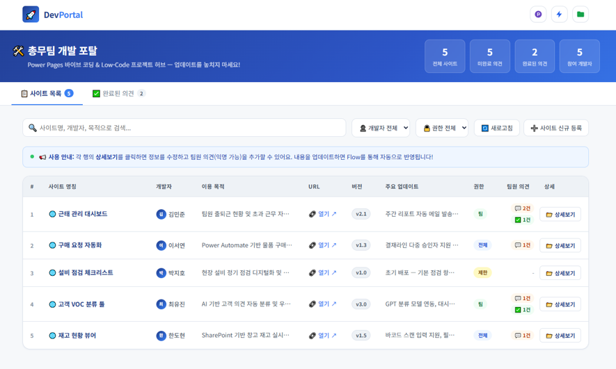

# Power Pages를 호스팅처럼 이용하게 되면 겪는 일
AI라는 미명 아래 이런저런 코딩을 하다보면, 그리고 M365 플랫폼을 쓰는 회사에 근무하다 보면 결국 Microsoft가 제공해주는 플랫폼 안에서 결과물을 보여줘야 한다.<br>총무팀에게 맘껏 개발하라고 '개발 서버'를 주는 회사는 없을 테니까... 😇<br>급기야 대안을 찾아다 Power Platforms 안에 있는 Power Pages의 웹 리소스 기능을 마치 호스팅 서버 마냥 이용하게 되었다.<br>기본에 내가 만들었던 [AI를 활용한 마스터플랜(Progress Tracker)](), [AI를 활용한 Global Hotel Dashboard]() 등 여러 프로젝트들도 모두 Power Pages에 업로드 되어 있다.<br>Power Pages를 활용했을 때 장점은 다음과 같다.
- 별도의 호스팅 서버 없이 회사 내부망(VDI 환경)에서 **HTML, CSS, JS로 이뤄진 웹 리소스를 호스팅하고 테스트**할 수 있다.
- M365 회사 환경 기반이기 때문에 **트래픽 제한도 없다.** 
- 외부에서 접속시 VPN 혹은 별도 소프트웨어로 가상환경 접속했을 때와 마찬가지로 **회사 임직원임을 인증해야지만 접속이 가능하다.**
- Dataverse를 이용할 수 있다면 원본 DB에 대한 접근 권한도 세부적으로 설정 가능하며, SharePoint를 대체 이용한다 해도 원본 DB에 대한 접근은 어느정도 차단이 가능하다.

한편, 단점도 있다. <br>이 부분은 사용자 입장에서 '권한'이 부족하기 때문에 발생하는 문제도 더러 있다.
- Python은 호스팅 불가하므로 로컬 환경에서 테스트해야 한다. Streamlit으로 웹 페이를 구성했다면 HTML 기반으로 다시 제작해야 한다. 😇
- 기본 사용자의 경우 업로드는 가능하지만 업로드한 파일의 수정은 불가능하기 때문에 **코드가 업데이트 되면 매번 새로운 파일을 업로드해야 한다.**
- 앞서 권한이 부족하기 때문에 VS Code Power Platforms 확장 등을 통해 개발자 환경을 구현할 수 없다.
- Power Pages 자체는 구글 드라이브나 원드라이브처럼 **폴더 구조가 없기 때문에** 처음 접하는 사람들에게는 다소 생소하고 어렵다.<br>예를 들어, devportal/index/v0.1 이런식으로 파일명을 입력하고 업로드해야 폴더 구가 생성되는데, 해당 폴더 구조도 터미널에서 리소스 전체를 다운로드 받을 때나 압축파일 안에서 확인 가능한 구조다.<br>그래서 업로드 하고 나면 HTML 단일 파일 하나만 덩그러니 목록에 나타난다.
이렇다 보니 '총무팀'이라는 솔루션을 만들어 놓고 팀원들이 접속해서 나름의 개발(?)을 진행하고 있는데, 무수히 많은 HTML 파일들이 올라온다.<br>하지만, 어떤 파일이 최신 파일인지 누가 업로드했는지, 어떤 파일을 지울 수 있는지 당최 알 수가 없다. 그래서 만들었다.

# 팀내 개발자 포탈



팀내 개발자 포탈에서는 본인이 **개발중인 사이트 명칭과 목적, Power Pages상 업로드 후 부여된 URL, 주요 업데이트 내용, 권한(전체 임직원인지, 특정 팀만인지, 제한된 사용자인지) 등을 List-up** 한다.<br>특히, **팀원 의견(기본적으로 익명)을 토대로 수정/보완해야 될 사항들을 피드백** 받는 간단한 구조의 시스템이다.<br>개발자 혼자서 아무리 테스트를 해봐도 다양한 클라이언트 환경에서 발생하는 문제를 알기도 어렵고, 매일 코드를 보다보면 띄어쓰기 하나, 오타 하나도 발견을 못하는 경우도 비일비재해서 실제 개발한 웹사이트(시스템)를 오픈하려면 무수히 많은 사람들의 테스트가 많은 도움이 된다.<br><br>그런 측면을 포커싱 했고, SharePoint상 업로드된 DB(devportal.json)는 Power Automate의 흐름을 통해 Read/Write 하도록 설정했다.<br>사실 어떤면에서는 이렇게 코드를 짜고 업로드하는 것보다 **Power Automate 흐름을 설정하는 게 더 어려울 수 있다.** <br>왜냐하면 이 흐름을 AI가 코드를 짜주지 않는데, 아니 짜줄 수가 없다. 😇<br>순서도처럼 사용자가 하나하나 이벤트를 설정해줘야 되다보니 그렇기도 하고, Copilot이 아직 제대로 성능을 내지 못하는 것도 그 이유 중 하나라 본다.<br>흐름만 다뤄도 분량이 만만치 않아서.. 흐름에 대한 포스팅은 다음을 기약해 보겠다. 



```
[
  {
    "name": "사이트 명칭",
    "dev": "개발자 이름",
    "purpose": "이용 목적",
    "url": "https://...",
    "version": "v1.0",
    "update": "주요 업데이트 내용",
    "perm": "팀",
    "opinions": []
  }
]
```

<br>


```
// ===================================================================

// ⚙️  설정 — Power Automate Flow URL을 여기에 입력하세요

// ===================================================================

const CONFIG = {

  // ✅ Read Flow URL

  // 트리거: When HTTP request received (POST, Anyone)

  // → Get file content using path (File Path에 triggerBody()?['file'] 사용)

  // → Response (Body: body('Get_file_content_using_path'))

  FLOW_READ_URL: '',

  

  // ✅ Write Flow URL

  FLOW_WRITE_URL: '',

  

  // ✅ Flow File Path의 triggerBody()?['file'] 로 전달할 파일명

  //    예시 File Path 설정: /Shared Documents/폴더명/@{triggerBody()?['file']}

  FILE_NAME: 'devportal.json',

  

  // 데모 모드: true → 샘플 데이터 / false → 실제 Flow 연결

  DEMO_MODE: true,

};
```


> [!SUCCESS] **팀내 개발자 포탈 공유**
> - [🌐 새 창에서 개발자 포탈 열기(Ctrl + 클릭)](/files/devportal.html)
