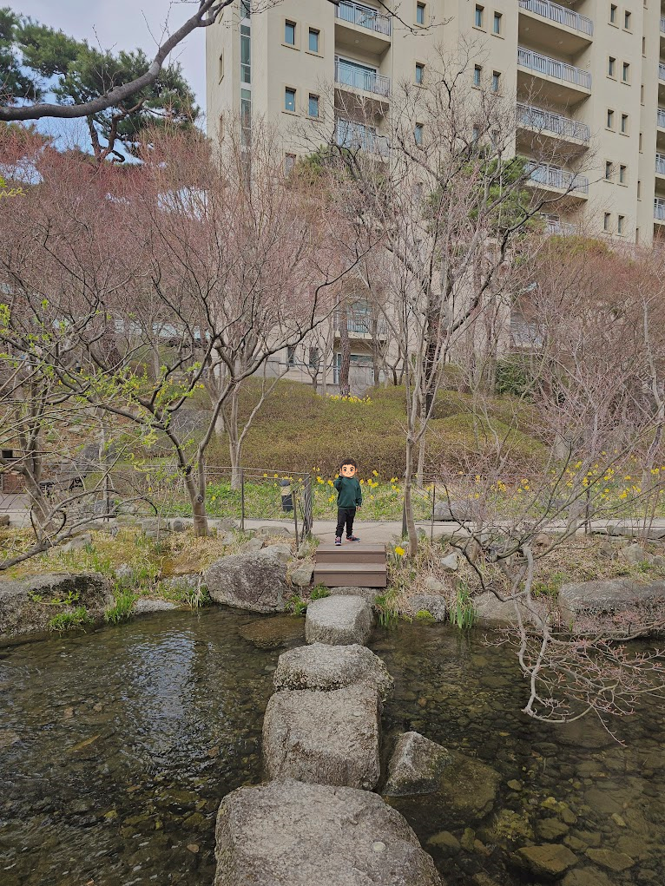
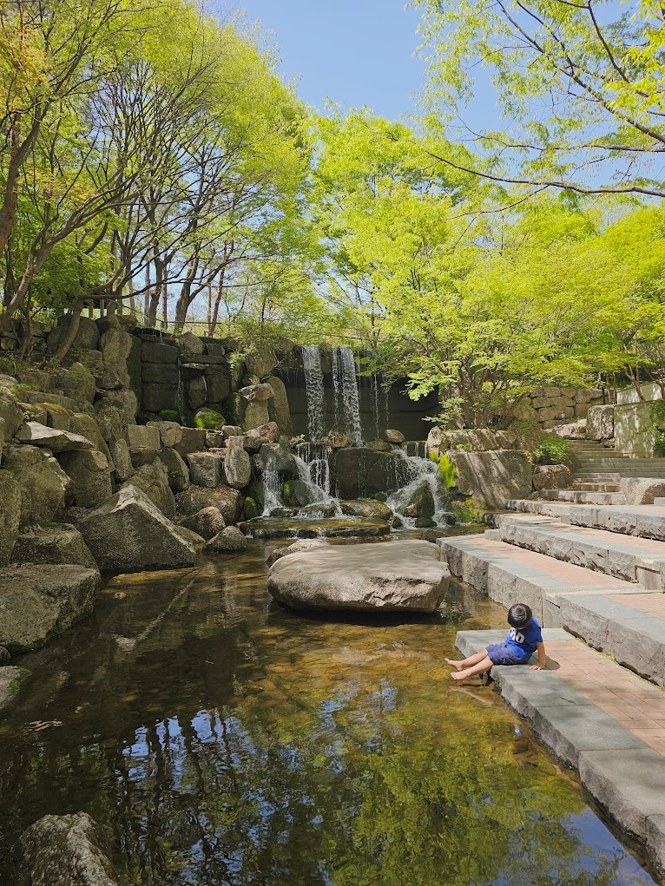
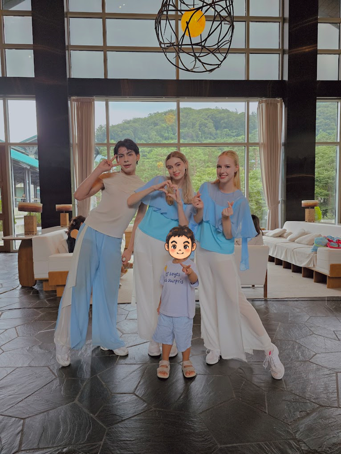
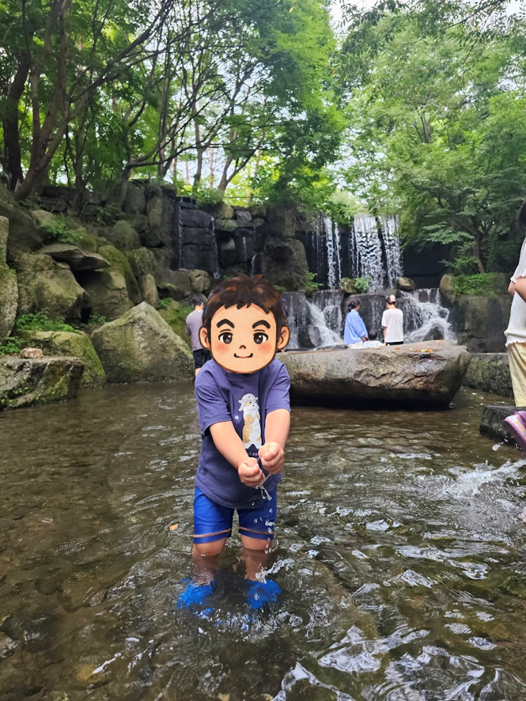
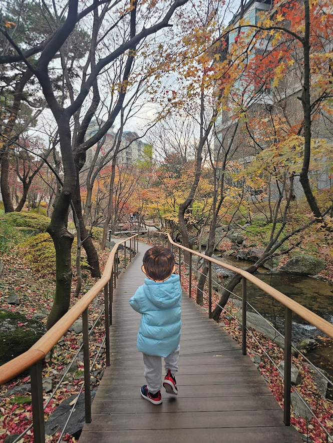
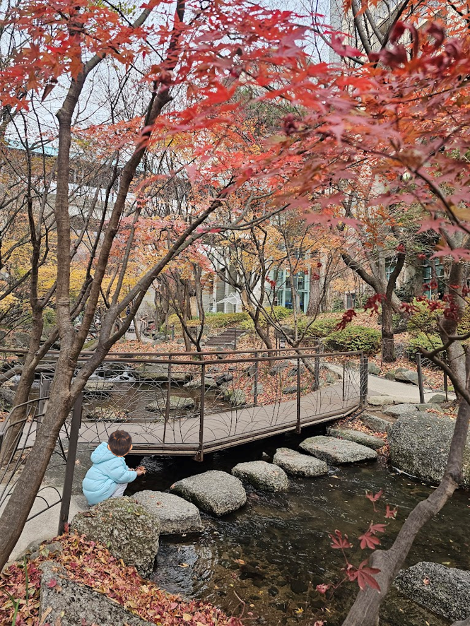
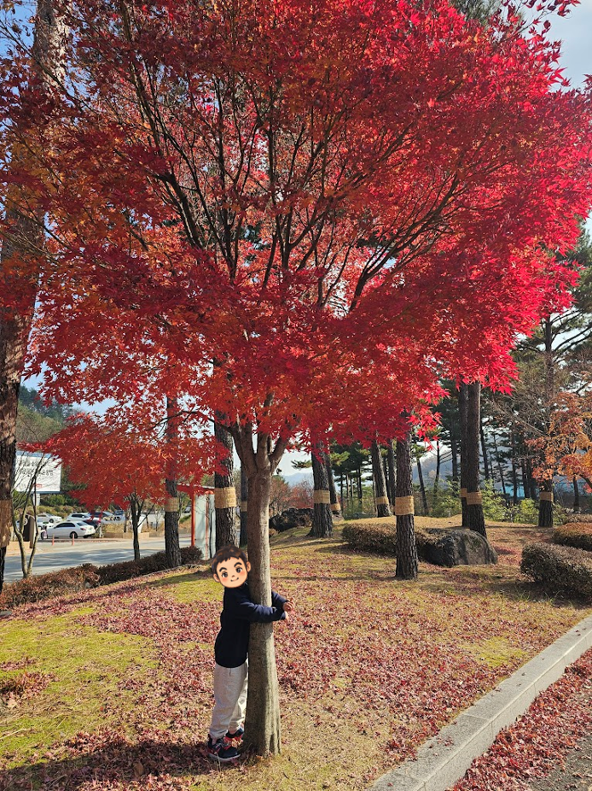
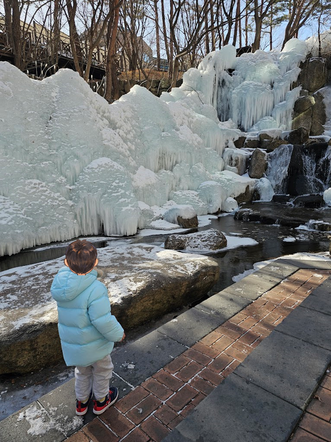
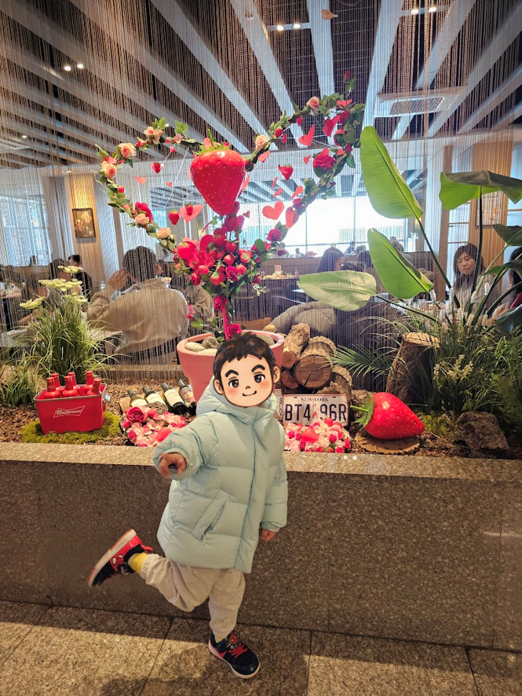

# 곤지암 리조트를 찾게 된 이유
이전 회사에서는 한화나 소노리조트 등 법인 회원권을 거의 매년 구매했다. 그럼에도 불구하고 직원 수 대비 부족한 느낌이었는데, 다행히(?) 나의 경우 꼭 임원분들이 예약을 해놓고 펑크를 내는 경우가 너무 많았던 터라 패널티를 무마하기 위해 나와 아내가 같이 여행을 가곤 했다. 😇 (사실 이 때는 자차도 없었던 시절이었는데...)
그 덕분에 진도나 거제도 정도에 위치해 있는 리조트가 아니고서는 웬만한 리조트는 다 다녀온 것 같다. 가까운 양평부터 시작해서 단양, 용인, 홍천, 속초, 양양, 삼척, 대천, 해운대, 제주 등등 참 많이도 다녔다.  그랬던 생활을 청산하고 이직을 하게 됐다. 그리고 얼마 지나지 않아 아이가 태어났다. 아이가 있는 집은 알겠지만 아이가 어릴 때 여행가는 게 보통 일이 아니다.  짐도 어마어마하고.. 호텔은 아이 분유며, 이유식을 데우는 것 조차 번거롭기 때문에 리조트가 1순위였다.  아이가 태어났을 때부터 분리수면을 했던 우리 부부였기 때문에 **방도 2개 이상** 되어야 하는데 그럼 더더욱 호텔은 불가능하다. 이런저런 제약에도 불구하고 나와 내 아내도 살아야 하기 때문에 하루 정도의 힐링이 필요했다.  그런데, 이직한 회사는 한화나 소노리조트 등의 회원권이 전무하다. 😇 최근에서야 조금 늘긴 했지만 사실상 없는 것과 다를 바가 없다. 대신 '곤지암 리조트' 회원권이 있다. 다행히 집에서도 그리 멀지 않다. 그렇게 울며 겨자먹기로 처음 곤지암 리조트를 접하게 됐다. 결론부터 이야기하면 아마 최근 5년간 내가 다니는 회사 직원들 중에 나보다 곤지암 리조트를 많이 간 사람은 없을 것으로 예상한다. 😃  특히, 아이가 있는 집 한테는 더할 나위 없이 좋다. 물론, 이것도 애 by 애, 사람 by 사람일 수는 있다.   그럼에도 불구하고 내가 그렇게 자주 가는 데는 다음과 같은 이유가 있다.
- 우리집 기준이지만, 차로 45분 내외면 도착
- 리조트 숙박과 무관하게 **주차는 무료**
- 생태하천과 화담숲의 정원이 **사계절을 느끼기엔 더할 나위 없이 제격**
- 루지, 곤돌라, 눈썰매, 스키, 수영장, 오락실, 당구장, 탁구장, 노래방 등 리조트 안에서 즐길거리가 꽤 됨
- 유모차로 이동할 수 있는 **데크길이 내가 가본 곳들 중에는 가장 잘되어 있음**
- 아이를 풀어놓고 놀 수 있는 잔디 구장이 있고, 스키 시즌이 아닌 경우 잔디밭 뷰에 아들 놀이터도 마련되어 있음
- 돈 좀 쓰면 야외에서 가족들끼리 바베큐를 할 수 있고, 악천후나 날씨가 좋지 않을 때는 실내에서 가능
- 베스킨라빈스, BHC를 비롯해서 최근 음식 퀄리티가 상당히 올라간데다 가성비까지 있는 미라시아 등 먹을 수 있는 음식이 꽤 많음
- 객실 내 배달, 포장 음식도 비싸긴 하지만 맜있음
- 리조트 안에서 안 먹어도 차타고 10분이면 '[최미자 소머리국밥](https://naver.me/FZ27U0uj)', '[동동국수](https://naver.me/54LbkicZ)', '[어선비](https://naver.me/FPn5jAxs)'와 같은 음식점이 널려있음

# 곤지암 리조트의 사계절
## 봄
 

곤지암은 보통 3월 말부터 '수선화 축제'로 화담숲을 개장한다. 산이 있어 그늘이 많아서 그런지, 다른 곳들보다 온도가 낮아서 그런지 매년 다녀보지만 벚꽃이 다른 지역보다 1주일 이상 늦게 핀다. 여의도에서 4/1 벚꽃이 만개했다면 곤지암은 4/11 정도 가야 만개하는 느낌이다. 그래서 **매년 벚꽃이 만개한 시기에 가기가 사실상 굉장히 어렵다.** 올해는 4/4(토), 4/18(토)에 갔었는데 4/4(토)에는 벚꽃이 피지도 않았고, 4/18(토)에는 다 져버린 후였다. 물론, 우리 가족이야 노란색 수선화를 더 좋아하기는 하지만 😄  수선화는 화담숲 뿐만 아니라 생태하천을 비롯해서 로비, 길가 등등에 다 심어져 있다. 눈에 밟히는 모든 곳이 수선화라고 보면 된다. 갑자기 여름처럼 날이 더워져서 이번에는 봄이지만 뽀짝이와 함께 생태하천에 발을 담궈봤는데, 역시나 차갑다. 아니, 겁나 차갑다. 😇  그리고 아직 사람의 발길이 많이 안 닿기도 해서 바닥에 있는 돌에 이끼가 많아 미끄러우니 발을 담글 사람들은 참고하길 바란다. 슬러시를 한번에 쭉 빨아대면 오는 두통만큼 차가운데, 아이는 그것조차 재밌다. 😆

## 여름
  

한 여름 휴가철이 되면 사람들이 워낙 많아서 숙박 예약이 쉽지는 않지만, 어느 계곡에 가서 노는 것보다 **시원하고 안전하다**. 튜브로 둥둥 떠다니면서 놀 수는 없겠지만 아이들 입장에서는 흐르는 물에 발 담구고, 물컵에 물을 떴다가 붓고, 잘 보이지도 않는 작은 물고기를 찾아다니는 게 나름의 재미다. 여름에는 스키장 잔디에서 저녁에 마술 공연도 하고, 로비에서 공연도 하고 다양한 프로그램들이 있다.  스키장 잔디에 놀이터도 있어서 야외 바베큐를 하거나 밖에서 맥주라도 한잔하는 부모들의 경우 아이들을 시야에 놓고 잠시 쉴 수 있어서 좋다. 물론, 이 시즌에는 저녁에도 많이 덥다. 😇

## 가을

  

화담숲의 단풍은 워낙 유명해서 '한국관광 100선'에도 한 10여년전부터 늘 들어가 있다. 봄보다 오히려 **가을이 훨씬 사람들에게는 인기가 있는 것 같다**. 단풍 피크시즌에는 화담숲 예약 조차도 하늘의 별 따기다. 물론, 이 때도 숙박을 하는 사람들에게는 화담숲 입장권을 구매할 수 있는 별도 채널(?), 권리(?)를 주기 때문에 진짜 화담숲을 피크 때 보고 싶을땐 숙박을 하면 된다. 우리 가족은 이미 가볼만큼 가봤기 때문이기도 하지만, 화담숲을 가면 모노레일을 타고 1→3으로 이동한 후에 3에서 걸어서 내려오는 패턴이라서 생태하천에서 낙엽을 밟으면서 또, 단풍 나뭇잎을 물 위에 띄우면서 노는 게 더 재미있다. 특히, 뽀짝이는 낙엽을 밟을 때 바스락 바스락 나는 소리에 재미를 느끼기에 생태하천에 있는 낙엽을 다 밟고나면 시간은 순삭이다. 👍

## 겨울

 

스키 인기가 예전만 못하다고는 하지만, 그래도 겨울 곤지암리조트 스키장에는 스키와 보드 타는 사람이 꽤 많다. 아이가 탈 수 있는 눈썰매장도 있긴 하지만, 아직까지는 썰매의 재미를 알지 못한터라 여전히 생태하천을 간다. 남자들은 알겠지만 **하천 위에 얼음이 얼어있으면 깨고 싶고, 고드름이 달려있으면 떼고 싶다.** 😄 뽀짝이도 마찬가지이다. 체감온도 영하 10도가 넘어가는 날씨에도 마냥 재미있다. 남들이 밟지 않은 눈을 밟으면서 발자국을 내는 것도, 나뭇가지를 주워다가 구멍난 얼음 사이로 얼음낚시 흉내를 내보는 것도 재밌다.  [미라시아](https://naver.me/5uIYJfK3)에서 올해부터 '딸기 뷔페'를 운영하기 시작했다. 성인 기준 59,000원으로! 나 같은 경우 10% 할인쿠폰이 거의 앱에 상시로 들어가 있기 때문에 더 저렴하게 먹을 수 있다.  기본적인 핫 디쉬 음식들이 꽤 맛있기 때문에 아마 웬만한 사람들은 충분히 만족할만 하다는 생각이 든다. (59,000원에 5성급 호텔 딸기 뷔페를 기대하지만 않는 다면 말이다.)  아내가 딸기 뷔페를 좋아하다보니 뽀짝이가 공짜인 시기에 거의 매년 [롯데호텔 서울 페닌슐라 라운지&바](https://naver.me/xHgIuT2j)에서 진행하는 딸기 뷔페를 갔었는데, 가격이 매번 올라서 이제는 거의 1인당 15만원 돈이다. 😇 (물론 너무 맛있긴 하다.) 그런데, 미라시아는 59,000원 게다가 10% 할인도 되니 안 갈 이유가 없다. 특히, 기존 조식/브런치 뷔페도 1년 전쯤(?) 어느 순간 조리실장이 바뀐건지 음식의 퀄리티와 맛이 확 올라서 실패 확률이 제로에 가깝다. 그리고 지금 이 글을 쓰고 있는 2026년 4월까지도 유지되고 있다. 👍