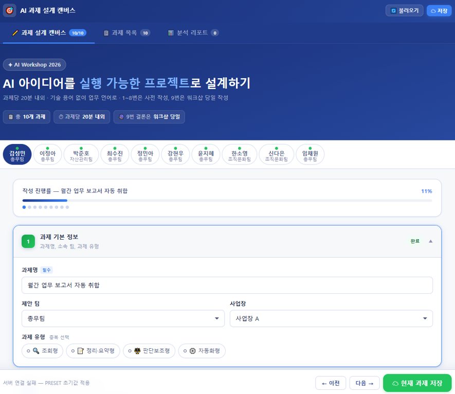
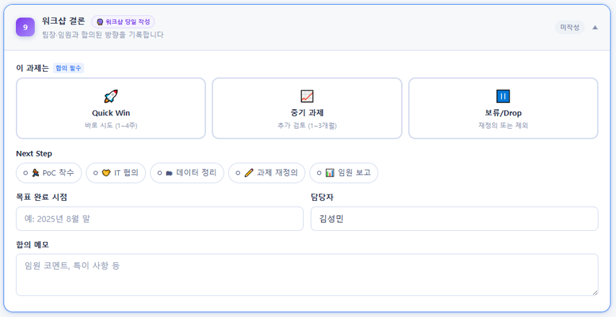
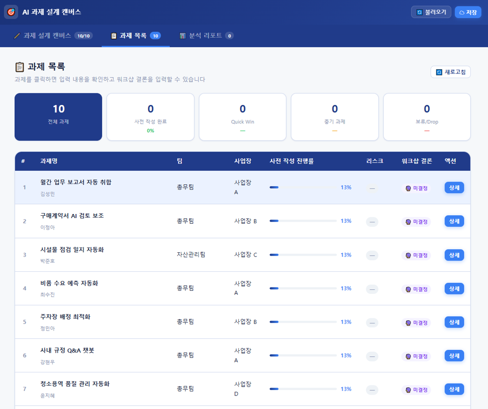
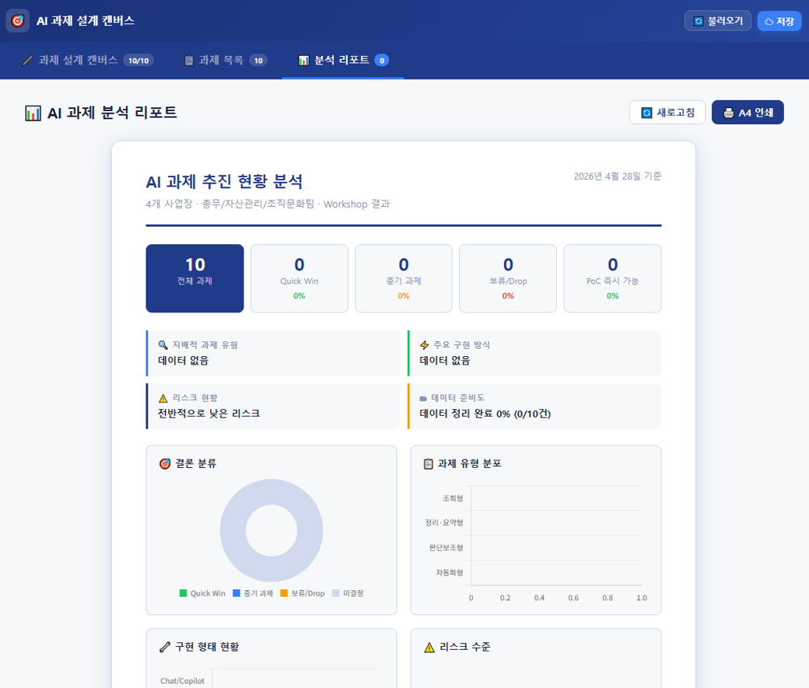

# AI Workshop 진행을 포스트잇으로 할 수는 없다.
[담당 임원 산하 팀장, 실무자들 대상으로 AI Workshop]() D-Day가 얼마 남지 않았다. 대상 인원에도 변동이 있고, 일정 진행도 변동이 있었지만, 결국 **AI로 성과를 내게 만들라**는 목적은 바뀌지 않았다.<br><br>그래서 기존에 Claude를 통해 초안으로 만들었던 AI 과제 설계 캔버스를 Develop해서 Workshop에 활용하기로 했다. <br>AI Workshop인데, 포스트잇으로 벽에 막 붙이고 할 수는 없지 않을까? 😇<br><br>각 팀별로 진행하겠다고 한 과제들이 총 10개이고, 그 10개의 과제들에 대해 캔버스를 작성할 수 있도록 웹페이지를 만들었다.<br>각 과제의 담당자는 이미 지정되어 있어 과제 기본 정보는 미리 입력해두고, Power Automate Flow를 통해서 ai_canvas_store.json을 Read/Write 하도록 설정했다.



마지막 9번 항목의 워크샵 결론은 워크샵 진행 후 마지막에 입력해야 하는 부분이므로 비워두게 했다.



각 담당자들이 입력을 하고 나면 과제 목록 페이지에서 사전 작성 진행률을 비롯해서 입력 내용을 상세 조회할 수 있다.<br>워크샵 당일에는 해당 페이지를 전부 띄워놓고, 각 담당자가 앞에서 혹은 자리에서 간단한 컨셉과 설명을 진행하고 애로사항 위주로 Q&A 할 계획이다.<br>어쨌든 **안되고 있는 걸 되게 만들어야 하니까**. 😇



워크샵이 종료되고 나면 입력된 9번 **워크샵 결론까지 포함하여 분석 리포트가 자동으로 작성**된다. <br>7월 말까지 과제 수행/완료하는 게 목표인데, 이 과정에서 흔히들 PoC(Proof of Concept)라 표현하지만, 진짜 할 수 있는 과제인지, 할 수 있다면 성과로 인정 받을 수 있는 과제인지 등을 종합적으로 판단하기 위함이다.<br>결론이 나오면 A4 인쇄해서 담당자를 비롯해서 각 팀장, 상무님까지 내용을 공유하면 이번 워크샵은 끝이다.<br>워크샵 이후에 어떤 일들을 F/up 해야 할지는 지금 당장은 생각하지 않기로 한다. 😅



참고로 현재 사내에서 내가 개발(?)하고 있는 방식 및 환경은 다음과 같다.
1. Power Pages 상 '총무팀' 솔루션 생성
2. 해당 솔루션상에 웹 리소스(html, css, js 등) 업로드 및 고유 URL 생성
3. SharePoint 상 DB 활용 목적으로 json 업로드 또는 간단한 내용일 경우 SharePoint 목록(List) 사용
4. Power Automate를 통해 Power Pages에서 SharePoint DB를 Read/Write할 수 있도록 각각의 Flow를 생성, 고유 URL을 html에 하드 코딩

Power Platforms 안에 Dataverse라는 DB 목적의 플랫폼이 있지만, 회사에서 개인이 개발한다고 DB를 할당해 줄지는 미지수다. <br>아니, 안해줄 것이라 거의 확신하기 때문에 M365 기반의 환경이라면 위와 같은 방법이 현 시점에서 최선이라는 판단이다.<br>사실 여기까지 알아내고 테스트 하는 데도 꽤 많은 시행착오를 겪었기 때문에 당분간 더 나은 대안이 있지는 않을 것 같다. 😇<br><br>
아래는 DB로 활용한 json 파일과 AI 과제 설계 캔버스 html 소스다. 참고가 되길... 😄


```
{
  "meta": {
    "version": "3.0",
    "updatedAt": ""
  },
  "tasks": [
    {
      "id": "TASK-01",
      "label": "1",
      "s1": {
        "taskName": "",
        "team": "",
        "site": "",
        "taskType": []
      },
      "s2": {
        "workDesc": "",
        "inputType": [],
        "frequency": "",
        "pain1": "",
        "pain2": ""
      },
      "s3": {
        "aiPoint": "",
        "humanJudge": ""
      },
      "s4": {
        "dataType": [],
        "dataLocation": [],
        "dataQuality": ""
      },
      "s5": {
        "implType": [],
        "implNote": ""
      },
      "s6": {
        "effectTime": "",
        "effectQuality": "",
        "effectOther": ""
      },
      "s7": {
        "riskLevel": "",
        "riskItems": [],
        "riskNote": ""
      },
      "s8": {
        "pocFeasibility": "",
        "pocScope": ""
      },
      "s9": {
        "conclusion": "",
        "nextActions": [],
        "targetDate": "",
        "owner": "",
        "conclusionNote": ""
      }
    },
    {
      "id": "TASK-02",
      "label": "2",
      "s1": {
        "taskName": "",
        "team": "",
        "site": "",
        "taskType": []
      },
      "s2": {
        "workDesc": "",
        "inputType": [],
        "frequency": "",
        "pain1": "",
        "pain2": ""
      },
      "s3": {
        "aiPoint": "",
        "humanJudge": ""
      },
      "s4": {
        "dataType": [],
        "dataLocation": [],
        "dataQuality": ""
      },
      "s5": {
        "implType": [],
        "implNote": ""
      },
      "s6": {
        "effectTime": "",
        "effectQuality": "",
        "effectOther": ""
      },
      "s7": {
        "riskLevel": "",
        "riskItems": [],
        "riskNote": ""
      },
      "s8": {
        "pocFeasibility": "",
        "pocScope": ""
      },
      "s9": {
        "conclusion": "",
        "nextActions": [],
        "targetDate": "",
        "owner": "",
        "conclusionNote": ""
      }
    },
    {
      "id": "TASK-03",
      "label": "3",
      "s1": {
        "taskName": "",
        "team": "",
        "site": "",
        "taskType": []
      },
      "s2": {
        "workDesc": "",
        "inputType": [],
        "frequency": "",
        "pain1": "",
        "pain2": ""
      },
      "s3": {
        "aiPoint": "",
        "humanJudge": ""
      },
      "s4": {
        "dataType": [],
        "dataLocation": [],
        "dataQuality": ""
      },
      "s5": {
        "implType": [],
        "implNote": ""
      },
      "s6": {
        "effectTime": "",
        "effectQuality": "",
        "effectOther": ""
      },
      "s7": {
        "riskLevel": "",
        "riskItems": [],
        "riskNote": ""
      },
      "s8": {
        "pocFeasibility": "",
        "pocScope": ""
      },
      "s9": {
        "conclusion": "",
        "nextActions": [],
        "targetDate": "",
        "owner": "",
        "conclusionNote": ""
      }
    },
    {
      "id": "TASK-04",
      "label": "4",
      "s1": {
        "taskName": "",
        "team": "",
        "site": "",
        "taskType": []
      },
      "s2": {
        "workDesc": "",
        "inputType": [],
        "frequency": "",
        "pain1": "",
        "pain2": ""
      },
      "s3": {
        "aiPoint": "",
        "humanJudge": ""
      },
      "s4": {
        "dataType": [],
        "dataLocation": [],
        "dataQuality": ""
      },
      "s5": {
        "implType": [],
        "implNote": ""
      },
      "s6": {
        "effectTime": "",
        "effectQuality": "",
        "effectOther": ""
      },
      "s7": {
        "riskLevel": "",
        "riskItems": [],
        "riskNote": ""
      },
      "s8": {
        "pocFeasibility": "",
        "pocScope": ""
      },
      "s9": {
        "conclusion": "",
        "nextActions": [],
        "targetDate": "",
        "owner": "",
        "conclusionNote": ""
      }
    },
    {
      "id": "TASK-05",
      "label": "5",
      "s1": {
        "taskName": "",
        "team": "",
        "site": "",
        "taskType": []
      },
      "s2": {
        "workDesc": "",
        "inputType": [],
        "frequency": "",
        "pain1": "",
        "pain2": ""
      },
      "s3": {
        "aiPoint": "",
        "humanJudge": ""
      },
      "s4": {
        "dataType": [],
        "dataLocation": [],
        "dataQuality": ""
      },
      "s5": {
        "implType": [],
        "implNote": ""
      },
      "s6": {
        "effectTime": "",
        "effectQuality": "",
        "effectOther": ""
      },
      "s7": {
        "riskLevel": "",
        "riskItems": [],
        "riskNote": ""
      },
      "s8": {
        "pocFeasibility": "",
        "pocScope": ""
      },
      "s9": {
        "conclusion": "",
        "nextActions": [],
        "targetDate": "",
        "owner": "",
        "conclusionNote": ""
      }
    },
    {
      "id": "TASK-06",
      "label": "6",
      "s1": {
        "taskName": "",
        "team": "",
        "site": "",
        "taskType": []
      },
      "s2": {
        "workDesc": "",
        "inputType": [],
        "frequency": "",
        "pain1": "",
        "pain2": ""
      },
      "s3": {
        "aiPoint": "",
        "humanJudge": ""
      },
      "s4": {
        "dataType": [],
        "dataLocation": [],
        "dataQuality": ""
      },
      "s5": {
        "implType": [],
        "implNote": ""
      },
      "s6": {
        "effectTime": "",
        "effectQuality": "",
        "effectOther": ""
      },
      "s7": {
        "riskLevel": "",
        "riskItems": [],
        "riskNote": ""
      },
      "s8": {
        "pocFeasibility": "",
        "pocScope": ""
      },
      "s9": {
        "conclusion": "",
        "nextActions": [],
        "targetDate": "",
        "owner": "",
        "conclusionNote": ""
      }
    },
    {
      "id": "TASK-07",
      "label": "7",
      "s1": {
        "taskName": "",
        "team": "",
        "site": "",
        "taskType": []
      },
      "s2": {
        "workDesc": "",
        "inputType": [],
        "frequency": "",
        "pain1": "",
        "pain2": ""
      },
      "s3": {
        "aiPoint": "",
        "humanJudge": ""
      },
      "s4": {
        "dataType": [],
        "dataLocation": [],
        "dataQuality": ""
      },
      "s5": {
        "implType": [],
        "implNote": ""
      },
      "s6": {
        "effectTime": "",
        "effectQuality": "",
        "effectOther": ""
      },
      "s7": {
        "riskLevel": "",
        "riskItems": [],
        "riskNote": ""
      },
      "s8": {
        "pocFeasibility": "",
        "pocScope": ""
      },
      "s9": {
        "conclusion": "",
        "nextActions": [],
        "targetDate": "",
        "owner": "",
        "conclusionNote": ""
      }
    },
    {
      "id": "TASK-08",
      "label": "8",
      "s1": {
        "taskName": "",
        "team": "",
        "site": "",
        "taskType": []
      },
      "s2": {
        "workDesc": "",
        "inputType": [],
        "frequency": "",
        "pain1": "",
        "pain2": ""
      },
      "s3": {
        "aiPoint": "",
        "humanJudge": ""
      },
      "s4": {
        "dataType": [],
        "dataLocation": [],
        "dataQuality": ""
      },
      "s5": {
        "implType": [],
        "implNote": ""
      },
      "s6": {
        "effectTime": "",
        "effectQuality": "",
        "effectOther": ""
      },
      "s7": {
        "riskLevel": "",
        "riskItems": [],
        "riskNote": ""
      },
      "s8": {
        "pocFeasibility": "",
        "pocScope": ""
      },
      "s9": {
        "conclusion": "",
        "nextActions": [],
        "targetDate": "",
        "owner": "",
        "conclusionNote": ""
      }
    },
    {
      "id": "TASK-09",
      "label": "9",
      "s1": {
        "taskName": "",
        "team": "",
        "site": "",
        "taskType": []
      },
      "s2": {
        "workDesc": "",
        "inputType": [],
        "frequency": "",
        "pain1": "",
        "pain2": ""
      },
      "s3": {
        "aiPoint": "",
        "humanJudge": ""
      },
      "s4": {
        "dataType": [],
        "dataLocation": [],
        "dataQuality": ""
      },
      "s5": {
        "implType": [],
        "implNote": ""
      },
      "s6": {
        "effectTime": "",
        "effectQuality": "",
        "effectOther": ""
      },
      "s7": {
        "riskLevel": "",
        "riskItems": [],
        "riskNote": ""
      },
      "s8": {
        "pocFeasibility": "",
        "pocScope": ""
      },
      "s9": {
        "conclusion": "",
        "nextActions": [],
        "targetDate": "",
        "owner": "",
        "conclusionNote": ""
      }
    },
    {
      "id": "TASK-10",
      "label": "10",
      "s1": {
        "taskName": "",
        "team": "",
        "site": "",
        "taskType": []
      },
      "s2": {
        "workDesc": "",
        "inputType": [],
        "frequency": "",
        "pain1": "",
        "pain2": ""
      },
      "s3": {
        "aiPoint": "",
        "humanJudge": ""
      },
      "s4": {
        "dataType": [],
        "dataLocation": [],
        "dataQuality": ""
      },
      "s5": {
        "implType": [],
        "implNote": ""
      },
      "s6": {
        "effectTime": "",
        "effectQuality": "",
        "effectOther": ""
      },
      "s7": {
        "riskLevel": "",
        "riskItems": [],
        "riskNote": ""
      },
      "s8": {
        "pocFeasibility": "",
        "pocScope": ""
      },
      "s9": {
        "conclusion": "",
        "nextActions": [],
        "targetDate": "",
        "owner": "",
        "conclusionNote": ""
      }
    }
  ]
}
```



> [!SUCCESS] **과제 설계 캔버스 공유**
> - [🌐 새 창에서 캔버스 열기(Ctrl + 클릭)](/files/canvas.html)
