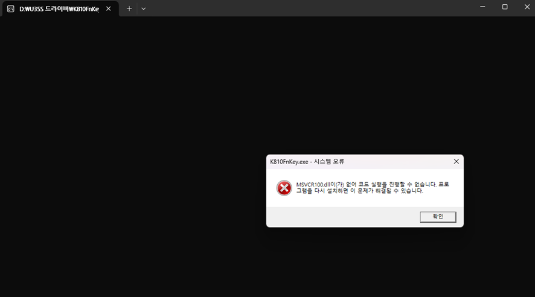
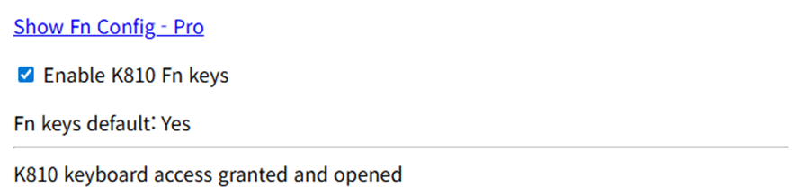

# 오래된 노트북을 꺼냈다.
어느 날 갑자기 시간(?)이 좀 생겨서 2015년에 생산된 오래된 노트북을 외부에서도 접속가능한 환경으로 만들어두고 싶었다.  회사에서는 아무래도 보안 때문에 이것저것 해보는 데 한계가 있다보니 장난감(?)처럼 이것저것 개발도 해보고 테스트해볼 용도로 말이다. 옛날 노트북이긴 하지만 윈도우 11은 가뿐하게 설치가 됐다. 그리고 이것저것 세팅을 했다. 오랜만에 이런 작업을 해보니까 시대가 많이 변하긴 했다.  과거에는 UltraISO로 ISO를 구워대던 걸 이제는 [Ventoy](https://www.ventoy.net/en/index.html)로 USB를 처음 부팅 가능하게 세팅해 놓으면 ISO 파일을 그냥 넣기만 하면 된다. 멀티 부팅은 덤이다. 👍 노트북은 공유기 옆에서 LAN 케이블로 연결이 되야 WOL이 작동하기 때문에 위치가 좀 애매하다. 그래서 집에 있던 K810 키보드를 꺼내들었다. 그런데, Fn키가 F1~F12로 작동하질 않는다.

# K810 키보드 Fn키 비활성화 방법
생각해보면 과거에도 직구로 구매한 K810 키보드의 경우 배치 파일을 돌려서 Fn키를 비활성화 했던 기억이 난다. SetPoint 구 버전을 활용한 방법도 있었는데, 최근에는 윈도우 11이 되다보니 여러가지 번거롭다.  우여곡절 끝에 인터넷에서 K810FnKey.exe 파일을 구해서 실행시켰는데, 윈도우 설치를 막 끝낸 상태에서 실행하니 "MSVCR100.dll 미설치" 오류가 난다. 이 경우에는 [Microsoft Visual C++ 재배포 가능 패키지](https://www.microsoft.com/ko-kr/download/details.aspx?id=26999)를 PC에 설치한 후에 다시 실행해야 한다. 또, [K810FnKey.exe](https://www.google.com/search?q=K810FnKey.exe)가 오래된 파일이기 때문에 vcredist_x86.exe (32비트용)를 반드시 설치해야 한다. 내 PC가 64비트라도 관계 없이 말이다.

그런데, 설치하려고 보니 너무 귀찮다. 😇 좀 더 간결한 방법이 없을까 찾아보니 Chrome이나 Edge에서 브라우저로 간편하게 하는 방법이 있었다. 설정 방법에 대한 자세한 설명은 [k810-fn-config](https://victor-st.github.io/k810-fn-config/) 깃허브 페이지에서 다루고 있고, 나는 빨리 하는게 중요하니 바로 해본다. 절차는 다음과 같다.
1. [설정 도구 페이지](https://victor-st.github.io/k810-fn-config/src/pages/fn-config.html) 로 접속한다.
2. 페이지 있는 "**Access K810 Keyboard**" 버튼을 클릭한다.
3. 브라우저 왼쪽 상단에 기기 선택 창이 뜨면 **'Logitech K810'을 클릭하고 "연결"**을 누른다.
4. 연결되면 아래에 설정 스위치들이 생기고, "**Enable K810 Fn Keys**" 켜주면 된다. 
그럼 끝! F2로 이름 바꾸기, F5로 새로고침을 해본다. 잘 작동한다. 😀

