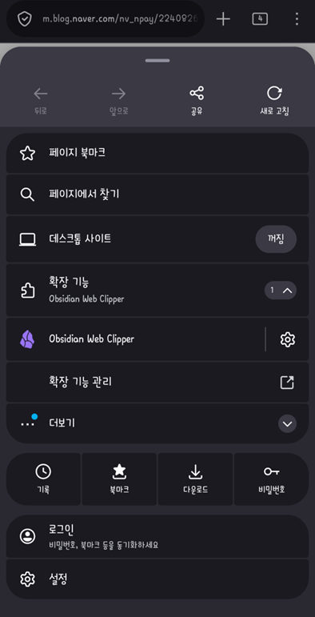
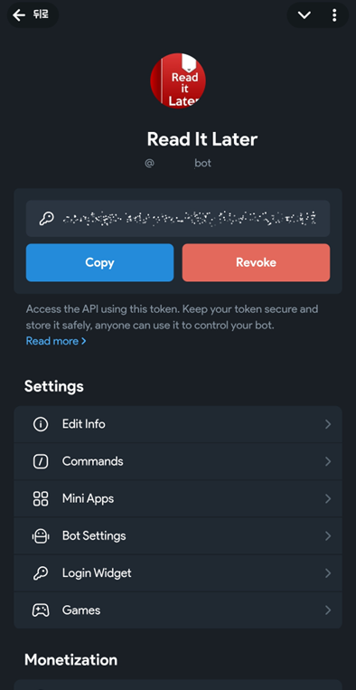
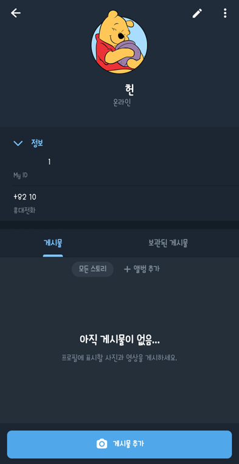
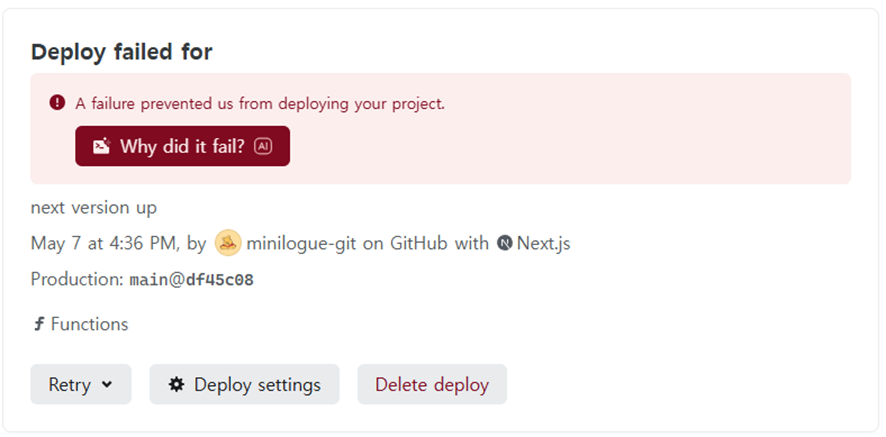
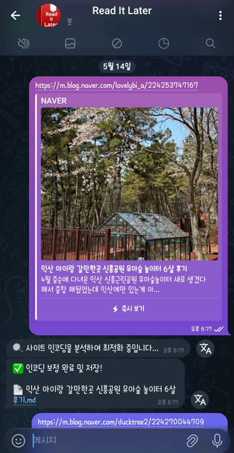
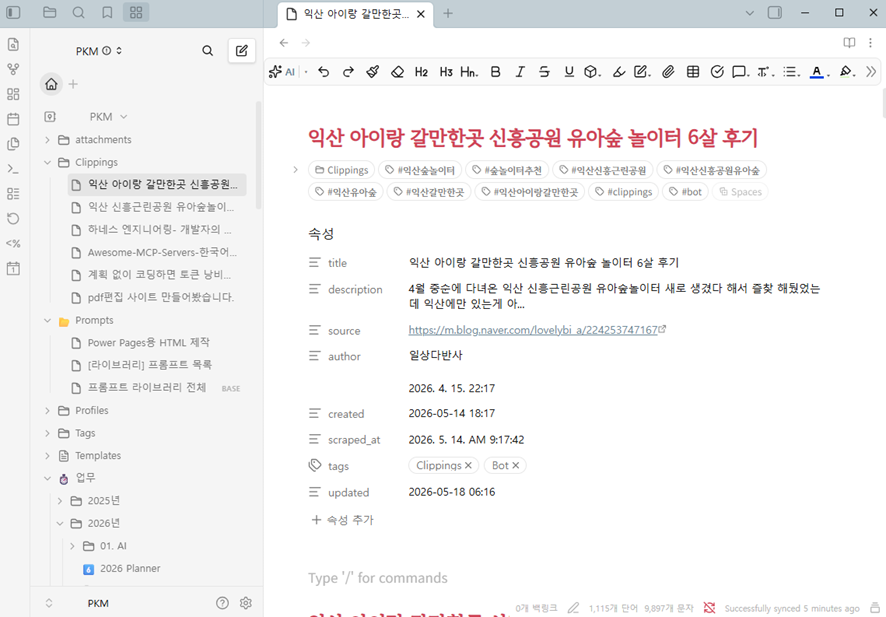

# 읽어야 될 글들이 너무 많아졌다.
인터넷 서핑을 하다보면 AI 대전환 시대여서 그런지 하루가 멀다하고 새로운 기술들이 쏟아져 나온다.<br>기술을 습득하는 것도 어려운 일이지만, 그런 기술을 습득하기 위해 관련 글이나 유튜브를 찾는 것, 그리고 나중에 읽어야 겠다고 어딘가 링크를 저장해 놓는 것도 보통 일이 아니다.<br>괜찮은 정보라고 생각되거나 언젠가 봐야겠다고 생각이 드는 것들은 URL을 '카카오톡 나에게 보내기'를 통해서 보내 놓거나 [Pushbullet](https://www.pushbullet.com/)을 이용했다.<br>그런데, 어느 순간부터 정보의 양이 많아지기 시작해서 이전에 내가 어떤 정보들을 보내놨는지 또 찾아야 하는 일들이 발생했다. 😇<br><br>그렇게 흔히 'Read It Later' 라 불리는 앱들을 찾기 시작한다.<br>과거에는 Omnivore, Pocket, [Raindrop.io](https://raindrop.io/) 과 같은 서비스들이 있었는데, 현재는 대부분 다 서비스를 종료했고, Raindrop만 살아남았다.<br>한편 Raindrop의 경우 나중에 읽을 URL을 북마크 형태로 정리하기에는 좋지만, 유료로 사용해야만 웹 스크래핑 서비스를 제공한다. 😂<br>PC나 모바일에서 [Obsidian Web Clipper](https://obsidian.md/clipper) 확장을 이용해서 스크래핑하면 로컬 옵시디언 볼트에 md 파일로 잘 들어가긴 하지만 모바일에서는 꽤나 귀찮다.<br>그래서 URL을 어딘가 던져주면 웹 스크래핑을 해서 내 옵시디언 볼트에 넣어주는 앱이 없을까 하다 결과적으로 직접 만들었다. 



# 무료로 셀프 Read It Later 구축
내 기준 최대한 자세히 설명하면 다음과 같다. 😇

## 1단계: 준비물 (계정 및 프로그램)
먼저 4개의 서비스 계정과 2개의 프로그램이 필요하다.
1. **필요한 계정 (모두 무료)**
	- [**GitHub**](https://github.com/): 내 코드 파일들을 보관하는 온라인 창고
	- [**Netlify**](https://www.netlify.com/): GitHub에 올린 코드를 실제 웹 서비스로 돌려주는 서버
	- [**Koofr**](https://koofr.eu/): 추출된 마크다운 파일(.md)이 저장되는 온라인 저장소입니다. (WebDAV 지원)
	- **Telegram**: 봇과 대화하고 링크를 전달하는 인터페이스
<br>현재 블로그도 GitHub와 Netlify로 무료 계정으로 운영중이다.<br>또, Obsidian이 각 기기(휴대폰, 태블릿, PC)마다 설치되어 있으며, Remotely Save 플러그인을 통해 Koofr의 WebDAV에 연동되어 있다.<br>나의 경우 Telegram 클라이언트로 [iMe](https://play.google.com/store/apps/details?id=com.iMe.android)를 사용중이다.

2. **필요한 프로그램**
	- [**Visual Studio Code (VS Code)**](https://code.visualstudio.com/): 코드를 수정하고 편집하는 메모장 같은 프로그램
	- [**GitHub Desktop**](https://desktop.github.com/download/): 복잡한 명령어 대신 마우스 클릭만으로 코드를 GitHub에 올릴 수 있게 해주는 프로그램
<br>VS Code가 무겁게 느껴지는 환경이라면 [Notepad++](https://notepad-plus-plus.org/) 정도만 써도 무방하다.

---

## 2단계: 텔레그램 봇 및 ID 준비
봇을 만들기 위해 텔레그램에서 두 가지 정보를 얻어야 한다.

1. **봇 생성**: `@BotFather`를 검색해 대화를 시작하고 `/newbot`을 입력하여 봇을 만든다. <br>마지막에 주는 **HTTP API Token**을 따로 적어둔다.    
2. **내 ID 확인**: `@userinfobot`을 검색해 메시지를 보내면 숫자(예: `12345678`)를 알려준다.<br>이게 `ALLOWED_USER_ID`가 된다.
<br>텔레그램 봇의 경우 Private 봇이 따로 있지 않기 때문에 봇을 호출했을 때, 나만 사용할 수 있도록 내 ID를 검증한 후에 작동하도록 하기 위함이다.

 

---

## 3단계: 폴더 구조 잡기

VS Code를 열고 컴퓨터에 새로운 폴더를 하나 만든다. 구조는 반드시 아래와 같아야 한다.

```
my-scrap-bot/ (내 폴더 이름)
├── app/
│   └── api/
│       └── telegram/
│           └── route.ts  <-- 최종 코드
├── package.json          <-- 프로그램 설정 파일
└── .gitignore            <-- 보안을 위해 업로드 제외할 목록
```

---

## 4단계: 핵심 코드 파일 작성

각 파일을 메모장(VS Code)으로 열고 아래 내용들을 복사해서 붙여넣는다.

### 1. `package.json` (설정 파일)

이 파일은 어떤 라이브러리가 필요한지 정의한다. **Next.js 15.4.2** 버전을 명시하여 보안 문제를 해결한 상태다.<br>처음엔 [Vercel](https://vercel.com/)을 이용하거나 Vercel CLI를 이용해서 GitHub 없이 바로 빌드를 하려고 했는데, 이 Next.js 버전으로 인한 보안 오류가 어마어마 하게 났다. 😇<br>빌드 오류가 수십번 났는데, Next.js 버전 숫자 하나하나 가지고 따지고 들어서 결국엔 지쳐서 Netlify로 옮겼는데, 동일한 오류가 나나 싶더니 Netlify 자체적으로 AI로 빌드 오류를 잡아주는 기능이 있어서 2~3번의 Failed 이후에 Complete 메세지를 보게 됐다. 😀

```
{
  "name": "my-scrap-bot",
  "version": "0.1.0",
  "private": true,
  "scripts": {
    "dev": "next dev",
    "build": "next build",
    "start": "next start"
  },
  "dependencies": {
    "@mozilla/readability": "^0.5.0",
    "iconv-lite": "^0.6.3",
    "jsdom": "^24.0.0",
    "next": "15.4.2",
    "react": "^19.0.0",
    "react-dom": "^19.0.0",
    "turndown": "^7.1.3",
    "webdav": "^5.6.0"
  },
  "devDependencies": {
    "@types/jsdom": "^21.1.6",
    "@types/node": "^20.0.0",
    "@types/react": "^19.0.0",
    "@types/turndown": "^5.0.4",
    "typescript": "^5.0.0"
  }
}
```



### 2. `app/api/telegram/route.ts` (최종 로직)

몇 번의 테스트를 거쳐 EUC-KR 인코딩 문제 등을 모두 해결한 아래 **코드**를 이 위치에 그대로 붙여넣으면 된다.<br>아래 코드 중 2가지 정도는 본인이 원하는 대로 수정할 수 있다.
- 옵시디언에 저장될 md 파일의 프론트매터 tags
	- tags: ["ReadItLater"]
- Koofr Webdav에 스크래핑된 md 파일이 저장될 위치
	- await client.putFileContents(`/ReadItLater/${fileName}`, finalContent);

```
import { NextRequest, NextResponse } from 'next/server';
import { Readability } from '@mozilla/readability';
import { JSDOM } from 'jsdom';
// @ts-ignore
import TurndownService from 'turndown';
import { createClient } from 'webdav';
import iconv from 'iconv-lite';

const TELEGRAM_TOKEN = process.env.TELEGRAM_TOKEN;
const KOOFR_EMAIL = process.env.KOOFR_EMAIL;
const KOOFR_APP_PASSWORD = process.env.KOOFR_APP_PASSWORD;
const ALLOWED_USER_ID = process.env.ALLOWED_USER_ID;
const KOOFR_WEBDAV_URL = 'https://app.koofr.net/dav/Koofr';

// jsdom, iconv-lite, webdav는 Node.js API를 사용하므로 Edge Runtime을 사용하지 않는다.
export const runtime = 'nodejs';

const USER_AGENT =
  'Mozilla/5.0 (Windows NT 10.0; Win64; x64) ' +
  'AppleWebKit/537.36 (KHTML, like Gecko) Chrome/122.0.0.0 Safari/537.36';

/**
 * HTML 앞부분은 charset 선언 자체가 ASCII이므로 latin1로 읽어도 안전하다.
 * meta charset과 과거형 http-equiv/content 선언을 모두 지원한다.
 */
function getDeclaredCharset(buffer: Buffer, contentType: string | null): string | null {
  const headerMatch = contentType?.match(/charset\s*=\s*["']?([^\s;"']+)/i);
  if (headerMatch) return headerMatch[1].toLowerCase();

  const head = buffer.subarray(0, 64 * 1024).toString('latin1');
  const metaCharset = head.match(/<meta\b[^>]*\bcharset\s*=\s*["']?([^\s"'/>;]+)/i);
  if (metaCharset) return metaCharset[1].toLowerCase();

  const httpEquiv = head.match(
    /<meta\b[^>]*\bcontent\s*=\s*["'][^"']*charset\s*=\s*([^\s;"']+)[^"']*["'][^>]*>/i,
  );
  return httpEquiv?.[1]?.toLowerCase() ?? null;
}

function normalizeCharset(charset: string | null): string | null {
  if (!charset) return null;
  const value = charset.trim().toLowerCase().replace(/["']/g, '');

  if (['utf-8', 'utf8'].includes(value)) return 'utf-8';
  if (
    value.includes('euc-kr') ||
    value.includes('cp949') ||
    value.includes('ms949') ||
    value.includes('x-windows-949') ||
    value.includes('ks_c_5601') ||
    value.includes('ks-c-5601')
  ) {
    // CP949는 EUC-KR의 확장 문자까지 포함하므로 국내 레거시 사이트에 더 안전하다.
    return 'cp949';
  }

  return iconv.encodingExists(value) ? value : null;
}

function isValidUtf8(buffer: Buffer): boolean {
  try {
    new TextDecoder('utf-8', { fatal: true }).decode(buffer);
    return true;
  } catch {
    return false;
  }
}

function countBrokenCharacters(value: string): number {
  return (value.match(/\uFFFD/g) || []).length + (value.match(/[\u0000-\u0008\u000B\u000C\u000E-\u001F]/g) || []).length;
}

/**
 * 최신 네이버처럼 선언값과 실제 바이트가 어긋나는 경우를 막기 위해
 * 유효한 UTF-8 바이트는 UTF-8을 최우선으로 사용한다.
 * UTF-8이 아니면 선언 인코딩과 CP949 후보 중 손상 문자가 적은 결과를 택한다.
 */
function decodeHtml(buffer: Buffer, contentType: string | null): string {
  // UTF-8 BOM
  if (buffer.length >= 3 && buffer[0] === 0xef && buffer[1] === 0xbb && buffer[2] === 0xbf) {
    return iconv.decode(buffer, 'utf-8');
  }

  if (isValidUtf8(buffer)) return iconv.decode(buffer, 'utf-8');

  const declared = normalizeCharset(getDeclaredCharset(buffer, contentType));
  const encodings = Array.from(new Set([declared, 'cp949'].filter(Boolean))) as string[];
  const candidates = encodings.map(encoding => ({
    encoding,
    html: iconv.decode(buffer, encoding),
  }));

  candidates.sort((a, b) => countBrokenCharacters(a.html) - countBrokenCharacters(b.html));
  return candidates[0]?.html ?? iconv.decode(buffer, 'utf-8');
}

function normalizeText(value: string | null | undefined): string {
  return (value || '')
    .normalize('NFC')
    .replace(/\uFFFD+/g, '')
    .replace(/[\u0000-\u001F\u007F]/g, ' ')
    .replace(/\s+/g, ' ')
    .trim();
}

function yamlString(value: string): string {
  return JSON.stringify(normalizeText(value));
}

function makeSafeFileName(title: string): string {
  const cleaned = normalizeText(title)
    .replace(/[\\/:*?"<>|%]/g, '-')
    .replace(/\.+$/g, '')
    .replace(/\s+/g, ' ')
    .trim()
    .slice(0, 150);

  return `${cleaned || 'Untitled'}.md`;
}

export async function POST(req: NextRequest) {
  try {
    const body = await req.json();
    const message = body.message;

    if (!message?.text) return NextResponse.json({ ok: true });

    const chatId = message.chat.id;
    if (ALLOWED_USER_ID && String(chatId) !== String(ALLOWED_USER_ID)) {
      return NextResponse.json({ ok: true });
    }

    const urlMatch = message.text.match(/https?:\/\/[^\s]+/g);
    if (!urlMatch) return NextResponse.json({ ok: true });

    let targetUrl = urlMatch[0];
    try {
      const urlObj = new URL(targetUrl);
      ['utm_source', 'utm_medium', 'utm_campaign', 'ref'].forEach(param =>
        urlObj.searchParams.delete(param),
      );
      targetUrl = urlObj.toString();
    } catch {
      // URL 생성 실패 시 Telegram에서 추출한 원문을 그대로 사용한다.
    }

    await sendTelegramMessage(chatId, '🔍 원본 콘텐츠 및 고화질 이미지 분석 중...');

    try {
      const response = await fetch(targetUrl, {
        redirect: 'follow',
        headers: {
          'User-Agent': USER_AGENT,
          Accept: 'text/html,application/xhtml+xml,application/xml;q=0.9,*/*;q=0.8',
          'Accept-Language': 'ko-KR,ko;q=0.9,en-US;q=0.7,en;q=0.5',
        },
      });

      if (!response.ok) {
        throw new Error(`HTTP ${response.status} ${response.statusText}`);
      }

      const contentType = response.headers.get('content-type');
      const buffer = Buffer.from(await response.arrayBuffer());
      const html = decodeHtml(buffer, contentType);

      // naver.me 등 단축 URL은 최종 리다이렉트 주소를 base URL로 사용해야 한다.
      const effectiveUrl = response.url || targetUrl;
      const dom = new JSDOM(html, { url: effectiveUrl });
      const document = dom.window.document;

      // Readability가 DOM을 변경하기 전에 신뢰도 높은 제목 후보를 보관한다.
      const ogTitle = normalizeText(
        document.querySelector('meta[property="og:title"]')?.getAttribute('content'),
      );
      const originalDocumentTitle = normalizeText(document.title);

      ['script', 'style', 'noscript', 'footer', 'nav'].forEach(selector => {
        document.querySelectorAll(selector).forEach(element => element.remove());
      });

      // 본문 iframe을 무조건 제거하면 일부 네이버 카페 페이지의 실제 글도 사라질 수 있다.
      // 광고/추적용 iframe만 제거하고, 같은 네이버 계열 iframe은 남긴다.
      document.querySelectorAll('iframe').forEach(iframe => {
        const src = iframe.getAttribute('src') || '';
        let keep = false;
        try {
          const host = new URL(src, effectiveUrl).hostname;
          keep = host === 'naver.com' || host.endsWith('.naver.com');
        } catch {
          keep = false;
        }
        if (!keep) iframe.remove();
      });

      document.querySelectorAll('a').forEach(anchor => {
        const href = anchor.getAttribute('href');
        if (!href || href === '#' || anchor.querySelector('img')) {
          anchor.replaceWith(...Array.from(anchor.childNodes));
        }
      });

      const article = new Readability(document).parse();

      if (!article?.content) {
        await sendTelegramMessage(chatId, '❌ 본문을 추출할 수 없습니다.');
        return NextResponse.json({ ok: true });
      }

      const readabilityTitle = normalizeText(article.title);
      const title = ogTitle || readabilityTitle || originalDocumentTitle || 'Untitled';

      const turndownService = new TurndownService({
        headingStyle: 'atx',
        hr: '---',
        bulletListMarker: '-',
        codeBlockStyle: 'fenced',
      });

      turndownService.addRule('absoluteImages', {
        filter: 'img',
        replacement: function (_content, node: any) {
          const src =
            node.getAttribute('data-lazy-src') ||
            node.getAttribute('data-source') ||
            node.getAttribute('data-src') ||
            node.getAttribute('src');

          if (!src) return '';

          try {
            let absoluteUrl = new URL(src.split(' ')[0], effectiveUrl).href;

            if (absoluteUrl.includes('pstatic.net') || absoluteUrl.includes('blogfiles')) {
              const cleanUrl = new URL(absoluteUrl);
              if (cleanUrl.searchParams.has('type')) cleanUrl.searchParams.set('type', 'w1');
              absoluteUrl = cleanUrl.toString();
            }

            const alt = normalizeText(node.getAttribute('alt')) || 'image';
            return `\n![${alt.replace(/[\[\]]/g, '')}](${absoluteUrl})\n`;
          } catch {
            return '';
          }
        },
      });

      const markdownContent = turndownService.turndown(article.content);
      const now = new Date();
      const description = normalizeText(article.excerpt);
      const author = normalizeText(article.byline) || 'Unknown';

      const frontmatter = `---
title: ${yamlString(title)}
description: ${yamlString(description)}
source: ${yamlString(effectiveUrl)}
author: ${yamlString(author)}
created: ${now.toISOString().split('T')[0]}
scraped_at: ${yamlString(now.toLocaleString('ko-KR', { timeZone: 'Asia/Seoul' }))}
tags: ["ReadItLater"]
---

`;

      const finalContent = `${frontmatter}# ${title}\n\n${markdownContent}`;
      const fileName = makeSafeFileName(title);

      const client = createClient(KOOFR_WEBDAV_URL, {
        username: KOOFR_EMAIL,
        password: KOOFR_APP_PASSWORD,
      });
      await client.putFileContents(`/ReadItLater/${fileName}`, finalContent, {
        overwrite: true,
      });

      await sendTelegramMessage(chatId, `✅ 아카이빙 완료!\n\n📄 ${fileName}`, true);
    } catch (error) {
      console.error('Error:', error);
      await sendTelegramMessage(chatId, '❌ 처리 중 에러가 발생했습니다.');
    }

    return NextResponse.json({ ok: true });
  } catch (error) {
    console.error('Webhook error:', error);
    return NextResponse.json({ ok: false }, { status: 500 });
  }
}

async function sendTelegramMessage(chatId: number, text: string, disablePreview = false) {
  const url = `https://api.telegram.org/bot${TELEGRAM_TOKEN}/sendMessage`;
  await fetch(url, {
    method: 'POST',
    headers: { 'Content-Type': 'application/json' },
    body: JSON.stringify({
      chat_id: chatId,
      text,
      disable_web_page_preview: disablePreview,
    }),
  });
}
```

---

## 5단계: GitHub Desktop으로 업로드

1. **GitHub Desktop**을 연다.
    
2. `Create New Repository on your local drive`를 선택하고 방금 만든 폴더를 지정한다.
    
3. `Publish Repository` 버튼을 눌러 내 GitHub 계정으로 코드를 보낸다.
    <br>※ 여기서 Repository는 비공개(Private)를 추천한다.

---

## 6단계: Netlify 설정 및 배포

이제 GitHub에 업로드된 코드를 실제 서버로 옮길 차례다.

1. **Netlify**에 로그인하고 `Add new site` -> `Import from an existing project`를 눌러 내 GitHub의 해당 저장소를 연결한다.
    
2. **중요: 환경 변수 설정**
    
    - `Site configuration` -> `Environment variables`로 들어가서 다음 5개를 입력한다.
        
    - `TELEGRAM_TOKEN`: 텔레그램 BotFather에게 받은 토큰
        
    - `KOOFR_EMAIL`: Koofr 이메일(로그인 계정)
        
    - `KOOFR_APP_PASSWORD`: Koofr 설정에서 만든 'App Password'
	    - 로그인 비밀번호가 아니라 Koofr 로그인 이후에 설정 > 비밀번호 화면에서 발급가능한 '앱 비밀번호'다.
        
    - `ALLOWED_USER_ID`: 내 텔레그램 숫자 ID
        
    - `NODE_VERSION`: `22`
	    - NODE_VERSION의 경우 이번 Read It Later 외에 다른 앱들도 같이 이용하는 사람이라면 변수가 아니라 로컬에서 VS Code에서 netlify.toml 같은 파일을 만들어서 설정해주는 것도 방법이다. 내가 그렇게 사용하고 있다.
        
3. 배포가 완료되면 Netlify에서 주는 주소(예: `https://mybot.netlify.app`)를 복사한다.
    

---

## 7단계: 봇 활성화 (Webhook 설정)

마지막으로 텔레그램에게 "누가 메시지를 보내면 이 주소(Netlify)로 전달해줘!"라고 알려줘야 한다.<br>브라우저 주소창에 아래 형식을 맞춰 입력하고 엔터를 친다.

`https://api.telegram.org/bot<내 토큰>/setWebhook?url=<내 Netlify 주소>/api/telegram`

화면에 `{"ok":true,"result":true,"description":"Webhook was set"}`가 뜨면 성공이다!

---

## ✅ 완료! 이제 어떻게 하면 되나?

1. 텔레그램에서 내가 만든 봇에게 아무 링크를 보낸다.
    
2. 봇이 "인코딩 분석 중..."이라고 답장하고 잠시 후 "저장 완료!"라고 하면 성공이다.
    
3. **Koofr**의 `ReadItLater` 폴더를 확인해 보면, 한글이 깨지지 않은 깔끔한 마크다운 파일이 들어있을 것이다.
    
4. 이 파일을 **옵시디언**에서 열어보면 사진과 함께 정갈하게 정리되어 있는 것을 볼 수 있다.<br>나의 경우 Remotely Save 플러그인을 통해서 URL 스크래핑 이후에 주기적으로 동기화해주고 있다.





---
2026.05.28 스크래핑 실패 사이트 확인
- 네이버 블로그 등 보통의 사이트를 스크래핑이 잘 되지만 '[브런치](https://brunch.co.kr/)'는 강력한 보안 및 크롤링 방지 정책이 적용되어 있어 오류가 발생한다.<br>Obsidian Web Clipper로 클리핑 하면 그만이지만, [Oracle Cloud Free Tier](https://www.oracle.com/cloud/)를 받은 만큼 Netlify가 아닌 자체 서버에서 스크래핑 해보는 걸로 했다. 
2026.08.04 네이버 카페 등 md 파일 저장시 인코딩 깨짐 확인
- md 파일 저장시 인코딩이 깨지는 경우를 방지하기 위해 코드를 일부 수정했다.