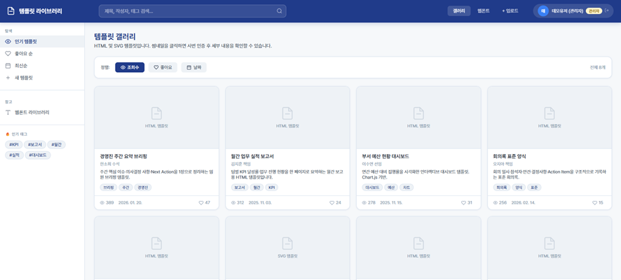
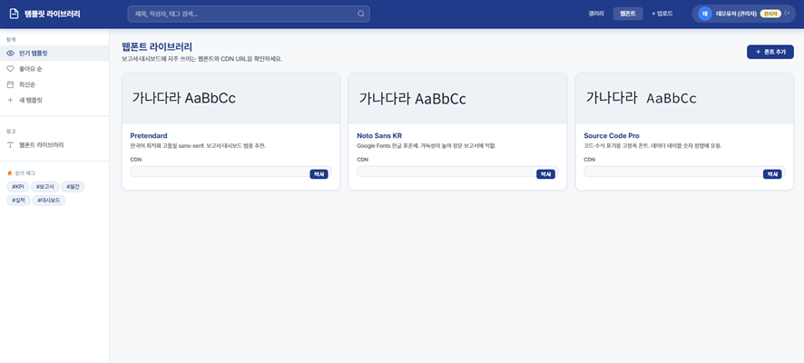
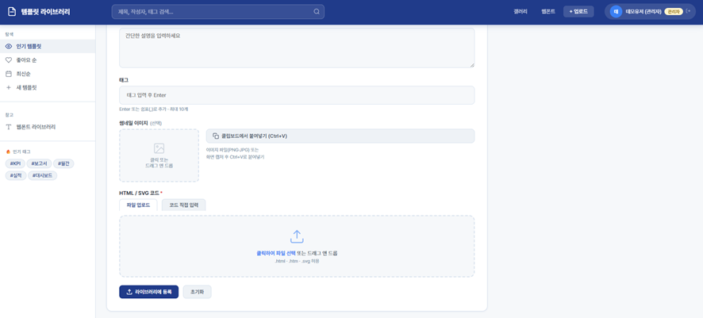
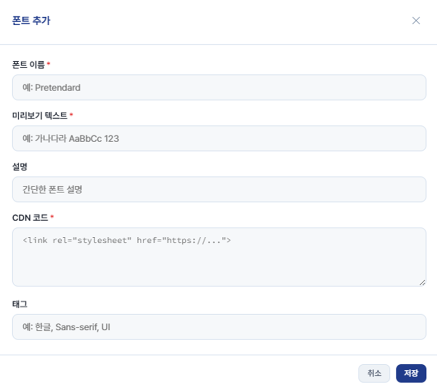

# 보고서와 안내문을 HTML 코딩으로 만들기 시작했다.
AI를 하도 많이 쓰다보니 이제는 보고서도 PPT에서 HTML로 쓰기 시작했다.<br>파워포인트를 언제 실행시켰는지 가물가물할 정도로 최근에는 마크다운으로 보고서 내용을 정리한 후에 바로 A4 가로 사이즈에 딱 맞춰서 HTML로 코딩한다.<br>이 역시 AI를 통해 도움을 받으면 뚝딱 만들어낸다. 나의 경우 보통은 Gemini Canvas로 만들고 있다.<br>물론, HTML 태그를 모르면 코딩이 완료된 파일을 수정하는 데 꽤 애를 먹을 수 있긴 하지만, 조금만 할 줄 알면 특별한 경우가 아니고서는 파워포인트로 작업하는 것보다 몇 배 이상의 효율이 난다.<br>파워포인트에서 색상이니 글꼴이니 배치니 신경 쓸 바에는 코딩 한번이면 [Tailwind.css](https://tailwindcss.com/)와 같은 것들로 디자인은 한방에 끝나버리기 때문이다. <br>더군다나 "구관이 명관"이라고 대부분의 보고를 받는 사람들이 내용이나 글자는 안보고 겉모습만 보기 때문에 더더욱 효과적이다. (이런 현실은 좀 씁쓸하긴 하지만... 😇)<br><br>또, 각종 임직원을 상대로 안내할 때 보통은 [망고보드](https://www.mangoboard.net/)를 이용해서 벡터 이미지를 제작했었는데, 이제는 SVG로 코딩하거나 아예 HTML로 동적 안내문을 만든다. ([Canva](https://www.canva.com/ko_kr/)는 회사에서 차단해 놓았다. 😅)<br>요즘 직원들을 첨부파일 자체를 안 열어보는 경우도 많고, 동영상으로 안내를 만들어도 2배속으로 보거나 거의 끝까지 보지 않기 때문에 하나의 게시물에 모든 내용이 들어가 있는 건 게시자 입장에서도 꽤나 도움이 된다. <br>"다 써놨는데 안본 건 본인 책임😅"이라고 할 수 있으니까 말이다. <br><br>아무튼 결론적으로 앞에서 이야기한 장점(?)들을 팀원들도 같이 누렸으면 하는 바람에 템플릿 라이브러리를 만들었다.

# 템플릿 라이브러리

   

템플릿 라이브러리의 주요 기능은 다음과 같다.
- 사번 인증을 통해 권한이 있는 사용자만 세부 내용을 볼 수 있다. <br>방문자의 경우 갤러리 첫 화면만 볼 수 있고, 세부내요 클릭시 사번 인증을 필요로 한다.
- 사번은 SHA-256 방식으로 암호화하고 SALT를 추가해 보안을 강화했다.<br>(사내 시스템 서버 관리자가 아니기 때문에 개인적으로는 Client에서 할 수 있는 최선이라 생각한다. 😇)
	- 예를 들어 사번이 20260522라고 할 때, SALT값이 LasId55QyWMsvn5Q3aVOudOQ 이면 DB에 저장되는 사번은 "7b8f0e8c75e5852f5fde3a0dbd589bb43579a8acbc1d75600bad8d10759daad6" 이와 같은 Hash값이다.
	- 혹시 몰라 사번 해시 생성기도 하단에 링크를 걸어놓았다.
- **사번 인증을 한 사용자는 누구나 HTML, SVG로 만든 보고서나 안내문을 공유**할 수 있다. <br>(실제 사이트에서는 결과물을 캡쳐하여 썸네일도 같이 업로드 하고 SharePoint에 저장해서 불러오기 때문에 좀 더 갤러리 느낌에 가깝다.)
- 템플릿의 세부 내용 확인시 여러 AI가 그렇듯이 화면을 세로로 2분할 하여 **오른쪽에 바로 미리보기가 제공**된다.
- 가독성이 높은 혹은 목적에 따른 웹폰트를 공유하여 템플릿에 적용할 수 있도록 CDN URL을 제공하고 라이브러리에서 폰트 예시를 볼 수 있다.

생각보다 굉장히 간단한(?) 시스템이지만, 보고서에 투입되는 시간을 생각하면 꽤나 유용하다.<br>물론, HTML 보고서의 형태를 받아본 적 없는 사람들을 여전히 PDF를 같이 생성해주긴 해야 하지만, 그까짓거 인쇄 > PDF 저장이면 끝이다.

참고로 이 템플릿 라이브러리 역시 [AI Workshop 과제 설계 캔버스]() 와 마찬가지로 다음과 같은 사내 플랫폼(도구)를 이용해서 구현했다. <br>기본적으로 M365 기반이다.
- Power Pages : HTML, CSS, JS 호스팅
- SharePoint : DB 용도(JSON 파일 이용)
- Power Automate : Power Pages에서 SharePoint에 저장된 JSON을 Read/Write

위와 같은 형태로 만들다 보니 SharePoint 상에 폴더 구조는 다음과 같다. <br>
> 📁 템플릿 라이브러리/<br>
  ├── 📁Thumbnails    ← 템플릿을 캡쳐한 이미지 저장<br>
  ├── 📁Templates    ← 업로드된 템플릿(HTML, SVG)을 게시 건마다 저장  <br>
  ├── auth.json    ← 사용자 정보(성명, 직위, SHA-256 + SALT로 암호화된 사번 Hash 값)<br>
  ├── templates.json    ← 템플릿 코드 및 작성자, 태그 등 메타데이터 저장<br>
  └── fonts.json    ← 폰트 CDN URL 및 작성자, 태그 등 메타데이터 저장

사이트를 제작하는데 가장 힘든 건 바로 Power Automate에서 Read/Write용 Flow를 만드는 거다.<br>왜냐하면 Flow는 AI가 직접 만들어 주질 못해서 사용자가 하나하나 다 설정해야 하는데, 이 작업이 만만치 않다.<br>여기서 포기하는 사람이 수두룩하다. 😇 DB라는 개념 조차 없는데 Flow까지 만드려고 하면 거의 불가능에 가까운 수준이다.<br>그래서 대략적인 아키텍쳐와 내가 설정해서 잘 작동하고 있는 Read/Write Flow JSON 파일을 같이 공유한다.<br>Power Automate에서 잘 작동하는 Flow를 Export하면 Package 형태의 .zip 파일로 만들어주는 데, 들여다보면 definition.json 파일이 있고, 이 파일이 핵심파일이다.<br>해당 파일의 내용을 토대로 각자의 사내 환경에 맞춰서 Rebuild 해달라고 AI에게 시켜서 자세한 가이드를 달라고 하면 쉽게 해결해 줄지도 모른다. 

## Read Flow

> [ 웹페이지 (사용자) ] <br>
>        │<br>
>        ▼ (1) 원하는 기능(action)을 담아 요청 (POST)<br>
> [ Power Automate Flow (Read) ]<br>
>        │<br>
>        ├─► [Switch 조건문] "네가 요청한 action이 무엇이니?"<br>
>        │      ├─ 1) get-salt      ──► 암호화용 소금(Salt) 값 반환<br>
>        │      ├─ 2) verify-empno  ──► 사원 인증 및 권한 확인 (auth.json)<br>
>        │      ├─ 3) read-templates──► 템플릿 목록 가져오기 (templates.json)<br>
>        │      ├─ 4) read-fonts    ──► 폰트 목록 가져오기 (fonts.json)<br>
>        │      └─ 5) read-html     ──► 특정 HTML 템플릿 파일 내용 읽기<br>
>        │<br>
>        ▼ (2) SharePoint에서 알맞은 데이터를 꺼내옴<br>
> [ SharePoint 저장소 (템플릿 라이브러리 폴더) ]


```
{"name":"TEMPLATES_READ","id":"/providers/Microsoft.Flow/flows/TEMPLATES_READ","type":"Microsoft.Flow/flows","properties":{"apiId":"/providers/Microsoft.PowerApps/apis/shared_logicflows","displayName":"ga_templates_read","definition":{"metadata":{"workflowEntityId":null,"processAdvisorMetadata":null,"flowChargedByPaygo":null,"flowclientsuspensionreason":"None","flowclientsuspensiontime":null,"flowclientsuspensionreasondetails":null,"creator":{"id":"JUHEON","type":"User","tenantId":"JUHEON.com"},"provisioningMethod":"FromDefinition","failureAlertSubscription":true,"clientLastModifiedTime":"2026-05-11T06:59:12.6417567Z","connectionKeySavedTimeKey":"2026-05-11T06:58:12.7360555Z","creationSource":null,"modifiedSources":"Portal"},"$schema":"https://schema.management.azure.com/providers/Microsoft.Logic/schemas/2016-06-01/workflowdefinition.json#","contentVersion":"undefined","parameters":{"$authentication":{"defaultValue":{},"type":"SecureObject"},"$connections":{"defaultValue":{},"type":"Object"}},"triggers":{"manual":{"metadata":{},"type":"Request","kind":"Http","inputs":{"schema":{"type":"object","properties":{"action":{"type":"string"},"empNo":{"type":"string"},"hash":{"type":"string"},"id":{"type":"string"},"html":{"type":"string"},"base64":{"type":"string"},"ext":{"type":"string"},"items":{"type":"array"},"fonts":{"type":"array"}},"required":["action"],"additionalProperties":true},"method":"POST","triggerAuthenticationType":"All"}}},"actions":{"Initialize_variable_varAction":{"runAfter":{"Initialize_variable_varMatchedUser":["Succeeded"]},"type":"InitializeVariable","inputs":{"variables":[{"name":"varAction","type":"string","value":"@triggerBody()?['action']"}]}},"Switch":{"runAfter":{"Initialize_variable_varAction":["Succeeded"]},"cases":{"get-salt":{"case":"get-salt","actions":{"Send_an_HTTP_request_to_SharePoint_auth_1":{"type":"OpenApiConnection","inputs":{"parameters":{"dataset":"https://{회사도메인}.sharepoint.com/sites/{사이트명}","parameters/method":"GET","parameters/uri":"_api/web/GetFileByServerRelativeUrl('/sites/{사이트명}/Shared%20Documents/템플릿%20라이브러리/auth.json')/$value","parameters/headers":{"Accept":"application/json"}},"host":{"apiId":"/providers/Microsoft.PowerApps/apis/shared_sharepointonline","connectionName":"shared_sharepointonline","operationId":"HttpRequest"},"authentication":"@parameters('$authentication')"}},"Response":{"runAfter":{"Set_variable":["Succeeded"]},"type":"Response","kind":"Http","inputs":{"statusCode":200,"headers":{"Content-Type":"application/json"},"body":"@json(concat('{\"salt\":\"', variables('varSalt'), '\"}'))"}},"Set_variable":{"runAfter":{"Send_an_HTTP_request_to_SharePoint_auth_1":["Succeeded"]},"type":"SetVariable","inputs":{"name":"varSalt","value":"{SALT값}"}}}},"verify-empno":{"case":"verify-empno","actions":{"Parse_JSON":{"runAfter":{"Compose_authText":["Succeeded"]},"type":"ParseJson","inputs":{"content":"@outputs('Compose_authText')","schema":{"type":"object","properties":{"_comment":{"type":"string"},"_saltHint":{"type":"string"},"users":{"type":"array","items":{"type":"object","properties":{"hash":{"type":"string"},"name":{"type":"string"},"rank":{"type":"string"},"isAdmin":{"type":"boolean"}},"required":["hash","name","rank","isAdmin"]}}}}}},"Filter_array":{"runAfter":{"Parse_JSON":["Succeeded"]},"type":"Query","inputs":{"from":"@body('Parse_JSON')?['users']","where":"@equals(item()?['hash'],triggerBody()?['hash'])"}},"Condition":{"actions":{"Parse_JSON_2":{"runAfter":{"Set_variable_1":["Succeeded"]},"type":"ParseJson","inputs":{"content":"@variables('varMatchedUser')","schema":{"type":"object","properties":{"hash":{"type":"string"},"name":{"type":"string"},"rank":{"type":"string"},"isAdmin":{"type":"boolean"}},"required":["hash","name","rank","isAdmin"]}}},"Response_2":{"runAfter":{"Parse_JSON_2":["Succeeded"]},"type":"Response","kind":"Http","inputs":{"statusCode":200,"headers":{"Content-Type":"application/json"},"body":{"ok":true,"name":"@{body('Parse_JSON_2')?['name']}","rank":"@{body('Parse_JSON_2')?['rank']}","isAdmin":"@{body('Parse_JSON_2')?['isAdmin']}"}}},"Set_variable_1":{"type":"SetVariable","inputs":{"name":"varMatchedUser","value":"@string(first(body('Filter_array')))"}}},"runAfter":{"Filter_array":["Succeeded"]},"else":{"actions":{"Response_3":{"type":"Response","kind":"Http","inputs":{"statusCode":200,"headers":{"Content-Type":"application/json"},"body":{"ok":false}}}}},"expression":{"and":[{"greater":["@length(body('Filter_array'))",0]}]},"type":"If"},"Get_file_content_auth":{"type":"OpenApiConnection","inputs":{"parameters":{"dataset":"https://{회사도메인}.sharepoint.com/sites/{사이트명}","path":"/Shared Documents/템플릿 라이브러리/auth.json","inferContentType":false},"host":{"apiId":"/providers/Microsoft.PowerApps/apis/shared_sharepointonline","connectionName":"shared_sharepointonline","operationId":"GetFileContentByPath"},"authentication":"@parameters('$authentication')"}},"Compose_authText":{"runAfter":{"Get_file_content_auth":["Succeeded"]},"type":"Compose","inputs":"@base64ToString(\r\n  body('Get_file_content_auth')?['$content']\r\n)"}}},"read-templates":{"case":"read-templates","actions":{"Send_an_HTTP_request_to_SharePoint_templates":{"type":"OpenApiConnection","inputs":{"parameters":{"dataset":"https://{회사도메인}.sharepoint.com/sites/{사이트명}","parameters/method":"GET","parameters/uri":"_api/web/GetFileByServerRelativeUrl('/sites/{사이트명}/Shared%20Documents/템플릿%20라이브러리/templates.json')/$value","parameters/headers":{"Accept":"application/json"}},"host":{"apiId":"/providers/Microsoft.PowerApps/apis/shared_sharepointonline","connectionName":"shared_sharepointonline","operationId":"HttpRequest"},"authentication":"@parameters('$authentication')"}},"Response_4":{"runAfter":{"Send_an_HTTP_request_to_SharePoint_templates":["Succeeded"]},"type":"Response","kind":"Http","inputs":{"statusCode":200,"headers":{"Content-Type":"application/json"},"body":"@body('Send_an_HTTP_request_to_SharePoint_templates')"}}}},"read-fonts":{"case":"read-fonts","actions":{"Send_an_HTTP_request_to_SharePoint_fonts":{"type":"OpenApiConnection","inputs":{"parameters":{"dataset":"https://{회사도메인}.sharepoint.com/sites/{사이트명}","parameters/method":"GET","parameters/uri":"_api/web/GetFileByServerRelativeUrl('/sites/{사이트명}/Shared%20Documents/템플릿%20라이브러리/fonts.json')/$value","parameters/headers":{"Accept":"application/json"}},"host":{"apiId":"/providers/Microsoft.PowerApps/apis/shared_sharepointonline","connectionName":"shared_sharepointonline","operationId":"HttpRequest"},"authentication":"@parameters('$authentication')"}},"Response_5":{"runAfter":{"Send_an_HTTP_request_to_SharePoint_fonts":["Succeeded"]},"type":"Response","kind":"Http","inputs":{"statusCode":200,"headers":{"Content-Type":"application/json"},"body":"@body('Send_an_HTTP_request_to_SharePoint_fonts')"}}}},"read-html":{"case":"read-html","actions":{"Send_an_HTTP_request_to_SharePoint_html":{"type":"OpenApiConnection","inputs":{"parameters":{"dataset":"https://{회사도메인}.sharepoint.com/sites/{사이트명}","parameters/method":"GET","parameters/uri":"@concat('_api/web/GetFileByServerRelativeUrl(''','/sites/{사이트명}/Shared%20Documents/템플릿%20라이브러리/templates/',triggerBody()?['id'],'.',if(empty(triggerBody()?['fileExt']),'html',triggerBody()?['fileExt']),''')/$value')","parameters/headers":{"Accept":"application/json"}},"host":{"apiId":"/providers/Microsoft.PowerApps/apis/shared_sharepointonline","connectionName":"shared_sharepointonline","operationId":"HttpRequest"},"authentication":"@parameters('$authentication')"}},"Response_6":{"runAfter":{"Send_an_HTTP_request_to_SharePoint_html":["Succeeded"]},"type":"Response","kind":"Http","inputs":{"statusCode":200,"headers":{"Content-Type":"application/json"},"body":{"html":"@{body('Send_an_HTTP_request_to_SharePoint_html')}"}}}}}},"default":{"actions":{"Response_7":{"type":"Response","kind":"Http","inputs":{"statusCode":200,"body":{"error":"unknown action"}}}}},"expression":"@variables('varAction')","type":"Switch"},"Initialize_variable_varMatchedUser":{"runAfter":{"Initialize_variable_varSalt":["Succeeded"]},"type":"InitializeVariable","inputs":{"variables":[{"name":"varMatchedUser","type":"string"}]}},"Initialize_variable_varSalt":{"runAfter":{},"type":"InitializeVariable","inputs":{"variables":[{"name":"varSalt","type":"string"}]}}}},"connectionReferences":{"shared_sharepointonline":{"connectionName":"shared-sharepointonl-c9dd6a08-056b-4063-a4be-c4c1f822e170","source":"Embedded","id":"/providers/Microsoft.PowerApps/apis/shared_sharepointonline","tier":"NotSpecified","apiName":"sharepointonline","isProcessSimpleApiReferenceConversionAlreadyDone":false}},"flowFailureAlertSubscribed":false,"isManaged":false}}
```


## Write Flow

> [ 웹페이지 (사용자/관리자) ]<br>
>        │<br>
>        ▼ (1) 변경할 데이터와 기능(action)을 담아 요청 (POST)<br>
> [ Power Automate Flow (Write) ]<br>
>        │<br>
>        ▼ (2) [Condition] 권한 검문소<br>
>        │     "요청자가 관리자(isAdmin=true)이거나, 본인이 쓴 글(empNo=authorEmpNo)인가?"<br>
>        │      ├─ [No]  ──► 🚫 거부 응답 (403 Forbidden / ok: false) 후 종료<br>
>        │      └─ [Yes] ──► ✅ 통과! 다음 단계로 이동<br>
>        │<br>
>        ├─► [Switch 조건문] "어떤 쓰기/지우기 작업을 할까?"<br>
>        │      ├─ 1) save-html      ──► HTML 템플릿 생성 및 업데이트<br>
>        │      ├─ 2) save-thumb     ──► 이미지 썸네일 파일 생성 (Base64 변환)<br>
>        │      ├─ 3) save-templates ──► 템플릿 목록 파일(templates.json) 갱신<br>
>        │      ├─ 4) save-fonts     ──► 폰트 목록 파일(fonts.json) 갱신<br>
>        │      └─ 5) delete-template──► 특정 템플릿 HTML 및 썸네일 삭제<br>
>        │<br>
>        ▼ (3) SharePoint의 파일들을 실제로 조작함<br>
> [ SharePoint 저장소 (템플릿 라이브러리 폴더) ]
> 


```
{"name":"8894334b-f68e-4172-8dfb-5930dbc03d31","id":"/providers/Microsoft.Flow/flows/8894334b-f68e-4172-8dfb-5930dbc03d31","type":"Microsoft.Flow/flows","properties":{"apiId":"/providers/Microsoft.PowerApps/apis/shared_logicflows","displayName":"ga_templates_write","definition":{"metadata":{"workflowEntityId":null,"processAdvisorMetadata":null,"flowChargedByPaygo":null,"flowclientsuspensionreason":"None","flowclientsuspensiontime":null,"flowclientsuspensionreasondetails":null,"creator":{"id":"JUHEON","type":"User","tenantId":"JUHEON.com"},"provisioningMethod":"FromDefinition","failureAlertSubscription":true,"clientLastModifiedTime":"2026-05-11T07:05:31.0851836Z","connectionKeySavedTimeKey":"2026-05-11T07:04:40.0224538Z","creationSource":null,"modifiedSources":"Portal"},"$schema":"https://schema.management.azure.com/providers/Microsoft.Logic/schemas/2016-06-01/workflowdefinition.json#","contentVersion":"undefined","parameters":{"$authentication":{"defaultValue":{},"type":"SecureObject"},"$connections":{"defaultValue":{},"type":"Object"}},"triggers":{"manual":{"metadata":{},"type":"Request","kind":"Http","inputs":{"triggerAuthenticationType":"All"}}},"actions":{"Initialize_variable_varAction":{"runAfter":{},"type":"InitializeVariable","inputs":{"variables":[{"name":"varAction","type":"string","value":"@triggerBody()?['action']"}]}},"Initialize_variable_varResult":{"runAfter":{"Initialize_variable_varAction":["Succeeded"]},"type":"InitializeVariable","inputs":{"variables":[{"name":"varResult","type":"object","value":{}}]}},"Condition":{"actions":{"Switch":{"cases":{"save-html":{"case":"save-html","actions":{"Create_file":{"type":"OpenApiConnection","inputs":{"parameters":{"dataset":"https://{회사도메인}.sharepoint.com/sites/{사이트명}","folderPath":"/Shared Documents/템플릿 라이브러리/Templates","name":"@concat(triggerBody()?['id'],'.',if(empty(triggerBody()?['fileExt']),'html',triggerBody()?['fileExt']))","body":"@triggerBody()?['html']"},"host":{"apiId":"/providers/Microsoft.PowerApps/apis/shared_sharepointonline","connectionName":"shared_sharepointonline","operationId":"CreateFile"},"authentication":"@parameters('$authentication')"},"runtimeConfiguration":{"contentTransfer":{"transferMode":"Chunked"}}},"Set_variable":{"runAfter":{"Update_file_2":["Succeeded"],"Create_file":["Succeeded"]},"type":"SetVariable","inputs":{"name":"varResult","value":{"ok":true,"action":"save-html"}}},"Response":{"runAfter":{"Set_variable":["Succeeded"]},"type":"Response","kind":"Http","inputs":{"statusCode":200,"body":"@variables('varResult')"}},"Update_file_2":{"runAfter":{"Create_file":["Succeeded","Skipped","TimedOut"]},"metadata":{"%252fShared%2bDocuments%252f%25ed%2585%259c%25ed%2594%258c%25eb%25a6%25bf%2b%25eb%259d%25bc%25ec%259d%25b4%25eb%25b8%258c%25eb%259f%25ac%25eb%25a6%25ac%252fauth.json":"/Shared Documents/템플릿 라이브러리/auth.json","%252fShared%2bDocuments%252f%25ed%2585%259c%25ed%2594%258c%25eb%25a6%25bf%2b%25eb%259d%25bc%25ec%259d%25b4%25eb%25b8%258c%25eb%259f%25ac%25eb%25a6%25ac%252fTemplates%252fmoi66js5bl4bnh.html":"/Shared Documents/템플릿 라이브러리/Templates/moi66js5bl4bnh.html"},"type":"OpenApiConnection","inputs":{"parameters":{"dataset":"https://{회사도메인}.sharepoint.com/sites/{사이트명}","id":"@outputs('Create_file')?['body/Id']","body":"@triggerBody()?['html']"},"host":{"apiId":"/providers/Microsoft.PowerApps/apis/shared_sharepointonline","connectionName":"shared_sharepointonline","operationId":"UpdateFile"},"authentication":"@parameters('$authentication')"}}}},"save-thumb":{"case":"save-thumb","actions":{"Create_file_1":{"type":"OpenApiConnection","inputs":{"parameters":{"dataset":"https://{회사도메인}.sharepoint.com/sites/{사이트명}","folderPath":"/Shared Documents/템플릿 라이브러리/Thumbnails","name":"@concat(triggerBody()?['id'], '.jpg')","body":"@base64ToBinary(triggerBody()?['base64'])"},"host":{"apiId":"/providers/Microsoft.PowerApps/apis/shared_sharepointonline","connectionName":"shared_sharepointonline","operationId":"CreateFile"},"authentication":"@parameters('$authentication')"},"runtimeConfiguration":{"contentTransfer":{"transferMode":"Chunked"}}},"Set_variable_1":{"runAfter":{"Create_file_1":["Succeeded"]},"type":"SetVariable","inputs":{"name":"varResult","value":{"ok":true,"action":"save-thumb"}}},"Response_1":{"runAfter":{"Set_variable_1":["Succeeded"]},"type":"Response","kind":"Http","inputs":{"statusCode":200,"body":"@variables('varResult')"}}}},"save-templates":{"case":"save-templates","actions":{"Update_file":{"metadata":{"%252fShared%2bDocuments%252f%25ed%2585%259c%25ed%2594%258c%25eb%25a6%25bf%2b%25eb%259d%25bc%25ec%259d%25b4%25eb%25b8%258c%25eb%259f%25ac%25eb%25a6%25ac%252fauth.json":"/Shared Documents/템플릿 라이브러리/auth.json"},"type":"OpenApiConnection","inputs":{"parameters":{"dataset":"https://{회사도메인}.sharepoint.com/sites/{사이트명}","id":"/Shared Documents/템플릿 라이브러리/templates.json","body":"@json(\r\n  concat(\r\n    '{ \"items\": ',\r\n    string(triggerBody()?['items']),\r\n    ' }'\r\n  )\r\n)"},"host":{"apiId":"/providers/Microsoft.PowerApps/apis/shared_sharepointonline","connectionName":"shared_sharepointonline","operationId":"UpdateFile"},"authentication":"@parameters('$authentication')"}},"Set_variable_2":{"runAfter":{"Update_file":["Succeeded"]},"type":"SetVariable","inputs":{"name":"varResult","value":{"ok":true,"action":"save-templates","count":"@{length(triggerBody()?['items'])}"}}},"Response_2":{"runAfter":{"Set_variable_2":["Succeeded"]},"type":"Response","kind":"Http","inputs":{"statusCode":200,"body":"@variables('varResult')"}}}},"save-fonts":{"case":"save-fonts","actions":{"Update_file_1":{"metadata":{"%252fShared%2bDocuments%252f%25ed%2585%259c%25ed%2594%258c%25eb%25a6%25bf%2b%25eb%259d%25bc%25ec%259d%25b4%25eb%25b8%258c%25eb%259f%25ac%25eb%25a6%25ac%252fauth.json":"/Shared Documents/템플릿 라이브러리/auth.json"},"type":"OpenApiConnection","inputs":{"parameters":{"dataset":"https://{회사도메인}.sharepoint.com/sites/{사이트명}","id":"/Shared Documents/템플릿 라이브러리/fonts.json","body":"@json(\r\n  concat(\r\n    '{ \"fonts\": ',\r\n    string(triggerBody()?['fonts']),\r\n    ' }'\r\n  )\r\n)"},"host":{"apiId":"/providers/Microsoft.PowerApps/apis/shared_sharepointonline","connectionName":"shared_sharepointonline","operationId":"UpdateFile"},"authentication":"@parameters('$authentication')"}},"Set_variable_3":{"runAfter":{"Update_file_1":["Succeeded"]},"type":"SetVariable","inputs":{"name":"varResult","value":{"ok":true,"action":"save-fonts","count":"@{length(triggerBody()?['fonts'])}"}}},"Response_3":{"runAfter":{"Set_variable_3":["Succeeded"]},"type":"Response","kind":"Http","inputs":{"statusCode":200,"body":"@variables('varResult')"}}}},"delete-template":{"case":"delete-template","actions":{"Delete_file":{"metadata":{"%252fShared%2bDocuments%252f%25ed%2585%259c%25ed%2594%258c%25eb%25a6%25bf%2b%25eb%259d%25bc%25ec%259d%25b4%25eb%25b8%258c%25eb%259f%25ac%25eb%25a6%25ac%252fauth.json":"/Shared Documents/템플릿 라이브러리/auth.json"},"type":"OpenApiConnection","inputs":{"parameters":{"dataset":"https://{회사도메인}.sharepoint.com/sites/{사이트명}","id":"@concat('/Shared Documents/템플릿 라이브러리/Templates/',triggerBody()?['id'],'.',if(empty(triggerBody()?['fileExt']),'html',triggerBody()?['fileExt']))"},"host":{"apiId":"/providers/Microsoft.PowerApps/apis/shared_sharepointonline","connectionName":"shared_sharepointonline","operationId":"DeleteFile"},"authentication":"@parameters('$authentication')"}},"Delete_file_1":{"runAfter":{"Delete_file":["Succeeded","Failed"]},"metadata":{"%252fShared%2bDocuments%252f%25ed%2585%259c%25ed%2594%258c%25eb%25a6%25bf%2b%25eb%259d%25bc%25ec%259d%25b4%25eb%25b8%258c%25eb%259f%25ac%25eb%25a6%25ac%252fauth.json":"/Shared Documents/템플릿 라이브러리/auth.json"},"type":"OpenApiConnection","inputs":{"parameters":{"dataset":"https://{회사도메인}.sharepoint.com/sites/{사이트명}","id":"/Shared Documents/템플릿 라이브러리/Thumbnails/@{triggerBody()?['id']}.{ext}"},"host":{"apiId":"/providers/Microsoft.PowerApps/apis/shared_sharepointonline","connectionName":"shared_sharepointonline","operationId":"DeleteFile"},"authentication":"@parameters('$authentication')"}},"Set_variable_4":{"runAfter":{"Delete_file_1":["Succeeded"]},"type":"SetVariable","inputs":{"name":"varResult","value":{"ok":true,"action":"delete-template"}}},"Response_4":{"runAfter":{"Set_variable_4":["Succeeded"]},"type":"Response","kind":"Http","inputs":{"statusCode":200,"body":"@variables('varResult')"}}}}},"default":{"actions":{"Response_5":{"type":"Response","kind":"Http","inputs":{"statusCode":200,"body":{"ok":false,"error":"unknown action","receivedAction":"@{variables('varAction')}"}}}}},"expression":"@variables('varAction')","type":"Switch"}},"runAfter":{"Initialize_variable_varResult":["Succeeded"]},"else":{"actions":{"Response_6":{"type":"Response","kind":"Http","inputs":{"statusCode":200,"body":{"ok":false,"error":"forbidden"}}}}},"expression":{"and":[{"equals":["@or(\r\n  equals(toLower(string(triggerBody()?['isAdmin'])), 'true'),\r\n  equals(triggerBody()?['empNo'], triggerBody()?['authorEmpNo'])\r\n)",true]}]},"type":"If"}}},"connectionReferences":{"shared_sharepointonline":{"connectionName":"shared-sharepointonl-c9dd6a08-056b-4063-a4be-c4c1f822e170","source":"Embedded","id":"/providers/Microsoft.PowerApps/apis/shared_sharepointonline","tier":"NotSpecified","apiName":"sharepointonline","isProcessSimpleApiReferenceConversionAlreadyDone":false}},"flowFailureAlertSubscribed":false,"isManaged":false}}
```


마지막으로 auth.json의 구조는 다음과 같이 간단하다.
```
{
  "users": [
    { "empNo": "Hash값", "name": "홍길동", "rank": "책임", "isAdmin": false },
    { "empNo": "Hash값", "name": "김철수", "rank": "수석", "isAdmin": false },
    { "empNo": "Hash값", "name": "관리자", "rank": "관리자", "isAdmin": true }
  ]
}
```

아래 실제 HTML 코드가 있기 때문에 부족한 부분은 AI의 도움을 받자. 😇

> [!SUCCESS] **템플릿 라이브러리 공유**
> - [🌐 새 창에서 템플릿 라이브러리 열기(Ctrl + 클릭)](/files/templates.html)
> - [🌐 새 창에서 사번 해시 생성기 열기(Ctrl + 클릭)](/files/sha-265_hash_helper.html)
