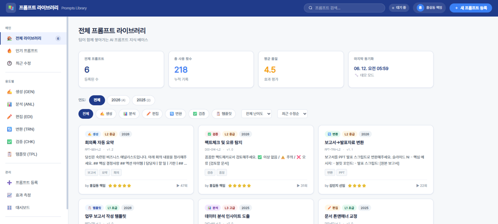
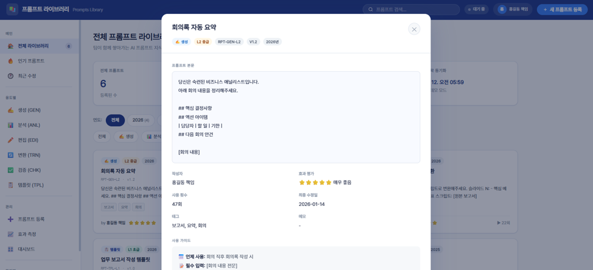
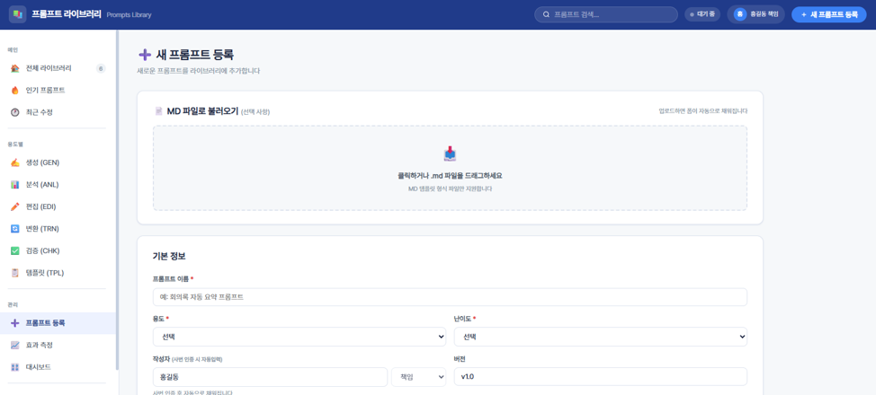
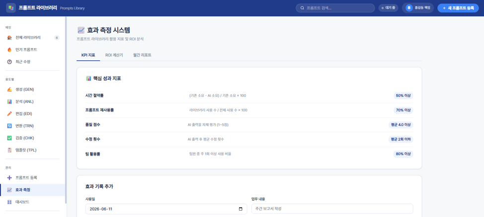
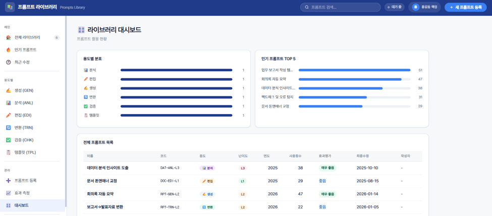

# 템플릿 라이브러리 만으로는 부족하다.
지난번 [AI를 활용한 템플릿 라이브러리]()를 만들어서 공유하면서 예쁜 혹은 비교적 정돈된 보고서 템플릿에 대한 갈증(?)은 어느정도 해결이 되었다. <br>하지만, 자세히 들여다보니 아직 AI에게 어떻게 일을 시켜야 할지 조차도 잘 모르는 사람이 많았다.<br>물론 관심의 차이이긴 하지만, 우연히 [리멤버 커뮤니티](https://community.rememberapp.co.kr/main)에서 「[프롬프트 절대 공유 안하는 신입 어떡하죠?](https://link.rmbr.in/8sij3l)」 라는 핫 게시글을 보았다.<br>댓글들에서도 의견이 분분하기는 했는데, 나는 이미 경력이 16년이 넘기도 했고 프롬프트 몇 개로 경쟁우위에 서야될 필요성도, 그러고 싶은 마음도 없었기에 내가 아는 것들을 비교적 체계적으로 공유하는 편을 선택했다.<br>어떻게 보면 '홍익인간(弘益人間)' 정신이나 '유니세프' 마인드이긴 한데, 누군가와 경쟁을 하지 않아도 된다는 게 이런 측면에서도 긍정적인 효과인 것 같기도 하다.<br>또, 프롬프트 라이브러리를 만들다 보니 자연스럽게 개인적인 라이브러리를 Obsidian Bases 기본 플러그인을 통해서 DB화 하게 되는 장점도 있었다. 😀

# 프롬프트 라이브러리
    

프롬프트 라이브러리의 주요 기능은 다음과 같다.
- [AI를 활용한 템플릿 라이브러리]()와 같이 사번 인증을 통해 권한이 있는 사용자만 세부 내용을 볼 수 있다.<br>또, 동일하게 사번은 SHA-256 방식으로 암호화하고 SALT를 추가해 보안을 강화했다.<br>즉, auth.json은 템플릿 라이브러리와 프롬프트 라이브러리가 동일하므로 하나의 파일로 두 시스템에서 활용할 수 있다.
- 프롬프트는 **생성(GEN), 분석(ANL), 편집(EDI), 변환(TRN), 검증(CHK), 템플릿(TPL)** 용도로 구분되며, 버전 이력을 기록할 수 있도록 되어 있다.
- 프롬프트는 마크다운(MD)으로 업로드하여 등록할 수 있고, 이미 등록되어 있는 프롬프트를 마크다운으로 다운로드할 수 있다.
- 사용자들의 피드백(사용횟수)과 자체 판단 효과(품질평가) 등을 통해 프롬프트의 효과를 KPI 형태로 측정할 수 있도록 했다.
- 관리자는 대시보드를 통해 전체 프롬프트 등록 현황을 한눈에 볼 수 있고, 접근 권한 관리를 통해 UI를 통해 auth.json을 업데이트할 수 있다.

템플릿 라이브러리도 그러했지만, 프롬프트 라이브러리도 생각해보면 굉장히 간단한(?) 시스템이다.<br>다만, 사람들이 더 어려워하는 건 겪어보니 템플릿보다는 프롬프트 작성에 있는 것이 확실했다.<br>예쁜 보고서 **템플릿을 제공해줘도 AI에게 어떤 프롬프트로 시켜야 될지를 몰라서 결과물이 안나오는 경우**가 허다했다. 😇<br>그럼에도 불구하고 이렇게 꾸역꾸역 뭔가를 만들어내고 공유하는 건 내가 겪은 시행착오를 다른 사람들은 그래도 최소화(?)해서 겪으라는 의미이기도 하다.<br><br>이 프롬프트 라이브러리도 [AI를 활용한 템플릿 라이브러리](),  [AI Workshop 과제 설계 캔버스]()와 마찬가지로 M365 기반의 사내 플랫폼를 이용해서 구현했다. <br>
- Power Pages : HTML, CSS, JS 호스팅
- SharePoint : DB 용도(JSON 파일 이용)
- Power Automate : Power Pages에서 SharePoint에 저장된 JSON을 Read/Write

SharePoint 상에 폴더 구조는 다음과 같다. <br>
> 📁 프롬프트 라이브러리/<br>
  ├── auth.json    ← 사용자 정보(성명, 직위, SHA-256 + SALT로 암호화된 사번 Hash 값)<br>
  ├── prompts.json    ← 프롬프트 내용 및 작성자, 태그 등 메타데이터 저장<br>
  └── effects.json    ← 효과측정 데이터(품질 평가), 소요시간, 수정 횟수 등 저장
  
  위에서 effects.json은 없어도 시스템 작동에는 큰 무리는 없다. 불필요하다면 삭제해도 된다.

## Read Flow

> [ 웹페이지 (사용자) ] <br>
>        │<br>
>        ▼ (1) 원하는 기능(action)과 매개변수를 담아 요청 (POST)<br>
> [ Power Automate Flow (Read) ]<br>
>        │<br>
>        ├─► [SALT 변수 설정] 보안용 텍스트 미리 정의 (암호화용 소금(Salt) 값)<br>
>        │<br>
>        ├─► [Switch 조건문] "어떤 데이터를 읽어다 줄까?"<br>
>        │      │<br>
>        │      ├─ 1) get-salt      ──► 암호화용 소금(Salt) 값 반환<br>
>        │      │<br>
>        │      ├─ 2) verify-empno  ──► 사원 인증 및 사용자 전체 목록(userList) 함께 반환<br>
>        │      │                       (대상: /프롬프트 라이브러리/auth.json)<br>
>        │      │<br>
>        │      ├─ 3) gen-user-hash ──► 입력받은 사번(empNo)을 고유한 해시값으로 변환하여 반환<br>
>        │      │                       (SHA256 알고리즘 사용)<br>
>        │      │<br>
>        │      ├─ 4) list-files    ──► 지정된 폴더 안의 파일 이름 목록만 쏙 골라서 반환<br>
>        │      │<br>
>        │      └─ 5) read-json     ──► 요청한 경로(path)에 있는 JSON 파일 내용 통째로 반환<br>
>        │<br>
>        ▼ (2) SharePoint에서 조건에 맞는 데이터를 조회함<br>
> [ SharePoint 저장소 (프롬프트 라이브러리 폴더) ]<br>


```
{"name":"PROMPTS_READ","id":"/providers/Microsoft.Flow/flows/PROMPTS_READ","type":"Microsoft.Flow/flows","properties":{"apiId":"/providers/Microsoft.PowerApps/apis/shared_logicflows","displayName":"PROMPTS_READ","definition":{"metadata":{"workflowEntityId":null,"processAdvisorMetadata":null,"flowChargedByPaygo":null,"flowclientsuspensionreason":"None","flowclientsuspensiontime":null,"flowclientsuspensionreasondetails":null,"creator":{"id":"JUHEON","type":"User","tenantId":"JUHEON.com"},"provisioningMethod":"FromDefinition","failureAlertSubscription":true,"clientLastModifiedTime":"2026-05-19T08:03:09.9094401Z","connectionKeySavedTimeKey":"2026-05-19T08:03:09.9094401Z","creationSource":"Portal","modifiedSources":"Portal"},"$schema":"https://schema.management.azure.com/providers/Microsoft.Logic/schemas/2016-06-01/workflowdefinition.json#","contentVersion":"undefined","parameters":{"$authentication":{"defaultValue":{},"type":"SecureObject"},"$connections":{"defaultValue":{},"type":"Object"}},"triggers":{"manual":{"metadata":{},"type":"Request","kind":"Http","inputs":{"schema":{"type":"object","properties":{"action":{"type":"string"},"folder":{"type":"string"},"path":{"type":"string"},"empNo":{"type":"string"},"hash":{"type":"string"},"name":{"type":"string"},"rank":{"type":"string"},"isAdmin":{"type":"boolean"},"empHash":{"type":"string"}}},"method":"POST","triggerAuthenticationType":"All"}}},"actions":{"SALT":{"runAfter":{},"type":"InitializeVariable","inputs":{"variables":[{"name":"SALT","type":"string","value":"{SALT값}"}]}},"Switch":{"runAfter":{"MatchedUser":["Succeeded"]},"cases":{"get-salt":{"case":"get-salt","actions":{"Response":{"type":"Response","kind":"Http","inputs":{"statusCode":200,"headers":{"Content-Type":"application/json"},"body":{"salt":"@{variables('SALT')}"}}}}},"verify-empno":{"case":"verify-empno","actions":{"Get_file_content_using_path_1":{"type":"OpenApiConnection","inputs":{"parameters":{"dataset":"https://{회사도메인}.sharepoint.com/sites/{사이트명}","path":"/Shared Documents/프롬프트 라이브러리/auth.json","inferContentType":false},"host":{"apiId":"/providers/Microsoft.PowerApps/apis/shared_sharepointonline","connectionName":"shared_sharepointonline","operationId":"GetFileContentByPath"},"authentication":"@parameters('$authentication')"}},"Compose_authText":{"runAfter":{"Get_file_content_using_path_1":["Succeeded"]},"type":"Compose","inputs":"@base64ToString(body('Get_file_content_using_path_1')?['$content'])"},"Parse_JSON":{"runAfter":{"Compose_authText":["Succeeded"]},"type":"ParseJson","inputs":{"content":"@outputs('Compose_authText')","schema":{"type":"object","properties":{"users":{"type":"array","items":{"type":"object","properties":{"hash":{"type":"string"},"name":{"type":"string"},"rank":{"type":"string"},"isAdmin":{"type":"boolean"}},"required":["hash","name","rank","isAdmin"]}}}}}},"Filter_array":{"runAfter":{"Parse_JSON":["Succeeded"]},"type":"Query","inputs":{"from":"@body('Parse_JSON')?['users']","where":"@equals(\n  item()?['hash'],\n  triggerBody()?['hash']\n)"}},"Select_userList":{"runAfter":{"Filter_array":["Succeeded"]},"type":"Select","inputs":{"from":"@body('Parse_JSON')?['users']","select":{"name":"@item()?['name']","rank":"@item()?['rank']","isAdmin":"@item()?['isAdmin']"}}},"Condition":{"actions":{"Compose_Matched":{"type":"Compose","inputs":"@first(body('Filter_array'))"},"Response_ok":{"runAfter":{"Compose_Matched":["Succeeded"]},"type":"Response","kind":"Http","inputs":{"statusCode":200,"headers":{"Content-Type":"application/json"},"body":{"ok":true,"name":"@{outputs('Compose_Matched')?['name']}","rank":"@{outputs('Compose_Matched')?['rank']}","isAdmin":"@{outputs('Compose_Matched')?['isAdmin']}","userList":"@{body('Select_userList')}"}}}},"runAfter":{"Select_userList":["Succeeded"]},"else":{"actions":{"Response_fail":{"type":"Response","kind":"Http","inputs":{"statusCode":200,"headers":{"Content-Type":"application/json"},"body":{"ok":false,"userList":"@{body('Select_userList')}"}}}}},"expression":{"and":[{"greater":["@length(body('Filter_array'))",0]}]},"type":"If"}}},"gen-user-hash":{"case":"gen-user-hash","actions":{"Compose":{"type":"Compose","inputs":"@concat(variables('SALT'),':',triggerBody()?['empNo'])"},"Compose_1":{"runAfter":{"Compose":["Succeeded"]},"type":"Compose","inputs":"@base64(sha256HashValue(outputs('Compose')))"},"Compose_2":{"runAfter":{"Compose_1":["Succeeded"]},"type":"Compose","inputs":{"empHash":"@{outputs('Compose_1')}","name":"@{triggerBody()?['name']}","rank":"@{triggerBody()?['rank']}","isAdmin":"@triggerBody()?['isAdmin']"}},"Response_3":{"runAfter":{"Compose_2":["Succeeded"]},"type":"Response","kind":"Http","inputs":{"statusCode":200,"headers":{"Content-Type":"application/json"},"body":{"user":"@outputs('Compose_2')"}}}}},"list-files":{"case":"list-files","actions":{"Send_an_HTTP_request_to_SharePoint_1":{"type":"OpenApiConnection","inputs":{"parameters":{"dataset":"https://{회사도메인}.sharepoint.com/sites/{사이트명}","parameters/method":"GET","parameters/uri":"@concat('_api/web/GetFolderByServerRelativeUrl(''',triggerBody()?['folder'],''')/Files?$select=Name&$orderby=Name')","parameters/headers":{"Accept":"application/json;odata=nometadata"}},"host":{"apiId":"/providers/Microsoft.PowerApps/apis/shared_sharepointonline","connectionName":"shared_sharepointonline","operationId":"HttpRequest"},"authentication":"@parameters('$authentication')"}},"Parse_JSON_1":{"runAfter":{"Send_an_HTTP_request_to_SharePoint_1":["Succeeded"]},"type":"ParseJson","inputs":{"content":"@body('Send_an_HTTP_request_to_SharePoint_1')","schema":{"type":"object","properties":{"value":{"type":"array","items":{"type":"object","properties":{"Name":{"type":"string"}}}}}}}},"Select_FileNames":{"runAfter":{"Parse_JSON_1":["Succeeded"]},"type":"Select","inputs":{"from":"@body('Parse_JSON_1')?['value']","select":{"Name":"@item()?['Name']"}}},"Response_4":{"runAfter":{"Select_FileNames":["Succeeded"]},"type":"Response","kind":"Http","inputs":{"statusCode":200,"headers":{"Content-Type":"application/json"},"body":"@body('Select_FileNames')"}}}},"read-json":{"case":"read-json","actions":{"Send_an_HTTP_request_to_SharePoint_2":{"type":"OpenApiConnection","inputs":{"parameters":{"dataset":"https://{회사도메인}.sharepoint.com/sites/{사이트명}","parameters/method":"GET","parameters/uri":"@concat('_api/web/GetFileByServerRelativeUrl(''',triggerBody()?['path'],''')/$value')","parameters/headers":{"Accept":"application/json"}},"host":{"apiId":"/providers/Microsoft.PowerApps/apis/shared_sharepointonline","connectionName":"shared_sharepointonline","operationId":"HttpRequest"},"authentication":"@parameters('$authentication')"}},"Response_5":{"runAfter":{"Send_an_HTTP_request_to_SharePoint_2":["Succeeded"]},"type":"Response","kind":"Http","inputs":{"statusCode":200,"headers":{"Content-Type":"application/json"},"body":"@body('Send_an_HTTP_request_to_SharePoint_2')"}}}},"get-auth":{"case":"get-auth","actions":{"Get_file_content_using_path":{"type":"OpenApiConnection","inputs":{"parameters":{"dataset":"https://{회사도메인}.sharepoint.com/sites/{사이트명}","path":"/Shared Documents/프롬프트 라이브러리/auth.json","inferContentType":false},"host":{"apiId":"/providers/Microsoft.PowerApps/apis/shared_sharepointonline","connectionName":"shared_sharepointonline","operationId":"GetFileContentByPath"},"authentication":"@parameters('$authentication')"}},"Compose_getAuth":{"runAfter":{"Get_file_content_using_path":["Succeeded"]},"type":"Compose","inputs":"@base64ToString(body('Get_file_content_using_path')?['$content'])"},"Response_6":{"runAfter":{"Compose_getAuth":["Succeeded"]},"type":"Response","kind":"Http","inputs":{"statusCode":200,"headers":{"Content-Type":"application/json"},"body":"@json(outputs('Compose_getAuth'))"}}}}},"default":{"actions":{"Response_7":{"type":"Response","kind":"Http","inputs":{"statusCode":400,"body":{"error":"unknown action"}}}}},"expression":"@triggerBody()?['action']","type":"Switch"},"MatchedUser":{"runAfter":{"UserList":["Succeeded"]},"type":"InitializeVariable","inputs":{"variables":[{"name":"MatchedUser","type":"object"}]}},"UserList":{"runAfter":{"SALT":["Succeeded"]},"type":"InitializeVariable","inputs":{"variables":[{"name":"UserList","type":"array"}]}}}},"connectionReferences":{"shared_sharepointonline":{"connectionName":"shared-sharepointonl-c9dd6a08-056b-4063-a4be-c4c1f822e170","source":"Embedded","id":"/providers/Microsoft.PowerApps/apis/shared_sharepointonline","tier":"NotSpecified","apiName":"sharepointonline","isProcessSimpleApiReferenceConversionAlreadyDone":false}},"flowFailureAlertSubscribed":false,"isManaged":false}}
```


## Write Flow

> [ 웹페이지 (사용자/관리자) ]<br>
>        │<br>
>        ▼ (1) 저장할 내용(content)과 경로(path)를 담아 요청 (POST)<br>
> [ Power Automate Flow (Write) ]<br>
>        │<br>
>        ├─► [Switch 조건문] "어떤 쓰기 작업을 할까?"<br>
>        │      │<br>
>        │      ├─ 1) save-json ──► 1. 전달받은 오브젝트 데이터를 문자열(String)로 변환<br>
>        │      │                   2. 파일 경로(path)에서 폴더와 파일명을 분리해냄<br>
>        │      │                   3. 파일이 있으면 덮어쓰기(overwrite=true)로 파일 저장<br>
>        │      │<br>
>        │      └─ *(그 외)* ──► 🚫 잘못된 요청 에러 반환 (400 Bad Request)<br>
>        │<br>
>        ▼ (2) SharePoint의 지정된 경로에 데이터를 새롭게 기록함<br>
> [ SharePoint 저장소 (프롬프트 라이브러리 폴더) ]<br>


```
{"name":"PROMPTS_WRITE","id":"/providers/Microsoft.Flow/flows/PROMPTS_WRITE","type":"Microsoft.Flow/flows","properties":{"apiId":"/providers/Microsoft.PowerApps/apis/shared_logicflows","displayName":"PROMPTS_WRITE","definition":{"metadata":{"workflowEntityId":null,"processAdvisorMetadata":null,"flowChargedByPaygo":null,"flowclientsuspensionreason":"None","flowclientsuspensiontime":null,"flowclientsuspensionreasondetails":null,"creator":{"id":"JUHEON","type":"User","tenantId":"JUHEON.com"},"provisioningMethod":"FromDefinition","failureAlertSubscription":true,"clientLastModifiedTime":"2026-05-19T08:03:44.1669342Z","connectionKeySavedTimeKey":"2026-05-19T08:03:44.1669342Z","creationSource":"Portal","modifiedSources":"Portal"},"$schema":"https://schema.management.azure.com/providers/Microsoft.Logic/schemas/2016-06-01/workflowdefinition.json#","contentVersion":"1.0.0.0","parameters":{"$authentication":{"defaultValue":{},"type":"SecureObject"},"$connections":{"defaultValue":{},"type":"Object"}},"triggers":{"manual":{"metadata":{},"type":"Request","kind":"Http","inputs":{"schema":{"type":"object","properties":{"action":{"type":"string"},"path":{"type":"string"},"content":{"type":"object"}}},"method":"POST","triggerAuthenticationType":"All"}}},"actions":{"Switch":{"runAfter":{},"cases":{"save-json":{"case":"save-json","actions":{"Compose":{"type":"Compose","inputs":"@string(triggerBody()?['content'])"},"Send_an_HTTP_request_to_SharePoint":{"runAfter":{"Compose":["Succeeded"]},"type":"OpenApiConnection","inputs":{"parameters":{"dataset":"https://{회사도메인}.sharepoint.com/sites/o365m_70137274-","parameters/method":"POST","parameters/uri":"@concat(\r\n  '_api/web/GetFolderByServerRelativeUrl(''',\r\n  replace(\r\n    triggerBody()?['path'],\r\n    concat('/',last(split(triggerBody()?['path'],'/'))),\r\n    ''\r\n  ),\r\n  ''')/Files/Add(url=''',\r\n  last(split(triggerBody()?['path'],'/')),\r\n  ''',overwrite=true)'\r\n)","parameters/headers":{"Accept":"application/json;odata=nometadata","Content-Type":"application/octet-stream"},"parameters/body":"@{outputs('Compose')}"},"host":{"apiId":"/providers/Microsoft.PowerApps/apis/shared_sharepointonline","connectionName":"shared_sharepointonline","operationId":"HttpRequest"},"authentication":"@parameters('$authentication')"}},"Response":{"runAfter":{"Send_an_HTTP_request_to_SharePoint":["Succeeded"]},"type":"Response","kind":"Http","inputs":{"statusCode":200,"headers":{"Content-Type":"application/json"},"body":{"success":true}}}}}},"default":{"actions":{"Response_1":{"type":"Response","kind":"Http","inputs":{"statusCode":400,"body":{"error":"unknown action"}}}}},"expression":"@triggerBody()?['action']","type":"Switch"}},"outputs":{}},"connectionReferences":{"shared_sharepointonline":{"connectionName":"shared-sharepointonl-c9dd6a08-056b-4063-a4be-c4c1f822e170","source":"Embedded","id":"/providers/Microsoft.PowerApps/apis/shared_sharepointonline","tier":"NotSpecified","apiName":"sharepointonline","isProcessSimpleApiReferenceConversionAlreadyDone":false}},"flowFailureAlertSubscribed":false,"isManaged":false}}
```


auth.json은 앞에서 얘기한 것 처럼 [AI를 활용한 템플릿 라이브러리]()에서 사용되는 파일과 동일하다.
```
{
  "users": [
    { "empNo": "Hash값", "name": "홍길동", "rank": "책임", "isAdmin": false },
    { "empNo": "Hash값", "name": "김철수", "rank": "수석", "isAdmin": false },
    { "empNo": "Hash값", "name": "관리자", "rank": "관리자", "isAdmin": true }
  ]
}
```

아래 실제 HTML 코드가 있기 때문에 부족한 부분은 AI의 도움을 받자. 😇

> [!SUCCESS] **프롬프트 라이브러리 공유**
> - [🌐 새 창에서 프롬프트 라이브러리 열기(Ctrl + 클릭)](/files/prompts.html)
