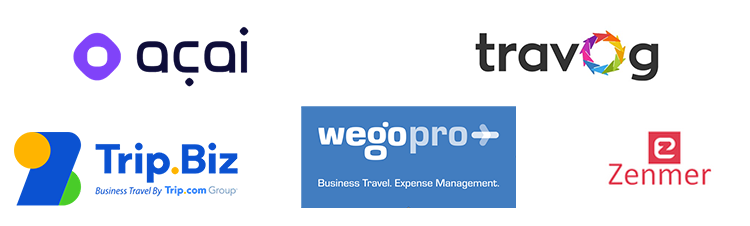
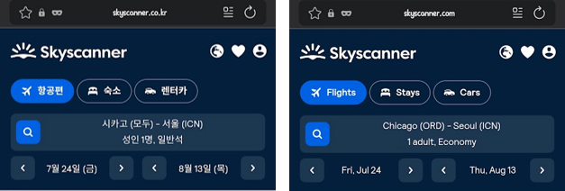
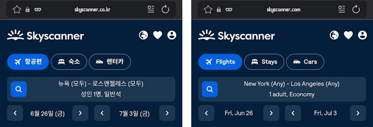
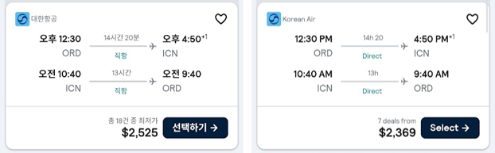
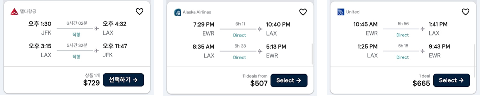

# TMC(Travel Management Company)란?
약자 그대로 기업의 출장 정책 관리, 비용 절감, 위기 대응, 데이터 분석까지 종합적으로 지원하는 '여행사'이다. 기업 출장의 경우 비즈니스 목적이기 때문에 출장의 규모나 범위, 기간과 횟수가 레저보다는 훨씬 많기도 하고, 그래도 대부분은 이코노미 클래스의 상위 클래스(Y, B, M 등)을 이용하는 경우가 많다. 임원들의 경우 정책적으로 비즈니스 클래스를 발권할 수 있도록 되어 있어서 흔히 말해 객단가가 높다. 이러다 보니 꾸준히 출장 수요가 있는 기업과 계약이 되어 있으면 발권 수수료 혹은 예약 수수료를 일정 금액, 일정 비율로 받을 수 있어 해당 여행사가 유지되는 형태이다. 그래서 대부분은 자체 예약 플랫폼을 운영하고 있다. 각각의 이름은 조금씩 다르지만 BTMS(Business Travel Management System)라고 부른다.

# 한국 기업들은 어떤 TMC를 이용할까?
현재 내가 재직중인 회사의 경우 아마 국내 기업중에 가장 많은 인원이 미국으로 출장가는 회사이기도 할 텐데, 한국 법인 기준 해외출장비가 한 해 900억원이 넘는다. 그 중 항공, 호텔, 렌트, 수당 등등을 다 뜯어보면 체감이 좀 다를 수는 있겠지만 전 사업장의 식대보다 해외출장비가 더 큰 지경이다. 한 회사가 이 정도 수준이라면 Global 비즈니스를 하는 다른 계열사를 합쳐 그룹 차원에서 볼륨을 본다면 상당한 금액이다. 그래서 대부분의 그룹은 TMC를 계열사 혹은 관계사로 지정 운영하고 있다. 삼성은 SBTM(호텔 신라 자회사), 현대는 현대드림투어(현대백화점그룹 계열사), LG는 레드캡투어(범LG), SK는 타이드스퀘어(과거 SK 계열사였던 '투어비스' 인수회사), 롯데는 롯데JTB와 같은 식이다. 한국 대기업들의 스타일이 '수직계열화'인 점도 무시 못하겠지만, 굳이 이해해보자면 생각보다 여행사가 가져갈 수 있는 정보가 워낙 많다보니 타 회사를 이용하는 것에 있어서도 조심스러울 수도 있겠다는 생각은 든다. 흔히 말해 '보안'이다. 중요 인물이 어느 비행기를 타고 어느 국가로 가고 어느 도시에서 어떤 호텔에서 숙박하는 안다면 사실상 '동선'을 다 꿸 수 있긴 하니까 말이다. 물론, 누굴 암살하려고 하는 것도 아니고, 앞서 얘기했던 중요 인물들 예를 들면, 그룹의 오너 정도가 되면 어차피 '전용기'로 이동하기 때문에 TMC가 필요 없다. 😇

# 그렇다면 왜 Global TMC를 이용하지는 않는 걸까?
최근에 Global TMC 도입에 대한 타당성을 검토하던 중에 느낀 주된 이유는 다음과 같다.
1. 한국 기준으로 보면 이 복잡하고 골 때리는 기업 출장의 세계를 제대로 알고 싶지도 않을 뿐더러 이미 계열사 혹은 관계사 TMC가 있기 때문에 그들에게 **아웃소싱하는 게 현명하다.** 그래서 실제 출장 업무를 총무팀에서 담당하는 경우도 있고 구매팀이 담당하는 경우도 많다. 이 말은 즉, 입찰에 따라 최저가 써내면 낙찰, 계약하는 수준의 업무로 판단하는 회사가 많다는 이야기다. 여기에는 개인적으로 2가지 이슈가 있다고 본다. 
	- 한국 로컬 TMC는 글로벌 진출을 하지 않거나 했다가도 코로나 여파로 대부분 철수 했다. 즉, **그들의 커버리지에 해외는 없다.**
	- 입찰 프로세스에 따라 항공, 호텔 등등의 견적을 받고 계약한다 치자, 여행 좀 다녀본 사람들은알겠지만, 항공, 호텔 등 **여행상품에 '정가'가 있을리 없다.** 즉, 할인을 받았다, 싸게 계약했다고 한들 어느 날 [스카이스캐너](https://www.skyscanner.co.kr/)를 돌리면 더 싼게 나오고, 비교해보면 계약 단가가 비싼 경우가 매우 흔하다. 물론, 정가를 찾아내는 과정 예를 들면, 가격 추적과 같은 일들이 더 어려운 일일 수는 있다. 게다가 아무도 잘 모르는데 가격 추적까지 해가면서 비용절감 실적을 언급하기에는 사실상 난이도 최상의 업무가 되는 형국이라 포기하는 게 빠를 수 있다. 😇
2. 해외 기업의 담당자들과 **빌드업 해서 계약까지 하는데 너무나 오랜 시간이 걸린다**. 최근 나의 경험에 의하면 딱 1년 소요됐다. 내가 재직중인 회사에서는 KPI 즉, 임원의 평가는 1월 ~ 9월, 10월에 한 해 평가 끝이다. 즉, 9개월 내에 Kick-off 부터 계약, 도입 후 비용절감이 된 실적까지 들고 가야 '성과'로 인정받을 수 있다. 또, 임원들은 내년에는 재계약이 될지 안될지 매일 불안해 하는 실정이라 최소 1년 짜리 프로젝트에 자원을 쓰는 게 어떤 면에서는 '낭비'라고 느낄 확률이 매우 높다. 
3. **불확실성이 높다.** TMC는 결국 '수수료 경쟁'이 되는데, 인터넷을 아무리 뒤져도 정확한 수수료에 대한 정보는 찾을 수 없다. 회사마다 영역마다 구간마다 수수료가 상이한 경우도 많고, 이를 공개하지도 않기 때문에 막상 Global에서 내놓아라 하는 TMC를 이용한다 해도 일만 많아지고 실제 효과는 미미할 수 있다. 밑에서 따로 언급하겠지만 작년에 싱가포르에서 열리는 [Business Travel Show Asia Pacific 2025](https://www.businesstravelnewseurope.com/Management/BTN-Group-to-launch-Business-Travel-Show-Asia-Pacific)에 호스트로 참석했을 때, 여러 TMC들을 만나서 우리 회사에 제안 좀 해달라는 영업(?)을 해본 바 수수료 수준이 저렴하지는 않았다. 특히, Global에서 가장 영향력 있는 [Amex GBT](https://www.amexglobalbusinesstravel.com/)의 아시아 [Egencia](https://www.egencia.com/en) 담당자 왈 "저희가 많이 할인된 가격으로 예약해드리지만, 그만큼 수수료가 싸지 않습니다." 라며, 의미심장한 말을 남겼었다. 해외 법인 직원들이 다른 Global 회사들이 Amex GBT를 이용하는 걸 보면서 "확실히 싸다."라며 "우리도 Amex꺼 못 쓰나요?"를 물어보곤 했는데, 할인한 것 못지 않은 수수료가 숨어 있다고는 예상 못했을 것이다. 본인이 지불하는 금액이 아니다 보니... 😇

# 그럼, 그냥 Global TMC는 쳐다도 안 보면 되는 거 아닌가?
그렇지가 않다. 나는 다음 2가지 이유 때문에 지속적인 접근이 필요하다고 본다.
1. Global TMC들은 막강한 플랫폼에 AI까지 접목한 터라 **이미 한국의 TMC들과의 격차가 너무 많이 벌어졌다.** 작년 Business Travel Show에 한국 회사, 아니 한국인은 내가 3일 동안 돌아다니면서 딱 4명 뿐이었다.  나와 후배 사원 1명, 항공사 아시아 담당이 한국인인 2곳의 2명. 즉, 한국 회사들은 이런 데 관심도 없을 뿐더러 TMC들 조차도 참여하지 않는다. 그런데, 내가 호스트로 참여해서 3일 동안 매일 40분씩 6건 이상의 업체들과 미팅한 결과 한국에 돌아와서 한마디로 Business Travel Show를 정리했을 때, 다른 사람들에게 얘기한 건 이거 였다. "**우리는 아직 갓을 쓰고 있는데, 저기는 지하철이 다녀요.**" 아래에서 보는 회사들이 아마 Trip.Biz 정도를 제외하고는 낯설텐데, 전부 해외출장 예약, 지출관리를 해주는 플랫폼들이다. 이미 플랫폼에 각종 AI 기술들이 다 결합되어 있는 상태였고, [acai](https://www.acaitravel.com/)의 경우 AI 상담원과 음성으로 대화하면서 예약 스케쥴 변경이며 환불 등을 시연했었다. 구닥다리 BTMS만 보던 나에게는 적지 않은 충격이었고, 여담이지만 '인도' 사람들은 진짜 똑똑하구싶었다. 대부분의 발표자들, 즉 각 회사의 대표들이 인도 사람이 많았다. 😅

2. 비즈니스 출장 비용의 대부분은 아마 항공, 숙박 비중이 제일 클텐데, 그 중 **항공의 경우 한마디로 하면 지역별 편차가 크다**. 즉, **'속지주의'에 가깝다.** 공식 용어로는 SITI, SOTO의 요금차이가 그 원인인데, 한마디로 얘기하면 미국발 한국행 비행기표를 한국에서 조회, 발권한 금액이랑 미국 현지에서 조회, 발권한 금액에 차이가 있다는 이야기다. '뭐, 그래봤자 얼마나 차이나겠어' 라고 생각할 수 있겠지만, 유의미한 차이가 꽤 있다. **적게는 10~20%의 차이가** 있을 때도 있지만, 출발이 임박하면 할 수록, **극 성수기일수록 2배 이상 차이가 나는 경우**도 상당하다.

| 구분       | 영문 약어                          | 의미               |
| -------- | ------------------------------ | ---------------- |
| **SITI** | Sold Inside, Ticketed Inside   | 여행 개시국 안에서 판매·발권 |
| **SOTO** | Sold Outside, Ticketed Outside | 여행 개시국 밖에서 판매·발권 |

# SITI vs SOTO

AI에 물어보고거나 인터넷에서 검색만 하면 차이가 난다고 하는데, 감이 잘 오질 않아서 6/25(목) 오전에 출근하면서 스카이스캐너를 돌려봤다.  조건은 다음과 같다.
- 시카고(ORG) → 인천(ICN), 7/24(금) ~ 8/13(목), 성인 1명, 이코노미, USD 기준

- 뉴욕(JFK) → 로스앤젤레스(LAX), 6/26(금) ~ 7/3(금), 성인 1명, 이코노미,  기준

결과는 다음과 같다.
- **시카고(ORG) → 인천(ICN)**
	- 동일한 대한항공 왕복 항공권이 SITI(미국 POS) 요금이 SOTO(한국 POS) 대비 **$156 (6.6%) 저렴**했다. 즉, **미국발 아시아행 비행편은 미국 현지에서 발권하는 게 더 저렴**한 셈이다. 

- **뉴욕(JFK) → 로스앤젤레스(LAX)**
	- 동일한 미국 국내선 노선을 조회할 때, SOTO(한국 POS)는 델타항공 $729만 검색되는 반면, SITI(미국 POS)에서는 알래스카 항공 $507 (**$222, 43.7% 저렴**), 유나이티드 항공 $665(**$64, 9.6% 저렴**)가 검색된다. 즉, **미국 국내선은 미국 현지에서 발권하는 게 더 저렴**하다.

북미(미국, 캐나다)발, 유럽발, 미국 국내선이 이러한 요금 차이가 특히 심하다고 한다. 차이가 나는 이유는 환율, 세금, 사전구매 조건 등 너무나도 많다. 그래서 여행사들은 각국의 현지 여행사들과 제휴를 통해 본인들의 플랫폼에 리소스를 받아와서 노출시키기도 한다.  다만, 여행사 자체 플랫폼으로 수수료를 포함한 상태에서 경쟁력이 있는지는 좀 의문이긴 하다. 😇  결국, 해외출장 업무를 비용절감 측면에서 바라본다면 한국에서 미국으로 출장을 갈 때, 미국 현지 국내선은 Global TMC가 있다면 현지 발권하는 것이 훨씬 저렴하다. 또, 유럽에서 미국으로 출장가는 수요도 마찬가지다.  
이런 이유 때문에 알만한 기업들에 연락도 해보고, 딥 리서치를 해보기도 했는데, 결론은 한국 대기업들은 Global TMC에 대한 필요성은 그다지 느끼지 못하는 듯 하다. 해외 현지 법인은 '현지에서 알아서 해야지'의 스탠스가 기본적으로 깔려 있기도 하지만, '내 돈 아니니까'가 더 크다. 한국에서 출발하는 비용은 한국 법인 코스트센터를 이용하지만, 해외 현지 법인 출장비용은 '알빠노' 할 만도 하니까 말이다. 그래서 초안 보고 때, **'남들이 하지 않는 이유'를 찾아달라**고 했었던건지도 모르겠다. 손에 잡히지 않는 신기루 같은 일일 테니까. 😇 