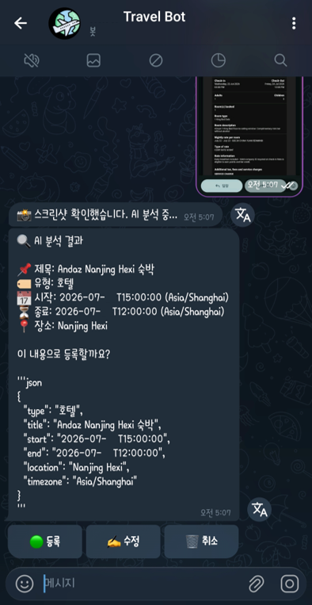
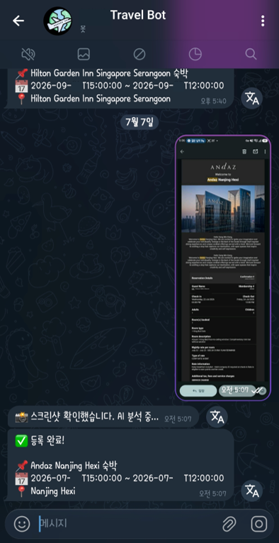
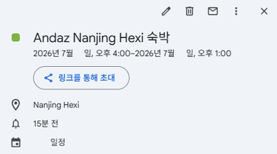

# 이번엔 여행 예약이 문제였다.

[Telegram Bot, Github, Netlify로 자체 무료 Read It Later 구축]()에서 Telegram + GitHub + Netlify로 무료 Read It Later 봇을 만들고 나서, 링크 저장은 거의 스트레스가 없어졌다. 👍<br>그냥 인터넷 서핑을 하다 봐야할 글들이나 Tip이 있으면 대화창에 링크를 던지면 그만이었고, 꺼내보는 건 Obsidian에서 쉽게 볼 수 있어서 많이 익숙해졌다.<br>
그런데 얼마 안 가서 비슷한 귀찮음이 또 하나 생겼다. 공교롭게 7~9월까지 매월 비행기를 타야 할 일이 생겼다. <br>출장이든 가족 여행이든 예약을 하고 나면 개인 메일로 예약 메일이 와서 자동으로 일정이 등록되는 서비스(예를 들면, 대한항공 공홈에서 항공권 예약하거나 Agoda를 이용해 호텔을 예약)가 있는 반면, 아닌 곳들이 상당히 많았다.<br>항공권 스크린샷, 호텔 예약 앱 캡처, 확인 메일 PDF가 여기저기 흩어지고, 그걸 다시 구글 캘린더에 하나하나 옮겨 적는 일이 매번 귀찮았다. 😇<br><br>그래서 만들었다! 이번엔 예약내역 스크린샷 또는 PDF 한 장을 봇에게 던지면,

1. **Gemini**가 OCR을 이용해 이미지를 읽고 예약 정보(제목/시간/장소/타임존)를 뽑아내고
2. 텔레그램 인라인 버튼으로 **등록 / 수정 / 취소**를 물어보고
3. 등록을 누르면 **구글 캘린더**에 일정이 생기고, 동시에 **옵시디언**(Koofr WebDAV)에도 마크다운으로 기록되는

여행 비서 봇(Travel Bot)을 만들어봤다. 인프라는 [지난 글]()과 동일하게 GitHub + Netlify로 유지해서 비용은 여전히 무료다.

 


# 무료로 여행 예약 자동 아카이빙 봇 구축

이번에도 최대한 자세히 적어본다. 😇

## 1단계: 준비물 (계정 및 프로그램)

### 1. 필요한 계정 (모두 무료)

기존 [Read It Later 봇]()에서 쓰던 계정을 거의 그대로 재사용한다.

- [**GitHub**](https://github.com/): 코드 보관 창고 (재사용)
- [**Netlify**](https://www.netlify.com/): 코드를 실제 서비스로 돌려주는 서버 (재사용)
- [**Koofr**](https://koofr.eu/): 옵시디언 볼트와 동기화되는 WebDAV 저장소 (재사용)
- **Telegram**: 봇과 대화하는 인터페이스 (봇은 새로 하나 더 만든다)

여기에 이번 프로젝트에서만 필요한 계정 두 개가 추가된다.

- [**Google AI Studio**](https://aistudio.google.com/apikey): 스크린샷/PDF를 분석할 Gemini API 키 발급용
- [**Google Cloud Console**](https://console.cloud.google.com/): 구글 캘린더 API 사용 설정 및 OAuth 인증서 발급용

### 2. 필요한 프로그램

- [**Visual Studio Code (VS Code)**](https://code.visualstudio.com/)
- [**GitHub Desktop**](https://desktop.github.com/download/)

저번과 동일하다. 이 두 개면 충분하다.

### 3. Gemini API 키 발급

1. [Google AI Studio](https://aistudio.google.com/apikey)에 로그인한다.<br>왼쪽 사이드바에서 MANAGE > Dashboard 로 이동한다.
2. 우측 상단의 **API 키 만들기**를 눌러 키를 생성한다.<br>키가 이미 여러개 있다면 관리를 위해서 프로젝트를 생성한 후에 키를 만들어도 된다.
3. 발급된 키를 메모해둔다. (`GEMINI_API_KEY`)

개인이 스크린샷 몇 장 분석하는 용도로는 무료 한도 안에서 충분히 쓸 수 있다.

### 4. Google Calendar API 설정 (Cloud Console)

여기가 이번 프로젝트에서 제일 손이 많이 가는 부분이다. 순서대로 따라가면 어렵지 않다.

1. [Google Cloud Console](https://console.cloud.google.com/)에서 새 프로젝트를 만든다. (예: `my-travel-bot`)<br>사이트 자체가 복잡해 보일 수 있어서 첫 페이지에서 **Ctrl + O**를 누르면 프로젝트 선택 화면이 나타나고, 새 프로젝트를 만들 수 있다.
2. **API 및 서비스 → 라이브러리**에서 `Google Calendar API`를 검색해 **사용 설정**을 누른다.
3. **API 및 서비스 → OAuth 동의 화면**으로 이동한다.
   - User Type: **외부(External)**
   - 앱 이름, 지원 이메일 등 필수 항목만 입력하고 저장한다.
   - **테스트 사용자**에 내 Google 계정 이메일을 추가한다.
4. **API 및 서비스 → 사용자 인증 정보 → 사용자 인증 정보 만들기 → OAuth 클라이언트 ID**
   - 애플리케이션 유형: **웹 애플리케이션**
   - 승인된 리디렉션 URI: `https://developers.google.com/oauthplayground`
   - 발급된 **클라이언트 ID**와 **클라이언트 보안 비밀번호**을 메모해둔다.

> **⚠️ 여기서 하나 걸렸다.** OAuth 동의 화면 게시 상태를 "테스트(Testing)"로 두면, 여기서 발급되는 Refresh Token이 **7일 뒤 자동 만료**된다. 매주 토큰을 새로 발급해야 하면 자동화의 의미가 없다. <br>
> 해결법은 간단하다. OAuth 동의 화면에서 **프로덕션으로 게시(Publish App)**를 눌러버리면 된다. 캘린더 쓰기 권한이 "민감한 범위"라 로그인할 때 **"확인되지 않은 앱"** 경고가 한 번 뜨는데, 어차피 나 혼자 쓰는 앱이니 **고급 → (앱 이름)으로 이동(안전하지 않음)**을 눌러 계속 진행하면 된다. <br>이 경고는 딱 한 번, 다음 단계(Refresh Token 발급)에서만 보고 넘어가면 그만이다.

### 5. Refresh Token 추출 (OAuth Playground)

1. [Google OAuth 2.0 Playground](https://developers.google.com/oauthplayground/)에 접속한다.
2. 우측 상단 톱니바퀴(⚙️) → 하단의 **Use your own OAuth credentials** 체크 → 방금 만든 **Client ID / Client Secret(보안 비밀번호)** 를 입력한다.
3. 왼쪽 Step 1에서 `Calendar API v3`를 펼쳐 `https://www.googleapis.com/auth/calendar`에 체크 → **Authorize APIs** 를 클릭한다.
4. 구글 계정 로그인 → (테스트 상태였다면 "확인되지 않은 앱" 경고 → 고급 → 이동) → 권한 승인한다.
5. Step 2로 돌아와 **Exchange authorization code for tokens** 을 클릭한다.
6. 발급된 **Refresh token** 값을 복사해둔다. (`GOOGLE_REFRESH_TOKEN`)

> 여기서도 한 번 막혔었다. `Authorize APIs`를 눌렀는데 `액세스 차단됨: 승인 오류` / `invalid_scope: Some requested scopes were invalid. {valid=[...calendar], invalid=[calendar]}` 에러가 났다. <br>알고 보니 Step 1 화면 아래쪽에 있는 **"Input your own scopes" 입력창에 `calendar`라는 글자가 따로 남아있어서** 체크박스로 선택한 정상 scope와 같이 전송되며 생긴 문제였다. <br>입력창을 비우고 체크박스만 다시 체크하니 바로 해결됐다.

---

## 2단계: 텔레그램 봇 및 ID 준비

1. **봇 생성**: `@BotFather`에서 `/newbot`으로 새 봇을 만든다. (기존 Read It Later 봇과 섞이지 않게 별도로 생성하는 걸 추천한다.)<br>마지막에 나오는 **HTTP API Token**을 적어둔다.
2. **내 ID 확인**: 저번에 만든 `ALLOWED_USER_ID`를 그대로 재사용하면 된다. 처음이라면 `@userinfobot`에게 메시지를 보내면 숫자 ID를 알려준다.

---

## 3단계: 폴더 구조 잡기

Read It Later 봇과 완전히 분리된 새 폴더/저장소를 만든다.

```text
my-travel-bot/ (내 폴더 이름)
├── app/
│   └── api/
│       └── telegram/
│           └── route.ts      <-- 최종 코드
├── package.json               <-- 프로그램 설정 파일
└── .gitignore                 <-- 보안을 위해 업로드 제외할 목록
```

---

## 4단계: 핵심 코드 파일 작성

### 1. `package.json` (설정 파일)

```json
{
  "name": "my-travel-bot",
  "version": "0.1.0",
  "private": true,
  "scripts": {
    "dev": "next dev",
    "build": "next build",
    "start": "next start"
  },
  "dependencies": {
    "@google/genai": "^1.30.0",
    "googleapis": "^140.0.0",
    "next": "^15.4.8",
    "react": "^19.0.0",
    "react-dom": "^19.0.0",
    "webdav": "^5.6.0"
  },
  "devDependencies": {
    "@types/node": "^20.0.0",
    "@types/react": "^19.0.0",
    "@types/react-dom": "^19.0.0",
    "typescript": "^5.0.0"
  }
}
```

이번에도 Next.js 버전 때문에 한 번 암초에 걸렸다. 처음엔 `next: "15.4.2"`로 고정했는데, Netlify에 배포하는 순간 아래 메시지와 함께 배포 자체가 막혔다.

```text
You're currently using a version of Next.js affected by a critical security vulnerability.
To protect your project, we're blocking further deploys until you update your Next.js version.
```

찾아보니 2025년 12월에 나온 React Server Components 치명적 원격 코드 실행 취약점(CVE-2025-55182 / Next.js 쪽 CVE-2025-66478)에 정확히 걸리는 버전이었다. <br>Netlify가 알아서 이 버전대의 배포를 차단해주는 셈이라 오히려 고마웠다. 😀<br> `15.4.x` 라인의 패치 버전인 `15.4.8` 이상으로 올리고(`^`로 캐럿을 붙여 이후 패치도 자동으로 받도록) 다시 push하니 바로 통과됐다.<br><br>
여기에 하나 더, `@types/react`와 `@types/react-dom`도 꼭 넣어야 한다. <br>이 프로젝트엔 실제 화면(JSX)이 하나도 없는데도, Next.js는 TypeScript 파일이 하나라도 있고 `react`가 의존성에 있으면 무조건 이 타입 패키지들을 요구한다. <br>빠뜨렸더니 Netlify 빌드 로그에 `Please install @types/react`라는 메시지와 함께 실패했다.

### 2. `app/api/telegram/route.ts` (최종 로직)

몇 번의 시행착오를 거쳐 정리한 최종 코드다. 그대로 붙여넣으면 된다.

```typescript
import { NextRequest, NextResponse } from 'next/server';
import { GoogleGenAI } from '@google/genai';
import { google } from 'googleapis';
import { createClient } from 'webdav';

const TELEGRAM_TOKEN = process.env.TELEGRAM_TOKEN;
const ALLOWED_USER_ID = process.env.ALLOWED_USER_ID;
const GEMINI_API_KEY = process.env.GEMINI_API_KEY;

const KOOFR_EMAIL = process.env.KOOFR_EMAIL;
const KOOFR_APP_PASSWORD = process.env.KOOFR_APP_PASSWORD;
const KOOFR_WEBDAV_URL = 'https://app.koofr.net/dav/Koofr';
const OBSIDIAN_FOLDER = '/Travel'; // 옵시디언 볼트 내 저장 폴더

const ai = new GoogleGenAI({ apiKey: GEMINI_API_KEY });

const oauth2Client = new google.auth.OAuth2(
  process.env.GOOGLE_CLIENT_ID,
  process.env.GOOGLE_CLIENT_SECRET,
  'https://developers.google.com/oauthplayground'
);
oauth2Client.setCredentials({ refresh_token: process.env.GOOGLE_REFRESH_TOKEN });
const calendar = google.calendar({ version: 'v3', auth: oauth2Client });

type ReservationInfo = {
  type: string;       // 항공 / 호텔 / 기차 / 버스 / 관광지 / 기타
  title: string;
  start: string;       // YYYY-MM-DDTHH:MM:SS (해당 지역 현지 시각)
  end: string;
  location: string;
  timezone: string;    // IANA 타임존, 예: Asia/Tokyo, Asia/Seoul
};

export async function POST(req: NextRequest) {
  try {
    const body = await req.json();

    // ── 1) 일반 메시지 (사진 / PDF / 텍스트) ─────────────────────────
    if (body.message) {
      const chatId = body.message.chat.id;
      if (ALLOWED_USER_ID && String(chatId) !== String(ALLOWED_USER_ID)) {
        return NextResponse.json({ ok: true });
      }

      // 1-a. 스크린샷(사진)이 들어온 경우 → Gemini 분석
      if (body.message.photo) {
        const photo = body.message.photo[body.message.photo.length - 1]; // 최고화질
        await handleReservationFile(chatId, photo.file_id, 'image/jpeg');
        return NextResponse.json({ ok: true });
      }

      // 1-a'. 파일로 첨부된 PDF(항공권 등) 또는 이미지가 들어온 경우
      if (body.message.document) {
        const mimeType = body.message.document.mime_type as string;
        const isSupported = mimeType === 'application/pdf' || mimeType?.startsWith('image/');

        if (!isSupported) {
          await sendTelegramMessage(chatId, '❌ PDF 또는 이미지 파일만 분석할 수 있어요.');
          return NextResponse.json({ ok: true });
        }

        await handleReservationFile(chatId, body.message.document.file_id, mimeType);
        return NextResponse.json({ ok: true });
      }

      // 1-b. "/list" — 다가오는 일정 조회
      if (body.message.text && body.message.text.trim() === '/list') {
        await listUpcomingEvents(chatId);
        return NextResponse.json({ ok: true });
      }

      // 1-c. "✍️ 수정" 이후 사용자가 고친 JSON을 텍스트로 다시 보낸 경우
      if (body.message.text) {
        const edited = extractJson(body.message.text);
        if (edited && edited.title && edited.start && edited.end) {
          await sendConfirmMessage(chatId, edited);
          return NextResponse.json({ ok: true });
        }

        // 그 외 일반 텍스트 → 간단 안내
        if (body.message.text.trim().length > 0) {
          await sendTelegramMessage(
            chatId,
            '항공권/호텔/기차/버스/관광지 예약 스크린샷이나 PDF를 보내주시면 분석해서 캘린더 등록을 도와드릴게요. ✈️🏨\n다가오는 일정을 보려면 /list 를 입력하세요.'
          );
        }
      }
      return NextResponse.json({ ok: true });
    }

    // ── 2) 인라인 버튼 클릭 (콜백) ───────────────────────────────
    if (body.callback_query) {
      const query = body.callback_query;
      const chatId = query.message.chat.id;
      const messageId = query.message.message_id;
      const data = JSON.parse(query.data);
      const action = data.a; // 'register' | 'edit' | 'cancel' | 'delete'

      await answerCallbackQuery(query.id);

      // /list 에서 온 삭제 버튼은 JSON 블록이 없는 메시지이므로 먼저 분기 처리
      if (action === 'delete') {
        try {
          await calendar.events.delete({ calendarId: 'primary', eventId: data.id });
          await editTelegramMessage(chatId, messageId, '🗑 삭제되었습니다.');
        } catch (e) {
          console.error('일정 삭제 실패:', e);
          await editTelegramMessage(chatId, messageId, '❌ 삭제 실패 (이미 지난 일정이거나 오류가 발생했습니다)');
        }
        return NextResponse.json({ ok: true });
      }

      const info = extractJson(query.message.text);
      if (!info) {
        await editTelegramMessage(chatId, messageId, '❌ 정보를 다시 읽지 못했습니다. 스크린샷을 다시 보내주세요.');
        return NextResponse.json({ ok: true });
      }

      if (action === 'cancel') {
        await editTelegramMessage(chatId, messageId, '🗑 취소되었습니다.');
        return NextResponse.json({ ok: true });
      }

      if (action === 'edit') {
        const raw = JSON.stringify(info, null, 2);
        await editTelegramMessage(
          chatId,
          messageId,
          `✍️ 아래 내용을 수정한 뒤, 전체를 복사해서 그대로 다시 보내주세요.\n\n\`\`\`json\n${raw}\n\`\`\``
        );
        return NextResponse.json({ ok: true });
      }

      if (action === 'register') {
        await calendar.events.insert({
          calendarId: 'primary',
          requestBody: {
            summary: info.title,
            location: info.location,
            start: { dateTime: info.start, timeZone: info.timezone || 'Asia/Seoul' },
            end: { dateTime: info.end, timeZone: info.timezone || 'Asia/Seoul' },
          },
        });

        await saveToObsidian(info);

        await editTelegramMessage(
          chatId,
          messageId,
          `✅ 등록 완료!\n\n📌 ${info.title}\n📅 ${info.start} ~ ${info.end}\n📍 ${info.location || '-'}`
        );
      }
    }

    return NextResponse.json({ ok: true });
  } catch (err) {
    console.error(err);
    return NextResponse.json({ ok: false }, { status: 500 });
  }
}

// ── 사진/PDF 공용 처리: 다운로드 → Gemini 분석 → 확인 메시지 전송 ──
async function handleReservationFile(chatId: number, fileId: string, mimeType: string) {
  const label = mimeType === 'application/pdf' ? '📄 PDF' : '📸 스크린샷';
  await sendTelegramMessage(chatId, `${label} 확인했습니다. AI 분석 중...`);

  const fileBuffer = await downloadTelegramFile(fileId);

  try {
    const info = await analyzeReservation(fileBuffer, mimeType);
    await sendConfirmMessage(chatId, info);
  } catch (e) {
    console.error('Gemini 분석 실패:', e);
    await sendTelegramMessage(chatId, '❌ 예약 정보를 추출하지 못했습니다. 다시 시도해 주세요.');
  }
}

// ── Gemini 분석 (이미지/PDF 공용, 구조화 출력) ──
async function analyzeReservation(fileBuffer: Buffer, mimeType: string): Promise<ReservationInfo> {
  const response = await ai.models.generateContent({
    model: 'gemini-2.5-flash',
    contents: [
      {
        role: 'user',
        parts: [
          {
            text:
              '이 파일은 항공권, 호텔, 기차, 버스, 관광지 입장권/투어 등 여행 관련 예약 내역입니다 (스크린샷 또는 PDF). ' +
              '핵심 정보를 추출해 주세요.\n' +
              '- type은 "항공", "호텔", "기차", "버스", "관광지", "기타" 중 하나로 분류하세요.\n' +
              '- start/end는 해당 예약이 실제로 진행되는 지역의 "현지 시각" 기준으로 적으세요 (시차 변환하지 마세요).\n' +
              '- timezone은 그 현지 시각에 해당하는 IANA 타임존 식별자로 적으세요 (예: Asia/Tokyo, Europe/Paris, America/Los_Angeles). ' +
              '항공권은 출발/도착 공항이 다른 타임존일 수 있는데, 이 경우 "출발 시각 기준"의 타임존을 사용하세요. ' +
              '타임존을 특정할 단서가 전혀 없으면 Asia/Seoul로 두세요.\n' +
              '- 관광지 입장권처럼 정확한 종료 시각이 없으면 시작 시각 + 2시간 정도로 end를 추정하세요.',
          },
          { inlineData: { mimeType, data: fileBuffer.toString('base64') } },
        ],
      },
    ],
    config: {
      responseMimeType: 'application/json',
      responseSchema: {
        type: 'object',
        properties: {
          type: {
            type: 'string',
            enum: ['항공', '호텔', '기차', '버스', '관광지', '기타'],
          },
          title: { type: 'string', description: '예: 신라호텔 숙박, KE123 도쿄행, 유니버설스튜디오 입장권' },
          start: { type: 'string', description: '현지 시각 기준 YYYY-MM-DDTHH:MM:SS' },
          end: { type: 'string', description: '현지 시각 기준 YYYY-MM-DDTHH:MM:SS' },
          location: { type: 'string' },
          timezone: { type: 'string', description: 'IANA 타임존, 예: Asia/Tokyo' },
        },
        required: ['type', 'title', 'start', 'end', 'location', 'timezone'],
      },
    },
  });

  return JSON.parse(response.text as string);
}

// ── 확인용 인라인 키보드 메시지 전송 ──
async function sendConfirmMessage(chatId: number, info: ReservationInfo) {
  const text =
    `🔍 AI 분석 결과\n\n` +
    `📌 제목: ${info.title}\n` +
    `🏷 유형: ${info.type}\n` +
    `📅 시작: ${info.start} (${info.timezone})\n` +
    `⏳ 종료: ${info.end} (${info.timezone})\n` +
    `📍 장소: ${info.location}\n\n` +
    `이 내용으로 등록할까요?\n\n` +
    '```json\n' + JSON.stringify(info, null, 2) + '\n```';

  const keyboard = {
    inline_keyboard: [
      [
        { text: '🟢 등록', callback_data: JSON.stringify({ a: 'register' }) },
        { text: '✍️ 수정', callback_data: JSON.stringify({ a: 'edit' }) },
        { text: '🗑 취소', callback_data: JSON.stringify({ a: 'cancel' }) },
      ],
    ],
  };

  await fetch(`https://api.telegram.org/bot${TELEGRAM_TOKEN}/sendMessage`, {
    method: 'POST',
    headers: { 'Content-Type': 'application/json' },
    // 주의: 여기서는 parse_mode를 절대 쓰지 않는다.
    // Markdown/HTML을 쓰면 텔레그램이 렌더링을 위해 ```json 같은 서식 문자를
    // message.text에서 지워버려서, 나중에 콜백에서 JSON을 다시 읽어올 때 실패한다.
    body: JSON.stringify({ chat_id: chatId, text, reply_markup: keyboard }),
  });
}

// ── /list: 다가오는 일정 조회 + 삭제 버튼 전송 ──
async function listUpcomingEvents(chatId: number) {
  const res = await calendar.events.list({
    calendarId: 'primary',
    timeMin: new Date().toISOString(),
    maxResults: 10,
    singleEvents: true,
    orderBy: 'startTime',
  });

  const events = res.data.items || [];

  if (events.length === 0) {
    await sendTelegramMessage(chatId, '📭 다가오는 일정이 없습니다.');
    return;
  }

  await sendTelegramMessage(chatId, `📅 다가오는 일정 ${events.length}건 (최대 10건)`);

  // 이벤트별로 메시지를 따로 보내서, 각 메시지 자체가 "그 일정의 삭제 버튼"을 갖도록 함
  for (const event of events) {
    const start = event.start?.dateTime || event.start?.date || '-';
    const end = event.end?.dateTime || event.end?.date || '-';
    const text =
      `📌 ${event.summary || '(제목 없음)'}\n` +
      `📅 ${start} ~ ${end}\n` +
      `📍 ${event.location || '-'}`;

    const keyboard = {
      inline_keyboard: [[{ text: '🗑 삭제', callback_data: JSON.stringify({ a: 'delete', id: event.id }) }]],
    };

    await fetch(`https://api.telegram.org/bot${TELEGRAM_TOKEN}/sendMessage`, {
      method: 'POST',
      headers: { 'Content-Type': 'application/json' },
      body: JSON.stringify({ chat_id: chatId, text, reply_markup: keyboard }),
    });
  }
}

// ── 메시지 텍스트에서 ```json ... ``` 블록 파싱 ──
function extractJson(text: string): ReservationInfo | null {
  const match = text.match(/```json\s*([\s\S]*?)```/);
  const raw = match ? match[1] : text.trim().startsWith('{') ? text.trim() : null;
  if (!raw) return null;
  try {
    return JSON.parse(raw);
  } catch {
    return null;
  }
}

// ── 옵시디언(WebDAV)에 마크다운 기록 ──
async function saveToObsidian(info: ReservationInfo) {
  const now = new Date();
  const frontmatter =
    `---\n` +
    `title: "${info.title.replace(/"/g, '\\"')}"\n` +
    `type: "${info.type}"\n` +
    `start: ${info.start}\n` +
    `end: ${info.end}\n` +
    `timezone: "${info.timezone}"\n` +
    `location: "${info.location.replace(/"/g, '\\"')}"\n` +
    `created: ${now.toISOString().split('T')[0]}\n` +
    `tags: ["Travel"]\n` +
    `---\n\n`;

  const body = `# ${info.title}\n\n- 유형: ${info.type}\n- 시작: ${info.start} (${info.timezone})\n- 종료: ${info.end} (${info.timezone})\n- 장소: ${info.location}\n`;
  const fileName = `${info.title.replace(/[\/\\?%*:|"<>]/g, '-')}.md`;

  const client = createClient(KOOFR_WEBDAV_URL, {
    username: KOOFR_EMAIL,
    password: KOOFR_APP_PASSWORD,
  });
  await client.putFileContents(`${OBSIDIAN_FOLDER}/${fileName}`, frontmatter + body);
}

// ── 텔레그램 파일 다운로드 ──
async function downloadTelegramFile(fileId: string): Promise<Buffer> {
  const fileInfoRes = await fetch(`https://api.telegram.org/bot${TELEGRAM_TOKEN}/getFile?file_id=${fileId}`);
  const fileInfo = await fileInfoRes.json();
  const filePath = fileInfo.result.file_path;

  const fileRes = await fetch(`https://api.telegram.org/file/bot${TELEGRAM_TOKEN}/${filePath}`);
  return Buffer.from(await fileRes.arrayBuffer());
}

// ── 텔레그램 API 헬퍼 ──
async function sendTelegramMessage(chatId: number, text: string) {
  await fetch(`https://api.telegram.org/bot${TELEGRAM_TOKEN}/sendMessage`, {
    method: 'POST',
    headers: { 'Content-Type': 'application/json' },
    body: JSON.stringify({ chat_id: chatId, text }),
  });
}

async function editTelegramMessage(chatId: number, messageId: number, text: string) {
  await fetch(`https://api.telegram.org/bot${TELEGRAM_TOKEN}/editMessageText`, {
    method: 'POST',
    headers: { 'Content-Type': 'application/json' },
    body: JSON.stringify({ chat_id: chatId, message_id: messageId, text, parse_mode: 'Markdown' }),
  });
}

async function answerCallbackQuery(callbackQueryId: string) {
  await fetch(`https://api.telegram.org/bot${TELEGRAM_TOKEN}/answerCallbackQuery`, {
    method: 'POST',
    headers: { 'Content-Type': 'application/json' },
    body: JSON.stringify({ callback_query_id: callbackQueryId }),
  });
}
```

이 코드를 만들면서 신경 쓴 부분, 혹은 직접 취향대로 바꿔볼 수 있는 부분은 다음과 같다.

- `callback_data`는 `{ a: 'register' }`처럼 액션만 담는다. 텔레그램 버튼의 `callback_data`는 최대 64바이트라 예약 정보 전체를 담을 수 없어서, 실제 데이터는 버튼을 누른 그 메시지 본문의 ` ```json ` 블록에서 다시 읽어온다. 별도 DB 없이도 상태 관리가 되는 이유다.
- "수정"을 누르면 봇이 JSON을 다시 보여주고, 그걸 고쳐서 통째로 복사-붙여넣기하면 Gemini를 다시 호출하지 않고 바로 확인 메시지를 다시 띄운다.
- `responseSchema`로 Gemini에게 JSON 스키마를 강제해서, 프롬프트로 "JSON만 출력해줘"라고 부탁하는 것보다 파싱 실패 확률이 훨씬 낮다.
- 사진(`photo`)과 파일로 첨부된 PDF/이미지(`document`)를 `handleReservationFile()` 하나로 같이 처리한다. Gemini에 넘기는 `mimeType`만 바뀔 뿐 나머지 흐름은 동일하다.
- 타임존은 Gemini가 IANA 형식(`Asia/Tokyo` 등)으로 직접 추론해서 `calendar.events.insert`에 그대로 넣는다. 매번 수동으로 지역을 고르게 하는 것보다, AI가 1차로 판단하고 확신이 안 서면 "✍️ 수정" 단계에서 값만 고치는 쪽이 훨씬 편했다.
- 옵시디언에 저장될 md 파일의 프론트매터 `tags`나, Koofr WebDAV에 저장되는 경로(`OBSIDIAN_FOLDER`)는 원하는 값으로 바꿔서 쓰면 된다.

---

## 5단계: GitHub Desktop으로 업로드

1. **GitHub Desktop**을 연다.
2. `Create New Repository on your local drive`로 방금 만든 폴더를 지정한다.
3. `Publish Repository`로 GitHub에 올린다. (Private 추천)

---

## 6단계: Netlify 설정 및 배포

1. **Netlify**에서 `Add new project` → `Import a Git repository`로 방금 만든 저장소를 연결한다.
2. `Site configuration` → `Environment variables`에서 아래 9개를 등록한다.

| 변수명                    | 값                                |
| ---------------------- | -------------------------------- |
| `TELEGRAM_TOKEN`       | 새로 만든 여행 봇의 토큰                   |
| `ALLOWED_USER_ID`      | 내 텔레그램 숫자 ID                     |
| `GEMINI_API_KEY`       | 1단계에서 발급받은 Gemini 키              |
| `GOOGLE_CLIENT_ID`     | Cloud Console에서 발급받은 클라이언트 ID    |
| `GOOGLE_CLIENT_SECRET` | Cloud Console에서 발급받은 클라이언트 보안 비밀 |
| `GOOGLE_REFRESH_TOKEN` | OAuth Playground에서 추출한 리프레시 토큰   |
| `KOOFR_EMAIL`          | Koofr 로그인 이메일                    |
| `KOOFR_APP_PASSWORD`   | Koofr 앱 비밀번호                     |
| `NODE_VERSION`         | `22`                             |


3. 배포가 완료되면 Netlify 주소(예: `https://my-travel-bot.netlify.app`)를 복사해둔다.

---

## 7단계: 봇 활성화 (Webhook 설정)

브라우저 주소창에 아래 형식을 맞춰 입력하고 엔터를 친다.<br>
`https://api.telegram.org/bot<내 토큰>/setWebhook?url=<내 Netlify 주소>/api/telegram`
<br>
`{"ok":true,"result":true,"description":"Webhook was set"}`가 뜨면 성공이다.

---

## ✅ 완료! 이제 어떻게 하면 되나?

1. 텔레그램에서 봇에게 항공권/호텔/기차/버스/관광지 예약 스크린샷이나 PDF를 보낸다.
2. 봇이 "AI 분석 중..."이라고 답하고, 잠시 후 분석 결과와 함께 `[🟢 등록] [✍️ 수정] [🗑 취소]` 버튼을 보여준다.
3. **등록**을 누르면 구글 캘린더에 일정이 생기고, 동시에 Koofr `/Travel/` 폴더에도 마크다운 파일이 저장된다. 옵시디언은 Remotely Save 플러그인이 알아서 동기화해준다.
4. 정보가 틀렸다면 **수정**을 눌러 JSON을 고쳐서 다시 보내면 되고, 필요 없으면 **취소**를 누르면 그만이다.
5. 아무 때나 `/list`를 입력하면 다가오는 일정이 각각 삭제 버튼과 함께 도착한다.

이제 여행 예약 캡처본이나 PDF를 따로 정리할 필요 없이, 봇에게 던져놓기만 하면 캘린더와 옵시디언에 알아서 정리된다.

---

2026.07.07 실제로 써보며 겪은 이슈들

- `sendConfirmMessage`에 `parse_mode: 'Markdown'`을 넣어놨더니, 화면엔 JSON이 멀쩡히 보이는데 정작 "등록"을 누르면 정보를 못 읽어오는 버그가 있었다. 텔레그램이 서식 렌더링을 위해 백틱을 실제 텍스트에서 지워버려서 생긴 문제였고, 이 함수에서만 `parse_mode`를 빼서 해결했다.
